# Protocol Guardians Whitepaper

## Abstract

Protocol Guardians is a comprehensive NFT gaming ecosystem built on Ethereum, combining strategic gameplay mechanics with blockchain technology. The project features 8 unique Guardian types with circular advantage systems, 7 rarity tiers with exponential scaling, and a dual gameplay model incorporating both expeditions and Player-versus-Player (PvP) combat. With 60+ abilities, complex stat systems, and full OpenSea compatibility, Protocol Guardians delivers a deep, engaging experience for players while maintaining technical excellence through gas-optimized smart contracts and comprehensive security measures.

**Key Differentiators:**
- **Ethereum-Native Integration**: Built specifically for Ethereum with blockchain scaling optimization
- **Strategic Depth**: Complex type advantages, party composition, and ability systems
- **Dual Gameplay Modes**: Expeditions (PvE) and PvP combat systems
- **Rich Lore**: Crypto-native backstories with authentic Ethereum terminology
- **Technical Excellence**: 226 passing tests, comprehensive security analysis, and gas-optimized contracts
- **Contract Immutability**: Core contracts are immutable, ensuring permanent trust and security with unchangeable logic

## Table of Contents

- [Abstract](#abstract)
- [1. Introduction](#1-introduction)
  - [1.1 Project Context](#11-project-context)
  - [1.2 Core Philosophy](#12-core-philosophy)
- [2. Vision and Philosophy](#2-vision-and-philosophy)
  - [2.1 Vision Statement](#21-vision-statement)
  - [2.2 Ethereum Integration](#22-ethereum-integration)
  - [2.3 Cultural Authenticity](#23-cultural-authenticity)
- [3. Type System](#3-type-system)
  - [3.1 Type Wheel](#31-type-wheel)
  - [3.2 Type Effectiveness Matrix](#32-type-effectiveness-matrix)
  - [3.3 Type Profiles](#33-type-profiles)
    - [Galactic ⭐](#galactic-)
    - [Cosmic 🌌](#cosmic-)
    - [Celestial ☄️](#celestial-)
    - [Mechanical 🤖](#mechanical-)
    - [Dragon 🐉](#dragon-)
    - [Beast 🦁](#beast-)
    - [Elemental 🔥](#elemental-)
    - [Chaos 💀](#chaos-)
- [4. Family System](#4-family-system)
  - [4.1 Family Hierarchy](#41-family-hierarchy)
  - [4.2 Family Profiles](#42-family-profiles)
    - [Guardians Family](#guardians-family)
    - [Beasts Family](#beasts-family)
    - [Mechanicals Family](#mechanicals-family)
    - [Elementals Family](#elementals-family)
    - [Chaos Family](#chaos-family)
    - [Dragons Family](#dragons-family)
    - [Ancients Family](#ancients-family)
    - [Void Family](#void-family)
  - [4.3 Family Synergy System](#43-family-synergy-system)
    - [Family Synergy Formula](#family-synergy-formula)
    - [Family Combinations](#family-combinations)
  - [4.4 Family-Type Mapping](#44-family-type-mapping)
- [5. Rarity System](#5-rarity-system)
  - [5.1 Rarity Distribution](#51-rarity-distribution)
  - [5.2 Rarity Tiers](#52-rarity-tiers)
- [6. Stat System](#6-stat-system)
  - [6.1 Stat Categories](#61-stat-categories)
  - [6.2 Stat Distribution by Type](#62-stat-distribution-by-type)
- [7. Expedition System](#7-expedition-system)
  - [7.1 Expedition Flow](#71-expedition-flow)
  - [7.2 Difficulty Levels](#72-difficulty-levels)
  - [7.3 Success Rate Calculation](#73-success-rate-calculation)
  - [7.4 Reward Calculation](#74-reward-calculation)
  - [7.5 Cooldown System](#75-cooldown-system)
  - [7.6 Expeditions vs Staking Comparison](#76-expeditions-vs-staking-comparison)
    - [Reward Type Differences](#reward-type-differences)
    - [Detailed Comparison Table](#detailed-comparison-table)
    - [Expected ROI Examples by Rarity](#expected-roi-examples-by-rarity)
    - [When to Use Each System](#when-to-use-each-system)
    - [Combined Strategies](#combined-strategies)
- [8. Ability System](#8-ability-system)
  - [8.1 Ability Categories](#81-ability-categories)
    - [Universal Abilities (Available to All Types)](#universal-abilities-available-to-all-types)
    - [Family Signature Abilities](#family-signature-abilities)
  - [8.2 Ability Metadata Structure](#82-ability-metadata-structure)
  - [8.3 Ability Access by Rarity](#83-ability-access-by-rarity)
  - [8.4 Cooldown Management](#84-cooldown-management)
  - [8.5 Complete Ability Reference](#85-complete-ability-reference)
- [9. PvP System](#9-pvp-system)
  - [9.1 PvP Architecture](#91-pvp-architecture)
    - [9.1.1 Formation System](#911-formation-system)
    - [9.1.2 Matchmaking System](#912-matchmaking-system)
    - [9.1.3 Stats Validation & Signing Service](#913-stats-validation--signing-service)
    - [9.1.4 Challenge Fees](#914-challenge-fees)
  - [9.2 Battle Modes](#92-battle-modes)
  - [9.3 Combat Mechanics](#93-combat-mechanics)
    - [Damage Calculation](#damage-calculation)
    - [Turn Order](#turn-order)
    - [Target Selection in Multi-Guardian Battles](#target-selection-in-multi-guardian-battles)
    - [Win Conditions](#win-conditions)
    - [Complete 3v3 Battle Example](#complete-3v3-battle-example)
  - [9.4 ELO Ranking System](#94-elo-ranking-system)
    - [ELO Basics](#elo-basics)
    - [ELO Change Formula](#elo-change-formula)
    - [ELO Changes by Scenario](#elo-changes-by-scenario)
    - [ELO Calculation Examples](#elo-calculation-examples)
    - [ELO and Matchmaking](#elo-and-matchmaking)
    - [ELO Features](#elo-features)
  - [9.5 Wager System](#95-wager-system)
    - [Supported Tokens](#supported-tokens)
    - [Wager Requirements](#wager-requirements)
    - [Winnings Distribution](#winnings-distribution)
    - [Wager Distribution Examples](#wager-distribution-examples)
    - [Cancellation Policy](#cancellation-policy)
  - [9.6 XP and Levels](#96-xp-and-levels)
- [10. Technical Architecture](#10-technical-architecture)
  - [10.1 Contract Architecture](#101-contract-architecture)
  - [10.2 ProtocolGuardians NFT (ERC721)](#102-protocolguardians-nft-erc721)
    - [10.2.1 Contract Immutability Guarantees](#1021-contract-immutability-guarantees)
    - [10.2.2 Verifying Contract Immutability](#1022-verifying-contract-immutability)
  - [10.3 ProtocolPower Token (ERC20)](#103-protocolpower-token-erc20)
    - [10.3.1 Token Distribution](#1031-token-distribution)
    - [10.3.2 Deflationary Mechanisms](#1032-deflationary-mechanisms)
  - [10.4 ProtocolStaking](#104-protocolstaking)
  - [10.5 ProtocolTimelock](#105-protocoltimelock)
  - [10.6 Gas Optimization](#106-gas-optimization)
- [11. Metadata and Compatibility](#11-metadata-and-compatibility)
  - [11.1 Metadata Structure](#111-metadata-structure)
  - [11.2 Display Types](#112-display-types)
  - [11.3 IPFS Integration](#113-ipfs-integration)
  - [11.4 Marketplace Compatibility](#114-marketplace-compatibility)
- [12. Security](#12-security)
  - [12.1 Security Analysis](#121-security-analysis)
  - [12.2 Security Measures](#122-security-measures)
    - [Reentrancy Protection](#reentrancy-protection)
    - [Access Control](#access-control)
    - [Governance Security](#governance-security)
    - [Operational Safety](#operational-safety)
  - [12.3 Testing Coverage](#123-testing-coverage)
- [13. Roadmap](#13-roadmap)
  - [13.1 Completed Milestones](#131-completed-milestones)
  - [13.2 In Progress](#132-in-progress)
  - [13.3 Upcoming Milestones](#133-upcoming-milestones)
- [14. Deployed Contracts](#14-deployed-contracts)
  - [14.1 ProtocolGuardians NFT](#141-protocolguardians-nft)
  - [14.2 Contract Status](#142-contract-status)
  - [14.3 Contract Features](#143-contract-features)
- [15. Conclusion](#15-conclusion)
  - [15.1 Key Strengths](#151-key-strengths)
  - [15.2 Future Vision](#152-future-vision)
- [Notice](#notice)

## 1. Introduction

**Table of Contents:**
- [1.1 Project Context](#11-project-context)
- [1.2 Core Philosophy](#12-core-philosophy)

Protocol Guardians represents a fusion of strategic gaming mechanics and blockchain technology, creating a unique NFT ecosystem where digital entities called "Guardians" exist as living manifestations of Ethereum's onchain energy. Each Guardian is an ERC721 NFT with unique characteristics, stats, abilities, and lore deeply rooted in Ethereum's history and culture.

### 1.1 Project Context

The Protocol Guardians collection exists within the Ethereum ecosystem, leveraging the network's infrastructure, scalability solutions, and cultural heritage. Guardians are born from the compression and optimization of Ethereum's computational power through advanced blockchain scaling technology, making them true natives of the Ethereum blockchain.

### 1.2 Core Philosophy

The project embodies several key principles:
- **Blockchain Authenticity**: All game mechanics leverage on-chain logic for transparency and decentralization
- **Strategic Depth**: Complex systems encourage thoughtful play and long-term engagement
- **Community-Driven**: Governance through Protocol Power tokens enables decentralized decision-making
- **Cultural Integration**: Lore and terminology authentically reflect Ethereum and crypto culture
- **Immutability and Trust**: Core smart contracts are immutable, ensuring permanent and unchangeable game logic, providing users with absolute trust in the system's integrity and fairness

## 2. Vision and Philosophy

**Table of Contents:**
- [2.1 Vision Statement](#21-vision-statement)
- [2.2 Ethereum Integration](#22-ethereum-integration)
- [2.3 Cultural Authenticity](#23-cultural-authenticity)

### 2.1 Vision Statement

Protocol Guardians aims to create a sustainable, engaging NFT gaming ecosystem that celebrates Ethereum's innovation while providing meaningful gameplay and value to participants. The project envisions a future where NFTs serve as both collectibles and functional gaming assets within a thriving, decentralized community.

### 2.2 Ethereum Integration

Guardians carry the genetic memory of Ethereum's pioneering spirit. The lore framework integrates key Ethereum milestones:
- **The Merge (September 2022)**: Guardians remember the transition from PoW to PoS
- **Onchain Summer**: Birth of creative explosion in the Ethereum ecosystem
- **Gas Wars**: Guardians who survived extreme network conditions
- **OG Builders**: Wisdom passed from early Ethereum contributors

### 2.3 Cultural Authenticity

The project uses authentic crypto terminology naturally integrated into the lore:
- **gm/gn**: Greetings between Guardians
- **ser**: Term of respect indicating blockchain wisdom
- **wagmi**: Collective belief in mutual success
- **diamond hands**: Guardians with unwavering determination
- **OG**: Original Guardians who remember early crypto vision

## 3. Type System

**Table of Contents:**
- [3.1 Type Wheel](#31-type-wheel)
- [3.2 Type Effectiveness Matrix](#32-type-effectiveness-matrix)
- [3.3 Type Profiles](#33-type-profiles)
  - [Galactic ⭐](#galactic-)
  - [Cosmic 🌌](#cosmic-)
  - [Celestial ☄️](#celestial-)
  - [Mechanical 🤖](#mechanical-)
  - [Dragon 🐉](#dragon-)
  - [Beast 🦁](#beast-)
  - [Elemental 🔥](#elemental-)
  - [Chaos 💀](#chaos-)

The Protocol Guardians collection features 8 distinct types arranged in a circular advantage system, where each type is strong against one other type and weak against another.

### 3.1 Type Wheel

The type advantage cycle follows this pattern:


**Type Advantage Notes:**
- Each type is **strong** against one other type (deals 115% damage)
- Each type is **weak** against another type (takes 115% damage, deals 85% damage)
- The cycle completes the full circle: Galactic → Cosmic → Celestial → Mechanical → Dragon → Beast → Elemental → Chaos → Galactic

### 3.2 Type Effectiveness Matrix

| Attacker | Galactic | Cosmic | Celestial | Mechanical | Dragon | Beast | Elemental | Chaos |
|----------|----------|--------|-----------|------------|--------|-------|-----------|-------|
| **Galactic** | 100% | 115% | 85% | 100% | 100% | 100% | 100% | 100% |
| **Cosmic** | 85% | 100% | 115% | 100% | 100% | 100% | 100% | 100% |
| **Celestial** | 100% | 85% | 100% | 115% | 100% | 100% | 100% | 100% |
| **Mechanical** | 100% | 100% | 85% | 100% | 115% | 100% | 100% | 100% |
| **Dragon** | 100% | 100% | 100% | 85% | 100% | 115% | 100% | 100% |
| **Beast** | 100% | 100% | 100% | 100% | 85% | 100% | 115% | 100% |
| **Elemental** | 100% | 100% | 100% | 100% | 100% | 85% | 100% | 115% |
| **Chaos** | 115% | 100% | 100% | 100% | 100% | 100% | 85% | 100% |

### 3.3 Type Profiles

#### Galactic ⭐
- **Theme**: Speed and magical prowess, cosmic energy manipulation
- **Primary Stats**: Speed (25%), Mana (20%), Critical (15%)
- **Secondary Stats**: Power (15%), Defense (10%), HP (8%), Luck (5%), Stamina (2%)
- **Strengths**: Fast, magically gifted, high critical hit potential
- **Weaknesses**: Low HP and Stamina, vulnerable to sustained attacks
- **Lore**: Born from the cosmic dust of Ethereum's genesis block, these entities channel the raw energy of interplanetary blockchain networks.

#### Cosmic 🌌
- **Theme**: Mystical knowledge and dimensional manipulation
- **Primary Stats**: Mana (30%), Luck (20%), Critical (15%)
- **Secondary Stats**: Speed (15%), Power (10%), Defense (5%), HP (3%), Stamina (2%)
- **Strengths**: High magical power, luck-based abilities, probability manipulation
- **Weaknesses**: Low physical stats, vulnerable to direct attacks
- **Lore**: Masters of probability and quantum uncertainty, these entities manipulate the very fabric of digital reality.

#### Celestial ☄️
- **Theme**: Divine power and celestial energy
- **Primary Stats**: Power (25%), Mana (20%), Defense (15%)
- **Secondary Stats**: Speed (15%), HP (10%), Critical (8%), Luck (5%), Stamina (2%)
- **Strengths**: Balanced power and magic, good defense, divine abilities
- **Weaknesses**: Average speed, limited physical endurance
- **Lore**: Divine messengers of Ethereum, these entities carry the wisdom of the original Ethereum vision.

#### Mechanical 🤖
- **Theme**: Technological precision and systematic efficiency
- **Primary Stats**: Defense (25%), Stamina (20%), Power (15%)
- **Secondary Stats**: Speed (15%), HP (10%), Critical (8%), Mana (5%), Luck (2%)
- **Strengths**: High defense, excellent stamina, systematic approach
- **Weaknesses**: Low magical abilities, limited luck, predictable patterns
- **Lore**: Precision-engineered entities born from Ethereum's smart contract infrastructure, operating with mathematical precision.

#### Dragon 🐉
- **Theme**: Raw power and ancient wisdom
- **Primary Stats**: Power (30%), HP (25%), Defense (15%)
- **Secondary Stats**: Speed (10%), Critical (8%), Mana (5%), Luck (4%), Stamina (3%)
- **Strengths**: Massive power, high HP, devastating attacks
- **Weaknesses**: Slow movement, limited magical versatility, high resource costs
- **Lore**: Ancient guardians of digital treasure hoards, these entities have accumulated vast wealth of knowledge and power.

#### Beast 🦁
- **Theme**: Natural instincts and physical prowess
- **Primary Stats**: Speed (25%), Power (20%), Stamina (20%)
- **Secondary Stats**: HP (15%), Critical (10%), Defense (5%), Luck (3%), Mana (2%)
- **Strengths**: High speed, good power, excellent stamina
- **Weaknesses**: Low magical abilities, limited luck, predictable patterns
- **Lore**: Wild, untamed entities that rely on instinct and natural ability rather than complex strategies.

#### Elemental 🔥
- **Theme**: Elemental mastery and environmental control
- **Primary Stats**: Mana (25%), Power (20%), Critical (15%)
- **Secondary Stats**: Speed (15%), Defense (10%), HP (8%), Luck (5%), Stamina (2%)
- **Strengths**: High magical power, elemental abilities, critical hit potential
- **Weaknesses**: Low HP and Stamina, vulnerable to sustained attacks
- **Lore**: Masters of their chosen digital elements, these entities channel the raw power of specific blockchain protocols.

#### Chaos 💀
- **Theme**: Unpredictable power and destructive potential
- **Primary Stats**: Critical (30%), Luck (20%), Power (15%)
- **Secondary Stats**: Speed (15%), Mana (10%), HP (5%), Defense (3%), Stamina (2%)
- **Strengths**: Extremely high critical hits, luck-based abilities, unpredictable power
- **Weaknesses**: Low HP and Defense, vulnerable to direct attacks, unpredictable outcomes
- **Lore**: Unpredictable entities that thrive in the volatility and uncertainty of the crypto markets.

## 4. Family System

**Table of Contents:**
- [4.1 Family Hierarchy](#41-family-hierarchy)
- [4.2 Family Profiles](#42-family-profiles)
  - [Guardians Family](#guardians-family)
  - [Beasts Family](#beasts-family)
  - [Mechanicals Family](#mechanicals-family)
  - [Elementals Family](#elementals-family)
  - [Chaos Family](#chaos-family)
  - [Dragons Family](#dragons-family)
  - [Ancients Family](#ancients-family)
  - [Void Family](#void-family)
- [4.3 Family Synergy System](#43-family-synergy-system)
  - [Family Synergy Formula](#family-synergy-formula)
  - [Family Combinations](#family-combinations)
- [4.4 Family-Type Mapping](#44-family-type-mapping)

Beyond types, Guardians belong to 8 distinct families that provide thematic characteristics and exclusive signature abilities.

### 4.1 Family Hierarchy

```mermaid
flowchart TD
    Start([🏛️ Family Hierarchy])
    Start --> Desc[8 distinct families provide<br/>thematic characteristics and exclusive abilities]
    Desc --> G1[🛡️ Guardians Family]
    
    G1 -->|Signature| GA[Protective Abilities<br/>Ward, Shield, Barrier]
    G1 --> B1[🦁 Beasts Family]
    
    B1 -->|Signature| BA[Hunt Abilities<br/>Instinct, Fury, Tactics]
    B1 --> M1[🤖 Mechanicals Family]
    
    M1 -->|Signature| MA[System Abilities<br/>Override, Circuit, Processor]
    M1 --> E1[🔥 Elementals Family]
    
    E1 -->|Signature| EA[Element Abilities<br/>Infusion, Wrath, Convergence]
    E1 --> C1[💀 Chaos Family]
    
    C1 -->|Signature| CA[Chaos Abilities<br/>Surge, Warp, Vortex]
    C1 --> D1[🐉 Dragons Family]
    
    D1 -->|Signature| DA[Fury Abilities<br/>Fury, Breath, Hoard]
    D1 --> A1[☄️ Ancients Family]
    
    A1 -->|Signature| AA[Wisdom Abilities<br/>Knowledge, Awareness, Architect]
    A1 --> V1[🌌 Void Family]
    
    V1 -->|Signature| VA[Nullify Abilities<br/>Touch, Drain, Erasure]
    V1 --> End([All Families Complete])
    
    style Start fill:#e1f5ff,stroke:#0288d1,stroke-width:3px
    style Desc fill:#f5f5f5,stroke:#333,stroke-width:2px
    style End fill:#e8f5e9,stroke:#388e3c,stroke-width:3px
    style G1 fill:#4169E1,stroke:#1E3A8A,stroke-width:3px,color:#fff
    style GA fill:#b3d9ff,stroke:#1E3A8A,stroke-width:2px,color:#000
    style B1 fill:#8B4513,stroke:#654321,stroke-width:3px,color:#fff
    style BA fill:#cd853f,stroke:#654321,stroke-width:2px,color:#fff
    style M1 fill:#708090,stroke:#2F4F4F,stroke-width:3px,color:#fff
    style MA fill:#a9a9a9,stroke:#2F4F4F,stroke-width:2px,color:#fff
    style E1 fill:#FF4500,stroke:#CC3300,stroke-width:3px,color:#fff
    style EA fill:#ff7f50,stroke:#CC3300,stroke-width:2px,color:#fff
    style C1 fill:#2F2F2F,stroke:#000000,stroke-width:3px,color:#fff
    style CA fill:#4a4a4a,stroke:#000000,stroke-width:2px,color:#fff
    style D1 fill:#DC143C,stroke:#8B0000,stroke-width:3px,color:#fff
    style DA fill:#ff6347,stroke:#8B0000,stroke-width:2px,color:#fff
    style A1 fill:#FFD700,stroke:#FFA500,stroke-width:3px,color:#000
    style AA fill:#ffeb3b,stroke:#FFA500,stroke-width:2px,color:#000
    style V1 fill:#9370DB,stroke:#663399,stroke-width:3px,color:#fff
    style VA fill:#ba87db,stroke:#663399,stroke-width:2px,color:#fff
```



### 4.2 Family Profiles

#### Guardians Family
- **Theme**: Protection, defense, and safeguarding
- **Lore**: The protectors of Ethereum, these Guardians have sworn to defend the ecosystem from external threats.
- **Signature Abilities**: 
  - GUARDIAN'S WARD (Uncommon+): 50% damage reduction for 6 hours
  - PROTECTIVE AURA (Rare+): Prevents all party damage for 2 hours
  - DIVINE SHIELD (Epic+): Reflects 100% damage back to attackers
  - SACRED BARRIER (Legendary+): Immunity to all negative effects for 8 hours
  - ETERNAL GUARDIAN (Mythic+): Resurrects fallen party members

#### Beasts Family
- **Theme**: Hunting, instinct, and natural prowess
- **Lore**: Wild hunters who track down the most profitable opportunities in the Ethereum ecosystem.
- **Signature Abilities**:
  - HUNTER'S INSTINCT (Uncommon+): +40% Critical and +25% Speed for 4 hours
  - PREDATOR'S FURY (Rare+): +35% Power and -20% enemy defense for 3 hours
  - PACK TACTICS (Epic+): +20% all stats when 3+ Beasts in party
  - ALPHA ROAR (Legendary+): Stuns enemies and +50% party Power for 2 hours
  - PRIMAL RAGE (Mythic+): Transforms party into berserkers for 6 hours

#### Mechanicals Family
- **Theme**: Technology, precision, and systematic efficiency
- **Lore**: Precision-engineered entities that operate the complex machinery of Ethereum.
- **Signature Abilities**:
  - SYSTEM OVERRIDE (Uncommon+): +25% all stats and -30% cooldowns for 6 hours
  - CIRCUIT BREAKER (Rare+): Prevents negative effects and +40% Mana for 4 hours
  - AUTOMATED DEFENSE (Epic+): Creates auto-shields absorbing 1000 damage per member
  - QUANTUM PROCESSOR (Legendary+): Calculates optimal expedition strategies
  - OMEGA PROTOCOL (Transcendent+): Guarantees expedition success

#### Elementals Family
- **Theme**: Elemental mastery and environmental control
- **Lore**: Masters of specific aspects of the Ethereum ecosystem, these Guardians channel the power of particular protocols.
- **Signature Abilities**:
  - ELEMENTAL INFUSION (Uncommon+): +30% Power and Mana for 5 hours
  - NATURE'S WRATH (Rare+): +50% Critical and elemental damage for 4 hours
  - ELEMENTAL CONVERGENCE (Epic+): Combines elemental powers for massive stat boosts
  - PRIMAL STORM (Legendary+): Creates devastating elemental storms
  - WORLD SHAPER (Transcendent+): Temporarily reshapes reality to favor party

#### Chaos Family
- **Theme**: Unpredictability and destructive potential
- **Lore**: The ultimate 'degens' of the digital realm, these Guardians thrive in the unpredictable nature of crypto markets.
- **Signature Abilities**:
  - CHAOS SURGE (Uncommon+): Randomly buffs 3 stats by 40% for 3 hours
  - REALITY WARP (Rare+): 25% chance to double rewards
  - ENTROPY FIELD (Epic+): Reduces enemy effectiveness by 35%
  - CHAOS VORTEX (Legendary+): Creates unpredictable effects
  - REALITY COLLAPSE (Transcendent+): Temporarily breaks reality

#### Dragons Family
- **Theme**: Ancient power and treasure hoarding
- **Lore**: Ancient entities of immense power and wealth, these Guardians have been accumulating since the early days of crypto.
- **Signature Abilities**:
  - DRAGON'S FURY (Uncommon+): +50% Power and fire damage for 4 hours
  - ANCIENT WISDOM (Rare+): +20% all stats and strategic insights
  - DRAGON'S BREATH (Epic+): Devastating area attack and +60% party Power
  - HOARD MASTER (Legendary+): +100% rewards for next 3 expeditions
  - DRAGON LORD (Transcendent+): Transforms party into dragon form

#### Ancients Family
- **Theme**: Wisdom and primordial knowledge
- **Lore**: Wise entities that carry the knowledge of the entire crypto evolution, from Bitcoin's genesis to Ethereum's innovation.
- **Signature Abilities**:
  - ETERNAL KNOWLEDGE (Rare+): Perfect expedition strategy for 8 hours
  - PRIMORDIAL POWER (Epic+): +40% all stats for 6 hours
  - TIME MASTERY (Legendary+): -50% expedition durations for 12 hours
  - COSMIC AWARENESS (Mythic+): Reveals all hidden expedition mechanics
  - REALITY ARCHITECT (Transcendent+): Modifies expedition parameters

#### Void Family
- **Theme**: Nullification and existence manipulation
- **Lore**: Mysterious entities that exist in the spaces between blockchain networks, understanding the fundamental nature of digital existence.
- **Signature Abilities**:
  - VOID TOUCH (Rare+): Nullifies enemy abilities and +50% party Luck
  - ENTROPY DRAIN (Epic+): Steals enemy stats and adds to party for 4 hours
  - REALITY ERASURE (Legendary+): Temporarily removes enemies from existence
  - VOID MASTER (Transcendent+): Controls fabric of reality for 8 hours
  - NULL EXISTENCE (Transcendent+): Makes party invulnerable and omnipotent

### 4.3 Family Synergy System

Beyond individual family abilities, the Protocol Guardians collection features a synergy system that rewards strategic family composition in parties.

#### Family Synergy Formula

When multiple Guardians of the same family are in a party, they receive synergy bonuses based on family composition:

```javascript
function calculateFamilySynergy(party) {
  const familyCounts = {};
  party.forEach(guardian => {
    familyCounts[guardian.family] = (familyCounts[guardian.family] || 0) + 1;
  });
  
  const maxFamilyCount = Math.max(...Object.values(familyCounts));
  const totalGuardians = party.length;
  
  return (maxFamilyCount / totalGuardians) * 3; // 3% per 100% same family
}
```

**Synergy Bonuses:**
- **All Same Family**: 3% bonus to all stats
- **80% Same Family**: 2.4% bonus to all stats
- **60% Same Family**: 1.8% bonus to all stats
- **40% Same Family**: 1.2% bonus to all stats
- **20% Same Family**: 0.6% bonus to all stats

**Important Distinction:**
- **Family Synergy**: Bonus when multiple Guardians belong to the SAME family (e.g., 3x Guardians family = same family members)
- **Family Combinations**: Bonus when Guardians belong to DIFFERENT families that synergize (e.g., Guardians + Beasts = different families that pair well)

These bonuses **stack together** - a party can benefit from both:
1. Family Synergy (same family members)
2. Combination Bonus (specific family pairs)

**Example: Party with 3x Guardians + 2x Beasts receives:**
- Family Synergy: (3/5) * 3% = 1.8% bonus (from 3 Guardians family members)
- Combination Bonus: +5% Defense, +3% Power (from Guardians + Beasts pairing)
- Total: Both bonuses apply simultaneously

#### Family Combinations

Different family combinations provide unique strategic advantages:

| Combination | Bonus | Description |
|-------------|-------|-------------|
| **Guardians + Beasts** | +5% Defense, +3% Power | Balanced offense/defense |
| **Mechanicals + Elementals** | +4% Mana, +3% Critical | Magical precision |
| **Dragons + Ancients** | +6% Power, +4% Wisdom | Ultimate strength |
| **Chaos + Void** | +5% Luck, +3% Critical | Unpredictable power |
| **All 8 Families** | +10% all stats | Ultimate diversity bonus |

These combination bonuses stack with family synergy bonuses, allowing for complex strategic party compositions.

### 4.4 Family-Type Mapping

Each Guardian type belongs to a specific family, determining access to family signature abilities:

| Type | Family | Signature Abilities |
|------|--------|---------------------|
| **Galactic** ⭐ | Guardians | Protective abilities (ward, shield, barrier) |
| **Cosmic** 🌌 | Ancients | Wisdom abilities (knowledge, awareness, architect) |
| **Celestial** ☄️ | Void | Nullify abilities (touch, drain, erasure) |
| **Mechanical** 🤖 | Mechanicals | System abilities (override, circuit, processor) |
| **Dragon** 🐉 | Dragons | Fury abilities (fury, breath, hoard) |
| **Beast** 🦁 | Beasts | Hunt abilities (instinct, fury, tactics) |
| **Elemental** 🔥 | Elementals | Element abilities (infusion, wrath, convergence) |
| **Chaos** 💀 | Chaos | Chaos abilities (surge, warp, vortex) |

This mapping ensures that type selection also determines family abilities, creating additional strategic depth in party composition.

## 5. Rarity System

**Table of Contents:**
- [5.1 Rarity Distribution](#51-rarity-distribution)
- [5.2 Rarity Tiers](#52-rarity-tiers)

The Protocol Guardians collection features 7 rarity tiers with pyramid distribution, where higher rarities are exponentially more valuable and powerful.

### 5.1 Rarity Distribution


**Rarity Colors:**
- **Common**: Gray (#808080)
- **Uncommon**: Green (#00FF00)
- **Rare**: Blue (#0000FF)
- **Epic**: Purple (#800080)
- **Legendary**: Gold (#FFD700)
- **Mythic**: Red (#FF0000)
- **Transcendent**: Rainbow (#FF00FF)

### 5.2 Rarity Tiers

| Rarity | Supply % | Total Stats Range | Background Color | Multiplier |
|--------|----------|-------------------|------------------|------------|
| Common | 40% | 4,000-5,000 | #808080 (Gray) | 1.0x |
| Uncommon | 25% | 5,500-6,500 | #00FF00 (Green) | 1.5x |
| Rare | 15% | 7,000-8,000 | #0000FF (Blue) | 2.0x |
| Epic | 10% | 8,500-9,500 | #800080 (Purple) | 2.5x |
| Legendary | 7% | 10,000-11,000 | #FFD700 (Gold) | 3.0x |
| Mythic | 2% | 11,500-12,500 | #FF0000 (Red) | 3.5x |
| Transcendent | 1% | 12,000-14,000 | #FF00FF (Rainbow) | 4.0x |

**Note on Transcendent Rarity:** Transcendent rarity has a wider stat range (12,000-14,000, a 2,000-point range) compared to other rarities (which typically have 1,000-point ranges). This wider range allows for more variation in maximum power while maintaining the 1% supply cap, ensuring that Transcendent Guardians represent the ultimate tier with the highest potential stats in the collection.

## 6. Stat System

**Table of Contents:**
- [6.1 Stat Categories](#61-stat-categories)
- [6.2 Stat Distribution by Type](#62-stat-distribution-by-type)

Each Guardian has 8 core stats that determine their effectiveness in expeditions and combat. Every stat is configured into immutable NFT metadata, ensuring that each Guardian's characteristics are permanently recorded on-chain and cannot be altered after minting.

### 6.1 Stat Categories

1. **Power**: Offensive capability, determines base damage
2. **Defense**: Damage mitigation, reduces incoming damage
3. **Speed**: Turn order/initiative, determines attack priority
4. **HP**: Health points/durability, survival capability
5. **Luck**: 
   - **Expeditions**: Success rate modifier (+0.01% per point), contributes to expedition success probability
   - **PvP Combat**: Dodge chance, allows Guardian to evade incoming attacks (dodge check uses Luck stat directly)
   - **Dual Purpose**: Same stat serves different functions in different game modes
6. **Mana**: Magical resource, enables ability usage
7. **Stamina**: Physical resource, endurance for long missions
8. **Critical**: Critical hit chance/damage, burst potential

### 6.2 Stat Distribution by Type

The percentage allocation for each type determines how total stats are distributed:

**Stat Distribution Examples:**

| Rarity | Type | Total Stats | Power | Defense | Speed | HP | Luck | Mana | Stamina | Critical |
|--------|------|-------------|-------|---------|-------|----|----|------|---------|----------|
| Common | Galactic | 4,500 | 675 | 450 | 1,125 | 360 | 225 | 900 | 90 | 675 |
| Legendary | Galactic | 10,500 | 1,575 | 1,050 | 2,625 | 840 | 525 | 2,100 | 210 | 1,575 |

**Example Calculation: Legendary Galactic Guardian**
- Total Stats: 10,500 (Legendary range: 10,000-11,000)
- Speed: 2,625 (25% of 10,500)
- Mana: 2,100 (20% of 10,500)
- Critical: 1,575 (15% of 10,500)
- Power: 1,575 (15% of 10,500)
- Defense: 1,050 (10% of 10,500)
- HP: 840 (8% of 10,500)
- Luck: 525 (5% of 10,500)
- Stamina: 210 (2% of 10,500)

This distribution shows how the same type (Galactic) scales from Common to Legendary rarity, maintaining the same percentage allocation but with exponentially higher total stats.

## 7. Expedition System

**Table of Contents:**
- [7.1 Expedition Flow](#71-expedition-flow)
- [7.2 Difficulty Levels](#72-difficulty-levels)
- [7.3 Success Rate Calculation](#73-success-rate-calculation)
- [7.4 Reward Calculation](#74-reward-calculation)
- [7.5 Cooldown System](#75-cooldown-system)
- [7.6 Expeditions vs Staking Comparison](#76-expeditions-vs-staking-comparison)
  - [Reward Type Differences](#reward-type-differences)
  - [Detailed Comparison Table](#detailed-comparison-table)
  - [Expected ROI Examples by Rarity](#expected-roi-examples-by-rarity)
  - [When to Use Each System](#when-to-use-each-system)
  - [Combined Strategies](#combined-strategies)

Expeditions are on-chain missions where Guardians earn rewards based on their stats, abilities, and strategic party composition. Rewards are distributed as protocol governance tokens (Protocol Power) and are stored in a timelock-styled staking vault that acts as the expedition reward mechanism. Note: Expeditions provide governance tokens, while staking provides liquidity pool farm tokens.

### 7.1 Expedition Flow


### 7.2 Difficulty Levels

| Level | Duration | Required Stats | Base Reward | Success Rate Range |
|-------|----------|----------------|-------------|-------------------|
| Beginner | 30 min | 5,000 | 50 tokens | 60-80% |
| Novice | 2 hours | 10,000 | 150 tokens | 50-70% |
| Adept | 6 hours | 15,000 | 400 tokens | 40-60% |
| Expert | 12 hours | 20,000 | 1,000 tokens | 30-50% |
| Master | 24 hours | 25,000 | 3,000 tokens | 20-40% |

### 7.3 Success Rate Calculation

The success rate formula incorporates multiple factors:

```javascript
function calculateSuccessRate(party, mission) {
  // Base success rate
  const baseSuccess = 50;
  
  // Stats bonus: How much party exceeds requirements
  const statsBonus = Math.min(45, (party.totalStats - mission.requiredStats) / mission.requiredStats * 100);
  
  // Type advantage: 15% if party has advantageous type
  const typeAdvantage = hasTypeAdvantage(party, mission) ? 15 : 0;
  
  // Luck bonus: 0.01% per total party Luck stat
  const luckBonus = Math.min(5, party.totalLuck * 0.01);
  
  // Party synergy: Bonus for same-type Guardians
  // sameTypeGuardians = number of Guardians with the most common type in party
  // totalGuardians = total number of Guardians in party
  const partySynergy = (party.sameTypeGuardians / party.totalGuardians) * 5;
  
  // Final success rate (capped at 95%)
  return Math.min(95, baseSuccess + statsBonus + typeAdvantage + luckBonus + partySynergy);
}
```

**Party Synergy Calculation:**

Party Synergy rewards parties with Guardians of the same type. The bonus is calculated based on the percentage of Guardians that share the most common type in the party:

- **sameTypeGuardians**: Number of Guardians with the most common type in the party
- **totalGuardians**: Total number of Guardians in the party
- **Formula**: `(same_type_guardians / total_guardians) * 5`
- **Maximum Bonus**: 5% (when all Guardians share the same type)
- **Example**: Party with 3 Galactic + 2 Cosmic has 3/5 same type = 60% = 3% bonus

**Synergy Examples:**
- **All Same Type**: 5 Galactic = 5/5 = 100% = 5% bonus
- **Majority Same Type**: 3 Galactic + 2 Cosmic = 3/5 = 60% = 3% bonus
- **Minority Same Type**: 1 Galactic + 4 Cosmic = 4/5 = 80% = 4% bonus (Cosmic is the majority)
- **Mixed Party**: 2 Galactic + 2 Cosmic + 1 Dragon = 2/5 = 40% = 2% bonus (two-way tie, uses largest count)

**Example Calculation:**
- Party: 3x Legendary Galactic, 2x Epic Cosmic
- Mission: Expert (20,000 stats required)
- Party Total Stats: 25,000
- Party Total Luck: 500
- Has Type Advantage: Yes (Galactic > Cosmic)
- Same Type Count: 3 Galactic (majority type)
- Total Guardians: 5

```
Base Success: 50%
Stats Bonus: min(45%, (25000 - 20000) / 20000 * 100) = 25%
Type Advantage: 15%
Luck Bonus: 500 * 0.01 = 5%
Party Synergy: (3 / 5) * 5 = 3% (3 Galactic out of 5 total Guardians)

Final Success: min(95%, 50 + 25 + 15 + 5 + 3) = 98% → 95% (capped)
```

### 7.4 Reward Calculation

Rewards scale exponentially with difficulty and rarity. The difficulty scaling formula uses a difficulty level mapping system where each difficulty tier corresponds to a numeric level.

**Difficulty Level Mapping:**

| Difficulty | Level | Scaling Multiplier | Calculation |
|------------|-------|-------------------|--------------|
| Beginner | 0 | 1.0x | 1.5^0 = 1.0 |
| Novice | 1 | 1.5x | 1.5^1 = 1.5 |
| Adept | 2 | 2.25x | 1.5^2 = 2.25 |
| Expert | 3 | 3.375x | 1.5^3 = 3.375 |
| Master | 4 | 5.0625x | 1.5^4 = 5.0625 |

**Reward Calculation Formula:**

```javascript
function calculateRewards(party, mission) {
  const baseReward = mission.baseReward;
  
  // Average rarity multiplier
  const rarityMultiplier = party.averageRarityMultiplier;
  
  // Difficulty scaling (exponential)
  // Each difficulty level multiplies by 1.5x
  const difficultyScaling = Math.pow(1.5, mission.difficultyLevel);
  
  // Final reward
  return baseReward * rarityMultiplier * difficultyScaling;
}
```

**Example: Expert Mission**
- Base Reward: 1,000 tokens
- Average Rarity Multiplier: 2.8x (3x Legendary + 2x Epic)
- Difficulty Level: 3 (Expert)
- Difficulty Scaling: 1.5^3 = 3.375x
- Final Reward: 1,000 * 2.8 * 3.375 = 9,450 tokens

**Example: Master Mission**
- Base Reward: 3,000 tokens
- Average Rarity Multiplier: 3.0x (Legendary party)
- Difficulty Level: 4 (Master)
- Difficulty Scaling: 1.5^4 = 5.0625x
- Final Reward: 3,000 * 3.0 * 5.0625 = 45,562.5 tokens

### 7.5 Cooldown System

Cooldown duration equals mission duration:
- Beginner: 30 minutes cooldown
- Novice: 2 hours cooldown
- Adept: 6 hours cooldown
- Expert: 12 hours cooldown
- Master: 24 hours cooldown

### 7.6 Expeditions vs Staking Comparison

Players can choose between expeditions and staking for their Guardians. Both systems offer different reward types and gameplay experiences.

#### Reward Type Differences

**Expeditions Rewards: Protocol Power (POWER) Tokens**
- **Token Type**: Protocol Power (POWER) ERC20 governance tokens
- **Utility**: Governance rights, voting power, protocol participation
- **Distribution**: Rewarded upon successful mission completion
- **Use Cases**: DAO governance, protocol decision-making, voting on proposals
- **Earning Mechanism**: Based on mission success rate, party stats, and difficulty level

**Staking Rewards: Liquidity Pool Farm Tokens**
- **Token Type**: Liquidity pool farm tokens (not governance tokens)
- **Utility**: Liquidity provision rewards, trading fees, yield farming
- **Distribution**: Time-based accumulation (passive income)
- **Use Cases**: Providing liquidity to trading pairs, earning trading fees, yield farming
- **Earning Mechanism**: Based on staking duration, rarity multipliers, and time staked

**Key Distinction**: Expeditions provide governance tokens (POWER) that grant voting rights and protocol participation, while staking provides liquidity pool farm tokens that earn from trading fees and yield farming. These are fundamentally different token types with different utilities.

#### Detailed Comparison Table

| Feature | Expeditions | Staking |
|---------|-------------|---------|
| **Gameplay Type** | Active gameplay | Passive income |
| **Reward Source** | Mission completion | Time-based accumulation |
| **Reward Type** | Protocol governance tokens (POWER) | Liquidity pool farm tokens |
| **Token Utility** | Governance rights, voting power | Liquidity provision, trading fees |
| **Risk Level** | Success/failure chance (20-95%) | Guaranteed rewards (100% success) |
| **Cooldowns** | Yes (equals mission duration) | No cooldowns |
| **Rarity Impact** | Multiplier on rewards (1.0x - 4.0x) | Multiplier on earning rate (1.0x - 4.0x) |
| **Time Investment** | High (monitoring, strategy) | Low (set and forget) |
| **Optimal Use** | High-rarity Guardians, active players | Low-rarity Guardians, passive players |
| **Reward Calculation** | Base × Rarity × Difficulty × Success | Rate × Rarity × Time |
| **Failure Risk** | Yes (expedition can fail) | No (always earns) |
| **Cooldown Duration** | 30 min - 24 hours | None |
| **Strategic Depth** | High (party composition, timing) | Low (simple staking) |
| **Skill Required** | High (strategic planning, optimization) | Low (no skill required) |

#### Expected ROI Examples by Rarity

**Expeditions (24-hour period, Expert mission, 70% success rate):**

| Rarity | Base Reward | Rarity Multiplier | Difficulty Scaling | Success Rate | Expected Reward (24h) |
|--------|-------------|-------------------|-------------------|--------------|----------------------|
| Common | 1,000 | 1.0x | 3.375x | 70% | ~2,363 tokens |
| Uncommon | 1,000 | 1.5x | 3.375x | 70% | ~3,544 tokens |
| Rare | 1,000 | 2.0x | 3.375x | 70% | ~4,725 tokens |
| Epic | 1,000 | 2.5x | 3.375x | 70% | ~5,906 tokens |
| Legendary | 1,000 | 3.0x | 3.375x | 70% | ~7,088 tokens |
| Mythic | 1,000 | 3.5x | 3.375x | 70% | ~8,269 tokens |
| Transcendent | 1,000 | 4.0x | 3.375x | 70% | ~9,450 tokens |

**Staking (24-hour period, guaranteed):**

| Rarity | Base Rate/Hour | Rarity Multiplier | Daily Rewards (24h) |
|--------|----------------|-------------------|---------------------|
| Common | 10 tokens/hour | 1.0x | 240 tokens |
| Uncommon | 10 tokens/hour | 1.5x | 360 tokens |
| Rare | 10 tokens/hour | 2.0x | 480 tokens |
| Epic | 10 tokens/hour | 2.5x | 600 tokens |
| Legendary | 10 tokens/hour | 3.0x | 720 tokens |
| Mythic | 10 tokens/hour | 3.5x | 840 tokens |
| Transcendent | 10 tokens/hour | 4.0x | 960 tokens |

**Note**: Expedition rewards are Protocol Power (POWER) governance tokens, while staking rewards are liquidity pool farm tokens. These are different token types with different utilities and cannot be directly compared in value.

#### When to Use Each System

**Use Expeditions if:**
- You have high-rarity Guardians (Rare or higher)
- You enjoy active gameplay and strategic planning
- You want maximum potential rewards
- You can monitor expeditions and optimize party composition
- You want governance tokens for protocol participation
- You're willing to accept failure risk for higher rewards

**Use Staking if:**
- You have common/uncommon Guardians
- You prefer passive income with no risk
- You want guaranteed, predictable rewards
- You don't want to monitor or manage actively
- You want liquidity pool farm tokens for yield farming
- You prefer lower rewards but guaranteed income

**Use Combined Strategy if:**
- You have a mixed collection (high-rarity and low-rarity)
- You want to balance risk and reward
- You can dedicate some Guardians to each system
- You want both governance tokens and liquidity rewards

#### Combined Strategies

**Strategy 1: Rarity-Based Allocation**
- **High-rarity Guardians (Epic+)**: Expeditions for maximum rewards
- **Low-rarity Guardians (Common-Rare)**: Staking for guaranteed income

**Strategy 2: Risk Management**
- **80% in Expeditions**: For active players seeking maximum returns
- **20% in Staking**: For stability and guaranteed income

**Strategy 3: Diversification**
- **50% in Expeditions**: For governance tokens and active gameplay
- **50% in Staking**: For liquidity pool tokens and passive income

**Note**: Guardians cannot be staked while on expeditions, and vice versa. Choose the strategy that best fits your playstyle and Guardian collection.

## 8. Ability System

**Table of Contents:**
- [8.1 Ability Categories](#81-ability-categories)
  - [Universal Abilities (Available to All Types)](#universal-abilities-available-to-all-types)
  - [Family Signature Abilities](#family-signature-abilities)
- [8.2 Ability Metadata Structure](#82-ability-metadata-structure)
- [8.3 Ability Access by Rarity](#83-ability-access-by-rarity)
- [8.4 Cooldown Management](#84-cooldown-management)
- [8.5 Complete Ability Reference](#85-complete-ability-reference)

The Protocol Guardians ecosystem features 60+ abilities, split between universal abilities available to all types and family-specific signature abilities.

### 8.1 Ability Categories

#### Universal Abilities (Available to All Types)

**Basic Abilities (Common+)**
- QUICK STRIKE: Increases party Speed by 10% for 2 hours (12h cooldown)
- DEFENSIVE STANCE: Increases party Defense by 15% for 3 hours (18h cooldown)
- LUCKY BREAK: Increases party Luck by 20% for 1 hour (24h cooldown)
- ENERGY SURGE: Increases party Stamina by 25% for 2 hours (16h cooldown)
- HEALTH BOOST: Increases party HP by 12% for 4 hours (20h cooldown)

**Intermediate Abilities (Uncommon+)**
- POWER FOCUS: Increases party Power by 18% for 3 hours (24h cooldown)
- CRITICAL EYE: Increases party Critical by 30% for 2 hours (30h cooldown)
- MANA FLOW: Increases party Mana by 20% for 4 hours (36h cooldown)
- TEAM SYNERGY: Reduces expedition duration by 15% for next mission (48h cooldown)
- FORTUNE'S FAVOR: Increases expedition success rate by 8% for next mission (48h cooldown)

**Advanced Abilities (Rare+)**
- DIMENSION HOP: Reduces expedition duration by 25% for 6 hours (72h cooldown)
- REALITY ANCHOR: Prevents expedition failure for next mission (96h cooldown)
- STATS OVERDRIVE: Increases all party stats by 15% for 4 hours (72h cooldown)
- TIME DILATION: Reduces all cooldowns by 50% for 8 hours (120h cooldown)
- QUANTUM LUCK: Increases expedition rewards by 25% for next mission (96h cooldown)

**Elite Abilities (Epic+)**
- COSMIC AWARENESS: Reveals hidden expedition bonuses for 24 hours (168h cooldown)
- REALITY BEND: Allows party to attempt higher difficulty missions (240h cooldown)
- STATS TRANSCENDENCE: Increases all party stats by 30% for 8 hours (192h cooldown)
- TEMPORAL MASTERY: Reduces all cooldowns by 75% for 12 hours (240h cooldown)
- DIMENSIONAL GATE: Allows instant expedition completion for next mission (336h cooldown)

#### Family Signature Abilities

Family signature abilities are exclusive to Guardians of specific families. Each family has 5 unique abilities that become available at different rarity tiers.

**Guardians Family**
- GUARDIAN'S WARD (Uncommon+): Provides 50% damage reduction for 6 hours (48h cooldown)
- PROTECTIVE AURA (Rare+): Prevents all party members from taking damage for 2 hours (72h cooldown)
- DIVINE SHIELD (Epic+): Reflects 100% of damage back to attackers for 4 hours (96h cooldown)
- SACRED BARRIER (Legendary+): Makes party immune to all negative effects for 8 hours (168h cooldown)
- ETERNAL GUARDIAN (Mythic+): Resurrects fallen party members with full stats (336h cooldown)

**Beasts Family**
- HUNTER'S INSTINCT (Uncommon+): Increases Critical by 40% and Speed by 25% for 4 hours (36h cooldown)
- PREDATOR'S FURY (Rare+): Increases Power by 35% and reduces enemy defense by 20% for 3 hours (48h cooldown)
- PACK TACTICS (Epic+): Increases all party stats by 20% when 3+ Beasts in party (72h cooldown)
- ALPHA ROAR (Legendary+): Stuns all enemies for 2 hours and increases party Power by 50% (120h cooldown)
- PRIMAL RAGE (Mythic+): Transforms party into unstoppable berserkers for 6 hours (240h cooldown)

**Mechanicals Family**
- SYSTEM OVERRIDE (Uncommon+): Increases all stats by 25% and reduces cooldowns by 30% for 6 hours (48h cooldown)
- CIRCUIT BREAKER (Rare+): Prevents all negative effects and increases Mana by 40% for 4 hours (72h cooldown)
- AUTOMATED DEFENSE (Epic+): Creates auto-shields that absorb 1000 damage per party member (96h cooldown)
- QUANTUM PROCESSOR (Legendary+): Allows instant calculation of optimal expedition strategies (168h cooldown)
- OMEGA PROTOCOL (Transcendent+): Activates emergency protocols that guarantee expedition success (336h cooldown)

**Elementals Family**
- ELEMENTAL INFUSION (Uncommon+): Increases Power and Mana by 30% for 5 hours (42h cooldown)
- NATURE'S WRATH (Rare+): Increases Critical by 50% and adds elemental damage for 4 hours (60h cooldown)
- ELEMENTAL CONVERGENCE (Epic+): Combines all elemental powers for massive stat boosts (96h cooldown)
- PRIMAL STORM (Legendary+): Creates devastating elemental storms that devastate enemies (144h cooldown)
- WORLD SHAPER (Transcendent+): Temporarily reshapes reality to favor the party (288h cooldown)

**Chaos Family**
- CHAOS SURGE (Uncommon+): Randomly buffs 3 random stats by 40% for 3 hours (36h cooldown)
- REALITY WARP (Rare+): Distorts probability, giving 25% chance to double rewards (72h cooldown)
- ENTROPY FIELD (Epic+): Creates field that reduces enemy effectiveness by 35% (96h cooldown)
- CHAOS VORTEX (Legendary+): Creates unpredictable effects that can massively help or hinder (168h cooldown)
- REALITY COLLAPSE (Transcendent+): Temporarily breaks reality, allowing impossible feats (336h cooldown)

**Dragons Family**
- DRAGON'S FURY (Uncommon+): Increases Power by 50% and adds fire damage for 4 hours (48h cooldown)
- ANCIENT WISDOM (Rare+): Increases all stats by 20% and provides strategic insights (72h cooldown)
- DRAGON'S BREATH (Epic+): Devastating area attack that increases party Power by 60% (120h cooldown)
- HOARD MASTER (Legendary+): Increases all rewards by 100% for next 3 expeditions (240h cooldown)
- DRAGON LORD (Transcendent+): Transforms party into dragon form with massive stat boosts (480h cooldown)

**Ancients Family**
- ETERNAL KNOWLEDGE (Rare+): Provides perfect expedition strategy for 8 hours (72h cooldown)
- PRIMORDIAL POWER (Epic+): Increases all stats by 40% for 6 hours (120h cooldown)
- TIME MASTERY (Legendary+): Reduces all expedition durations by 50% for 12 hours (192h cooldown)
- COSMIC AWARENESS (Mythic+): Reveals all hidden expedition mechanics for 24 hours (336h cooldown)
- REALITY ARCHITECT (Transcendent+): Can modify expedition parameters for 48 hours (720h cooldown)

**Void Family**
- VOID TOUCH (Rare+): Nullifies enemy abilities and increases party Luck by 50% (60h cooldown)
- ENTROPY DRAIN (Epic+): Steals enemy stats and adds them to party for 4 hours (96h cooldown)
- REALITY ERASURE (Legendary+): Temporarily removes enemies from existence (240h cooldown)
- VOID MASTER (Transcendent+): Controls the fabric of reality for 8 hours (480h cooldown)
- NULL EXISTENCE (Transcendent+): Makes party temporarily invulnerable and omnipotent (960h cooldown)

**Note:** Cooldown durations are fixed and do not vary by family or ability rarity. All cooldowns are tracked on-chain. For complete ability details and metadata structure, refer to Section 8.5.

### 8.2 Ability Metadata Structure

```json
{
  "trait_type": "Ability: DIMENSION HOP",
  "value": "Reduces expedition duration by 25% for 6 hours",
  "ability_data": {
    "effect": "utility",
    "target": "party",
    "stat_affected": "duration",
    "value": 25,
    "duration": 21600,
    "cooldown": 259200,
    "min_rarity": "rare",
    "family": "universal"
  }
}
```

### 8.3 Ability Access by Rarity

| Rarity | Universal Abilities | Family Abilities |
|--------|-------------------|------------------|
| Common | 5 basic abilities | 0 |
| Uncommon | 10 abilities | 1-2 |
| Rare | 15 abilities | 3-4 |
| Epic | 20 abilities | 5-6 |
| Legendary | 25 abilities | 7-8 |
| Mythic | 30 abilities | 9-10 |
| Transcendent | 35+ abilities | 11+ |

### 8.4 Cooldown Management

```javascript
function canUseAbility(guardian, ability) {
  const lastUsed = guardian.abilityCooldowns[ability.name];
  const cooldownDuration = ability.cooldown;
  const currentTime = Date.now() / 1000;
  
  return (currentTime - lastUsed) >= cooldownDuration;
}
```

### 8.5 Complete Ability Reference

The Protocol Guardians ecosystem features 60 unique abilities total:
- **20 Universal Abilities**: Available to all Guardian types, organized in 4 tiers (Basic, Intermediate, Advanced, Elite)
- **40 Family Signature Abilities**: Exclusive to specific families (5 abilities per family across 8 families)

**Ability Distribution Summary:**

| Family | Abilities Count | Min Rarity Range |
|--------|----------------|------------------|
| **Universal** | 20 abilities | Common+ to Epic+ |
| **Guardians** | 5 abilities | Uncommon+ to Mythic+ |
| **Beasts** | 5 abilities | Uncommon+ to Mythic+ |
| **Mechanicals** | 5 abilities | Uncommon+ to Transcendent+ |
| **Elementals** | 5 abilities | Uncommon+ to Transcendent+ |
| **Chaos** | 5 abilities | Uncommon+ to Transcendent+ |
| **Dragons** | 5 abilities | Uncommon+ to Transcendent+ |
| **Ancients** | 5 abilities | Rare+ to Transcendent+ |
| **Void** | 5 abilities | Rare+ to Transcendent+ |
| **Total** | **60 abilities** | Common+ to Transcendent+ |

**Complete Documentation:**

For complete ability details, including:
- Full descriptions of all 60 abilities
- Exact cooldown durations in seconds
- Complete metadata structure for each ability
- Implementation notes and stacking rules
- Ability interaction mechanics

Please refer to the [Complete Abilities List](https://github.com/cjbaezilla/ProtocolGuardians-Ethereum-NFT-Contracts-Docs/blob/main/guardians/en/ABILITIES.md) documentation.

## 9. PvP System

**Table of Contents:**
- [9.1 PvP Architecture](#91-pvp-architecture)
  - [9.1.1 Formation System](#911-formation-system)
  - [9.1.2 Matchmaking System](#912-matchmaking-system)
  - [9.1.3 Stats Validation & Signing Service](#913-stats-validation--signing-service)
  - [9.1.4 Challenge Fees](#914-challenge-fees)
- [9.2 Battle Modes](#92-battle-modes)
- [9.3 Combat Mechanics](#93-combat-mechanics)
  - [Damage Calculation](#damage-calculation)
  - [Turn Order](#turn-order)
  - [Target Selection in Multi-Guardian Battles](#target-selection-in-multi-guardian-battles)
  - [Win Conditions](#win-conditions)
  - [Complete 3v3 Battle Example](#complete-3v3-battle-example)
- [9.4 ELO Ranking System](#94-elo-ranking-system)
  - [ELO Basics](#elo-basics)
  - [ELO Change Formula](#elo-change-formula)
  - [ELO Changes by Scenario](#elo-changes-by-scenario)
  - [ELO Calculation Examples](#elo-calculation-examples)
  - [ELO and Matchmaking](#elo-and-matchmaking)
  - [ELO Features](#elo-features)
- [9.5 Wager System](#95-wager-system)
  - [Supported Tokens](#supported-tokens)
  - [Wager Requirements](#wager-requirements)
  - [Winnings Distribution](#winnings-distribution)
  - [Wager Distribution Examples](#wager-distribution-examples)
  - [Cancellation Policy](#cancellation-policy)
- [9.6 XP and Levels](#96-xp-and-levels)

Protocol Guardians features a comprehensive Player-versus-Player combat system built on Ethereum, enabling NFT holders to battle each other in asynchronous combat.

### 9.1 PvP Architecture


#### 9.1.1 Formation System

Players must configure formations before participating in PvP battles. Formations define the Guardian NFTs that will be used in combat.

**Formation Configuration:**
- **Maximum Formations**: 3 saved formations (one per battle type: 1v1, 3v3, 5v5)
- **Formation Setup**: Select battle type → Choose NFTs from collection → Confirm ownership → Formation saved
- **Formation Lock**: Formation is locked when used in a pending challenge
- **Formation Validation**: System validates ownership and availability before saving formation

**Formation Rules:**
- NFTs must be owned by the player at time of formation creation
- Cannot use staked NFTs in formations (must unstake first)
- Cannot use NFTs on expeditions (must wait for expedition completion)
- Formation cannot be modified while part of a pending challenge
- Formation becomes invalid if any NFT is sold or transferred
- Formation size must match battle type (1 NFT for 1v1, 3 NFTs for 3v3, 5 NFTs for 5v5)

**Restrictions:**
- Cannot change formation if it's part of a pending challenge
- Must own all NFTs in formation at time of challenge creation/acceptance
- NFTs must not be staked or on expeditions
- Formation cannot be used if any NFT in formation is sold/transferred
- Formation becomes invalid if player loses ownership of any NFT

**What Happens When NFT is Sold:**
- Formation becomes invalid immediately
- Cannot accept new challenges with invalid formation
- Must update formation with new NFTs before accepting challenges
- Pending challenges using the formation will fail validation

**Formation Lock Mechanism:**
- Formation is locked when used in a pending challenge
- Lock is released when challenge is accepted, completed, or cancelled
- Cannot modify locked formation (prevents mid-challenge changes)
- Must wait for challenge resolution before modifying formation

**Valid Formation Examples:**
- **1v1 Formation**: 1x Legendary Galactic Guardian (owned, not staked, not on expedition)
- **3v3 Formation**: 1x Epic Dragon, 1x Rare Beast, 1x Legendary Elemental (all owned, available)
- **5v5 Formation**: 2x Legendary, 2x Epic, 1x Mythic (mixed types, all available)

#### 9.1.2 Matchmaking System

The PvP system features an automated matchmaking system that pairs players with similar ELO ratings, ensuring competitive and balanced battles.

**Matchmaking Mechanics:**

**ELO Range:**
- **Range**: ±100 ELO points from player's current rating
- **Purpose**: Prevents overwhelming mismatches while maintaining competitive balance
- **Example**: A player with 1200 ELO can match with opponents between 1100-1300 ELO
- **Dynamic Adjustment**: The range ensures players face opponents of similar skill level

**Matchmaking Pool:**
- **Joining the Pool**: Players with configured formations can join the matchmaking pool to be discoverable
- **Leaving the Pool**: Players can leave matchmaking at any time to be hidden from searches
- **Multiple Battle Types**: Players can be in matchmaking for multiple battle types (1v1, 3v3, 5v5) simultaneously
- **Formation Requirements**: Must have valid formations configured for the battle type to participate

**Automatic Search:**
- **Search Algorithm**: System automatically searches for opponents within ELO range
- **Opponent Display**: Up to 10 eligible opponents displayed to the player
- **Search Without Joining**: Players can search for opponents without joining the matchmaking pool
- **Real-time Updates**: Matchmaking pool is continuously updated as players join/leave

**How Matchmaking Works:**
1. **Formation Setup**: Player configures formation for desired battle type (1v1, 3v3, or 5v5)
2. **Join Pool**: Player joins matchmaking pool to be discoverable (optional)
3. **Search for Opponents**: System searches for opponents with ±100 ELO difference from player's rating
4. **Display Results**: Up to 10 eligible opponents displayed with their ELO ratings
5. **Select Opponent**: Player can challenge any displayed opponent
6. **Challenge Sent**: Opponent receives challenge notification and can accept/decline

**Matchmaking Features:**
- **ELO-Based Matching**: Ensures competitive battles by matching similar skill levels
- **Flexible Discovery**: Join matchmaking for discoverability or search without joining
- **Battle Type Separation**: Separate matchmaking pools for each battle type (1v1, 3v3, 5v5)
- **Formation Validation**: System validates formations before allowing matchmaking
- **Real-time Availability**: Matchmaking status updated in real-time as players join/leave

**Limits and Restrictions:**
- **Formation Lock**: Formation is locked when used in a pending challenge
- **Ownership Validation**: All NFTs in formation must be owned by the player
- **Staking Restriction**: Staked NFTs cannot be used in formations
- **Expedition Restriction**: NFTs on expeditions cannot be used in formations
- **ELO Range Enforcement**: Only opponents within ±100 ELO range are shown

**Matchmaking Flow Diagram:**


#### 9.1.3 Stats Validation & Signing Service

All Guardian stats used in PvP battles are validated through cryptographic signatures to ensure authenticity and prevent manipulation.

**What is the Stats Signing Service?**

The Stats Signing Service is a backend service that cryptographically signs Guardian stats extracted from NFT metadata. This ensures that:
- Stats cannot be modified after extraction
- Battle calculations use authentic, verified stats
- Manipulation attempts are detected and rejected

**Why is it Necessary?**

- **Security**: Prevents stat manipulation or tampering before battles
- **Trust**: Ensures battle results are based on authentic Guardian stats
- **Decentralization**: Stats are verified on-chain, maintaining blockchain transparency
- **Fair Play**: All players use verified, unmodified stats in battles

**How the Signing Flow Works:**

1. **Stats Extraction**: Frontend extracts stats from NFT metadata stored on IPFS
2. **Request Signature**: Frontend sends stats to the Stats Signing Service backend
3. **Cryptographic Signing**: Backend signs stats using ECDSA (Elliptic Curve Digital Signature Algorithm)
4. **Signature Return**: Backend returns signed stats to frontend
5. **On-chain Verification**: Smart contract verifies signature before battle execution
6. **Battle Execution**: Battle proceeds only if signature is valid

**Security and Decentralization:**

- **On-chain Verification**: All signatures are verified on-chain before battles
- **ECDSA Signatures**: Uses standard cryptographic signatures for security
- **Signature Expiry**: Signatures expire after 1 hour to prevent replay attacks
- **Immutable Metadata**: Stats in NFT metadata are immutable, ensuring permanent authenticity
- **Transparent Process**: All signature verification is on-chain and auditable

**Signature Validity:**

- **Validity Window**: 1 hour from signature creation
- **Expiration Check**: Contracts verify signature timestamp before battle
- **Re-signing**: Players must re-sign stats if challenge is pending for more than 1 hour
- **Automatic Expiry**: Expired signatures cannot be used for battles

#### 9.1.4 Challenge Fees

Players must pay fees when creating challenges. The fee structure differs between ranking challenges and wager challenges.

**Ranking Challenges:**
- **Challenge Fee**: 0.001 ETH (required to create a ranking challenge)
- **Purpose**: Prevents spam and ensures commitment
- **Refund Policy**: Fully refunded if challenger cancels before acceptance
- **Payment Timing**: Fee paid when challenge is created
- **No Additional Fees**: No fees required from the opponent to accept a ranking challenge
- **ELO Impact**: ELO ratings are updated based on battle results

**Wager Challenges:**
- **No Additional Fee**: Only the wager amount is required (no separate challenge fee)
- **Wager Locked**: Wager is locked in contract until battle completion
- **Equal Wager Required**: Both players must bet exactly the same amount
- **Same Token Type**: Both players must use the same token (both ETH or both same ERC20)
- **Winner Receives**: 97% of total pool (wager_amount * 2 * 0.97)
- **Protocol Fee**: 3% of total pool retained by protocol
- **No ELO Impact**: Wager battles do not affect ELO ratings

**Comparison Table:**

| Feature | Ranking Challenge | Wager Challenge |
|---------|-------------------|-----------------|
| **Challenge Fee** | 0.001 ETH | None |
| **Wager Amount** | None | Set by challenger |
| **ELO Impact** | Yes (updates rating) | No |
| **Cancellation** | Free (full refund) | 5% penalty |
| **Opponent Fee** | None | Match wager amount |
| **Purpose** | Competitive ranking | Competitive betting |

**Cancellation Policy:**
- **Ranking Challenges**: Challenger can cancel for free, receives full 0.001 ETH refund
- **Wager Challenges**: Challenger can cancel, but forfeits 5% of wager to protocol (receives 95% refund)
- **Opponent Cannot Cancel**: Only the challenger who created the challenge can cancel it

### 9.2 Battle Modes

- **1v1 Battles**: Single card vs single card, fast-paced combat
- **3v3 Battles**: Team of 3 cards, strategic formation planning
- **5v5 Battles**: Full team combat, maximum strategic depth

### 9.3 Combat Mechanics

#### Damage Calculation

```javascript
// Base damage formula
damage = attacker.power - (defender.defense / 2)
minimum_damage = 1

// Type advantage modifier
if (hasTypeAdvantage(attacker.type, defender.type)) {
  damage = damage * 1.15; // +15% bonus
} else if (hasTypeDisadvantage(attacker.type, defender.type)) {
  damage = damage * 0.85; // -15% penalty
}

// Critical hit check (base 1000 system)
if (random(0, 1000) < attacker.critical) {
  damage = damage * 2; // 2x damage
}

// Dodge check (base 1000 system)
if (random(0, 1000) < defender.luck) {
  damage = 0; // Attack misses
}
```

**Complete Battle Flow Diagram:**


#### Turn Order

Cards attack in order of Speed stat:
- **Higher Speed = Attacks first**: Cards are sorted by Speed stat (highest first)
- **Same Speed = Random order**: If multiple cards have the same Speed, attack order is randomized
- **Teams alternate turns**: Teams alternate turns until one is defeated
- **Speed Priority**: Higher Speed cards attack more frequently, giving tactical advantage

**Turn Order Example:**
1. Card A (Speed=150) attacks first
2. Card B (Speed=120) attacks second
3. Card C (Speed=100) attacks third
4. Card D (Speed=100) attacks fourth (same Speed as C, random order)
5. Cards cycle back to Card A after all have attacked

**Handling Speed Ties:**
- When multiple cards have identical Speed, random order is used
- Random seed is generated from block.timestamp, block.prevrandao, and challenge_id
- Ensures deterministic but unpredictable turn order for same Speed cards

#### Target Selection in Multi-Guardian Battles

In 3v3 and 5v5 battles, attacking Guardians must select targets from the enemy team. The target selection mechanism ensures fair and balanced combat.

**Target Selection Rules:**
- **Random Target Selection**: Attacking Guardian randomly selects from available enemy Guardians
- **No Focus Fire**: System randomly distributes attacks across enemy team (no forced focus)
- **Elimination Priority**: Once a Guardian is defeated (HP ≤ 0), it cannot be targeted
- **Deterministic Selection**: Target selection uses seeded randomness (block.prevrandao + challenge_id) for consistency
- **Available Targets**: Only Guardians with HP > 0 can be selected as targets

**How Target Selection Works:**
1. Attacking Guardian's turn begins
2. System identifies all enemy Guardians with HP > 0
3. Random seed generated from block.prevrandao + challenge_id + turn_number
4. Target selected randomly from available enemies
5. Attack executed against selected target
6. If target is defeated (HP ≤ 0), it is removed from available targets for future turns

**Target Selection Examples:**

**3v3 Battle:**
- Turn 1: Card A1 randomly selects from [B1, B2, B3] → selects B1
- Turn 2: Card A2 randomly selects from [B1, B2, B3] → selects B2
- Turn 3: Card B1 defeats Card A3 (A3 HP = 0)
- Turn 4: Card B2 randomly selects from [A1, A2] (A3 is eliminated)

**5v5 Battle:**
- Turn 1: Card A1 randomly selects from [B1, B2, B3, B4, B5] → selects B3
- Turn 2: Card A2 randomly selects from [B1, B2, B3, B4, B5] → selects B1
- Turn 3: Card A3 defeats Card B2 (B2 HP = 0)
- Turn 4: Card A4 randomly selects from [B1, B3, B4, B5] (B2 is eliminated)

**Strategic Implications:**
- **No Guaranteed Focus**: Players cannot guarantee focusing on a specific enemy Guardian
- **Distributed Damage**: Attacks are naturally distributed across enemy team
- **Adaptive Strategy**: Players must adapt to random target selection
- **Balance**: Prevents overwhelming single-target strategies

#### Win Conditions

- **Victory**: All opponent cards have HP ≤ 0
- **Turn Limit**: Maximum 50 turns per battle
- **Tiebreaker**: After 50 turns, team with most total HP wins
- **No Ties**: Winner is always determined (no draw outcomes)

**Turn Limit Explanation:**
- Battles have a maximum of 50 turns to prevent infinite stalemates
- After 50 turns, battle automatically ends
- Team with highest total HP remaining wins
- Prevents excessively long defensive battles

**Example Turn Limit Scenario:**
- Turn 50 reached: Team A has 500 total HP, Team B has 480 total HP
- Winner: Team A (higher total HP)
- Result: Team A wins despite not eliminating all opponents

#### Complete 3v3 Battle Example

**Setup:**
- **Team A**: 
  - Card A1: Power=600, Defense=250, HP=1200, Speed=150, Critical=300, Luck=200, Type=Galactic ⭐
  - Card A2: Power=550, Defense=300, HP=1400, Speed=120, Critical=250, Luck=150, Type=Mechanical 🤖
  - Card A3: Power=500, Defense=200, HP=1000, Speed=100, Critical=200, Luck=100, Type=Dragon 🐉
- **Team B**:
  - Card B1: Power=580, Defense=280, HP=1300, Speed=140, Critical=280, Luck=180, Type=Cosmic 🌌
  - Card B2: Power=520, Defense=320, HP=1500, Speed=110, Critical=220, Luck=120, Type=Celestial ☄️
  - Card B3: Power=480, Defense=250, HP=1100, Speed=90, Critical=180, Luck=80, Type=Beast 🦁

**Turn 1: Card A1 (Galactic) attacks Card B1 (Cosmic)**
1. Speed Check: A1 (150) > B1 (140), A1 attacks first
2. Dodge Check: random(0,1000) = 250, B1 luck=180, no dodge (250 >= 180)
3. Base Damage: 600 - (280/2) = 600 - 140 = 460
4. Critical Check: random(0,1000) = 200, A1 critical=300, critical hit! (200 < 300 = 30% chance)
5. Critical Damage: 460 * 2 = 920
6. Type Check: Galactic ⭐ vs Cosmic 🌌, Galactic has advantage (Galactic > Cosmic)
7. Final Damage: 920 * 1.15 = 1058
8. HP Update: Card B1 HP = 1300 - 1058 = 242

**Turn 2: Card B1 (Cosmic) attacks Card A1 (Galactic)**
1. Dodge Check: random(0,1000) = 150, A1 luck=200, no dodge (150 < 200, dodge!)
2. Damage: 0 (attack misses)

**Turn 3: Card A2 (Mechanical) attacks Card B2 (Celestial)**
1. Dodge Check: random(0,1000) = 300, B2 luck=120, no dodge (300 >= 120)
2. Base Damage: 550 - (320/2) = 550 - 160 = 390
3. Critical Check: random(0,1000) = 300, A2 critical=250, no critical (300 >= 250)
4. Type Check: Mechanical 🤖 vs Celestial ☄️, Mechanical has disadvantage (Celestial > Mechanical)
5. Final Damage: 390 * 0.85 = 331.5 → 331
6. HP Update: Card B2 HP = 1500 - 331 = 1169

**Battle continues until one team is eliminated or turn limit reached...**

### 9.4 ELO Ranking System

The Protocol Guardians PvP system uses an ELO rating system to track player skill and enable competitive matchmaking.

#### ELO Basics

- **Starting ELO**: 1000 points (all players start here)
- **Minimum ELO**: 0 (no lower limit)
- **Maximum ELO**: No upper limit (can theoretically reach very high ratings)
- **ELO Purpose**: Measures player skill and enables balanced matchmaking

#### ELO Change Formula

The ELO system uses a formula that adjusts points based on the skill difference between players:

```javascript
elo_change = base_change * (1 + (opponent_elo - my_elo) / 400)
```

Where:
- `base_change` = ±20 points (positive for win, negative for loss)
- `opponent_elo` = Opponent's current ELO rating
- `my_elo` = Player's current ELO rating

#### ELO Changes by Scenario

**Winning Scenarios:**
- **Winning against higher ELO**: +30 to +40 points (beating better players gives more points)
- **Winning against similar ELO**: +20 to +30 points (beating similar skill gives moderate points)
- **Winning against lower ELO**: +10 to +20 points (beating weaker players gives fewer points)

**Losing Scenarios:**
- **Losing against higher ELO**: -10 to -20 points (losing to better players costs fewer points)
- **Losing against similar ELO**: -20 to -30 points (losing to similar skill costs moderate points)
- **Losing against lower ELO**: -30 to -40 points (losing to weaker players costs more points)

#### ELO Calculation Examples

**Example 1: Winning Against Higher ELO**
- My ELO: 1000
- Opponent ELO: 1200
- Result: I win
- Calculation: `20 * (1 + (1200 - 1000) / 400) = 20 * (1 + 0.5) = 20 * 1.5 = 30 points`
- New ELO: 1030 (+30 points)

**Example 2: Losing Against Lower ELO**
- My ELO: 1200
- Opponent ELO: 1000
- Result: I lose
- Calculation: `-20 * (1 + (1000 - 1200) / 400) = -20 * (1 - 0.5) = -20 * 0.5 = -10 points`
- New ELO: 1190 (-10 points)

**Example 3: Winning Against Similar ELO**
- My ELO: 1100
- Opponent ELO: 1120
- Result: I win
- Calculation: `20 * (1 + (1120 - 1100) / 400) = 20 * (1 + 0.05) = 20 * 1.05 = 21 points`
- New ELO: 1121 (+21 points)

#### ELO and Matchmaking

- **ELO Range**: Matchmaking uses ±100 ELO range from player's current rating
- **Separate ELO**: Ranking battles affect ELO, wager battles do not affect ELO
- **Public Leaderboards**: Leaderboards rank players by ELO rating
- **Skill-Based Matching**: ELO ensures players face opponents of similar skill level

#### ELO Features

- **Separate for Ranking vs Wager**: ELO only changes in ranking battles (not wager battles)
- **Public Leaderboards**: Players are ranked publicly by ELO rating
- **Matchmaking Integration**: ELO directly affects which opponents you can match with
- **Dynamic Adjustment**: Formula automatically adjusts based on skill difference

### 9.5 Wager System

Players can create wager challenges with betting to compete for token prizes. Wager battles provide an opportunity to earn rewards while testing skills against opponents.

#### Supported Tokens

**Native ETH:**
- **Token Address**: Zero address (0x0)
- **Most Common**: ETH wagers are the most popular wager type
- **Direct Transfer**: Value transferred directly in the transaction
- **No Approval**: No token approval needed for native ETH

**ERC20 Tokens:**
- **Any ERC20 Token**: Supports any ERC20 token without transfer fees
- **Same Token Required**: Both players must use the same token type
- **Approval Required**: Must approve contract to spend tokens before wagering
- **Transfer Fee Restriction**: Tokens with transfer fees (tax on transfer) are not supported

#### Wager Requirements

- **Equal Amounts**: Both players must bet exactly the same amount
- **Same Token Type**: Both players must use the same token (both ETH or both same ERC20)
- **Challenger Sets Amount**: Challenger determines wager amount
- **Opponent Must Match**: Opponent must match the exact amount to accept
- **No Partial Acceptance**: Cannot accept challenge with partial or different amount

#### Winnings Distribution

**Winner Receives:**
- **Formula**: `(wager_amount * 2) * 0.97`
- **97% of Total Pool**: Winner receives 97% of the combined wager pool
- **Immediate Distribution**: Winnings sent immediately after battle completion
- **No Delay or Vesting**: Full amount transferred in one transaction

**Protocol Receives:**
- **Formula**: `(wager_amount * 2) * 0.03`
- **3% Protocol Fee**: Protocol receives 3% of the total pool
- **Purpose**: Used for protocol development and maintenance
- **Transparency**: Fee amount is clearly disclosed before accepting challenge

#### Wager Distribution Examples

**Example 1: ETH Wager**
- Challenger Wager: 0.1 ETH
- Opponent Wager: 0.1 ETH
- Total Pool: 0.2 ETH
- Winner Receives: 0.2 ETH * 0.97 = 0.194 ETH
- Protocol Receives: 0.2 ETH * 0.03 = 0.006 ETH

**Example 2: ERC20 Token Wager**
- Challenger Wager: 1000 POWER tokens
- Opponent Wager: 1000 POWER tokens
- Total Pool: 2000 POWER tokens
- Winner Receives: 2000 * 0.97 = 1940 POWER tokens
- Protocol Receives: 2000 * 0.03 = 60 POWER tokens

#### Cancellation Policy

**Who Can Cancel:**
- **Only Challenger**: Only the player who created the challenge can cancel it
- **Opponent Cannot Cancel**: Opponent must wait for challenger to cancel or accept the challenge

**Penalties:**
- **Ranking Challenge**: No penalty (free cancellation)
- **Wager Challenge**: 5% of wager forfeited to protocol
- **No ELO Loss**: ELO does not change on cancellation
- **No XP Loss**: XP does not change on cancellation

**Refunds:**
- **Ranking Challenge**: Full challenge fee (0.001 ETH) refunded
- **Wager Challenge**: 95% of wager refunded (5% goes to protocol)

**Cancellation Example:**
- Wager Amount: 0.1 ETH
- Challenger Cancels: Cancellation penalty = 0.1 ETH * 0.05 = 0.005 ETH
- Challenger Receives: 0.1 ETH - 0.005 ETH = 0.095 ETH (95% refund)
- Protocol Receives: 0.005 ETH (5% penalty)

### 9.6 XP and Levels

- **XP Gain**: Winner receives +50 XP, loser receives +20 XP
- **Level Formula**: Level = (XP / 100) + 1
- **Level Benefits**: Pure prestige system, indicates battle experience

## 10. Technical Architecture

**Table of Contents:**
- [10.1 Contract Architecture](#101-contract-architecture)
- [10.2 ProtocolGuardians NFT (ERC721)](#102-protocolguardians-nft-erc721)
  - [10.2.1 Contract Immutability Guarantees](#1021-contract-immutability-guarantees)
  - [10.2.2 Verifying Contract Immutability](#1022-verifying-contract-immutability)
- [10.3 ProtocolPower Token (ERC20)](#103-protocolpower-token-erc20)
  - [10.3.1 Token Distribution](#1031-token-distribution)
  - [10.3.2 Deflationary Mechanisms](#1032-deflationary-mechanisms)
- [10.4 ProtocolStaking](#104-protocolstaking)
- [10.5 ProtocolTimelock](#105-protocoltimelock)
- [10.6 Gas Optimization](#106-gas-optimization)

Protocol Guardians is built on Ethereum using a modular smart contract architecture optimized for gas efficiency and security.

### 10.1 Contract Architecture

```mermaid
graph TB
    subgraph Core["🔷 Core Contracts"]
        NFT[ProtocolGuardians<br/>ERC721 NFT]
        TOKEN[ProtocolPower<br/>ERC20 Token]
        STAKE[ProtocolStaking<br/>Reward Distribution]
        TIMELOCK[ProtocolTimelock<br/>DAO Governance]
    end
    
    subgraph PvP["⚔️ PvP Contracts"]
        REGISTRY[PlayerRegistry<br/>Profiles & Formations]
        BATTLE[BattleEngine<br/>Combat Logic]
        ARENA[PvPArena<br/>Challenge Management]
    end
    
    NFT --> STAKE
    STAKE --> TOKEN
    TIMELOCK --> TOKEN
    NFT --> REGISTRY
    REGISTRY --> ARENA
    BATTLE --> ARENA
    ARENA --> TOKEN
    
    style Core fill:#e1f5ff,stroke:#0288d1,stroke-width:3px
    style PvP fill:#f3e5f5,stroke:#7b1fa2,stroke-width:3px
    style NFT fill:#b3e5fc,stroke:#0277bd,stroke-width:2px
    style TOKEN fill:#c8e6c9,stroke:#2e7d32,stroke-width:2px
    style STAKE fill:#fff3e0,stroke:#f57c00,stroke-width:2px
    style TIMELOCK fill:#e8f5e9,stroke:#388e3c,stroke-width:2px
    style REGISTRY fill:#fce4ec,stroke:#c2185b,stroke-width:2px
    style BATTLE fill:#ffebee,stroke:#d32f2f,stroke-width:2px
    style ARENA fill:#e8f5e9,stroke:#388e3c,stroke-width:2px
```



### 10.2 ProtocolGuardians NFT (ERC721)

**Key Features:**
- Solady implementation for gas optimization
- Immutable base URI (IPFS)
- Unlimited supply
- Standard ERC721 transfers
- IPFS CID-based token identification

**Contract Address**: `0xfB49118d739482048ff514b699C23E2875a91837`

**Main Functions:**
```solidity
function mint(address to, string memory cid) external returns (uint256 tokenId)
function tokenURI(uint256 tokenId) public view returns (string memory)
function getCIDByTokenId(uint256 tokenId) external view returns (string memory)
```

#### 10.2.1 Contract Immutability Guarantees

The ProtocolGuardians NFT contract is designed with complete immutability guarantees to ensure that metadata cannot be modified after minting. This provides absolute trust and permanence for NFT holders.

**Metadata Immutability:**
- **Per-Token IPFS CID**: Each NFT is minted with a unique IPFS Content Identifier (CID) that is permanently stored in the contract
- **Fixed tokenURI**: The `tokenURI` function always returns the same IPFS gateway URL for a given token, pointing to the immutable CID assigned during minting
- **No Post-Mint Editing**: Once minted, neither the contract owner nor any administrator can modify the CID, baseURI, or tokenURI for any token

**Contract-Level Immutability:**
- **Immutable Base URI**: The base URI is set in the constructor and marked as `immutable`, meaning it cannot be changed after deployment
- **No Admin Functions**: There are no administrative functions to change CID, baseURI, or tokenURI for any token
- **Immutable Name and Symbol**: The contract name "Protocol Guardians" and symbol are defined as `pure` functions, ensuring they cannot be altered
- **No Proxy Pattern**: The contract does not use upgradeable proxy patterns, meaning the contract logic itself cannot be upgraded or modified

**Security Implications:**
- **Permanent Metadata**: Metadata stored on IPFS is content-addressed, meaning it is permanently linked to its hash
- **Trust Guarantee**: NFT holders have mathematical certainty that their NFT's metadata will never change
- **No Owner Control**: The contract owner has no ability to modify metadata, ensuring true decentralization
- **Verified Contract**: The contract is verified on Etherscan, allowing anyone to verify these immutability guarantees

**Technical Implementation:**
```solidity
// Base URI is immutable - set once in constructor, cannot be changed
immutable string private _baseTokenURI;

// CID mapping is permanent - no setters exist
mapping(uint256 => string) private _tokenCIDs;

// tokenURI always returns baseURI + CID - no modification possible
function tokenURI(uint256 tokenId) public view returns (string memory) {
    return string(abi.encodePacked(_baseTokenURI, _tokenCIDs[tokenId]));
}
```

This immutability is not a promise or guarantee from a company—it is enforced by mathematics, cryptography, and the decentralized nature of blockchain technology. Your Protocol Guardian NFTs will exist exactly as they are minted until Ethereum itself ceases to exist.

#### 10.2.2 Verifying Contract Immutability

Anyone can verify the immutability guarantees of the ProtocolGuardians NFT contract through the following steps:

**Verification on Etherscan:**
1. Navigate to the contract address: `0xfB49118d739482048ff514b699C23E2875a91837`
2. Click on the "Contract" tab to view the verified source code
3. Verify that the following conditions are met:
   - Base URI is declared as `immutable string private _baseTokenURI;`
   - No function `setBaseURI()` or `setTokenURI()` exists
   - No function `setCID()` or `updateTokenCID()` exists
   - No upgradeable proxy pattern is used

**What to Look For in Source Code:**

**Immutable Variables:**
- The base URI must be declared with the `immutable` keyword:
```solidity
immutable string private _baseTokenURI;
```

**Functions That Must NOT Exist:**
- `setBaseURI(string memory newBaseURI)` - Must NOT exist
- `setTokenURI(uint256 tokenId, string memory newURI)` - Must NOT exist
- `setCID(uint256 tokenId, string memory newCID)` - Must NOT exist
- `updateMetadata(uint256 tokenId, ...)` - Must NOT exist

**Functions That Should Exist (Read-Only):**
- `tokenURI(uint256 tokenId) public view returns (string memory)` - Should exist
- `getCIDByTokenId(uint256 tokenId) external view returns (string memory)` - Should exist

**Additional Verification Methods:**
- **Sourcify**: Verify complete source code at [Sourcify](https://repo.sourcify.dev/1/0xfB49118d739482048ff514b699C23E2875a91837/)
- **Blockscout**: View contract details at [Blockscout](https://eth.blockscout.com/address/0xfB49118d739482048ff514b699C23E2875a91837?tab=contract)
- **Routescan**: Check contract verification at [Routescan](https://routescan.io/address/0xfB49118d739482048ff514b699C23E2875a91837/contract/1/code)

These verification steps provide mathematical certainty that your Protocol Guardian NFT metadata cannot be modified after minting.

### 10.3 ProtocolPower Token (ERC20)

**Key Features:**
- Standard ERC20 implementation
- Governance extensions (Votes, Permit)
- On-demand minting
- Timelock ownership

**Specifications:**
- **Name**: "Protocol Power"
- **Symbol**: "POWER"
- **Decimals**: 18
- **Max Supply**: 1,000,000,000 tokens (1 billion)

#### 10.3.1 Token Distribution

The total supply of 1 billion POWER tokens is distributed across the following categories:

| Category | Percentage | Tokens | Purpose |
|----------|------------|--------|---------|
| **Expedition Rewards** | 60% | 600,000,000 | Governance tokens for successful expeditions |
| **Staking Rewards** | 30% | 300,000,000 | Liquidity pool farm tokens for staked Guardians |
| **Special Events** | 5% | 50,000,000 | Community events, tournaments, airdrops |
| **Team Reserve** | 3% | 30,000,000 | Team compensation, development |
| **Liquidity Pool** | 2% | 20,000,000 | Initial liquidity and market making |

#### 10.3.2 Deflationary Mechanisms

The Protocol Power token implements several deflationary mechanisms to ensure long-term value sustainability:

**Token Burning:**
- **Failed Expeditions**: 10% of potential rewards burned on expedition failure
- **Ability Cooldowns**: 5% of ability usage costs burned
- **Special Events**: 20% of event participation costs burned

**Burning Formula:**
```javascript
function calculateBurnedTokens(activity, cost) {
  const burnRates = {
    'failed_expedition': 0.10,  // 10% of potential rewards
    'ability_cooldown': 0.05,   // 5% of ability costs
    'special_event': 0.20      // 20% of event costs
  };
  
  const burnRate = burnRates[activity] || 0;
  return cost * burnRate;
}
```

**Supply Reduction Schedule:**
- **Year 1**: ~5% of total supply burned
- **Year 2**: ~3% of total supply burned
- **Year 3**: ~2% of total supply burned
- **Year 4+**: ~1% of total supply burned annually

### 10.4 ProtocolStaking

**Key Features:**
- Custody staking (NFTs transferred to contract)
- Precise reward calculation based on blocks
- Reentrancy protection
- Multiple NFT tracking per user
- **Reward Type**: Liquidity pool farm tokens (not governance tokens)

**Reward Calculation:**
```solidity
REWARD_RATE_PER_BLOCK = 1388888888888888; // 0.001388888888888888 tokens per block
Rewards = Blocks_Staked × REWARD_RATE_PER_BLOCK
```

**Note**: Staking rewards are provided as liquidity pool farm tokens, while expeditions provide governance tokens.

### 10.5 ProtocolTimelock

**Key Features:**
- Configurable delay (default 2 days)
- Proposer, executor, and admin roles
- Proposal cancellation
- Secure operation execution

### 10.6 Gas Optimization

The project uses several gas optimization strategies:
- **Solady**: Gas-optimized contract implementations
- **Batch Operations**: Up to 30 NFTs per transaction
- **Storage Optimization**: Minimal storage usage
- **Event Optimization**: Compact events

**Estimated Gas Costs (as of November 2025):**

⚠️ **Note**: Gas costs vary based on network conditions and ETH price. These are estimates for reference only and may change depending on Ethereum network congestion and gas prices.

| Operation | Gas Cost (Estimate) |
|-----------|---------------------|
| Mint NFT | ~150k gas |
| Stake NFT | ~200k gas |
| Claim Rewards | ~100k gas |
| Unstake NFT | ~180k gas |

**Gas Cost Factors:**
- **Network Congestion**: Gas prices increase during high network activity
- **ETH Price**: USD cost varies with ETH price fluctuations
- **Operation Complexity**: More complex operations require more gas
- **Storage Usage**: Writing to storage consumes more gas than reading
- **Optimization**: Solady and batch operations help minimize gas costs

## 11. Metadata and Compatibility

**Table of Contents:**
- [11.1 Metadata Structure](#111-metadata-structure)
- [11.2 Display Types](#112-display-types)
- [11.3 IPFS Integration](#113-ipfs-integration)
- [11.4 Marketplace Compatibility](#114-marketplace-compatibility)

Protocol Guardians follows OpenSea metadata standards to ensure full compatibility with marketplaces and dApps.

### 11.1 Metadata Structure

```json
{
  "name": "GALACTIC GUARDIAN #007",
  "description": "300-500 word backstory with crypto lingo and Ethereum lore",
  "image": "ipfs://QmTy8w65yBXgyfG2ZBg5TrfB2hPjrDQH3RCQFJGkARStJb",
  "external_url": "https://dapp.com/guardian/7",
  "background_color": "FFD700",
  "attributes": [
    {
      "trait_type": "Power",
      "value": 1575,
      "display_type": "number",
      "max_value": 3000
    },
    {
      "trait_type": "Type",
      "value": "Galactic ⭐"
    },
    {
      "trait_type": "Rarity",
      "value": "Legendary"
    },
    {
      "trait_type": "Ability: DIMENSION HOP",
      "value": "Reduces expedition duration by 25% for 6 hours",
      "ability_data": {
        "effect": "utility",
        "target": "party",
        "stat_affected": "duration",
        "value": 25,
        "duration": 21600,
        "cooldown": 259200,
        "min_rarity": "rare",
        "family": "universal"
      }
    }
  ]
}
```

### 11.2 Display Types

OpenSea supports various display types for attributes:
- `number`: Numeric value with progress bar
- `boost_number`: Boost value with + prefix
- `boost_percentage`: Percentage boost with % suffix
- `date`: Unix timestamp as date
- `hidden`: Hidden from OpenSea display

### 11.3 IPFS Integration

All metadata and images are stored on IPFS:
- **Primary Gateway**: `https://ipfs.io/ipfs/`
- **Fallback Gateways**: Cloudflare, Pinata
- **Decentralized Storage**: Immutable metadata distribution

**IPFS Immutability Guarantees:**
- **Content-Addressed Storage**: Each file is identified by its cryptographic hash (CID), ensuring content integrity
- **Per-Token CIDs**: Each Protocol Guardian NFT is associated with a unique IPFS CID that points directly to its metadata JSON file
- **Permanent References**: The contract stores these CIDs permanently, and `tokenURI` always returns the same IPFS gateway URL for each token
- **No Metadata Modification**: Once a CID is assigned to a token, it cannot be changed by anyone, including the contract owner
- **Decentralized Access**: Metadata is distributed across thousands of IPFS nodes worldwide, ensuring permanent accessibility

### 11.4 Marketplace Compatibility

- **OpenSea**: Full compatibility with all attribute types
- **LooksRare**: Compatible with standard ERC721
- **Blur**: Compatible with standard metadata format
- **Other Marketplaces**: Standard ERC721 compliance

## 12. Security

**Table of Contents:**
- [12.1 Security Analysis](#121-security-analysis)
- [12.2 Security Measures](#122-security-measures)
  - [Reentrancy Protection](#reentrancy-protection)
  - [Access Control](#access-control)
  - [Governance Security](#governance-security)
  - [Operational Safety](#operational-safety)
- [12.3 Testing Coverage](#123-testing-coverage)

Protocol Guardians implements comprehensive security measures to protect users and their assets.

### 12.1 Security Analysis

All contracts have been analyzed using Slither, a static analysis framework for Solidity. Critical security issues have been identified and fixed:

**Fixed Issues:**
1. **Reentrancy Vulnerabilities**: Applied Checks-Effects-Interactions pattern
2. **Uninitialized Variables**: All variables properly initialized
3. **State Variables**: Immutable declarations where appropriate
4. **Variable Shadowing**: Clear naming conventions
5. **Costly Operations**: Optimized batch operations
6. **Contract Locking**: Proper ETH withdrawal mechanisms

### 12.2 Security Measures

#### Reentrancy Protection
- **ReentrancyGuard**: Applied to all state-changing functions
- **Checks-Effects-Interactions**: Proper execution order

#### Access Control
- **Ownable Pattern**: Owner-only functions for administrative operations
- **Role-based Access**: MINTER_ROLE for reward token minting
- **Input Validation**: Comprehensive parameter validation

#### Governance Security
- **Timelock Controller**: 2-day delay for all governance proposals
- **Multi-role System**: Separate proposers, executors, and admin roles
- **Proposal Validation**: Multiple checks before execution

#### Operational Safety
- **Batch Limits**: Maximum 30 NFTs per transaction
- **Supply Caps**: Maximum token supply limits
- **Emergency Functions**: Withdraw function for accidental ETH
- **Safe External Calls**: Use of safe transfer libraries

### 12.3 Testing Coverage

**Current Status**: 
- **Core Contracts**: 226 tests passing (100% passing for deployed contracts)
- **Features in Development**: 28 tests in development (PvP system optimization)

**Core Contract Tests (100% Passing):**
- ProtocolGuardians: 18 tests passing
- ProtocolPower: 20 tests passing
- ProtocolStaking: 25 tests passing
- ProtocolTimelock: 15 tests passing
- Integration Tests: 8 tests passing

**Features in Development (Active Testing):**
- BattleEngine: 12+ tests passing, additional optimization tests in development
- PlayerRegistry: 45+ tests passing, edge case tests in development
- PvPArena: 24+ tests passing, gas optimization tests in development

**Test Categories:**
- Unit Tests: Individual contract testing
- Integration Tests: Cross-contract functionality
- Security Tests: Reentrancy and access control validation
- Gas Tests: Performance optimization verification
- Edge Cases: Comprehensive error handling

## 13. Roadmap

**Table of Contents:**
- [13.1 Completed Milestones](#131-completed-milestones)
- [13.2 In Progress](#132-in-progress)
- [13.3 Upcoming Milestones](#133-upcoming-milestones)

The Protocol Guardians project has made significant progress and continues to develop new features.

### 13.1 Completed Milestones

- ✅ **Domain Registration**: Project domain secured
- ✅ **Website**: Official website launched
- ✅ **Social Media**: Twitter and Telegram channels active
  - Twitter: https://x.com/EthProtoGuards
  - Telegram: https://t.me/EthProtoGuards
- ✅ **NFT Contract Creation**: ERC721 contract deployed on Ethereum Mainnet
- ✅ **OpenSea Integration**: Collection page live on OpenSea
- ✅ **Wiki Documentation**: Comprehensive wiki for new players
  - English: https://github.com/cjbaezilla/ProtocolGuardians-Ethereum-NFT-Contracts-Docs/wiki/Getting-Started
  - Spanish: https://github.com/cjbaezilla/ProtocolGuardians-Ethereum-NFT-Contracts-Docs/wiki/Getting-Started-ES

### 13.2 In Progress

- 🔄 **Minting Collection**: 1,245 / 10,000 NFTs minted
- 🔄 **Collaboration NFTs**: 3 / 100 collab NFTs minted
- 🔄 **Game Contract Creation**: PvP system contracts in development

### 13.3 Upcoming Milestones

**Q1 2026:**
- ⏳ **Game Contract Testing**: Sepolia testnet deployment and testing
- ⏳ **Public Testnet Beta**: Limited beta testing with community
- ⏳ **Game Integration**: Frontend integration of PvP system

**Q2 2026:**
- ⏳ **Expeditions Contract**: Expedition system smart contract development
- ⏳ **Expeditions Testing**: Sepolia testnet testing for expeditions
- ⏳ **Expeditions Integration**: Frontend integration of expedition system

**Q3-Q4 2026:**
- ⏳ **Governance Token Launch**: Protocol Power token deployment and distribution
- ⏳ **Mainnet Deployment**: Full system deployment on Ethereum Mainnet
- ⏳ **Public Launch**: Official launch and marketing campaign

## 14. Deployed Contracts

**Table of Contents:**
- [14.1 ProtocolGuardians NFT](#141-protocolguardians-nft)
- [14.2 Contract Status](#142-contract-status)
- [14.3 Contract Features](#143-contract-features)

Protocol Guardians contracts are deployed and verified on Ethereum Mainnet.

### 14.1 ProtocolGuardians NFT

**Contract Address**: `0xfB49118d739482048ff514b699C23E2875a91837`

**Deployment Details:**
- **Network**: Ethereum Mainnet (Chain ID: 1)
- **Compiler Version**: Solidity ^0.8.0
- **Verification Status**: ✅ Verified on Etherscan, Sourcify, Blockscout, Routescan
- **Current Supply**: 1,245+ NFTs (as of November 2025)
- **Minting Status**: Active, unlimited supply

**Verification Links:**
- **Etherscan**: [View Contract](https://etherscan.io/address/0xfB49118d739482048ff514b699C23E2875a91837)
- **Sourcify**: [Verified Source](https://repo.sourcify.dev/1/0xfB49118d739482048ff514b699C23E2875a91837/)
- **Blockscout**: [View on Blockscout](https://eth.blockscout.com/address/0xfB49118d739482048ff514b699C23E2875a91837?tab=contract)
- **Routescan**: [View on Routescan](https://routescan.io/address/0xfB49118d739482048ff514b699C23E2875a91837/contract/1/code)

**OpenSea**: [View Collection](https://opensea.io/collection/protocol-guardians)

### 14.2 Contract Status

- **Network**: Ethereum Mainnet (Chain ID: 1)
- **Status**: Verified and active
- **Total Supply**: Unlimited (currently 1,245+ NFTs minted)
- **Metadata**: IPFS-hosted, immutable base URI
- **Immutability**: Complete contract immutability guarantees (see Section 10.2.1)
  - No admin functions to modify metadata
  - Per-token IPFS CIDs permanently stored
  - Immutable base URI set in constructor
  - Contract logic not upgradable (no proxy pattern)

### 14.3 Contract Features

- **Gas Optimized**: Solady implementation
- **OpenSea Compatible**: Full metadata standards support
- **IPFS Integration**: Decentralized storage
- **Ethereum Native**: Built specifically for Ethereum
- **Fully Immutable**: Complete immutability guarantees—no admin functions, no metadata modification possible

## 15. Conclusion

**Table of Contents:**
- [15.1 Key Strengths](#151-key-strengths)
- [15.2 Future Vision](#152-future-vision)

Protocol Guardians represents a comprehensive NFT gaming ecosystem that combines strategic gameplay depth with blockchain technology excellence. The project's unique features—including 8 types with circular advantages, 7 rarity tiers, 60+ abilities, dual gameplay modes (Expeditions and PvP), and full Ethereum integration—create a compelling value proposition for both players and investors.

### 15.1 Key Strengths

- **Technical Excellence**: Gas-optimized contracts, comprehensive testing, and security measures
- **Strategic Depth**: Complex mechanics encourage thoughtful play and long-term engagement
- **Market Compatibility**: Full OpenSea integration and ERC721 compliance
- **Community Focus**: Governance mechanisms enable decentralized decision-making
- **Cultural Authenticity**: Lore and terminology reflect genuine Ethereum culture
- **Immutability**: Complete contract immutability with permanent metadata guarantees, ensuring unchangeable game logic and absolute trust

### 15.2 Future Vision

The Protocol Guardians ecosystem is designed for long-term growth and sustainability. With a clear roadmap, modular architecture, and community-driven governance, the project is positioned to evolve and expand based on community needs and market dynamics.

We invite investors, players, and community members to join the Protocol Guardians ecosystem. Whether you're interested in collecting rare Guardians, participating in expeditions, competing in PvP battles, or contributing to governance, there's a place for you in the Protocol Guardians universe.

**WAGMI** - We're all gonna make it together.

---

**Document Version**: 1.0  
**Last Updated**: November 2025
**Network**: Ethereum Mainnet  
**Contract Address**: `0xfB49118d739482048ff514b699C23E2875a91837`

For more information, visit:
- **Website**: [Protocol Guardians](https://protocolguardians.com)
- **OpenSea**: [Collection](https://opensea.io/collection/protocol-guardians)
- **Twitter**: [@EthProtoGuards](https://x.com/EthProtoGuards)
- **Telegram**: [Protocol Guardians](https://t.me/EthProtoGuards)
- **GitHub**: [Source Code](https://github.com/cjbaezilla/ProtocolGuardians-Ethereum-NFT-Contracts-Docs)
- **Wiki**: [Documentation](https://github.com/cjbaezilla/ProtocolGuardians-Ethereum-NFT-Contracts-Docs/wiki)

## Notice

**Token Economics**: Tokenomics, token supplies, and distribution mechanisms for the Protocol Power (POWER) token are currently under evaluation and may be subject to change. The information provided in this document represents preliminary planning and should not be considered final. Updates will be provided as the token economics are finalized.