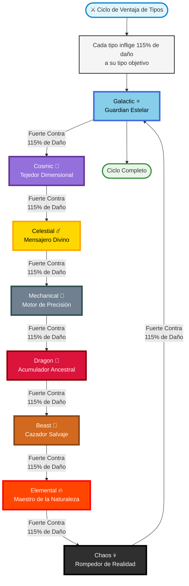
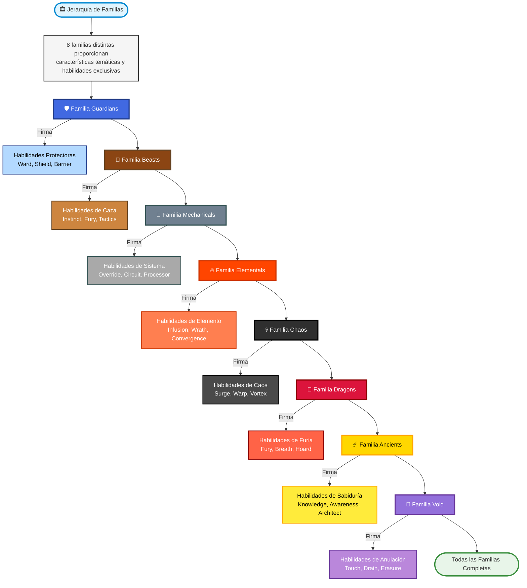
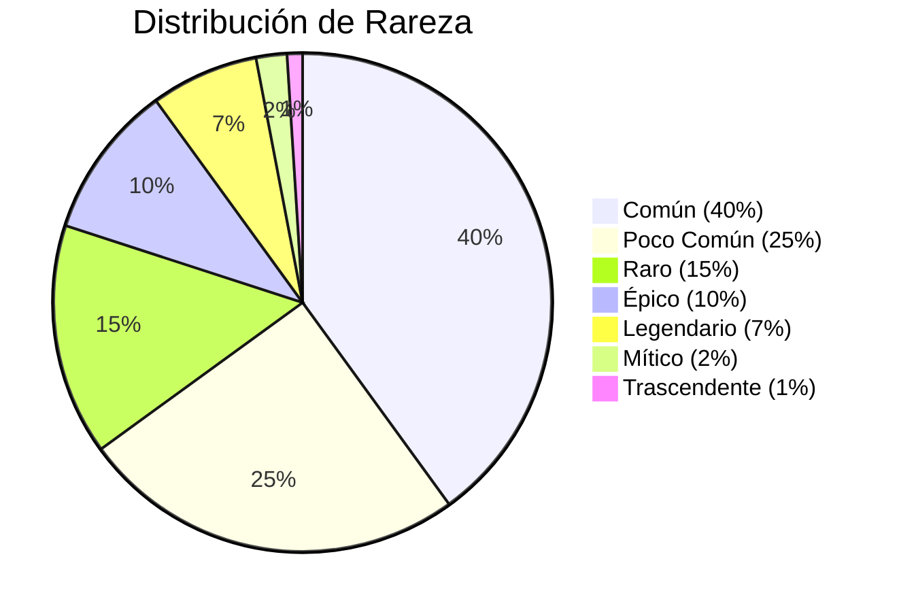
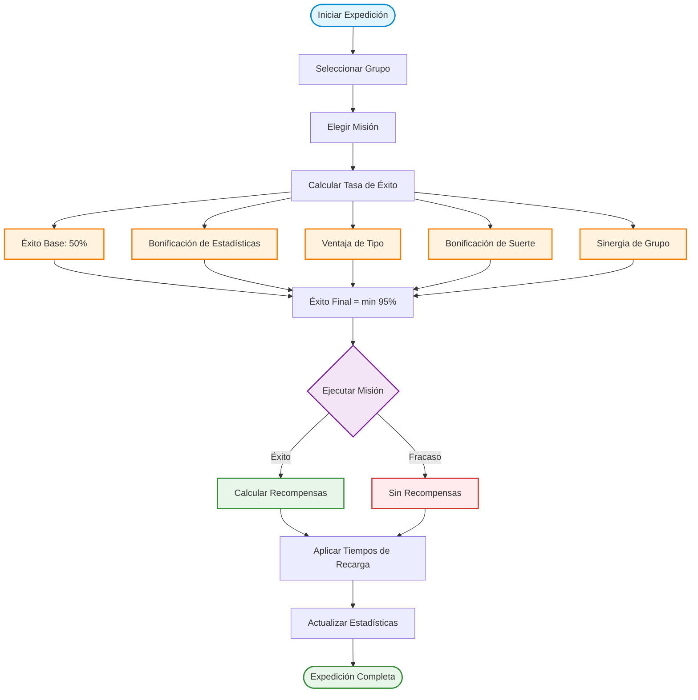
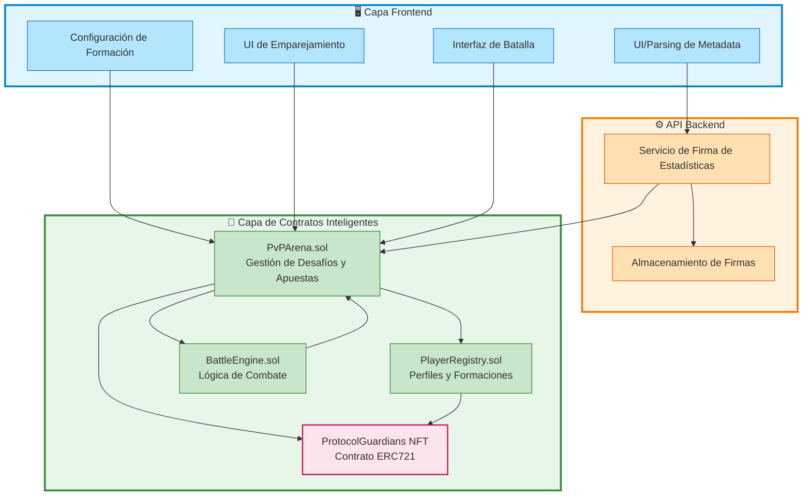
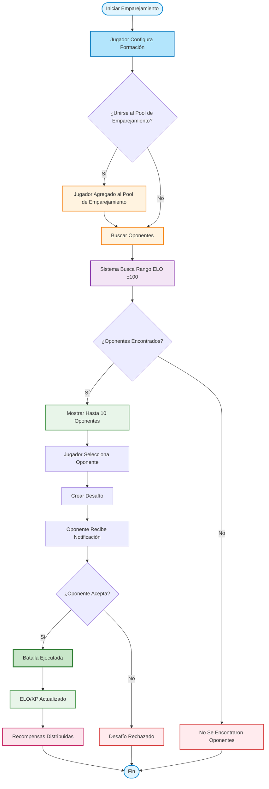
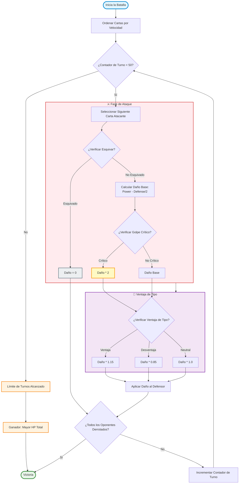
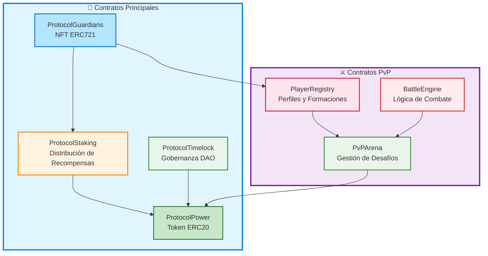

# Protocol Guardians Whitepaper

## Resumen

Protocol Guardians es un ecosistema completo de juegos NFT construido en Ethereum, combinando mecánicas de juego estratégico con tecnología blockchain. El proyecto presenta 8 tipos únicos de Guardians con sistemas de ventajas circulares, 7 niveles de rareza con escalado exponencial, y un modelo de juego dual que incorpora tanto expediciones como combate Jugador contra Jugador (PvP). Con más de 60 habilidades, sistemas de estadísticas complejos y compatibilidad completa con OpenSea, Protocol Guardians ofrece una experiencia profunda y atractiva para los jugadores mientras mantiene la excelencia técnica a través de contratos inteligentes optimizados para gas y medidas de seguridad integrales.

**Diferenciadores Clave:**
- **Integración Nativa de Ethereum**: Construido específicamente para Ethereum con optimización de escalado blockchain
- **Profundidad Estratégica**: Ventajas de tipos complejas, composición de grupo y sistemas de habilidades
- **Modos de Juego Duales**: Sistemas de combate de Expediciones (PvE) y PvP
- **Lore Rico**: Historias de fondo nativas de crypto con terminología auténtica de Ethereum
- **Excelencia Técnica**: 226 pruebas aprobadas, análisis de seguridad integral y contratos optimizados para gas
- **Inmutabilidad de Contratos**: Los contratos principales son inmutables, asegurando confianza permanente y seguridad con lógica inmutable

## Tabla de Contenidos

- [Resumen](#resumen)
- [1. Introducción](#1-introducción)
  - [1.1 Contexto del Proyecto](#11-contexto-del-proyecto)
  - [1.2 Filosofía Central](#12-filosofía-central)
- [2. Visión y Filosofía](#2-visión-y-filosofía)
  - [2.1 Declaración de Visión](#21-declaración-de-visión)
  - [2.2 Integración con Ethereum](#22-integración-con-ethereum)
  - [2.3 Autenticidad Cultural](#23-autenticidad-cultural)
- [3. Sistema de Tipos](#3-sistema-de-tipos)
  - [3.1 Rueda de Tipos](#31-rueda-de-tipos)
  - [3.2 Matriz de Efectividad de Tipos](#32-matriz-de-efectividad-de-tipos)
  - [3.3 Perfiles de Tipos](#33-perfiles-de-tipos)
    - [Galactic ⭐](#galactic-)
    - [Cosmic 🌌](#cosmic-)
    - [Celestial ☄️](#celestial-)
    - [Mechanical 🤖](#mechanical-)
    - [Dragon 🐉](#dragon-)
    - [Beast 🦁](#beast-)
    - [Elemental 🔥](#elemental-)
    - [Chaos 💀](#chaos-)
- [4. Sistema de Familias](#4-sistema-de-familias)
  - [4.1 Jerarquía de Familias](#41-jerarquía-de-familias)
  - [4.2 Perfiles de Familias](#42-perfiles-de-familias)
    - [Guardians Family](#guardians-family)
    - [Beasts Family](#beasts-family)
    - [Mechanicals Family](#mechanicals-family)
    - [Elementals Family](#elementals-family)
    - [Chaos Family](#chaos-family)
    - [Dragons Family](#dragons-family)
    - [Ancients Family](#ancients-family)
    - [Void Family](#void-family)
  - [4.3 Sistema de Sinergia de Familias](#43-sistema-de-sinergia-de-familias)
    - [Fórmula de Sinergia de Familias](#fórmula-de-sinergia-de-familias)
    - [Combinaciones de Familias](#combinaciones-de-familias)
  - [4.4 Mapeo Familia-Tipo](#44-mapeo-familia-tipo)
- [5. Sistema de Rareza](#5-sistema-de-rareza)
  - [5.1 Distribución de Rareza](#51-distribución-de-rareza)
  - [5.2 Niveles de Rareza](#52-niveles-de-rareza)
- [6. Sistema de Estadísticas](#6-sistema-de-estadísticas)
  - [6.1 Categorías de Estadísticas](#61-categorías-de-estadísticas)
  - [6.2 Distribución de Estadísticas por Tipo](#62-distribución-de-estadísticas-por-tipo)
- [7. Sistema de Expediciones](#7-sistema-de-expediciones)
  - [7.1 Flujo de Expediciones](#71-flujo-de-expediciones)
  - [7.2 Niveles de Dificultad](#72-niveles-de-dificultad)
  - [7.3 Cálculo de Tasa de Éxito](#73-cálculo-de-tasa-de-éxito)
  - [7.4 Cálculo de Recompensas](#74-cálculo-de-recompensas)
  - [7.5 Sistema de Tiempo de Recarga](#75-sistema-de-tiempo-de-recarga)
  - [7.6 Comparación Expediciones vs Staking](#76-comparación-expediciones-vs-staking)
    - [Diferencias en Tipos de Recompensa](#diferencias-en-tipos-de-recompensa)
    - [Tabla de Comparación Detallada](#tabla-de-comparación-detallada)
    - [Ejemplos de ROI Esperado por Rareza](#ejemplos-de-roi-esperado-por-rareza)
    - [Cuándo Usar Cada Sistema](#cuándo-usar-cada-sistema)
    - [Estrategias Combinadas](#estrategias-combinadas)
- [8. Sistema de Habilidades](#8-sistema-de-habilidades)
  - [8.1 Categorías de Habilidades](#81-categorías-de-habilidades)
    - [Habilidades Universales (Disponibles para Todos los Tipos)](#habilidades-universales-disponibles-para-todos-los-tipos)
    - [Habilidades de Firma de Familia](#habilidades-de-firma-de-familia)
  - [8.2 Estructura de Metadata de Habilidades](#82-estructura-de-metadata-de-habilidades)
  - [8.3 Acceso a Habilidades por Rareza](#83-acceso-a-habilidades-por-rareza)
  - [8.4 Gestión de Tiempo de Recarga](#84-gestión-de-tiempo-de-recarga)
  - [8.5 Referencia Completa de Habilidades](#85-referencia-completa-de-habilidades)
- [9. Sistema PvP](#9-sistema-pvp)
  - [9.1 Arquitectura PvP](#91-arquitectura-pvp)
    - [9.1.1 Sistema de Formación](#911-sistema-de-formación)
    - [9.1.2 Sistema de Emparejamiento](#912-sistema-de-emparejamiento)
    - [9.1.3 Servicio de Validación y Firma de Estadísticas](#913-servicio-de-validación-y-firma-de-estadísticas)
    - [9.1.4 Tarifas de Desafío](#914-tarifas-de-desafío)
  - [9.2 Modos de Batalla](#92-modos-de-batalla)
  - [9.3 Mecánicas de Combate](#93-mecánicas-de-combate)
    - [Cálculo de Daño](#cálculo-de-daño)
    - [Orden de Turnos](#orden-de-turnos)
    - [Selección de Objetivo en Batallas Multi-Guardian](#selección-de-objetivo-en-batallas-multi-guardian)
    - [Condiciones de Victoria](#condiciones-de-victoria)
    - [Ejemplo Completo de Batalla 3v3](#ejemplo-completo-de-batalla-3v3)
  - [9.4 Sistema de Ranking ELO](#94-sistema-de-ranking-elo)
    - [Fundamentos de ELO](#fundamentos-de-elo)
    - [Fórmula de Cambio de ELO](#fórmula-de-cambio-de-elo)
    - [Cambios de ELO por Escenario](#cambios-de-elo-por-escenario)
    - [Ejemplos de Cálculo de ELO](#ejemplos-de-cálculo-de-elo)
    - [ELO y Emparejamiento](#elo-y-emparejamiento)
    - [Características de ELO](#características-de-elo)
  - [9.5 Sistema de Apuestas](#95-sistema-de-apuestas)
    - [Tokens Soportados](#tokens-soportados)
    - [Requisitos de Apuesta](#requisitos-de-apuesta)
    - [Distribución de Ganancias](#distribución-de-ganancias)
    - [Ejemplos de Distribución de Apuestas](#ejemplos-de-distribución-de-apuestas)
    - [Política de Cancelación](#política-de-cancelación)
  - [9.6 XP y Niveles](#96-xp-y-niveles)
- [10. Arquitectura Técnica](#10-arquitectura-técnica)
  - [10.1 Arquitectura de Contratos](#101-arquitectura-de-contratos)
  - [10.2 ProtocolGuardians NFT (ERC721)](#102-protocolguardians-nft-erc721)
    - [10.2.1 Garantías de Inmutabilidad de Contratos](#1021-garantías-de-inmutabilidad-de-contratos)
    - [10.2.2 Verificación de Inmutabilidad de Contratos](#1022-verificación-de-inmutabilidad-de-contratos)
  - [10.3 Token ProtocolPower (ERC20)](#103-token-protocolpower-erc20)
    - [10.3.1 Distribución de Tokens](#1031-distribución-de-tokens)
    - [10.3.2 Mecanismos Deflacionarios](#1032-mecanismos-deflacionarios)
  - [10.4 ProtocolStaking](#104-protocolstaking)
  - [10.5 ProtocolTimelock](#105-protocoltimelock)
  - [10.6 Optimización de Gas](#106-optimización-de-gas)
- [11. Metadata y Compatibilidad](#11-metadata-y-compatibilidad)
  - [11.1 Estructura de Metadata](#111-estructura-de-metadata)
  - [11.2 Tipos de Visualización](#112-tipos-de-visualización)
  - [11.3 Integración IPFS](#113-integración-ipfs)
  - [11.4 Compatibilidad con Marketplace](#114-compatibilidad-con-marketplace)
- [12. Seguridad](#12-seguridad)
  - [12.1 Análisis de Seguridad](#121-análisis-de-seguridad)
  - [12.2 Medidas de Seguridad](#122-medidas-de-seguridad)
    - [Protección contra Reentrancy](#protección-contra-reentrancy)
    - [Control de Acceso](#control-de-acceso)
    - [Seguridad de Gobernanza](#seguridad-de-gobernanza)
    - [Seguridad Operacional](#seguridad-operacional)
  - [12.3 Cobertura de Pruebas](#123-cobertura-de-pruebas)
- [13. Hoja de Ruta](#13-hoja-de-ruta)
  - [13.1 Hitos Completados](#131-hitos-completados)
  - [13.2 En Progreso](#132-en-progreso)
  - [13.3 Hitos Próximos](#133-hitos-próximos)
- [14. Contratos Desplegados](#14-contratos-desplegados)
  - [14.1 ProtocolGuardians NFT](#141-protocolguardians-nft)
  - [14.2 Estado del Contrato](#142-estado-del-contrato)
  - [14.3 Características del Contrato](#143-características-del-contrato)
- [15. Conclusión](#15-conclusión)
  - [15.1 Fortalezas Clave](#151-fortalezas-clave)
  - [15.2 Visión Futura](#152-visión-futura)
- [Aviso](#aviso)

## 1. Introducción

**Tabla de Contenidos:**
- [1.1 Contexto del Proyecto](#11-contexto-del-proyecto)
- [1.2 Filosofía Central](#12-filosofía-central)

Protocol Guardians representa una fusión de mecánicas de juego estratégico y tecnología blockchain, creando un ecosistema NFT único donde entidades digitales llamadas "Guardians" existen como manifestaciones vivas de la energía onchain de Ethereum. Cada Guardian es un NFT ERC721 con características únicas, estadísticas, habilidades y lore profundamente arraigado en la historia y cultura de Ethereum.

### 1.1 Contexto del Proyecto

La colección Protocol Guardians existe dentro del ecosistema de Ethereum, aprovechando la infraestructura de la red, las soluciones de escalabilidad y el patrimonio cultural. Los Guardians nacen de la compresión y optimización del poder computacional de Ethereum a través de tecnología avanzada de escalado blockchain, convirtiéndolos en verdaderos nativos de la blockchain de Ethereum.

### 1.2 Filosofía Central

El proyecto encarna varios principios clave:
- **Autenticidad Blockchain**: Todas las mecánicas de juego aprovechan la lógica on-chain para transparencia y descentralización
- **Profundidad Estratégica**: Sistemas complejos fomentan el juego reflexivo y el compromiso a largo plazo
- **Impulsado por la Comunidad**: La gobernanza a través de tokens Protocol Power permite la toma de decisiones descentralizada
- **Integración Cultural**: El lore y la terminología reflejan auténticamente la cultura de Ethereum y crypto
- **Inmutabilidad y Confianza**: Los contratos inteligentes principales son inmutables, asegurando lógica de juego permanente e inmutable, proporcionando a los usuarios confianza absoluta en la integridad y equidad del sistema

## 2. Visión y Filosofía

**Tabla de Contenidos:**
- [2.1 Declaración de Visión](#21-declaración-de-visión)
- [2.2 Integración con Ethereum](#22-integración-con-ethereum)
- [2.3 Autenticidad Cultural](#23-autenticidad-cultural)

### 2.1 Declaración de Visión

Protocol Guardians tiene como objetivo crear un ecosistema de juegos NFT sostenible y atractivo que celebre la innovación de Ethereum mientras proporciona juego significativo y valor a los participantes. El proyecto vislumbra un futuro donde los NFTs sirven tanto como coleccionables como activos de juego funcionales dentro de una comunidad próspera y descentralizada.

### 2.2 Integración con Ethereum

Los Guardians llevan la memoria genética del espíritu pionero de Ethereum. El marco de lore integra hitos clave de Ethereum:
- **The Merge (Septiembre 2022)**: Los Guardians recuerdan la transición de PoW a PoS
- **Onchain Summer**: Nacimiento de la explosión creativa en el ecosistema de Ethereum
- **Gas Wars**: Guardians que sobrevivieron condiciones extremas de red
- **OG Builders**: Sabiduría transmitida por contribuyentes tempranos de Ethereum

### 2.3 Autenticidad Cultural

El proyecto utiliza terminología crypto auténtica integrada naturalmente en el lore:
- **gm/gn**: Saludos entre Guardians
- **ser**: Término de respeto que indica sabiduría blockchain
- **wagmi**: Creencia colectiva en el éxito mutuo
- **diamond hands**: Guardians con determinación inquebrantable
- **OG**: Guardians originales que recuerdan la visión crypto temprana

## 3. Sistema de Tipos

**Tabla de Contenidos:**
- [3.1 Rueda de Tipos](#31-rueda-de-tipos)
- [3.2 Matriz de Efectividad de Tipos](#32-matriz-de-efectividad-de-tipos)
- [3.3 Perfiles de Tipos](#33-perfiles-de-tipos)
  - [Galactic ⭐](#galactic-)
  - [Cosmic 🌌](#cosmic-)
  - [Celestial ☄️](#celestial-)
  - [Mechanical 🤖](#mechanical-)
  - [Dragon 🐉](#dragon-)
  - [Beast 🦁](#beast-)
  - [Elemental 🔥](#elemental-)
  - [Chaos 💀](#chaos-)

La colección Protocol Guardians presenta 8 tipos distintos organizados en un sistema de ventajas circulares, donde cada tipo es fuerte contra un tipo y débil contra otro.

### 3.1 Rueda de Tipos

El ciclo de ventajas de tipos sigue este patrón:



**Notas sobre Ventaja de Tipos:**
- Cada tipo es **fuerte** contra otro tipo (inflige 115% de daño)
- Cada tipo es **débil** contra otro tipo (recibe 115% de daño, inflige 85% de daño)
- El ciclo completa el círculo completo: Galactic → Cosmic → Celestial → Mechanical → Dragon → Beast → Elemental → Chaos → Galactic

### 3.2 Matriz de Efectividad de Tipos

| Atacante | Galactic | Cosmic | Celestial | Mechanical | Dragon | Beast | Elemental | Chaos |
|----------|----------|--------|-----------|------------|--------|-------|-----------|-------|
| **Galactic** | 100% | 115% | 85% | 100% | 100% | 100% | 100% | 100% |
| **Cosmic** | 85% | 100% | 115% | 100% | 100% | 100% | 100% | 100% |
| **Celestial** | 100% | 85% | 100% | 115% | 100% | 100% | 100% | 100% |
| **Mechanical** | 100% | 100% | 85% | 100% | 115% | 100% | 100% | 100% |
| **Dragon** | 100% | 100% | 100% | 85% | 100% | 115% | 100% | 100% |
| **Beast** | 100% | 100% | 100% | 100% | 85% | 100% | 115% | 100% |
| **Elemental** | 100% | 100% | 100% | 100% | 100% | 85% | 100% | 115% |
| **Chaos** | 115% | 100% | 100% | 100% | 100% | 100% | 85% | 100% |

### 3.3 Perfiles de Tipos

#### Galactic ⭐
- **Tema**: Velocidad y poder mágico, manipulación de energía cósmica
- **Estadísticas Primarias**: Velocidad (25%), Mana (20%), Crítico (15%)
- **Estadísticas Secundarias**: Poder (15%), Defensa (10%), HP (8%), Suerte (5%), Resistencia (2%)
- **Fortalezas**: Rápido, dotado mágicamente, alto potencial de golpe crítico
- **Debilidades**: HP y Resistencia bajos, vulnerable a ataques sostenidos
- **Lore**: Nacidos del polvo cósmico del bloque génesis de Ethereum, estas entidades canalizan la energía cruda de redes blockchain interplanetarias.

#### Cosmic 🌌
- **Tema**: Conocimiento místico y manipulación dimensional
- **Estadísticas Primarias**: Mana (30%), Suerte (20%), Crítico (15%)
- **Estadísticas Secundarias**: Velocidad (15%), Poder (10%), Defensa (5%), HP (3%), Resistencia (2%)
- **Fortalezas**: Alto poder mágico, habilidades basadas en suerte, manipulación de probabilidad
- **Debilidades**: Estadísticas físicas bajas, vulnerable a ataques directos
- **Lore**: Maestros de la probabilidad y la incertidumbre cuántica, estas entidades manipulan el tejido mismo de la realidad digital.

#### Celestial ☄️
- **Tema**: Poder divino y energía celestial
- **Estadísticas Primarias**: Poder (25%), Mana (20%), Defensa (15%)
- **Estadísticas Secundarias**: Velocidad (15%), HP (10%), Crítico (8%), Suerte (5%), Resistencia (2%)
- **Fortalezas**: Poder y magia equilibrados, buena defensa, habilidades divinas
- **Debilidades**: Velocidad promedio, resistencia física limitada
- **Lore**: Mensajeros divinos de Ethereum, estas entidades llevan la sabiduría de la visión original de Ethereum.

#### Mechanical 🤖
- **Tema**: Precisión tecnológica y eficiencia sistemática
- **Estadísticas Primarias**: Defensa (25%), Resistencia (20%), Poder (15%)
- **Estadísticas Secundarias**: Velocidad (15%), HP (10%), Crítico (8%), Mana (5%), Suerte (2%)
- **Fortalezas**: Alta defensa, excelente resistencia, enfoque sistemático
- **Debilidades**: Habilidades mágicas bajas, suerte limitada, patrones predecibles
- **Lore**: Entidades de precisión diseñadas nacidas de la infraestructura de contratos inteligentes de Ethereum, operando con precisión matemática.

#### Dragon 🐉
- **Tema**: Poder crudo y sabiduría ancestral
- **Estadísticas Primarias**: Poder (30%), HP (25%), Defensa (15%)
- **Estadísticas Secundarias**: Velocidad (10%), Crítico (8%), Mana (5%), Suerte (4%), Resistencia (3%)
- **Fortalezas**: Poder masivo, HP alto, ataques devastadores
- **Debilidades**: Movimiento lento, versatilidad mágica limitada, costos de recursos altos
- **Lore**: Guardianes ancestrales de tesoros digitales, estas entidades han acumulado vasta riqueza de conocimiento y poder.

#### Beast 🦁
- **Tema**: Instintos naturales y poderío físico
- **Estadísticas Primarias**: Velocidad (25%), Poder (20%), Resistencia (20%)
- **Estadísticas Secundarias**: HP (15%), Crítico (10%), Defensa (5%), Suerte (3%), Mana (2%)
- **Fortalezas**: Alta velocidad, buen poder, excelente resistencia
- **Debilidades**: Habilidades mágicas bajas, suerte limitada, patrones predecibles
- **Lore**: Entidades salvajes e indómitas que confían en el instinto y la habilidad natural en lugar de estrategias complejas.

#### Elemental 🔥
- **Tema**: Maestría elemental y control ambiental
- **Estadísticas Primarias**: Mana (25%), Poder (20%), Crítico (15%)
- **Estadísticas Secundarias**: Velocidad (15%), Defensa (10%), HP (8%), Suerte (5%), Resistencia (2%)
- **Fortalezas**: Alto poder mágico, habilidades elementales, potencial de golpe crítico
- **Debilidades**: HP y Resistencia bajos, vulnerable a ataques sostenidos
- **Lore**: Maestros de sus elementos digitales elegidos, estas entidades canalizan el poder crudo de protocolos blockchain específicos.

#### Chaos 💀
- **Tema**: Poder impredecible y potencial destructivo
- **Estadísticas Primarias**: Crítico (30%), Suerte (20%), Poder (15%)
- **Estadísticas Secundarias**: Velocidad (15%), Mana (10%), HP (5%), Defensa (3%), Resistencia (2%)
- **Fortalezas**: Golpes críticos extremadamente altos, habilidades basadas en suerte, poder impredecible
- **Debilidades**: HP y Defensa bajos, vulnerable a ataques directos, resultados impredecibles
- **Lore**: Entidades impredecibles que prosperan en la volatilidad e incertidumbre de los mercados crypto.

## 4. Sistema de Familias

**Tabla de Contenidos:**
- [4.1 Jerarquía de Familias](#41-jerarquía-de-familias)
- [4.2 Perfiles de Familias](#42-perfiles-de-familias)
  - [Guardians Family](#guardians-family)
  - [Beasts Family](#beasts-family)
  - [Mechanicals Family](#mechanicals-family)
  - [Elementals Family](#elementals-family)
  - [Chaos Family](#chaos-family)
  - [Dragons Family](#dragons-family)
  - [Ancients Family](#ancients-family)
  - [Void Family](#void-family)
- [4.3 Sistema de Sinergia de Familias](#43-sistema-de-sinergia-de-familias)
  - [Fórmula de Sinergia de Familias](#fórmula-de-sinergia-de-familias)
  - [Combinaciones de Familias](#combinaciones-de-familias)
- [4.4 Mapeo Familia-Tipo](#44-mapeo-familia-tipo)

Más allá de los tipos, los Guardians pertenecen a 8 familias distintas que proporcionan características temáticas y habilidades exclusivas de firma.

### 4.1 Jerarquía de Familias



### 4.2 Perfiles de Familias

#### Familia Guardians
- **Tema**: Protección, defensa y salvaguarda
- **Lore**: Los protectores de Ethereum, estos Guardians han jurado defender el ecosistema de amenazas externas.
- **Habilidades de Firma**: 
  - GUARDIAN'S WARD (Poco Común+): 50% de reducción de daño durante 6 horas
  - PROTECTIVE AURA (Raro+): Previene todo el daño del grupo durante 2 horas
  - DIVINE SHIELD (Épico+): Refleja 100% del daño de vuelta a los atacantes
  - SACRED BARRIER (Legendario+): Inmunidad a todos los efectos negativos durante 8 horas
  - ETERNAL GUARDIAN (Mítico+): Resucita a los miembros del grupo caídos

#### Familia Beasts
- **Tema**: Caza, instinto y poderío natural
- **Lore**: Cazadores salvajes que rastrean las oportunidades más rentables en el ecosistema de Ethereum.
- **Habilidades de Firma**:
  - HUNTER'S INSTINCT (Poco Común+): +40% Crítico y +25% Velocidad durante 4 horas
  - PREDATOR'S FURY (Raro+): +35% Poder y -20% defensa enemiga durante 3 horas
  - PACK TACTICS (Épico+): +20% todas las estadísticas cuando hay 3+ Beasts en el grupo
  - ALPHA ROAR (Legendario+): Aturde enemigos y +50% Poder del grupo durante 2 horas
  - PRIMAL RAGE (Mítico+): Transforma al grupo en berserkers durante 6 horas

#### Familia Mechanicals
- **Tema**: Tecnología, precisión y eficiencia sistemática
- **Lore**: Entidades de precisión diseñadas que operan la maquinaria compleja de Ethereum.
- **Habilidades de Firma**:
  - SYSTEM OVERRIDE (Poco Común+): +25% todas las estadísticas y -30% tiempos de recarga durante 6 horas
  - CIRCUIT BREAKER (Raro+): Previene efectos negativos y +40% Mana durante 4 horas
  - AUTOMATED DEFENSE (Épico+): Crea escudos automáticos que absorben 1000 de daño por miembro
  - QUANTUM PROCESSOR (Legendario+): Calcula estrategias de expedición óptimas
  - OMEGA PROTOCOL (Trascendente+): Garantiza el éxito de la expedición

#### Familia Elementals
- **Tema**: Maestría elemental y control ambiental
- **Lore**: Maestros de aspectos específicos del ecosistema de Ethereum, estos Guardians canalizan el poder de protocolos particulares.
- **Habilidades de Firma**:
  - ELEMENTAL INFUSION (Poco Común+): +30% Poder y Mana durante 5 horas
  - NATURE'S WRATH (Raro+): +50% Crítico y daño elemental durante 4 horas
  - ELEMENTAL CONVERGENCE (Épico+): Combina poderes elementales para aumentos masivos de estadísticas
  - PRIMAL STORM (Legendario+): Crea tormentas elementales devastadoras
  - WORLD SHAPER (Trascendente+): Reconfigura temporalmente la realidad para favorecer al grupo

#### Familia Chaos
- **Tema**: Impredecibilidad y potencial destructivo
- **Lore**: Los 'degens' definitivos del reino digital, estos Guardians prosperan en la naturaleza impredecible de los mercados crypto.
- **Habilidades de Firma**:
  - CHAOS SURGE (Poco Común+): Mejora aleatoriamente 3 estadísticas en 40% durante 3 horas
  - REALITY WARP (Raro+): 25% de probabilidad de duplicar recompensas
  - ENTROPY FIELD (Épico+): Reduce la efectividad enemiga en 35%
  - CHAOS VORTEX (Legendario+): Crea efectos impredecibles
  - REALITY COLLAPSE (Trascendente+): Rompe temporalmente la realidad

#### Familia Dragons
- **Tema**: Poder ancestral y acumulación de tesoros
- **Lore**: Entidades ancestrales de inmenso poder y riqueza, estos Guardians han estado acumulando desde los primeros días de crypto.
- **Habilidades de Firma**:
  - DRAGON'S FURY (Poco Común+): +50% Poder y daño de fuego durante 4 horas
  - ANCIENT WISDOM (Raro+): +20% todas las estadísticas e ideas estratégicas
  - DRAGON'S BREATH (Épico+): Ataque de área devastador y +60% Poder del grupo
  - HOARD MASTER (Legendario+): +100% recompensas para las próximas 3 expediciones
  - DRAGON LORD (Trascendente+): Transforma al grupo en forma de dragón

#### Familia Ancients
- **Tema**: Sabiduría y conocimiento primordial
- **Lore**: Entidades sabias que llevan el conocimiento de toda la evolución crypto, desde el génesis de Bitcoin hasta la innovación de Ethereum.
- **Habilidades de Firma**:
  - ETERNAL KNOWLEDGE (Raro+): Estrategia perfecta de expedición durante 8 horas
  - PRIMORDIAL POWER (Épico+): +40% todas las estadísticas durante 6 horas
  - TIME MASTERY (Legendario+): -50% duraciones de expedición durante 12 horas
  - COSMIC AWARENESS (Mítico+): Revela todas las mecánicas ocultas de expedición
  - REALITY ARCHITECT (Trascendente+): Modifica parámetros de expedición

#### Familia Void
- **Tema**: Anulación y manipulación de existencia
- **Lore**: Entidades misteriosas que existen en los espacios entre redes blockchain, entendiendo la naturaleza fundamental de la existencia digital.
- **Habilidades de Firma**:
  - VOID TOUCH (Raro+): Anula habilidades enemigas y +50% Suerte del grupo
  - ENTROPY DRAIN (Épico+): Roba estadísticas enemigas y las agrega al grupo durante 4 horas
  - REALITY ERASURE (Legendario+): Elimina temporalmente a los enemigos de la existencia
  - VOID MASTER (Trascendente+): Controla el tejido de la realidad durante 8 horas
  - NULL EXISTENCE (Trascendente+): Hace al grupo invulnerable y omnipotente

### 4.3 Sistema de Sinergia de Familias

Más allá de las habilidades individuales de familia, la colección Protocol Guardians presenta un sistema de sinergia que recompensa la composición estratégica de familias en grupos.

#### Fórmula de Sinergia de Familias

Cuando múltiples Guardians de la misma familia están en un grupo, reciben bonificaciones de sinergia basadas en la composición de familias:

```javascript
function calculateFamilySynergy(party) {
  const familyCounts = {};
  party.forEach(guardian => {
    familyCounts[guardian.family] = (familyCounts[guardian.family] || 0) + 1;
  });
  
  const maxFamilyCount = Math.max(...Object.values(familyCounts));
  const totalGuardians = party.length;
  
  return (maxFamilyCount / totalGuardians) * 3; // 3% por 100% misma familia
}
```

**Bonificaciones de Sinergia:**
- **Toda la Misma Familia**: 3% de bonificación a todas las estadísticas
- **80% Misma Familia**: 2.4% de bonificación a todas las estadísticas
- **60% Misma Familia**: 1.8% de bonificación a todas las estadísticas
- **40% Misma Familia**: 1.2% de bonificación a todas las estadísticas
- **20% Misma Familia**: 0.6% de bonificación a todas las estadísticas

**Distinción Importante:**
- **Sinergia de Familia**: Bonificación cuando múltiples Guardians pertenecen a la MISMA familia (ej., 3x Familia Guardians = miembros de la misma familia)
- **Combinaciones de Familia**: Bonificación cuando los Guardians pertenecen a familias DIFERENTES que se sinergizan (ej., Guardians + Beasts = familias diferentes que se combinan bien)

Estas bonificaciones **se acumulan juntas** - un grupo puede beneficiarse de ambas:
1. Sinergia de Familia (miembros de la misma familia)
2. Bonificación de Combinación (pares específicos de familias)

**Ejemplo: Grupo con 3x Guardians + 2x Beasts recibe:**
- Sinergia de Familia: (3/5) * 3% = 1.8% de bonificación (de 3 miembros de la familia Guardians)
- Bonificación de Combinación: +5% Defensa, +3% Poder (del emparejamiento Guardians + Beasts)
- Total: Ambas bonificaciones se aplican simultáneamente

#### Combinaciones de Familias

Diferentes combinaciones de familias proporcionan ventajas estratégicas únicas:

| Combinación | Bonificación | Descripción |
|-------------|--------------|-------------|
| **Guardians + Beasts** | +5% Defensa, +3% Poder | Ofensa/defensa equilibrada |
| **Mechanicals + Elementals** | +4% Mana, +3% Crítico | Precisión mágica |
| **Dragons + Ancients** | +6% Poder, +4% Sabiduría | Fuerza máxima |
| **Chaos + Void** | +5% Suerte, +3% Crítico | Poder impredecible |
| **Todas las 8 Familias** | +10% todas las estadísticas | Bonificación de diversidad máxima |

Estas bonificaciones de combinación se acumulan con las bonificaciones de sinergia de familia, permitiendo composiciones de grupo estratégicas complejas.

### 4.4 Mapeo Familia-Tipo

Cada tipo de Guardian pertenece a una familia específica, determinando el acceso a las habilidades de firma de familia:

| Tipo | Familia | Habilidades de Firma |
|------|---------|---------------------|
| **Galactic** ⭐ | Guardians | Habilidades protectoras (ward, shield, barrier) |
| **Cosmic** 🌌 | Ancients | Habilidades de sabiduría (knowledge, awareness, architect) |
| **Celestial** ☄️ | Void | Habilidades de anulación (touch, drain, erasure) |
| **Mechanical** 🤖 | Mechanicals | Habilidades de sistema (override, circuit, processor) |
| **Dragon** 🐉 | Dragons | Habilidades de furia (fury, breath, hoard) |
| **Beast** 🦁 | Beasts | Habilidades de caza (instinct, fury, tactics) |
| **Elemental** 🔥 | Elementals | Habilidades de elemento (infusion, wrath, convergence) |
| **Chaos** 💀 | Chaos | Habilidades de caos (surge, warp, vortex) |

Este mapeo asegura que la selección de tipo también determina las habilidades de familia, creando profundidad estratégica adicional en la composición de grupo.

## 5. Sistema de Rareza

**Tabla de Contenidos:**
- [5.1 Distribución de Rareza](#51-distribución-de-rareza)
- [5.2 Niveles de Rareza](#52-niveles-de-rareza)

La colección Protocol Guardians presenta 7 niveles de rareza con distribución piramidal, donde las rarezas más altas son exponencialmente más valiosas y poderosas.

### 5.1 Distribución de Rareza



**Colores de Rareza:**
- **Común**: Gris (#808080)
- **Poco Común**: Verde (#00FF00)
- **Raro**: Azul (#0000FF)
- **Épico**: Morado (#800080)
- **Legendario**: Oro (#FFD700)
- **Mítico**: Rojo (#FF0000)
- **Trascendente**: Arcoíris (#FF00FF)

### 5.2 Niveles de Rareza

| Rareza | Suministro % | Rango de Estadísticas Totales | Color de Fondo | Multiplicador |
|--------|--------------|-------------------------------|----------------|---------------|
| Común | 40% | 4,000-5,000 | #808080 (Gris) | 1.0x |
| Poco Común | 25% | 5,500-6,500 | #00FF00 (Verde) | 1.5x |
| Raro | 15% | 7,000-8,000 | #0000FF (Azul) | 2.0x |
| Épico | 10% | 8,500-9,500 | #800080 (Morado) | 2.5x |
| Legendario | 7% | 10,000-11,000 | #FFD700 (Oro) | 3.0x |
| Mítico | 2% | 11,500-12,500 | #FF0000 (Rojo) | 3.5x |
| Trascendente | 1% | 12,000-14,000 | #FF00FF (Arcoíris) | 4.0x |

**Nota sobre Rareza Trascendente:** La rareza Trascendente tiene un rango de estadísticas más amplio (12,000-14,000, un rango de 2,000 puntos) en comparación con otras rarezas (que típicamente tienen rangos de 1,000 puntos). Este rango más amplio permite más variación en el poder máximo mientras mantiene el límite de suministro del 1%, asegurando que los Guardians Trascendentes representen el nivel máximo con las estadísticas potenciales más altas en la colección.

## 6. Sistema de Estadísticas

**Tabla de Contenidos:**
- [6.1 Categorías de Estadísticas](#61-categorías-de-estadísticas)
- [6.2 Distribución de Estadísticas por Tipo](#62-distribución-de-estadísticas-por-tipo)

Cada Guardian tiene 8 estadísticas principales que determinan su efectividad en expediciones y combate. Cada estadística está configurada en metadata NFT inmutable, asegurando que las características de cada Guardian estén permanentemente registradas on-chain y no puedan ser alteradas después del minteo.

### 6.1 Categorías de Estadísticas

1. **Power**: Capacidad ofensiva, determina el daño base
2. **Defense**: Mitigación de daño, reduce el daño entrante
3. **Speed**: Orden de turno/iniciativa, determina la prioridad de ataque
4. **HP**: Puntos de salud/durabilidad, capacidad de supervivencia
5. **Luck**: 
   - **Expediciones**: Modificador de tasa de éxito (+0.01% por punto), contribuye a la probabilidad de éxito de expedición
   - **Combate PvP**: Probabilidad de esquivar, permite al Guardian evadir ataques entrantes (la verificación de esquivar usa la estadística de Suerte directamente)
   - **Doble Propósito**: La misma estadística sirve diferentes funciones en diferentes modos de juego
6. **Mana**: Recurso mágico, permite el uso de habilidades
7. **Stamina**: Recurso físico, resistencia para misiones largas
8. **Critical**: Probabilidad/daño de golpe crítico, potencial de explosión

### 6.2 Distribución de Estadísticas por Tipo

La asignación porcentual para cada tipo determina cómo se distribuyen las estadísticas totales:

**Ejemplos de Distribución de Estadísticas:**

| Rareza | Tipo | Estadísticas Totales | Power | Defense | Speed | HP | Luck | Mana | Stamina | Critical |
|--------|------|---------------------|-------|---------|-------|----|----|------|---------|----------|
| Común | Galactic | 4,500 | 675 | 450 | 1,125 | 360 | 225 | 900 | 90 | 675 |
| Legendario | Galactic | 10,500 | 1,575 | 1,050 | 2,625 | 840 | 525 | 2,100 | 210 | 1,575 |

**Ejemplo de Cálculo: Guardian Galactic Legendario**
- Estadísticas Totales: 10,500 (rango Legendario: 10,000-11,000)
- Speed: 2,625 (25% de 10,500)
- Mana: 2,100 (20% de 10,500)
- Critical: 1,575 (15% de 10,500)
- Power: 1,575 (15% de 10,500)
- Defense: 1,050 (10% de 10,500)
- HP: 840 (8% de 10,500)
- Luck: 525 (5% de 10,500)
- Stamina: 210 (2% de 10,500)

Esta distribución muestra cómo el mismo tipo (Galactic) escala de rareza Común a Legendario, manteniendo la misma asignación porcentual pero con estadísticas totales exponencialmente más altas.

## 7. Sistema de Expediciones

**Tabla de Contenidos:**
- [7.1 Flujo de Expediciones](#71-flujo-de-expediciones)
- [7.2 Niveles de Dificultad](#72-niveles-de-dificultad)
- [7.3 Cálculo de Tasa de Éxito](#73-cálculo-de-tasa-de-éxito)
- [7.4 Cálculo de Recompensas](#74-cálculo-de-recompensas)
- [7.5 Sistema de Tiempo de Recarga](#75-sistema-de-tiempo-de-recarga)
- [7.6 Comparación Expediciones vs Staking](#76-comparación-expediciones-vs-staking)
  - [Diferencias en Tipos de Recompensa](#diferencias-en-tipos-de-recompensa)
  - [Tabla de Comparación Detallada](#tabla-de-comparación-detallada)
  - [Ejemplos de ROI Esperado por Rareza](#ejemplos-de-roi-esperado-por-rareza)
  - [Cuándo Usar Cada Sistema](#cuándo-usar-cada-sistema)
  - [Estrategias Combinadas](#estrategias-combinadas)

Las expediciones son misiones on-chain donde los Guardians ganan recompensas basadas en sus estadísticas, habilidades y composición estratégica de grupo. Las recompensas se distribuyen como tokens de gobernanza del protocolo (Protocol Power) y se almacenan en una bóveda de staking estilo timelock que actúa como el mecanismo de recompensa de expedición. Nota: Las expediciones proporcionan tokens de gobernanza, mientras que el staking proporciona tokens de granja de pool de liquidez.

### 7.1 Flujo de Expediciones



### 7.2 Niveles de Dificultad

| Nivel | Duración | Estadísticas Requeridas | Recompensa Base | Rango de Tasa de Éxito |
|-------|----------|------------------------|-----------------|------------------------|
| Principiante | 30 min | 5,000 | 50 tokens | 60-80% |
| Novato | 2 horas | 10,000 | 150 tokens | 50-70% |
| Adepto | 6 horas | 15,000 | 400 tokens | 40-60% |
| Experto | 12 horas | 20,000 | 1,000 tokens | 30-50% |
| Maestro | 24 horas | 25,000 | 3,000 tokens | 20-40% |

### 7.3 Cálculo de Tasa de Éxito

La fórmula de tasa de éxito incorpora múltiples factores:

```javascript
function calculateSuccessRate(party, mission) {
  // Tasa de éxito base
  const baseSuccess = 50;
  
  // Bonificación de estadísticas: Cuánto excede el grupo los requisitos
  const statsBonus = Math.min(45, (party.totalStats - mission.requiredStats) / mission.requiredStats * 100);
  
  // Ventaja de tipo: 15% si el grupo tiene tipo ventajoso
  const typeAdvantage = hasTypeAdvantage(party, mission) ? 15 : 0;
  
  // Bonificación de suerte: 0.01% por estadística de Suerte total del grupo
  const luckBonus = Math.min(5, party.totalLuck * 0.01);
  
  // Sinergia de grupo: Bonificación para Guardians del mismo tipo
  // sameTypeGuardians = número de Guardians con el tipo más común en el grupo
  // totalGuardians = número total de Guardians en el grupo
  const partySynergy = (party.sameTypeGuardians / party.totalGuardians) * 5;
  
  // Tasa de éxito final (limitada al 95%)
  return Math.min(95, baseSuccess + statsBonus + typeAdvantage + luckBonus + partySynergy);
}
```

**Cálculo de Sinergia de Grupo:**

La Sinergia de Grupo recompensa grupos con Guardians del mismo tipo. La bonificación se calcula basándose en el porcentaje de Guardians que comparten el tipo más común en el grupo:

- **sameTypeGuardians**: Número de Guardians con el tipo más común en el grupo
- **totalGuardians**: Número total de Guardians en el grupo
- **Fórmula**: `(same_type_guardians / total_guardians) * 5`
- **Bonificación Máxima**: 5% (cuando todos los Guardians comparten el mismo tipo)
- **Ejemplo**: Grupo con 3 Galactic + 2 Cosmic tiene 3/5 mismo tipo = 60% = 3% de bonificación

**Ejemplos de Sinergia:**
- **Todo el Mismo Tipo**: 5 Galactic = 5/5 = 100% = 5% de bonificación
- **Mayoría del Mismo Tipo**: 3 Galactic + 2 Cosmic = 3/5 = 60% = 3% de bonificación
- **Minoría del Mismo Tipo**: 1 Galactic + 4 Cosmic = 4/5 = 80% = 4% de bonificación (Cosmic es la mayoría)
- **Grupo Mixto**: 2 Galactic + 2 Cosmic + 1 Dragon = 2/5 = 40% = 2% de bonificación (empate doble, usa el recuento más grande)

**Ejemplo de Cálculo:**
- Grupo: 3x Galactic Legendario, 2x Cosmic Épico
- Misión: Experto (20,000 estadísticas requeridas)
- Estadísticas Totales del Grupo: 25,000
- Suerte Total del Grupo: 500
- Tiene Ventaja de Tipo: Sí (Galactic > Cosmic)
- Recuento del Mismo Tipo: 3 Galactic (tipo mayoría)
- Total de Guardians: 5

```
Éxito Base: 50%
Bonificación de Estadísticas: min(45%, (25000 - 20000) / 20000 * 100) = 25%
Ventaja de Tipo: 15%
Bonificación de Suerte: 500 * 0.01 = 5%
Sinergia de Grupo: (3 / 5) * 5 = 3% (3 Galactic de 5 Guardians totales)

Éxito Final: min(95%, 50 + 25 + 15 + 5 + 3) = 98% → 95% (limitado)
```

### 7.4 Cálculo de Recompensas

Las recompensas escalan exponencialmente con la dificultad y rareza. La fórmula de escalado de dificultad utiliza un sistema de mapeo de nivel de dificultad donde cada nivel de dificultad corresponde a un nivel numérico.

**Mapeo de Nivel de Dificultad:**

| Dificultad | Nivel | Multiplicador de Escalado | Cálculo |
|-----------|-------|---------------------------|---------|
| Principiante | 0 | 1.0x | 1.5^0 = 1.0 |
| Novato | 1 | 1.5x | 1.5^1 = 1.5 |
| Adepto | 2 | 2.25x | 1.5^2 = 2.25 |
| Experto | 3 | 3.375x | 1.5^3 = 3.375 |
| Maestro | 4 | 5.0625x | 1.5^4 = 5.0625 |

**Fórmula de Cálculo de Recompensas:**

```javascript
function calculateRewards(party, mission) {
  const baseReward = mission.baseReward;
  
  // Multiplicador de rareza promedio
  const rarityMultiplier = party.averageRarityMultiplier;
  
  // Escalado de dificultad (exponencial)
  // Cada nivel de dificultad multiplica por 1.5x
  const difficultyScaling = Math.pow(1.5, mission.difficultyLevel);
  
  // Recompensa final
  return baseReward * rarityMultiplier * difficultyScaling;
}
```

**Ejemplo: Misión Experto**
- Recompensa Base: 1,000 tokens
- Multiplicador de Rareza Promedio: 2.8x (3x Legendario + 2x Épico)
- Nivel de Dificultad: 3 (Experto)
- Escalado de Dificultad: 1.5^3 = 3.375x
- Recompensa Final: 1,000 * 2.8 * 3.375 = 9,450 tokens

**Ejemplo: Misión Maestro**
- Recompensa Base: 3,000 tokens
- Multiplicador de Rareza Promedio: 3.0x (grupo Legendario)
- Nivel de Dificultad: 4 (Maestro)
- Escalado de Dificultad: 1.5^4 = 5.0625x
- Recompensa Final: 3,000 * 3.0 * 5.0625 = 45,562.5 tokens

### 7.5 Sistema de Tiempo de Recarga

La duración del tiempo de recarga es igual a la duración de la misión:
- Principiante: 30 minutos de recarga
- Novato: 2 horas de recarga
- Adepto: 6 horas de recarga
- Experto: 12 horas de recarga
- Maestro: 24 horas de recarga

### 7.6 Comparación Expediciones vs Staking

Los jugadores pueden elegir entre expediciones y staking para sus Guardians. Ambos sistemas ofrecen diferentes tipos de recompensas y experiencias de juego.

#### Diferencias en Tipos de Recompensa

**Recompensas de Expediciones: Tokens Protocol Power (POWER)**
- **Tipo de Token**: Tokens de gobernanza Protocol Power (POWER) ERC20
- **Utilidad**: Derechos de gobernanza, poder de voto, participación en el protocolo
- **Distribución**: Recompensado al completar misión exitosamente
- **Casos de Uso**: Gobernanza DAO, toma de decisiones del protocolo, votación de propuestas
- **Mecanismo de Ganancia**: Basado en tasa de éxito de misión, estadísticas del grupo y nivel de dificultad

**Recompensas de Staking: Tokens de Granja de Pool de Liquidez**
- **Tipo de Token**: Tokens de granja de pool de liquidez (no tokens de gobernanza)
- **Utilidad**: Recompensas de provisión de liquidez, tarifas de trading, yield farming
- **Distribución**: Acumulación basada en tiempo (ingreso pasivo)
- **Casos de Uso**: Proporcionar liquidez a pares de trading, ganar tarifas de trading, yield farming
- **Mecanismo de Ganancia**: Basado en duración de staking, multiplicadores de rareza y tiempo apostado

**Distinción Clave**: Las expediciones proporcionan tokens de gobernanza (POWER) que otorgan derechos de voto y participación en el protocolo, mientras que el staking proporciona tokens de granja de pool de liquidez que ganan de tarifas de trading y yield farming. Estos son tipos de tokens fundamentalmente diferentes con diferentes utilidades.

#### Tabla de Comparación Detallada

| Característica | Expediciones | Staking |
|----------------|--------------|---------|
| **Tipo de Juego** | Juego activo | Ingreso pasivo |
| **Fuente de Recompensa** | Finalización de misión | Acumulación basada en tiempo |
| **Tipo de Recompensa** | Tokens de gobernanza del protocolo (POWER) | Tokens de granja de pool de liquidez |
| **Utilidad del Token** | Derechos de gobernanza, poder de voto | Provisión de liquidez, tarifas de trading |
| **Nivel de Riesgo** | Probabilidad de éxito/fracaso (20-95%) | Recompensas garantizadas (100% éxito) |
| **Tiempos de Recarga** | Sí (igual a duración de misión) | Sin tiempos de recarga |
| **Impacto de Rareza** | Multiplicador en recompensas (1.0x - 4.0x) | Multiplicador en tasa de ganancia (1.0x - 4.0x) |
| **Inversión de Tiempo** | Alta (monitoreo, estrategia) | Baja (configurar y olvidar) |
| **Uso Óptimo** | Guardians de alta rareza, jugadores activos | Guardians de baja rareza, jugadores pasivos |
| **Cálculo de Recompensa** | Base × Rareza × Dificultad × Éxito | Tasa × Rareza × Tiempo |
| **Riesgo de Fracaso** | Sí (la expedición puede fracasar) | No (siempre gana) |
| **Duración de Recarga** | 30 min - 24 horas | Ninguna |
| **Profundidad Estratégica** | Alta (composición de grupo, tiempo) | Baja (staking simple) |
| **Habilidad Requerida** | Alta (planificación estratégica, optimización) | Baja (no se requiere habilidad) |

#### Ejemplos de ROI Esperado por Rareza

**Expediciones (período de 24 horas, misión Experto, 70% tasa de éxito):**

| Rareza | Recompensa Base | Multiplicador de Rareza | Escalado de Dificultad | Tasa de Éxito | Recompensa Esperada (24h) |
|--------|----------------|------------------------|------------------------|---------------|---------------------------|
| Común | 1,000 | 1.0x | 3.375x | 70% | ~2,363 tokens |
| Poco Común | 1,000 | 1.5x | 3.375x | 70% | ~3,544 tokens |
| Raro | 1,000 | 2.0x | 3.375x | 70% | ~4,725 tokens |
| Épico | 1,000 | 2.5x | 3.375x | 70% | ~5,906 tokens |
| Legendario | 1,000 | 3.0x | 3.375x | 70% | ~7,088 tokens |
| Mítico | 1,000 | 3.5x | 3.375x | 70% | ~8,269 tokens |
| Trascendente | 1,000 | 4.0x | 3.375x | 70% | ~9,450 tokens |

**Staking (período de 24 horas, garantizado):**

| Rareza | Tasa Base/Hora | Multiplicador de Rareza | Recompensas Diarias (24h) |
|--------|----------------|------------------------|---------------------------|
| Común | 10 tokens/hora | 1.0x | 240 tokens |
| Poco Común | 10 tokens/hora | 1.5x | 360 tokens |
| Raro | 10 tokens/hora | 2.0x | 480 tokens |
| Épico | 10 tokens/hora | 2.5x | 600 tokens |
| Legendario | 10 tokens/hora | 3.0x | 720 tokens |
| Mítico | 10 tokens/hora | 3.5x | 840 tokens |
| Trascendente | 10 tokens/hora | 4.0x | 960 tokens |

**Nota**: Las recompensas de expedición son tokens de gobernanza Protocol Power (POWER), mientras que las recompensas de staking son tokens de granja de pool de liquidez. Estos son tipos de tokens diferentes con diferentes utilidades y no pueden compararse directamente en valor.

#### Cuándo Usar Cada Sistema

**Usa Expediciones si:**
- Tienes Guardians de alta rareza (Raro o superior)
- Disfrutas del juego activo y la planificación estratégica
- Quieres recompensas potenciales máximas
- Puedes monitorear expediciones y optimizar la composición del grupo
- Quieres tokens de gobernanza para la participación en el protocolo
- Estás dispuesto a aceptar el riesgo de fracaso por recompensas más altas

**Usa Staking si:**
- Tienes Guardians comunes/poco comunes
- Prefieres ingresos pasivos sin riesgo
- Quieres recompensas garantizadas y predecibles
- No quieres monitorear o gestionar activamente
- Quieres tokens de granja de pool de liquidez para yield farming
- Prefieres recompensas más bajas pero ingresos garantizados

**Usa Estrategia Combinada si:**
- Tienes una colección mixta (alta rareza y baja rareza)
- Quieres equilibrar riesgo y recompensa
- Puedes dedicar algunos Guardians a cada sistema
- Quieres tanto tokens de gobernanza como recompensas de liquidez

#### Estrategias Combinadas

**Estrategia 1: Asignación Basada en Rareza**
- **Guardians de Alta Rareza (Épico+)**: Expediciones para recompensas máximas
- **Guardians de Baja Rareza (Común-Raro)**: Staking para ingresos garantizados

**Estrategia 2: Gestión de Riesgo**
- **80% en Expediciones**: Para jugadores activos que buscan retornos máximos
- **20% en Staking**: Para estabilidad e ingresos garantizados

**Estrategia 3: Diversificación**
- **50% en Expediciones**: Para tokens de gobernanza y juego activo
- **50% en Staking**: Para tokens de pool de liquidez e ingresos pasivos

**Nota**: Los Guardians no pueden ser apostados mientras están en expediciones, y viceversa. Elige la estrategia que mejor se ajuste a tu estilo de juego y colección de Guardians.

## 8. Sistema de Habilidades

**Tabla de Contenidos:**
- [8.1 Categorías de Habilidades](#81-categorías-de-habilidades)
  - [Habilidades Universales (Disponibles para Todos los Tipos)](#habilidades-universales-disponibles-para-todos-los-tipos)
  - [Habilidades de Firma de Familia](#habilidades-de-firma-de-familia)
- [8.2 Estructura de Metadata de Habilidades](#82-estructura-de-metadata-de-habilidades)
- [8.3 Acceso a Habilidades por Rareza](#83-acceso-a-habilidades-por-rareza)
- [8.4 Gestión de Tiempo de Recarga](#84-gestión-de-tiempo-de-recarga)
- [8.5 Referencia Completa de Habilidades](#85-referencia-completa-de-habilidades)

El ecosistema Protocol Guardians presenta más de 60 habilidades, divididas entre habilidades universales disponibles para todos los tipos y habilidades de firma específicas de familia.

### 8.1 Categorías de Habilidades

#### Habilidades Universales (Disponibles para Todos los Tipos)

**Habilidades Básicas (Común+)**
- QUICK STRIKE: Aumenta la Velocidad del grupo en 10% durante 2 horas (12h tiempo de recarga)
- DEFENSIVE STANCE: Aumenta la Defensa del grupo en 15% durante 3 horas (18h tiempo de recarga)
- LUCKY BREAK: Aumenta la Suerte del grupo en 20% durante 1 hora (24h tiempo de recarga)
- ENERGY SURGE: Aumenta la Resistencia del grupo en 25% durante 2 horas (16h tiempo de recarga)
- HEALTH BOOST: Aumenta el HP del grupo en 12% durante 4 horas (20h tiempo de recarga)

**Habilidades Intermedias (Poco Común+)**
- POWER FOCUS: Aumenta el Poder del grupo en 18% durante 3 horas (24h tiempo de recarga)
- CRITICAL EYE: Aumenta el Crítico del grupo en 30% durante 2 horas (30h tiempo de recarga)
- MANA FLOW: Aumenta el Mana del grupo en 20% durante 4 horas (36h tiempo de recarga)
- TEAM SYNERGY: Reduce la duración de expedición en 15% para la próxima misión (48h tiempo de recarga)
- FORTUNE'S FAVOR: Aumenta la tasa de éxito de expedición en 8% para la próxima misión (48h tiempo de recarga)

**Habilidades Avanzadas (Raro+)**
- DIMENSION HOP: Reduce la duración de expedición en 25% durante 6 horas (72h tiempo de recarga)
- REALITY ANCHOR: Previene el fracaso de expedición para la próxima misión (96h tiempo de recarga)
- STATS OVERDRIVE: Aumenta todas las estadísticas del grupo en 15% durante 4 horas (72h tiempo de recarga)
- TIME DILATION: Reduce todos los tiempos de recarga en 50% durante 8 horas (120h tiempo de recarga)
- QUANTUM LUCK: Aumenta las recompensas de expedición en 25% para la próxima misión (96h tiempo de recarga)

**Habilidades Elite (Épico+)**
- COSMIC AWARENESS: Revela bonificaciones ocultas de expedición durante 24 horas (168h tiempo de recarga)
- REALITY BEND: Permite al grupo intentar misiones de mayor dificultad (240h tiempo de recarga)
- STATS TRANSCENDENCE: Aumenta todas las estadísticas del grupo en 30% durante 8 horas (192h tiempo de recarga)
- TEMPORAL MASTERY: Reduce todos los tiempos de recarga en 75% durante 12 horas (240h tiempo de recarga)
- DIMENSIONAL GATE: Permite completar instantáneamente la expedición para la próxima misión (336h tiempo de recarga)

#### Habilidades de Firma de Familia

Las habilidades de firma de familia son exclusivas para Guardians de familias específicas. Cada familia tiene 5 habilidades únicas que están disponibles en diferentes niveles de rareza.

**Familia Guardians**
- GUARDIAN'S WARD (Poco Común+): Proporciona 50% de reducción de daño durante 6 horas (48h tiempo de recarga)
- PROTECTIVE AURA (Raro+): Previene todo el daño de los miembros del grupo durante 2 horas (72h tiempo de recarga)
- DIVINE SHIELD (Épico+): Refleja 100% del daño de vuelta a los atacantes durante 4 horas (96h tiempo de recarga)
- SACRED BARRIER (Legendario+): Hace al grupo inmune a todos los efectos negativos durante 8 horas (168h tiempo de recarga)
- ETERNAL GUARDIAN (Mítico+): Resucita a los miembros del grupo caídos con estadísticas completas (336h tiempo de recarga)

**Familia Beasts**
- HUNTER'S INSTINCT (Poco Común+): Aumenta el Crítico en 40% y la Velocidad en 25% durante 4 horas (36h tiempo de recarga)
- PREDATOR'S FURY (Raro+): Aumenta el Poder en 35% y reduce la defensa enemiga en 20% durante 3 horas (48h tiempo de recarga)
- PACK TACTICS (Épico+): Aumenta todas las estadísticas del grupo en 20% cuando hay 3+ Beasts en el grupo (72h tiempo de recarga)
- ALPHA ROAR (Legendario+): Aturde a todos los enemigos durante 2 horas y aumenta el Poder del grupo en 50% (120h tiempo de recarga)
- PRIMAL RAGE (Mítico+): Transforma al grupo en berserkers imparable durante 6 horas (240h tiempo de recarga)

**Familia Mechanicals**
- SYSTEM OVERRIDE (Poco Común+): Aumenta todas las estadísticas en 25% y reduce los tiempos de recarga en 30% durante 6 horas (48h tiempo de recarga)
- CIRCUIT BREAKER (Raro+): Previene todos los efectos negativos y aumenta el Mana en 40% durante 4 horas (72h tiempo de recarga)
- AUTOMATED DEFENSE (Épico+): Crea escudos automáticos que absorben 1000 de daño por miembro del grupo (96h tiempo de recarga)
- QUANTUM PROCESSOR (Legendario+): Permite el cálculo instantáneo de estrategias de expedición óptimas (168h tiempo de recarga)
- OMEGA PROTOCOL (Trascendente+): Activa protocolos de emergencia que garantizan el éxito de la expedición (336h tiempo de recarga)

**Familia Elementals**
- ELEMENTAL INFUSION (Poco Común+): Aumenta el Poder y el Mana en 30% durante 5 horas (42h tiempo de recarga)
- NATURE'S WRATH (Raro+): Aumenta el Crítico en 50% y agrega daño elemental durante 4 horas (60h tiempo de recarga)
- ELEMENTAL CONVERGENCE (Épico+): Combina todos los poderes elementales para aumentos masivos de estadísticas (96h tiempo de recarga)
- PRIMAL STORM (Legendario+): Crea tormentas elementales devastadoras que devastan enemigos (144h tiempo de recarga)
- WORLD SHAPER (Trascendente+): Reconfigura temporalmente la realidad para favorecer al grupo (288h tiempo de recarga)

**Familia Chaos**
- CHAOS SURGE (Poco Común+): Mejora aleatoriamente 3 estadísticas aleatorias en 40% durante 3 horas (36h tiempo de recarga)
- REALITY WARP (Raro+): Distorsiona la probabilidad, dando 25% de probabilidad de duplicar recompensas (72h tiempo de recarga)
- ENTROPY FIELD (Épico+): Crea un campo que reduce la efectividad enemiga en 35% (96h tiempo de recarga)
- CHAOS VORTEX (Legendario+): Crea efectos impredecibles que pueden ayudar o perjudicar masivamente (168h tiempo de recarga)
- REALITY COLLAPSE (Trascendente+): Rompe temporalmente la realidad, permitiendo hazañas imposibles (336h tiempo de recarga)

**Familia Dragons**
- DRAGON'S FURY (Poco Común+): Aumenta el Poder en 50% y agrega daño de fuego durante 4 horas (48h tiempo de recarga)
- ANCIENT WISDOM (Raro+): Aumenta todas las estadísticas en 20% y proporciona ideas estratégicas (72h tiempo de recarga)
- DRAGON'S BREATH (Épico+): Ataque de área devastador que aumenta el Poder del grupo en 60% (120h tiempo de recarga)
- HOARD MASTER (Legendario+): Aumenta todas las recompensas en 100% para las próximas 3 expediciones (240h tiempo de recarga)
- DRAGON LORD (Trascendente+): Transforma al grupo en forma de dragón con aumentos masivos de estadísticas (480h tiempo de recarga)

**Familia Ancients**
- ETERNAL KNOWLEDGE (Raro+): Proporciona estrategia perfecta de expedición durante 8 horas (72h tiempo de recarga)
- PRIMORDIAL POWER (Épico+): Aumenta todas las estadísticas en 40% durante 6 horas (120h tiempo de recarga)
- TIME MASTERY (Legendario+): Reduce todas las duraciones de expedición en 50% durante 12 horas (192h tiempo de recarga)
- COSMIC AWARENESS (Mítico+): Revela todas las mecánicas ocultas de expedición durante 24 horas (336h tiempo de recarga)
- REALITY ARCHITECT (Trascendente+): Puede modificar parámetros de expedición durante 48 horas (720h tiempo de recarga)

**Familia Void**
- VOID TOUCH (Raro+): Anula habilidades enemigas y aumenta la Suerte del grupo en 50% (60h tiempo de recarga)
- ENTROPY DRAIN (Épico+): Roba estadísticas enemigas y las agrega al grupo durante 4 horas (96h tiempo de recarga)
- REALITY ERASURE (Legendario+): Elimina temporalmente a los enemigos de la existencia (240h tiempo de recarga)
- VOID MASTER (Trascendente+): Controla el tejido de la realidad durante 8 horas (480h tiempo de recarga)
- NULL EXISTENCE (Trascendente+): Hace al grupo temporalmente invulnerable y omnipotente (960h tiempo de recarga)

**Nota:** Las duraciones del tiempo de recarga son fijas y no varían por familia o rareza de habilidad. Todos los tiempos de recarga se rastrean on-chain. Para detalles completos de habilidades y estructura de metadata, consulta la Sección 8.5.

### 8.2 Estructura de Metadata de Habilidades

```json
{
  "trait_type": "Ability: DIMENSION HOP",
  "value": "Reduces expedition duration by 25% for 6 hours",
  "ability_data": {
    "effect": "utility",
    "target": "party",
    "stat_affected": "duration",
    "value": 25,
    "duration": 21600,
    "cooldown": 259200,
    "min_rarity": "rare",
    "family": "universal"
  }
}
```

### 8.3 Acceso a Habilidades por Rareza

| Rareza | Habilidades Universales | Habilidades de Familia |
|--------|------------------------|------------------------|
| Común | 5 habilidades básicas | 0 |
| Poco Común | 10 habilidades | 1-2 |
| Raro | 15 habilidades | 3-4 |
| Épico | 20 habilidades | 5-6 |
| Legendario | 25 habilidades | 7-8 |
| Mítico | 30 habilidades | 9-10 |
| Trascendente | 35+ habilidades | 11+ |

### 8.4 Gestión de Tiempo de Recarga

```javascript
function canUseAbility(guardian, ability) {
  const lastUsed = guardian.abilityCooldowns[ability.name];
  const cooldownDuration = ability.cooldown;
  const currentTime = Date.now() / 1000;
  
  return (currentTime - lastUsed) >= cooldownDuration;
}
```

### 8.5 Referencia Completa de Habilidades

El ecosistema Protocol Guardians presenta 60 habilidades únicas en total:
- **20 Habilidades Universales**: Disponibles para todos los tipos de Guardians, organizadas en 4 niveles (Básico, Intermedio, Avanzado, Elite)
- **40 Habilidades de Firma de Familia**: Exclusivas para familias específicas (5 habilidades por familia en 8 familias)

**Resumen de Distribución de Habilidades:**

| Familia | Recuento de Habilidades | Rango de Rareza Mínimo |
|---------|------------------------|------------------------|
| **Universal** | 20 habilidades | Común+ a Épico+ |
| **Guardians** | 5 habilidades | Poco Común+ a Mítico+ |
| **Beasts** | 5 habilidades | Poco Común+ a Mítico+ |
| **Mechanicals** | 5 habilidades | Poco Común+ a Trascendente+ |
| **Elementals** | 5 habilidades | Poco Común+ a Trascendente+ |
| **Chaos** | 5 habilidades | Poco Común+ a Trascendente+ |
| **Dragons** | 5 habilidades | Poco Común+ a Trascendente+ |
| **Ancients** | 5 habilidades | Raro+ a Trascendente+ |
| **Void** | 5 habilidades | Raro+ a Trascendente+ |
| **Total** | **60 habilidades** | Común+ a Trascendente+ |

**Documentación Completa:**

Para detalles completos de habilidades, incluyendo:
- Descripciones completas de las 60 habilidades
- Duraciones exactas del tiempo de recarga en segundos
- Estructura completa de metadata para cada habilidad
- Notas de implementación y reglas de acumulación
- Mecánicas de interacción de habilidades

Por favor consulta la documentación [Lista Completa de Habilidades](https://github.com/cjbaezilla/ProtocolGuardians-Ethereum-NFT-Contracts-Docs/blob/main/guardians/en/ABILITIES.md).

## 9. Sistema PvP

**Tabla de Contenidos:**
- [9.1 Arquitectura PvP](#91-arquitectura-pvp)
  - [9.1.1 Sistema de Formación](#911-sistema-de-formación)
  - [9.1.2 Sistema de Emparejamiento](#912-sistema-de-emparejamiento)
  - [9.1.3 Servicio de Validación y Firma de Estadísticas](#913-servicio-de-validación-y-firma-de-estadísticas)
  - [9.1.4 Tarifas de Desafío](#914-tarifas-de-desafío)
- [9.2 Modos de Batalla](#92-modos-de-batalla)
- [9.3 Mecánicas de Combate](#93-mecánicas-de-combate)
  - [Cálculo de Daño](#cálculo-de-daño)
  - [Orden de Turnos](#orden-de-turnos)
  - [Selección de Objetivo en Batallas Multi-Guardian](#selección-de-objetivo-en-batallas-multi-guardian)
  - [Condiciones de Victoria](#condiciones-de-victoria)
  - [Ejemplo Completo de Batalla 3v3](#ejemplo-completo-de-batalla-3v3)
- [9.4 Sistema de Ranking ELO](#94-sistema-de-ranking-elo)
  - [Fundamentos de ELO](#fundamentos-de-elo)
  - [Fórmula de Cambio de ELO](#fórmula-de-cambio-de-elo)
  - [Cambios de ELO por Escenario](#cambios-de-elo-por-escenario)
  - [Ejemplos de Cálculo de ELO](#ejemplos-de-cálculo-de-elo)
  - [ELO y Emparejamiento](#elo-y-emparejamiento)
  - [Características de ELO](#características-de-elo)
- [9.5 Sistema de Apuestas](#95-sistema-de-apuestas)
  - [Tokens Soportados](#tokens-soportados)
  - [Requisitos de Apuesta](#requisitos-de-apuesta)
  - [Distribución de Ganancias](#distribución-de-ganancias)
  - [Ejemplos de Distribución de Apuestas](#ejemplos-de-distribución-de-apuestas)
  - [Política de Cancelación](#política-de-cancelación)
- [9.6 XP y Niveles](#96-xp-y-niveles)

Protocol Guardians presenta un sistema completo de combate Jugador contra Jugador construido en Ethereum, permitiendo a los poseedores de NFT luchar entre sí en combate asíncrono.

### 9.1 Arquitectura PvP



#### 9.1.1 Sistema de Formación

Los jugadores deben configurar formaciones antes de participar en batallas PvP. Las formaciones definen los NFTs de Guardians que se usarán en combate.

**Configuración de Formación:**
- **Formaciones Máximas**: 3 formaciones guardadas (una por tipo de batalla: 1v1, 3v3, 5v5)
- **Configuración de Formación**: Seleccionar tipo de batalla → Elegir NFTs de la colección → Confirmar propiedad → Formación guardada
- **Bloqueo de Formación**: La formación se bloquea cuando se usa en un desafío pendiente
- **Validación de Formación**: El sistema valida la propiedad y disponibilidad antes de guardar la formación

**Reglas de Formación:**
- Los NFTs deben ser propiedad del jugador al momento de la creación de la formación
- No se pueden usar NFTs apostados en formaciones (debe desapostarlos primero)
- No se pueden usar NFTs en expediciones (debe esperar la finalización de la expedición)
- La formación no se puede modificar mientras es parte de un desafío pendiente
- La formación se vuelve inválida si cualquier NFT se vende o transfiere
- El tamaño de la formación debe coincidir con el tipo de batalla (1 NFT para 1v1, 3 NFTs para 3v3, 5 NFTs para 5v5)

**Restricciones:**
- No se puede cambiar la formación si es parte de un desafío pendiente
- Debe poseer todos los NFTs en la formación al momento de la creación/aceptación del desafío
- Los NFTs no deben estar apostados o en expediciones
- La formación no se puede usar si cualquier NFT en la formación se vende/transfiere
- La formación se vuelve inválida si el jugador pierde la propiedad de cualquier NFT

**Qué Sucede Cuando un NFT se Vende:**
- La formación se vuelve inválida inmediatamente
- No se puede aceptar nuevos desafíos con formación inválida
- Debe actualizar la formación con nuevos NFTs antes de aceptar desafíos
- Los desafíos pendientes usando la formación fallarán la validación

**Mecanismo de Bloqueo de Formación:**
- La formación se bloquea cuando se usa en un desafío pendiente
- El bloqueo se libera cuando el desafío se acepta, completa o cancela
- No se puede modificar la formación bloqueada (previene cambios a mitad del desafío)
- Debe esperar la resolución del desafío antes de modificar la formación

**Ejemplos de Formación Válida:**
- **Formación 1v1**: 1x Guardian Galactic Legendario (propiedad, no apostado, no en expedición)
- **Formación 3v3**: 1x Dragon Épico, 1x Beast Raro, 1x Elemental Legendario (todos propiedad, disponibles)
- **Formación 5v5**: 2x Legendario, 2x Épico, 1x Mítico (tipos mixtos, todos disponibles)

#### 9.1.2 Sistema de Emparejamiento

El sistema PvP presenta un sistema de emparejamiento automatizado que empareja jugadores con calificaciones ELO similares, asegurando batallas competitivas y equilibradas.

**Mecánicas de Emparejamiento:**

**Rango ELO:**
- **Rango**: ±100 puntos ELO de la calificación actual del jugador
- **Propósito**: Previene desajustes abrumadores mientras mantiene el equilibrio competitivo
- **Ejemplo**: Un jugador con 1200 ELO puede emparejarse con oponentes entre 1100-1300 ELO
- **Ajuste Dinámico**: El rango asegura que los jugadores enfrenten oponentes de nivel de habilidad similar

**Pool de Emparejamiento:**
- **Unirse al Pool**: Los jugadores con formaciones configuradas pueden unirse al pool de emparejamiento para ser descubiertos
- **Salir del Pool**: Los jugadores pueden salir del emparejamiento en cualquier momento para ocultarse de las búsquedas
- **Múltiples Tipos de Batalla**: Los jugadores pueden estar en emparejamiento para múltiples tipos de batalla (1v1, 3v3, 5v5) simultáneamente
- **Requisitos de Formación**: Debe tener formaciones válidas configuradas para el tipo de batalla para participar

**Búsqueda Automática:**
- **Algoritmo de Búsqueda**: El sistema busca automáticamente oponentes dentro del rango ELO
- **Visualización de Oponentes**: Hasta 10 oponentes elegibles mostrados al jugador
- **Búsqueda Sin Unirse**: Los jugadores pueden buscar oponentes sin unirse al pool de emparejamiento
- **Actualizaciones en Tiempo Real**: El pool de emparejamiento se actualiza continuamente a medida que los jugadores se unen/salen

**Cómo Funciona el Emparejamiento:**
1. **Configuración de Formación**: El jugador configura la formación para el tipo de batalla deseado (1v1, 3v3 o 5v5)
2. **Unirse al Pool**: El jugador se une al pool de emparejamiento para ser descubierto (opcional)
3. **Buscar Oponentes**: El sistema busca oponentes con diferencia ±100 ELO de la calificación del jugador
4. **Mostrar Resultados**: Hasta 10 oponentes elegibles mostrados con sus calificaciones ELO
5. **Seleccionar Oponente**: El jugador puede desafiar a cualquier oponente mostrado
6. **Desafío Enviado**: El oponente recibe notificación de desafío y puede aceptar/rechazar

**Características de Emparejamiento:**
- **Emparejamiento Basado en ELO**: Asegura batallas competitivas emparejando niveles de habilidad similares
- **Descubrimiento Flexible**: Unirse al emparejamiento para ser descubierto o buscar sin unirse
- **Separación de Tipos de Batalla**: Pools de emparejamiento separados para cada tipo de batalla (1v1, 3v3, 5v5)
- **Validación de Formación**: El sistema valida formaciones antes de permitir emparejamiento
- **Disponibilidad en Tiempo Real**: El estado de emparejamiento se actualiza en tiempo real a medida que los jugadores se unen/salen

**Límites y Restricciones:**
- **Bloqueo de Formación**: La formación se bloquea cuando se usa en un desafío pendiente
- **Validación de Propiedad**: Todos los NFTs en la formación deben ser propiedad del jugador
- **Restricción de Staking**: Los NFTs apostados no se pueden usar en formaciones
- **Restricción de Expedición**: Los NFTs en expediciones no se pueden usar en formaciones
- **Aplicación de Rango ELO**: Solo se muestran oponentes dentro del rango ±100 ELO

**Diagrama de Flujo de Emparejamiento:**



#### 9.1.3 Servicio de Validación y Firma de Estadísticas

Todas las estadísticas de Guardians usadas en batallas PvP se validan a través de firmas criptográficas para asegurar autenticidad y prevenir manipulación.

**¿Qué es el Servicio de Firma de Estadísticas?**

El Servicio de Firma de Estadísticas es un servicio backend que firma criptográficamente las estadísticas de Guardians extraídas de la metadata NFT. Esto asegura que:
- Las estadísticas no se pueden modificar después de la extracción
- Los cálculos de batalla usan estadísticas auténticas y verificadas
- Los intentos de manipulación se detectan y rechazan

**¿Por Qué es Necesario?**

- **Seguridad**: Previene manipulación o alteración de estadísticas antes de batallas
- **Confianza**: Asegura que los resultados de batalla se basen en estadísticas auténticas de Guardians
- **Descentralización**: Las estadísticas se verifican on-chain, manteniendo transparencia blockchain
- **Juego Limpio**: Todos los jugadores usan estadísticas verificadas y no modificadas en batallas

**Cómo Funciona el Flujo de Firma:**

1. **Extracción de Estadísticas**: El frontend extrae estadísticas de la metadata NFT almacenada en IPFS
2. **Solicitud de Firma**: El frontend envía estadísticas al servicio backend de Firma de Estadísticas
3. **Firma Criptográfica**: El backend firma estadísticas usando ECDSA (Algoritmo de Firma Digital de Curva Elíptica)
4. **Retorno de Firma**: El backend devuelve estadísticas firmadas al frontend
5. **Verificación On-chain**: El contrato inteligente verifica la firma antes de la ejecución de la batalla
6. **Ejecución de Batalla**: La batalla procede solo si la firma es válida

**Seguridad y Descentralización:**

- **Verificación On-chain**: Todas las firmas se verifican on-chain antes de batallas
- **Firmas ECDSA**: Usa firmas criptográficas estándar para seguridad
- **Expiración de Firma**: Las firmas expiran después de 1 hora para prevenir ataques de repetición
- **Metadata Inmutable**: Las estadísticas en la metadata NFT son inmutables, asegurando autenticidad permanente
- **Proceso Transparente**: Toda la verificación de firmas es on-chain y auditable

**Validez de Firma:**

- **Ventana de Validez**: 1 hora desde la creación de la firma
- **Verificación de Expiración**: Los contratos verifican el timestamp de la firma antes de la batalla
- **Re-firma**: Los jugadores deben volver a firmar estadísticas si el desafío está pendiente por más de 1 hora
- **Expiración Automática**: Las firmas expiradas no se pueden usar para batallas

#### 9.1.4 Tarifas de Desafío

Los jugadores deben pagar tarifas al crear desafíos. La estructura de tarifas difiere entre desafíos de ranking y desafíos de apuestas.

**Desafíos de Ranking:**
- **Tarifa de Desafío**: 0.001 ETH (requerida para crear un desafío de ranking)
- **Propósito**: Previene spam y asegura compromiso
- **Política de Reembolso**: Reembolsado completamente si el desafiante cancela antes de la aceptación
- **Momento del Pago**: Tarifa pagada cuando se crea el desafío
- **Sin Tarifas Adicionales**: No se requieren tarifas del oponente para aceptar un desafío de ranking
- **Impacto ELO**: Las calificaciones ELO se actualizan basándose en los resultados de la batalla

**Desafíos de Apuestas:**
- **Sin Tarifa Adicional**: Solo se requiere el monto de la apuesta (sin tarifa de desafío separada)
- **Apuesta Bloqueada**: La apuesta se bloquea en el contrato hasta la finalización de la batalla
- **Apuesta Igual Requerida**: Ambos jugadores deben apostar exactamente el mismo monto
- **Mismo Tipo de Token**: Ambos jugadores deben usar el mismo token (ambos ETH o ambos mismo ERC20)
- **Ganador Recibe**: 97% del pool total (monto_apuesta * 2 * 0.97)
- **Tarifa del Protocolo**: 3% del pool total retenido por el protocolo
- **Sin Impacto ELO**: Las batallas de apuestas no afectan las calificaciones ELO

**Tabla de Comparación:**

| Característica | Desafío de Ranking | Desafío de Apuestas |
|----------------|--------------------|---------------------|
| **Tarifa de Desafío** | 0.001 ETH | Ninguna |
| **Monto de Apuesta** | Ninguno | Establecido por el desafiante |
| **Impacto ELO** | Sí (actualiza calificación) | No |
| **Cancelación** | Gratis (reembolso completo) | Penalización del 5% |
| **Tarifa del Oponente** | Ninguna | Igualar monto de apuesta |
| **Propósito** | Ranking competitivo | Apuestas competitivas |

**Política de Cancelación:**
- **Desafíos de Ranking**: El desafiante puede cancelar gratis, recibe reembolso completo de 0.001 ETH
- **Desafíos de Apuestas**: El desafiante puede cancelar, pero pierde 5% de la apuesta al protocolo (recibe reembolso del 95%)
- **Oponente No Puede Cancelar**: Solo el desafiante que creó el desafío puede cancelarlo

### 9.2 Modos de Batalla

- **Batallas 1v1**: Carta única vs carta única, combate rápido
- **Batallas 3v3**: Equipo de 3 cartas, planificación estratégica de formación
- **Batallas 5v5**: Combate de equipo completo, máxima profundidad estratégica

### 9.3 Mecánicas de Combate

#### Cálculo de Daño

```javascript
// Fórmula de daño base
damage = attacker.power - (defender.defense / 2)
minimum_damage = 1

// Modificador de ventaja de tipo
if (hasTypeAdvantage(attacker.type, defender.type)) {
  damage = damage * 1.15; // Bonificación +15%
} else if (hasTypeDisadvantage(attacker.type, defender.type)) {
  damage = damage * 0.85; // Penalización -15%
}

// Verificación de golpe crítico (sistema base 1000)
if (random(0, 1000) < attacker.critical) {
  damage = damage * 2; // 2x daño
}

// Verificación de esquivar (sistema base 1000)
if (random(0, 1000) < defender.luck) {
  damage = 0; // El ataque falla
}
```

**Diagrama de Flujo Completo de Batalla:**



#### Orden de Turnos

Las cartas atacan en orden de la estadística de Velocidad:
- **Mayor Velocidad = Ataca Primero**: Las cartas se ordenan por estadística de Velocidad (más alta primero)
- **Misma Velocidad = Orden Aleatorio**: Si múltiples cartas tienen la misma Velocidad, el orden de ataque es aleatorio
- **Los equipos alternan turnos**: Los equipos alternan turnos hasta que uno es derrotado
- **Prioridad de Velocidad**: Las cartas con mayor Velocidad atacan con más frecuencia, dando ventaja táctica

**Ejemplo de Orden de Turnos:**
1. Carta A (Velocidad=150) ataca primero
2. Carta B (Velocidad=120) ataca segundo
3. Carta C (Velocidad=100) ataca tercero
4. Carta D (Velocidad=100) ataca cuarto (misma Velocidad que C, orden aleatorio)
5. Las cartas vuelven a la Carta A después de que todas hayan atacado

**Manejo de Empates de Velocidad:**
- Cuando múltiples cartas tienen Velocidad idéntica, se usa orden aleatorio
- La semilla aleatoria se genera desde block.timestamp, block.prevrandao y challenge_id
- Asegura orden de turnos determinista pero impredecible para cartas con misma Velocidad

#### Selección de Objetivo en Batallas Multi-Guardian

En batallas 3v3 y 5v5, los Guardians atacantes deben seleccionar objetivos del equipo enemigo. El mecanismo de selección de objetivos asegura combate justo y equilibrado.

**Reglas de Selección de Objetivo:**
- **Selección Aleatoria de Objetivo**: El Guardian atacante selecciona aleatoriamente de los Guardians enemigos disponibles
- **Sin Enfoque de Fuego**: El sistema distribuye aleatoriamente los ataques a través del equipo enemigo (sin enfoque forzado)
- **Prioridad de Eliminación**: Una vez que un Guardian es derrotado (HP ≤ 0), no puede ser objetivo
- **Selección Determinista**: La selección de objetivo usa aleatoriedad con semilla (block.prevrandao + challenge_id) para consistencia
- **Objetivos Disponibles**: Solo los Guardians con HP > 0 pueden ser seleccionados como objetivos

**Cómo Funciona la Selección de Objetivo:**
1. Comienza el turno del Guardian atacante
2. El sistema identifica todos los Guardians enemigos con HP > 0
3. Semilla aleatoria generada desde block.prevrandao + challenge_id + turn_number
4. Objetivo seleccionado aleatoriamente de los enemigos disponibles
5. Ataque ejecutado contra el objetivo seleccionado
6. Si el objetivo es derrotado (HP ≤ 0), se elimina de los objetivos disponibles para turnos futuros

**Ejemplos de Selección de Objetivo:**

**Batalla 3v3:**
- Turno 1: Carta A1 selecciona aleatoriamente de [B1, B2, B3] → selecciona B1
- Turno 2: Carta A2 selecciona aleatoriamente de [B1, B2, B3] → selecciona B2
- Turno 3: Carta B1 derrota a Carta A3 (A3 HP = 0)
- Turno 4: Carta B2 selecciona aleatoriamente de [A1, A2] (A3 está eliminada)

**Batalla 5v5:**
- Turno 1: Carta A1 selecciona aleatoriamente de [B1, B2, B3, B4, B5] → selecciona B3
- Turno 2: Carta A2 selecciona aleatoriamente de [B1, B2, B3, B4, B5] → selecciona B1
- Turno 3: Carta A3 derrota a Carta B2 (B2 HP = 0)
- Turno 4: Carta A4 selecciona aleatoriamente de [B1, B3, B4, B5] (B2 está eliminada)

**Implicaciones Estratégicas:**
- **Sin Enfoque Garantizado**: Los jugadores no pueden garantizar enfocarse en un Guardian enemigo específico
- **Daño Distribuido**: Los ataques se distribuyen naturalmente a través del equipo enemigo
- **Estrategia Adaptativa**: Los jugadores deben adaptarse a la selección aleatoria de objetivos
- **Equilibrio**: Previene estrategias abrumadoras de objetivo único

#### Condiciones de Victoria

- **Victoria**: Todas las cartas oponentes tienen HP ≤ 0
- **Límite de Turnos**: Máximo 50 turnos por batalla
- **Desempate**: Después de 50 turnos, el equipo con mayor HP total gana
- **Sin Empates**: El ganador siempre se determina (no hay resultados de empate)

**Explicación del Límite de Turnos:**
- Las batallas tienen un máximo de 50 turnos para prevenir estancamientos infinitos
- Después de 50 turnos, la batalla termina automáticamente
- El equipo con mayor HP total restante gana
- Previene batallas defensivas excesivamente largas

**Ejemplo de Escenario de Límite de Turnos:**
- Turno 50 alcanzado: Equipo A tiene 500 HP total, Equipo B tiene 480 HP total
- Ganador: Equipo A (mayor HP total)
- Resultado: Equipo A gana a pesar de no eliminar a todos los oponentes

#### Ejemplo Completo de Batalla 3v3

**Configuración:**
- **Equipo A**: 
  - Carta A1: Power=600, Defense=250, HP=1200, Speed=150, Critical=300, Luck=200, Type=Galactic ⭐
  - Carta A2: Power=550, Defense=300, HP=1400, Speed=120, Critical=250, Luck=150, Type=Mechanical 🤖
  - Carta A3: Power=500, Defense=200, HP=1000, Speed=100, Critical=200, Luck=100, Type=Dragon 🐉
- **Equipo B**:
  - Carta B1: Power=580, Defense=280, HP=1300, Speed=140, Critical=280, Luck=180, Type=Cosmic 🌌
  - Carta B2: Power=520, Defense=320, HP=1500, Speed=110, Critical=220, Luck=120, Type=Celestial ☄️
  - Carta B3: Power=480, Defense=250, HP=1100, Speed=90, Critical=180, Luck=80, Type=Beast 🦁

**Turno 1: Carta A1 (Galactic) ataca Carta B1 (Cosmic)**
1. Verificación de Velocidad: A1 (150) > B1 (140), A1 ataca primero
2. Verificación de Esquivar: random(0,1000) = 250, B1 luck=180, no esquivó (250 >= 180)
3. Daño Base: 600 - (280/2) = 600 - 140 = 460
4. Verificación de Crítico: random(0,1000) = 200, A1 critical=300, ¡golpe crítico! (200 < 300 = 30% probabilidad)
5. Daño Crítico: 460 * 2 = 920
6. Verificación de Tipo: Galactic ⭐ vs Cosmic 🌌, Galactic tiene ventaja (Galactic > Cosmic)
7. Daño Final: 920 * 1.15 = 1058
8. Actualización de HP: Carta B1 HP = 1300 - 1058 = 242

**Turno 2: Carta B1 (Cosmic) ataca Carta A1 (Galactic)**
1. Verificación de Esquivar: random(0,1000) = 150, A1 luck=200, no esquivó (150 < 200, ¡esquivó!)
2. Daño: 0 (el ataque falla)

**Turno 3: Carta A2 (Mechanical) ataca Carta B2 (Celestial)**
1. Verificación de Esquivar: random(0,1000) = 300, B2 luck=120, no esquivó (300 >= 120)
2. Daño Base: 550 - (320/2) = 550 - 160 = 390
3. Verificación de Crítico: random(0,1000) = 300, A2 critical=250, no crítico (300 >= 250)
4. Verificación de Tipo: Mechanical 🤖 vs Celestial ☄️, Mechanical tiene desventaja (Celestial > Mechanical)
5. Daño Final: 390 * 0.85 = 331.5 → 331
6. Actualización de HP: Carta B2 HP = 1500 - 331 = 1169

**La batalla continúa hasta que un equipo es eliminado o se alcanza el límite de turnos...**

### 9.4 Sistema de Ranking ELO

El sistema PvP de Protocol Guardians usa un sistema de calificación ELO para rastrear la habilidad del jugador y permitir emparejamiento competitivo.

#### Fundamentos de ELO

- **ELO Inicial**: 1000 puntos (todos los jugadores comienzan aquí)
- **ELO Mínimo**: 0 (sin límite inferior)
- **ELO Máximo**: Sin límite superior (teóricamente puede alcanzar calificaciones muy altas)
- **Propósito de ELO**: Mide la habilidad del jugador y permite emparejamiento equilibrado

#### Fórmula de Cambio de ELO

El sistema ELO usa una fórmula que ajusta puntos basándose en la diferencia de habilidad entre jugadores:

```javascript
elo_change = base_change * (1 + (opponent_elo - my_elo) / 400)
```

Donde:
- `base_change` = ±20 puntos (positivo para victoria, negativo para derrota)
- `opponent_elo` = Calificación ELO actual del oponente
- `my_elo` = Calificación ELO actual del jugador

#### Cambios de ELO por Escenario

**Escenarios de Victoria:**
- **Ganar contra ELO más alto**: +30 a +40 puntos (vencer a mejores jugadores da más puntos)
- **Ganar contra ELO similar**: +20 a +30 puntos (vencer a habilidad similar da puntos moderados)
- **Ganar contra ELO más bajo**: +10 a +20 puntos (vencer a jugadores más débiles da menos puntos)

**Escenarios de Derrota:**
- **Perder contra ELO más alto**: -10 a -20 puntos (perder contra mejores jugadores cuesta menos puntos)
- **Perder contra ELO similar**: -20 a -30 puntos (perder contra habilidad similar cuesta puntos moderados)
- **Perder contra ELO más bajo**: -30 a -40 puntos (perder contra jugadores más débiles cuesta más puntos)

#### Ejemplos de Cálculo de ELO

**Ejemplo 1: Ganar Contra ELO Más Alto**
- Mi ELO: 1000
- ELO del Oponente: 1200
- Resultado: Yo gano
- Cálculo: `20 * (1 + (1200 - 1000) / 400) = 20 * (1 + 0.5) = 20 * 1.5 = 30 puntos`
- Nuevo ELO: 1030 (+30 puntos)

**Ejemplo 2: Perder Contra ELO Más Bajo**
- Mi ELO: 1200
- ELO del Oponente: 1000
- Resultado: Yo pierdo
- Cálculo: `-20 * (1 + (1000 - 1200) / 400) = -20 * (1 - 0.5) = -20 * 0.5 = -10 puntos`
- Nuevo ELO: 1190 (-10 puntos)

**Ejemplo 3: Ganar Contra ELO Similar**
- Mi ELO: 1100
- ELO del Oponente: 1120
- Resultado: Yo gano
- Cálculo: `20 * (1 + (1120 - 1100) / 400) = 20 * (1 + 0.05) = 20 * 1.05 = 21 puntos`
- Nuevo ELO: 1121 (+21 puntos)

#### ELO y Emparejamiento

- **Rango ELO**: El emparejamiento usa rango ±100 ELO de la calificación actual del jugador
- **ELO Separado**: Las batallas de ranking afectan ELO, las batallas de apuestas no afectan ELO
- **Tablas de Clasificación Públicas**: Las tablas de clasificación clasifican a los jugadores por calificación ELO
- **Emparejamiento Basado en Habilidad**: ELO asegura que los jugadores enfrenten oponentes de nivel de habilidad similar

#### Características de ELO

- **Separado para Ranking vs Apuestas**: ELO solo cambia en batallas de ranking (no en batallas de apuestas)
- **Tablas de Clasificación Públicas**: Los jugadores son clasificados públicamente por calificación ELO
- **Integración de Emparejamiento**: ELO afecta directamente qué oponentes puedes emparejarte
- **Ajuste Dinámico**: La fórmula se ajusta automáticamente basándose en la diferencia de habilidad

### 9.5 Sistema de Apuestas

Los jugadores pueden crear desafíos de apuestas con apuestas para competir por premios de tokens. Las batallas de apuestas brindan una oportunidad de ganar recompensas mientras se prueban habilidades contra oponentes.

#### Tokens Soportados

**ETH Nativo:**
- **Dirección de Token**: Dirección cero (0x0)
- **Más Común**: Las apuestas ETH son el tipo de apuesta más popular
- **Transferencia Directa**: Valor transferido directamente en la transacción
- **Sin Aprobación**: No se necesita aprobación de token para ETH nativo

**Tokens ERC20:**
- **Cualquier Token ERC20**: Soporta cualquier token ERC20 sin tarifas de transferencia
- **Mismo Token Requerido**: Ambos jugadores deben usar el mismo tipo de token
- **Aprobación Requerida**: Debe aprobar el contrato para gastar tokens antes de apostar
- **Restricción de Tarifa de Transferencia**: Los tokens con tarifas de transferencia (impuesto en transferencia) no están soportados

#### Requisitos de Apuesta

- **Montos Iguales**: Ambos jugadores deben apostar exactamente el mismo monto
- **Mismo Tipo de Token**: Ambos jugadores deben usar el mismo token (ambos ETH o ambos mismo ERC20)
- **Desafiante Establece Monto**: El desafiante determina el monto de la apuesta
- **Oponente Debe Igualar**: El oponente debe igualar el monto exacto para aceptar
- **Sin Aceptación Parcial**: No se puede aceptar desafío con monto parcial o diferente

#### Distribución de Ganancias

**Ganador Recibe:**
- **Fórmula**: `(monto_apuesta * 2) * 0.97`
- **97% del Pool Total**: El ganador recibe 97% del pool de apuestas combinado
- **Distribución Inmediata**: Las ganancias se envían inmediatamente después de la finalización de la batalla
- **Sin Retraso o Vesting**: Monto completo transferido en una transacción

**Protocolo Recibe:**
- **Fórmula**: `(monto_apuesta * 2) * 0.03`
- **Tarifa del Protocolo del 3%**: El protocolo recibe 3% del pool total
- **Propósito**: Usado para desarrollo y mantenimiento del protocolo
- **Transparencia**: El monto de la tarifa se divulga claramente antes de aceptar el desafío

#### Ejemplos de Distribución de Apuestas

**Ejemplo 1: Apuesta ETH**
- Apuesta del Desafiante: 0.1 ETH
- Apuesta del Oponente: 0.1 ETH
- Pool Total: 0.2 ETH
- Ganador Recibe: 0.2 ETH * 0.97 = 0.194 ETH
- Protocolo Recibe: 0.2 ETH * 0.03 = 0.006 ETH

**Ejemplo 2: Apuesta Token ERC20**
- Apuesta del Desafiante: 1000 tokens POWER
- Apuesta del Oponente: 1000 tokens POWER
- Pool Total: 2000 tokens POWER
- Ganador Recibe: 2000 * 0.97 = 1940 tokens POWER
- Protocolo Recibe: 2000 * 0.03 = 60 tokens POWER

#### Política de Cancelación

**Quién Puede Cancelar:**
- **Solo Desafiante**: Solo el jugador que creó el desafío puede cancelarlo
- **Oponente No Puede Cancelar**: El oponente debe esperar que el desafiante cancele o aceptar el desafío

**Penalizaciones:**
- **Desafío de Ranking**: Sin penalización (cancelación gratis)
- **Desafío de Apuesta**: 5% de la apuesta perdida al protocolo
- **Sin Pérdida de ELO**: ELO no cambia en cancelación
- **Sin Pérdida de XP**: XP no cambia en cancelación

**Reembolsos:**
- **Desafío de Ranking**: Tarifa de desafío completa (0.001 ETH) reembolsada
- **Desafío de Apuesta**: 95% de la apuesta reembolsada (5% va al protocolo)

**Ejemplo de Cancelación:**
- Monto de Apuesta: 0.1 ETH
- Desafiante Cancela: Penalización de cancelación = 0.1 ETH * 0.05 = 0.005 ETH
- Desafiante Recibe: 0.1 ETH - 0.005 ETH = 0.095 ETH (95% reembolso)
- Protocolo Recibe: 0.005 ETH (5% penalización)

### 9.6 XP y Niveles

- **Ganancia de XP**: El ganador recibe +50 XP, el perdedor recibe +20 XP
- **Fórmula de Nivel**: Nivel = (XP / 100) + 1
- **Beneficios de Nivel**: Sistema puro de prestigio, indica experiencia en batalla

## 10. Arquitectura Técnica

**Tabla de Contenidos:**
- [10.1 Arquitectura de Contratos](#101-arquitectura-de-contratos)
- [10.2 ProtocolGuardians NFT (ERC721)](#102-protocolguardians-nft-erc721)
  - [10.2.1 Garantías de Inmutabilidad de Contratos](#1021-garantías-de-inmutabilidad-de-contratos)
  - [10.2.2 Verificación de Inmutabilidad de Contratos](#1022-verificación-de-inmutabilidad-de-contratos)
- [10.3 Token ProtocolPower (ERC20)](#103-token-protocolpower-erc20)
  - [10.3.1 Distribución de Tokens](#1031-distribución-de-tokens)
  - [10.3.2 Mecanismos Deflacionarios](#1032-mecanismos-deflacionarios)
- [10.4 ProtocolStaking](#104-protocolstaking)
- [10.5 ProtocolTimelock](#105-protocoltimelock)
- [10.6 Optimización de Gas](#106-optimización-de-gas)

Protocol Guardians está construido en Ethereum usando una arquitectura de contratos inteligentes modular optimizada para eficiencia de gas y seguridad.

### 10.1 Arquitectura de Contratos



### 10.2 ProtocolGuardians NFT (ERC721)

**Características Clave:**
- Implementación Solady para optimización de gas
- URI base inmutable (IPFS)
- Suministro ilimitado
- Transferencias estándar ERC721
- Identificación de token basada en CID IPFS

**Dirección del Contrato**: `0xfB49118d739482048ff514b699C23E2875a91837`

**Funciones Principales:**
```solidity
function mint(address to, string memory cid) external returns (uint256 tokenId)
function tokenURI(uint256 tokenId) public view returns (string memory)
function getCIDByTokenId(uint256 tokenId) external view returns (string memory)
```

#### 10.2.1 Garantías de Inmutabilidad de Contratos

El contrato ProtocolGuardians NFT está diseñado con garantías completas de inmutabilidad para asegurar que la metadata no pueda ser modificada después del minteo. Esto proporciona confianza absoluta y permanencia para los poseedores de NFT.

**Inmutabilidad de Metadata:**
- **CID IPFS por Token**: Cada NFT se mintea con un Identificador de Contenido IPFS (CID) único que se almacena permanentemente en el contrato
- **tokenURI Fijo**: La función `tokenURI` siempre devuelve la misma URL de gateway IPFS para un token dado, apuntando al CID inmutable asignado durante el minteo
- **Sin Edición Post-Minteo**: Una vez minteado, ni el propietario del contrato ni ningún administrador pueden modificar el CID, baseURI o tokenURI para ningún token

**Inmutabilidad a Nivel de Contrato:**
- **URI Base Inmutable**: La URI base se establece en el constructor y se marca como `immutable`, lo que significa que no puede cambiarse después del despliegue
- **Sin Funciones de Administración**: No hay funciones administrativas para cambiar CID, baseURI o tokenURI para ningún token
- **Nombre y Símbolo Inmutables**: El nombre del contrato "Protocol Guardians" y el símbolo se definen como funciones `pure`, asegurando que no puedan ser alterados
- **Sin Patrón de Proxy**: El contrato no usa patrones de proxy actualizables, lo que significa que la lógica del contrato misma no puede ser actualizada o modificada

**Implicaciones de Seguridad:**
- **Metadata Permanente**: La metadata almacenada en IPFS está direccionada por contenido, lo que significa que está permanentemente vinculada a su hash
- **Garantía de Confianza**: Los poseedores de NFT tienen certeza matemática de que la metadata de su NFT nunca cambiará
- **Sin Control del Propietario**: El propietario del contrato no tiene capacidad para modificar la metadata, asegurando verdadera descentralización
- **Contrato Verificado**: El contrato está verificado en Etherscan, permitiendo que cualquiera verifique estas garantías de inmutabilidad

**Implementación Técnica:**
```solidity
// URI base es inmutable - se establece una vez en el constructor, no puede cambiarse
immutable string private _baseTokenURI;

// El mapeo de CID es permanente - no existen setters
mapping(uint256 => string) private _tokenCIDs;

// tokenURI siempre devuelve baseURI + CID - no es posible modificación
function tokenURI(uint256 tokenId) public view returns (string memory) {
    return string(abi.encodePacked(_baseTokenURI, _tokenCIDs[tokenId]));
}
```

Esta inmutabilidad no es una promesa o garantía de una empresa—está forzada por las matemáticas, la criptografía y la naturaleza descentralizada de la tecnología blockchain. Tus NFTs Protocol Guardian existirán exactamente como fueron minteados hasta que Ethereum mismo deje de existir.

#### 10.2.2 Verificación de Inmutabilidad de Contratos

Cualquiera puede verificar las garantías de inmutabilidad del contrato ProtocolGuardians NFT a través de los siguientes pasos:

**Verificación en Etherscan:**
1. Navegar a la dirección del contrato: `0xfB49118d739482048ff514b699C23E2875a91837`
2. Hacer clic en la pestaña "Contract" para ver el código fuente verificado
3. Verificar que se cumplan las siguientes condiciones:
   - La URI base está declarada como `immutable string private _baseTokenURI;`
   - No existe la función `setBaseURI()` o `setTokenURI()`
   - No existe la función `setCID()` o `updateTokenCID()`
   - No se usa patrón de proxy actualizable

**Qué Buscar en el Código Fuente:**

**Variables Inmutables:**
- La URI base debe estar declarada con la palabra clave `immutable`:
```solidity
immutable string private _baseTokenURI;
```

**Funciones que NO Deben Existir:**
- `setBaseURI(string memory newBaseURI)` - NO debe existir
- `setTokenURI(uint256 tokenId, string memory newURI)` - NO debe existir
- `setCID(uint256 tokenId, string memory newCID)` - NO debe existir
- `updateMetadata(uint256 tokenId, ...)` - NO debe existir

**Funciones que Deben Existir (Solo Lectura):**
- `tokenURI(uint256 tokenId) public view returns (string memory)` - Debe existir
- `getCIDByTokenId(uint256 tokenId) external view returns (string memory)` - Debe existir

**Métodos de Verificación Adicionales:**
- **Sourcify**: Verificar código fuente completo en [Sourcify](https://repo.sourcify.dev/1/0xfB49118d739482048ff514b699C23E2875a91837/)
- **Blockscout**: Ver detalles del contrato en [Blockscout](https://eth.blockscout.com/address/0xfB49118d739482048ff514b699C23E2875a91837?tab=contract)
- **Routescan**: Verificar verificación del contrato en [Routescan](https://routescan.io/address/0xfB49118d739482048ff514b699C23E2875a91837/contract/1/code)

Estos pasos de verificación proporcionan certeza matemática de que la metadata de tu NFT Protocol Guardian no puede ser modificada después del minteo.

### 10.3 Token ProtocolPower (ERC20)

**Características Clave:**
- Implementación estándar ERC20
- Extensiones de gobernanza (Votes, Permit)
- Minteo bajo demanda
- Propiedad timelock

**Especificaciones:**
- **Nombre**: "Protocol Power"
- **Símbolo**: "POWER"
- **Decimales**: 18
- **Suministro Máximo**: 1,000,000,000 tokens (1 mil millón)

#### 10.3.1 Distribución de Tokens

El suministro total de 1 mil millón de tokens POWER se distribuye en las siguientes categorías:

| Categoría | Porcentaje | Tokens | Propósito |
|-----------|------------|--------|-----------|
| **Recompensas de Expedición** | 60% | 600,000,000 | Tokens de gobernanza para expediciones exitosas |
| **Recompensas de Staking** | 30% | 300,000,000 | Tokens de granja de pool de liquidez para Guardians apostados |
| **Eventos Especiales** | 5% | 50,000,000 | Eventos comunitarios, torneos, airdrops |
| **Reserva del Equipo** | 3% | 30,000,000 | Compensación del equipo, desarrollo |
| **Pool de Liquidez** | 2% | 20,000,000 | Liquidez inicial y creación de mercado |

#### 10.3.2 Mecanismos Deflacionarios

El token Protocol Power implementa varios mecanismos deflacionarios para asegurar sostenibilidad de valor a largo plazo:

**Quema de Tokens:**
- **Expediciones Fallidas**: 10% de las recompensas potenciales quemadas en fallo de expedición
- **Tiempos de Recarga de Habilidades**: 5% de los costos de uso de habilidades quemados
- **Eventos Especiales**: 20% de los costos de participación en eventos quemados

**Fórmula de Quema:**
```javascript
function calculateBurnedTokens(activity, cost) {
  const burnRates = {
    'failed_expedition': 0.10,  // 10% de las recompensas potenciales
    'ability_cooldown': 0.05,   // 5% de los costos de habilidades
    'special_event': 0.20      // 20% de los costos de eventos
  };
  
  const burnRate = burnRates[activity] || 0;
  return cost * burnRate;
}
```

**Cronograma de Reducción de Suministro:**
- **Año 1**: ~5% del suministro total quemado
- **Año 2**: ~3% del suministro total quemado
- **Año 3**: ~2% del suministro total quemado
- **Año 4+**: ~1% del suministro total quemado anualmente

### 10.4 ProtocolStaking

**Características Clave:**
- Staking de custodia (NFTs transferidos al contrato)
- Cálculo preciso de recompensas basado en bloques
- Protección contra reentrancy
- Seguimiento de múltiples NFTs por usuario
- **Tipo de Recompensa**: Tokens de granja de pool de liquidez (no tokens de gobernanza)

**Cálculo de Recompensas:**
```solidity
REWARD_RATE_PER_BLOCK = 1388888888888888; // 0.001388888888888888 tokens por bloque
Rewards = Blocks_Staked × REWARD_RATE_PER_BLOCK
```

**Nota**: Las recompensas de staking se proporcionan como tokens de granja de pool de liquidez, mientras que las expediciones proporcionan tokens de gobernanza.

### 10.5 ProtocolTimelock

**Características Clave:**
- Retraso configurable (por defecto 2 días)
- Roles de proponente, ejecutor y administrador
- Cancelación de propuestas
- Ejecución segura de operaciones

### 10.6 Optimización de Gas

El proyecto usa varias estrategias de optimización de gas:
- **Solady**: Implementaciones de contratos optimizadas para gas
- **Operaciones por Lotes**: Hasta 30 NFTs por transacción
- **Optimización de Almacenamiento**: Uso mínimo de almacenamiento
- **Optimización de Eventos**: Eventos compactos

**Costos de Gas Estimados (a partir de noviembre de 2025):**

⚠️ **Nota**: Los costos de gas varían según las condiciones de red y el precio de ETH. Estas son estimaciones solo para referencia y pueden cambiar dependiendo de la congestión de la red Ethereum y los precios de gas.

| Operación | Costo de Gas (Estimado) |
|-----------|------------------------|
| Mintear NFT | ~150k gas |
| Apostar NFT | ~200k gas |
| Reclamar Recompensas | ~100k gas |
| Desapostar NFT | ~180k gas |

**Factores de Costo de Gas:**
- **Congestión de Red**: Los precios de gas aumentan durante alta actividad de red
- **Precio de ETH**: El costo en USD varía con las fluctuaciones del precio de ETH
- **Complejidad de Operación**: Las operaciones más complejas requieren más gas
- **Uso de Almacenamiento**: Escribir en almacenamiento consume más gas que leer
- **Optimización**: Solady y operaciones por lotes ayudan a minimizar los costos de gas

## 11. Metadata y Compatibilidad

**Tabla de Contenidos:**
- [11.1 Estructura de Metadata](#111-estructura-de-metadata)
- [11.2 Tipos de Visualización](#112-tipos-de-visualización)
- [11.3 Integración IPFS](#113-integración-ipfs)
- [11.4 Compatibilidad con Marketplace](#114-compatibilidad-con-marketplace)

Protocol Guardians sigue los estándares de metadata de OpenSea para asegurar compatibilidad completa con marketplaces y dApps.

### 11.1 Estructura de Metadata

```json
{
  "name": "GALACTIC GUARDIAN #007",
  "description": "300-500 word backstory with crypto lingo and Ethereum lore",
  "image": "ipfs://QmTy8w65yBXgyfG2ZBg5TrfB2hPjrDQH3RCQFJGkARStJb",
  "external_url": "https://dapp.com/guardian/7",
  "background_color": "FFD700",
  "attributes": [
    {
      "trait_type": "Power",
      "value": 1575,
      "display_type": "number",
      "max_value": 3000
    },
    {
      "trait_type": "Type",
      "value": "Galactic ⭐"
    },
    {
      "trait_type": "Rarity",
      "value": "Legendary"
    },
    {
      "trait_type": "Ability: DIMENSION HOP",
      "value": "Reduces expedition duration by 25% for 6 hours",
      "ability_data": {
        "effect": "utility",
        "target": "party",
        "stat_affected": "duration",
        "value": 25,
        "duration": 21600,
        "cooldown": 259200,
        "min_rarity": "rare",
        "family": "universal"
      }
    }
  ]
}
```

### 11.2 Tipos de Visualización

OpenSea soporta varios tipos de visualización para atributos:
- `number`: Valor numérico con barra de progreso
- `boost_number`: Valor de aumento con prefijo +
- `boost_percentage`: Aumento porcentual con sufijo %
- `date`: Timestamp Unix como fecha
- `hidden`: Oculto de la visualización de OpenSea

### 11.3 Integración IPFS

Toda la metadata e imágenes se almacenan en IPFS:
- **Gateway Principal**: `https://ipfs.io/ipfs/`
- **Gateways de Respaldo**: Cloudflare, Pinata
- **Almacenamiento Descentralizado**: Distribución de metadata inmutable

**Garantías de Inmutabilidad IPFS:**
- **Almacenamiento Direccionado por Contenido**: Cada archivo se identifica por su hash criptográfico (CID), asegurando integridad de contenido
- **CIDs por Token**: Cada NFT Protocol Guardian está asociado con un CID IPFS único que apunta directamente a su archivo JSON de metadata
- **Referencias Permanentes**: El contrato almacena estos CIDs permanentemente, y `tokenURI` siempre devuelve la misma URL de gateway IPFS para cada token
- **Sin Modificación de Metadata**: Una vez que un CID se asigna a un token, no puede ser cambiado por nadie, incluido el propietario del contrato
- **Acceso Descentralizado**: La metadata está distribuida a través de miles de nodos IPFS en todo el mundo, asegurando accesibilidad permanente

### 11.4 Compatibilidad con Marketplace

- **OpenSea**: Compatibilidad completa con todos los tipos de atributos
- **LooksRare**: Compatible con ERC721 estándar
- **Blur**: Compatible con formato de metadata estándar
- **Otros Marketplaces**: Cumplimiento estándar ERC721

## 12. Seguridad

**Tabla de Contenidos:**
- [12.1 Análisis de Seguridad](#121-análisis-de-seguridad)
- [12.2 Medidas de Seguridad](#122-medidas-de-seguridad)
  - [Protección contra Reentrancy](#protección-contra-reentrancy)
  - [Control de Acceso](#control-de-acceso)
  - [Seguridad de Gobernanza](#seguridad-de-gobernanza)
  - [Seguridad Operacional](#seguridad-operacional)
- [12.3 Cobertura de Pruebas](#123-cobertura-de-pruebas)

Protocol Guardians implementa medidas de seguridad integrales para proteger a los usuarios y sus activos.

### 12.1 Análisis de Seguridad

Todos los contratos han sido analizados usando Slither, un framework de análisis estático para Solidity. Los problemas críticos de seguridad han sido identificados y corregidos:

**Problemas Corregidos:**
1. **Vulnerabilidades de Reentrancy**: Aplicado patrón Checks-Effects-Interactions
2. **Variables No Inicializadas**: Todas las variables correctamente inicializadas
3. **Variables de Estado**: Declaraciones inmutables donde corresponde
4. **Ocultamiento de Variables**: Convenciones de nombres claras
5. **Operaciones Costosas**: Operaciones por lotes optimizadas
6. **Bloqueo de Contratos**: Mecanismos apropiados de retiro de ETH

### 12.2 Medidas de Seguridad

#### Protección contra Reentrancy
- **ReentrancyGuard**: Aplicado a todas las funciones que cambian estado
- **Checks-Effects-Interactions**: Orden de ejecución apropiado

#### Control de Acceso
- **Patrón Ownable**: Funciones solo para propietario para operaciones administrativas
- **Acceso Basado en Roles**: MINTER_ROLE para minteo de tokens de recompensa
- **Validación de Entrada**: Validación integral de parámetros

#### Seguridad de Gobernanza
- **Controlador Timelock**: Retraso de 2 días para todas las propuestas de gobernanza
- **Sistema Multi-rol**: Roles separados de proponentes, ejecutores y administradores
- **Validación de Propuestas**: Múltiples verificaciones antes de la ejecución

#### Seguridad Operacional
- **Límites por Lotes**: Máximo 30 NFTs por transacción
- **Límites de Suministro**: Límites de suministro máximo de tokens
- **Funciones de Emergencia**: Función de retiro para ETH accidental
- **Llamadas Externas Seguras**: Uso de bibliotecas de transferencia seguras

### 12.3 Cobertura de Pruebas

**Estado Actual**: 
- **Contratos Principales**: 226 pruebas aprobadas (100% aprobadas para contratos desplegados)
- **Características en Desarrollo**: 28 pruebas en desarrollo (optimización del sistema PvP)

**Pruebas de Contratos Principales (100% Aprobadas):**
- ProtocolGuardians: 18 pruebas aprobadas
- ProtocolPower: 20 pruebas aprobadas
- ProtocolStaking: 25 pruebas aprobadas
- ProtocolTimelock: 15 pruebas aprobadas
- Pruebas de Integración: 8 pruebas aprobadas

**Características en Desarrollo (Pruebas Activas):**
- BattleEngine: 12+ pruebas aprobadas, pruebas adicionales de optimización en desarrollo
- PlayerRegistry: 45+ pruebas aprobadas, pruebas de casos límite en desarrollo
- PvPArena: 24+ pruebas aprobadas, pruebas de optimización de gas en desarrollo

**Categorías de Pruebas:**
- Pruebas Unitarias: Pruebas individuales de contratos
- Pruebas de Integración: Funcionalidad entre contratos
- Pruebas de Seguridad: Validación de reentrancy y control de acceso
- Pruebas de Gas: Verificación de optimización de rendimiento
- Casos Límite: Manejo integral de errores

## 13. Hoja de Ruta

**Tabla de Contenidos:**
- [13.1 Hitos Completados](#131-hitos-completados)
- [13.2 En Progreso](#132-en-progreso)
- [13.3 Hitos Próximos](#133-hitos-próximos)

El proyecto Protocol Guardians ha hecho progreso significativo y continúa desarrollando nuevas características.

### 13.1 Hitos Completados

- ✅ **Registro de Dominio**: Dominio del proyecto asegurado
- ✅ **Sitio Web**: Sitio web oficial lanzado
- ✅ **Redes Sociales**: Canales de Twitter y Telegram activos
  - Twitter: https://x.com/EthProtoGuards
  - Telegram: https://t.me/EthProtoGuards
- ✅ **Creación de Contrato NFT**: Contrato ERC721 desplegado en Ethereum Mainnet
- ✅ **Integración OpenSea**: Página de colección en vivo en OpenSea
- ✅ **Documentación Wiki**: Wiki integral para nuevos jugadores
  - Inglés: https://github.com/cjbaezilla/ProtocolGuardians-Ethereum-NFT-Contracts-Docs/wiki/Getting-Started
  - Español: https://github.com/cjbaezilla/ProtocolGuardians-Ethereum-NFT-Contracts-Docs/wiki/Getting-Started-ES

### 13.2 En Progreso

- 🔄 **Colección de Minteo**: 1,245 / 10,000 NFTs minteados
- 🔄 **NFTs de Colaboración**: 3 / 100 NFTs de colaboración minteados
- 🔄 **Creación de Contratos de Juego**: Contratos del sistema PvP en desarrollo

### 13.3 Hitos Próximos

**Q1 2026:**
- ⏳ **Pruebas de Contratos de Juego**: Despliegue y pruebas en testnet Sepolia
- ⏳ **Beta de Testnet Público**: Pruebas beta limitadas con la comunidad
- ⏳ **Integración de Juego**: Integración frontend del sistema PvP

**Q2 2026:**
- ⏳ **Contrato de Expediciones**: Desarrollo de contrato inteligente del sistema de expediciones
- ⏳ **Pruebas de Expediciones**: Pruebas en testnet Sepolia para expediciones
- ⏳ **Integración de Expediciones**: Integración frontend del sistema de expediciones

**Q3-Q4 2026:**
- ⏳ **Lanzamiento de Token de Gobernanza**: Despliegue y distribución del token Protocol Power
- ⏳ **Despliegue en Mainnet**: Despliegue completo del sistema en Ethereum Mainnet
- ⏳ **Lanzamiento Público**: Lanzamiento oficial y campaña de marketing

## 14. Contratos Desplegados

**Tabla de Contenidos:**
- [14.1 ProtocolGuardians NFT](#141-protocolguardians-nft)
- [14.2 Estado del Contrato](#142-estado-del-contrato)
- [14.3 Características del Contrato](#143-características-del-contrato)

Los contratos Protocol Guardians están desplegados y verificados en Ethereum Mainnet.

### 14.1 ProtocolGuardians NFT

**Dirección del Contrato**: `0xfB49118d739482048ff514b699C23E2875a91837`

**Detalles de Despliegue:**
- **Red**: Ethereum Mainnet (Chain ID: 1)
- **Versión del Compilador**: Solidity ^0.8.0
- **Estado de Verificación**: ✅ Verificado en Etherscan, Sourcify, Blockscout, Routescan
- **Suministro Actual**: 1,245+ NFTs (a partir de noviembre de 2025)
- **Estado de Minteo**: Activo, suministro ilimitado

**Enlaces de Verificación:**
- **Etherscan**: [Ver Contrato](https://etherscan.io/address/0xfB49118d739482048ff514b699C23E2875a91837)
- **Sourcify**: [Código Fuente Verificado](https://repo.sourcify.dev/1/0xfB49118d739482048ff514b699C23E2875a91837/)
- **Blockscout**: [Ver en Blockscout](https://eth.blockscout.com/address/0xfB49118d739482048ff514b699C23E2875a91837?tab=contract)
- **Routescan**: [Ver en Routescan](https://routescan.io/address/0xfB49118d739482048ff514b699C23E2875a91837/contract/1/code)

**OpenSea**: [Ver Colección](https://opensea.io/collection/protocol-guardians)

### 14.2 Estado del Contrato

- **Red**: Ethereum Mainnet (Chain ID: 1)
- **Estado**: Verificado y activo
- **Suministro Total**: Ilimitado (actualmente 1,245+ NFTs minteados)
- **Metadata**: Alojada en IPFS, URI base inmutable
- **Inmutabilidad**: Garantías completas de inmutabilidad de contratos (ver Sección 10.2.1)
  - Sin funciones de administración para modificar metadata
  - CIDs IPFS por token almacenados permanentemente
  - URI base inmutable establecida en constructor
  - Lógica del contrato no actualizable (sin patrón de proxy)

### 14.3 Características del Contrato

- **Optimizado para Gas**: Implementación Solady
- **Compatible con OpenSea**: Soporte completo de estándares de metadata
- **Integración IPFS**: Almacenamiento descentralizado
- **Nativo de Ethereum**: Construido específicamente para Ethereum
- **Totalmente Inmutable**: Garantías completas de inmutabilidad—sin funciones de administración, sin modificación de metadata posible

## 15. Conclusión

**Tabla de Contenidos:**
- [15.1 Fortalezas Clave](#151-fortalezas-clave)
- [15.2 Visión Futura](#152-visión-futura)

Protocol Guardians representa un ecosistema completo de juegos NFT que combina profundidad de juego estratégico con excelencia en tecnología blockchain. Las características únicas del proyecto—incluyendo 8 tipos con ventajas circulares, 7 niveles de rareza, más de 60 habilidades, modos de juego duales (Expediciones y PvP) e integración completa con Ethereum—crean una propuesta de valor convincente tanto para jugadores como para inversionistas.

### 15.1 Fortalezas Clave

- **Excelencia Técnica**: Contratos optimizados para gas, pruebas integrales y medidas de seguridad
- **Profundidad Estratégica**: Mecánicas complejas fomentan juego reflexivo y compromiso a largo plazo
- **Compatibilidad de Mercado**: Integración completa con OpenSea y cumplimiento ERC721
- **Enfoque en la Comunidad**: Los mecanismos de gobernanza permiten toma de decisiones descentralizada
- **Autenticidad Cultural**: El lore y la terminología reflejan cultura genuina de Ethereum
- **Inmutabilidad**: Inmutabilidad completa de contratos con garantías permanentes de metadata, asegurando lógica de juego inmutable y confianza absoluta

### 15.2 Visión Futura

El ecosistema Protocol Guardians está diseñado para crecimiento y sostenibilidad a largo plazo. Con una hoja de ruta clara, arquitectura modular y gobernanza impulsada por la comunidad, el proyecto está posicionado para evolucionar y expandirse basándose en las necesidades de la comunidad y dinámicas del mercado.

Invitamos a inversionistas, jugadores y miembros de la comunidad a unirse al ecosistema Protocol Guardians. Ya sea que estés interesado en coleccionar Guardians raros, participar en expediciones, competir en batallas PvP o contribuir a la gobernanza, hay un lugar para ti en el universo Protocol Guardians.

**WAGMI** - Todos lo vamos a lograr juntos.

---

**Versión del Documento**: 1.0  
**Última Actualización**: Noviembre 2025
**Red**: Ethereum Mainnet  
**Dirección del Contrato**: `0xfB49118d739482048ff514b699C23E2875a91837`

Para más información, visita:
- **Sitio Web**: [Protocol Guardians](https://protocolguardians.com)
- **OpenSea**: [Colección](https://opensea.io/collection/protocol-guardians)
- **Twitter**: [@EthProtoGuards](https://x.com/EthProtoGuards)
- **Telegram**: [Protocol Guardians](https://t.me/EthProtoGuards)
- **GitHub**: [Código Fuente](https://github.com/cjbaezilla/ProtocolGuardians-Ethereum-NFT-Contracts-Docs)
- **Wiki**: [Documentación](https://github.com/cjbaezilla/ProtocolGuardians-Ethereum-NFT-Contracts-Docs/wiki)

## Aviso

**Economía de Tokens**: La tokenómica, los suministros de tokens y los mecanismos de distribución para el token Protocol Power (POWER) están actualmente bajo evaluación y pueden estar sujetos a cambios. La información proporcionada en este documento representa planificación preliminar y no debe considerarse final. Se proporcionarán actualizaciones a medida que se finalice la economía de tokens.

