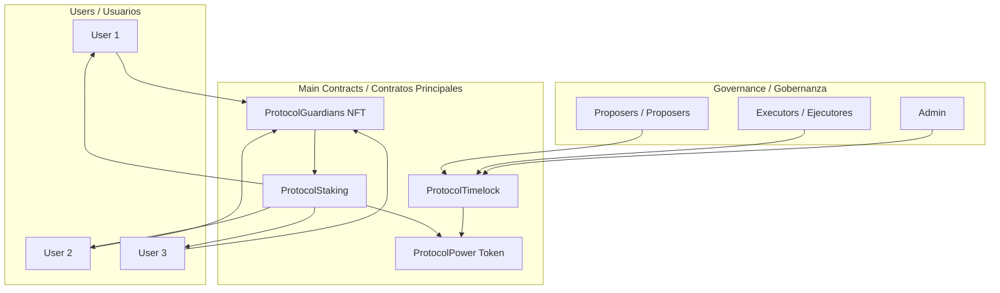

# Protocol Guardians Documentation

## Bilingual Index / Índice Bilingüe

### English Documentation / Documentación en Inglés

| File | Description | Descripción |
|------|-------------|-------------|
| [en/README.md](./en/README.md) | Main English documentation index | Índice principal de documentación en inglés |
| [en/architecture.md](./en/architecture.md) | Complete system architecture with Mermaid diagrams | Arquitectura completa del sistema con diagramas Mermaid |
| [en/contracts.md](./en/contracts.md) | Detailed technical documentation of all contracts | Documentación técnica detallada de todos los contratos |
| [en/SECURITY.md](./en/SECURITY.md) | Comprehensive security analysis with Slither | Análisis de seguridad integral con Slither |
| [en/deployment.md](./en/deployment.md) | Step-by-step deployment guide | Guía paso a paso para deployment |
| [en/staking-guide.md](./en/staking-guide.md) | User guide for NFT staking | Guía de usuario para staking de NFTs |
| [en/dao-guide.md](./en/dao-guide.md) | Complete DAO governance guide with Timelock | Guía completa de gobernanza DAO con Timelock |
| [en/examples.md](./en/examples.md) | Code examples and use cases | Ejemplos de código y casos de uso |

### Spanish Documentation / Documentación en Español

| File | Description | Descripción |
|------|-------------|-------------|
| [es/README.md](./es/README.md) | Índice principal de documentación en español | Main Spanish documentation index |
| [es/arquitectura.md](./es/arquitectura.md) | Arquitectura completa del sistema con diagramas Mermaid | Complete system architecture with Mermaid diagrams |
| [es/contratos.md](./es/contratos.md) | Documentación técnica detallada de todos los contratos | Detailed technical documentation of all contracts |
| [es/SECURITY.md](./es/SECURITY.md) | Análisis de seguridad integral con Slither | Comprehensive security analysis with Slither |
| [es/deployment.md](./es/deployment.md) | Guía paso a paso para deployment | Step-by-step deployment guide |
| [es/staking-guide.md](./es/staking-guide.md) | Guía de usuario para staking de NFTs | User guide for NFT staking |
| [es/dao-guide.md](./es/dao-guide.md) | Guía completa de gobernanza DAO con Timelock | Complete DAO governance guide with Timelock |
| [es/ejemplos.md](./es/ejemplos.md) | Ejemplos de código y casos de uso | Code examples and use cases |

## Project Overview / Resumen del Proyecto

### English

Protocol Guardians is a complete ERC721 NFT ecosystem with staking capabilities and DAO governance built on Ethereum. The project includes:

- **ProtocolGuardians NFT**: NFT collection with immutable IPFS metadata
- **ProtocolPower Token**: ERC20 token with governance capabilities for staking rewards
- **ProtocolStaking**: Custody staking contract with automatic reward distribution
- **ProtocolTimelock**: Configurable timelock controller (default 2-day) for secure DAO governance

## Deployed Contracts / Contratos Desplegados

### English

#### Ethereum Mainnet
- **ProtocolGuardians NFT**: [`0xfB49118d739482048ff514b699C23E2875a91837`](https://etherscan.io/address/0xfB49118d739482048ff514b699C23E2875a91837)
- **Etherscan**: [View Contract](https://etherscan.io/address/0xfB49118d739482048ff514b699C23E2875a91837)
- **Sourcify**: [Verified Source](https://repo.sourcify.dev/1/0xfB49118d739482048ff514b699C23E2875a91837/)
- **Blockscout**: [View on Blockscout](https://eth.blockscout.com/address/0xfB49118d739482048ff514b699C23E2875a91837?tab=contract)
- **Routescan**: [View on Routescan](https://routescan.io/address/0xfB49118d739482048ff514b699C23E2875a91837/contract/1/code)
- **OpenSea**: [View Collection](https://opensea.io/collection/protocol-guardians)

### Español

#### Ethereum Mainnet
- **ProtocolGuardians NFT**: [`0xfB49118d739482048ff514b699C23E2875a91837`](https://etherscan.io/address/0xfB49118d739482048ff514b699C23E2875a91837)
- **Etherscan**: [Ver Contrato](https://etherscan.io/address/0xfB49118d739482048ff514b699C23E2875a91837)
- **Sourcify**: [Código Verificado](https://repo.sourcify.dev/1/0xfB49118d739482048ff514b699C23E2875a91837/)
- **Blockscout**: [Ver en Blockscout](https://eth.blockscout.com/address/0xfB49118d739482048ff514b699C23E2875a91837?tab=contract)
- **Routescan**: [Ver en Routescan](https://routescan.io/address/0xfB49118d739482048ff514b699C23E2875a91837/contract/1/code)
- **OpenSea**: [Ver Colección](https://opensea.io/collection/protocol-guardians)

**Key Features:**
- 🎨 **NFTs**: Solady-optimized ERC721 with immutable baseURI
- 💰 **Rewards**: 10 POWER tokens per NFT per day
- 🏛️ **Governance**: DAO with configurable timelock (default 2-day) and Tally integration
- 🔒 **Security**: Reentrancy protection and role-based access control

**Known Limitations:**
- ⚠️ **Public Mint**: Anyone can mint NFTs without restrictions
- ⚠️ **No Pause**: Staking cannot be paused
- ⚠️ **Immutable**: Reward parameters are fixed
- ℹ️ **Batch Limit**: Maximum 30 NFTs per transaction

### Español

Protocol Guardians es un ecosistema completo de NFTs ERC721 con capacidades de staking y gobernanza DAO construido en Ethereum. El proyecto incluye:

- **ProtocolGuardians NFT**: Colección de NFTs con metadatos IPFS inmutables
- **ProtocolPower Token**: Token ERC20 con capacidades de gobernanza para recompensas de staking
- **ProtocolStaking**: Contrato de staking con custody y distribución automática de recompensas
- **ProtocolTimelock**: Controlador de timelock configurable (por defecto 2 días) para gobernanza DAO segura

**Características Principales:**
- 🎨 **NFTs**: ERC721 optimizado con Solady y baseURI inmutable
- 💰 **Recompensas**: 10 tokens POWER por NFT por día
- 🏛️ **Gobernanza**: DAO con timelock configurable (por defecto 2 días) e integración con Tally
- 🔒 **Seguridad**: Protección contra reentrancy y control de acceso basado en roles

**Limitaciones Conocidas:**
- ⚠️ **Mint Público**: Cualquiera puede mintear NFTs sin restricciones
- ⚠️ **Sin Pausa**: El staking no puede ser pausado
- ⚠️ **Inmutabilidad**: Parámetros de recompensas son fijos
- ℹ️ **Límite Batch**: Máximo 30 NFTs por transacción

## Quick Start / Inicio Rápido

### English

1. **Read the Architecture**: Start with [System Architecture](./en/architecture.md)
2. **Deploy Contracts**: Follow the [Deployment Guide](./en/deployment.md)
3. **Learn Staking**: Use the [Staking Guide](./en/staking-guide.md)
4. **Explore Governance**: Check the [DAO Guide](./en/dao-guide.md)
5. **Try Examples**: Run [Usage Examples](./en/examples.md)

### Español

1. **Lee la Arquitectura**: Comienza con [Arquitectura del Sistema](./es/arquitectura.md)
2. **Despliega Contratos**: Sigue la [Guía de Deployment](./es/deployment.md)
3. **Aprende Staking**: Usa la [Guía de Staking](./es/staking-guide.md)
4. **Explora Gobernanza**: Revisa la [Guía DAO](./es/dao-guide.md)
5. **Prueba Ejemplos**: Ejecuta [Ejemplos de Uso](./es/ejemplos.md)

## Technical Stack / Stack Técnico

### Smart Contracts / Contratos Inteligentes
- **Solidity ^0.8.28**
- **Solady**: Gas-optimized contracts
- **OpenZeppelin**: Governance and security contracts

### Development Tools / Herramientas de Desarrollo
- **Hardhat**: Development and testing framework
- **Ethers.js**: Ethereum library
- **Mocha**: Testing framework
- **Chai**: Assertion library

### Security / Seguridad
- **Static Analysis**: Automated vulnerability detection with Slither
- **ReentrancyGuard**: Protection against reentrancy attacks
- **Role-based Access**: Granular permission control
- **Timelock**: 2-day delay for critical operations
- **Parameter Validation**: Input validation on all functions
- **Emergency Functions**: Withdraw mechanisms for accidental ETH

## Architecture Diagram / Diagrama de Arquitectura



## Key Features / Características Principales

### NFT System / Sistema de NFTs
- **Immutable Metadata**: IPFS-based metadata that cannot be changed
- **Gas Optimized**: Solady implementation for efficient transactions
- **Unlimited Supply**: No cap on NFT creation
- **Standard Compliance**: Full ERC721 compatibility

### Staking System / Sistema de Staking
- **Custody Staking**: NFTs transferred to contract for security
- **Automatic Rewards**: 10 POWER tokens per NFT per day
- **Flexible Management**: Stake/unstake multiple NFTs at once
- **Precise Calculation**: Block-based reward calculation

### Governance System / Sistema de Gobernanza
- **Token Voting**: 1 POWER token = 1 vote
- **Timelock Security**: 2-day delay for all proposals
- **Role Management**: Proposer, executor, and admin roles
- **Tally Integration**: User-friendly governance interface

## Getting Started / Comenzando

### Prerequisites / Prerrequisitos
- Node.js >= 16.0.0
- npm or yarn
- Git
- Wallet with ETH for gas

### Installation / Instalación
```bash
# Clone repository / Clonar repositorio
git clone <repository-url>
cd protocol-guardians

# Install dependencies / Instalar dependencias
npm install

# Compile contracts / Compilar contratos
npx hardhat compile

# Run tests / Ejecutar tests
npx hardhat test
```

### Deployment / Despliegue
```bash
# Deploy to local network / Desplegar en red local
npx hardhat run scripts/deploy.js --network localhost

# Deploy to testnet / Desplegar en testnet
npx hardhat run scripts/deploy.js --network sepolia

# Deploy to mainnet / Desplegar en mainnet
npx hardhat run scripts/deploy.js --network ethereum
```

## Documentation Structure / Estructura de Documentación

### Technical Documentation / Documentación Técnica
- **Architecture**: System design and component interactions
- **Contracts**: Detailed function documentation
- **Deployment**: Step-by-step deployment instructions

### User Guides / Guías de Usuario
- **Staking**: How to stake NFTs and claim rewards
- **Governance**: How to participate in DAO decisions
- **Examples**: Practical code examples and use cases

### Language Support / Soporte de Idiomas
- **English**: Complete documentation in English
- **Spanish**: Complete documentation in Spanish
- **Bilingual Index**: This file serves as a bridge between languages

## Contributing / Contribuyendo

### English
We welcome contributions to improve the Protocol Guardians ecosystem:

1. **Code Contributions**: Submit pull requests for bug fixes and features
2. **Documentation**: Help improve documentation in any language
3. **Testing**: Add test cases and improve coverage
4. **Security**: Report security issues responsibly

### Español
Bienvenimos contribuciones para mejorar el ecosistema Protocol Guardians:

1. **Contribuciones de Código**: Envía pull requests para correcciones y características
2. **Documentación**: Ayuda a mejorar la documentación en cualquier idioma
3. **Testing**: Agrega casos de prueba y mejora la cobertura
4. **Seguridad**: Reporta problemas de seguridad de manera responsable

## Support / Soporte

### English
If you need help with Protocol Guardians:

1. **Documentation**: Check the relevant guides above
2. **Examples**: Run the provided examples
3. **Community**: Join our community discussions
4. **Issues**: Report issues on GitHub

### Español
Si necesitas ayuda con Protocol Guardians:

1. **Documentación**: Revisa las guías relevantes arriba
2. **Ejemplos**: Ejecuta los ejemplos proporcionados
3. **Comunidad**: Únete a nuestras discusiones comunitarias
4. **Issues**: Reporta problemas en GitHub

## License / Licencia

This project is licensed under the MIT License. See LICENSE file for details.

Este proyecto está licenciado bajo la Licencia MIT. Ver archivo LICENSE para detalles.

---

**Last Updated / Última Actualización**: October 2024
**Version / Versión**: 1.0.0
**Status / Estado**: Production Ready / Listo para Producción
