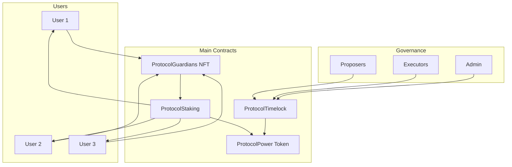
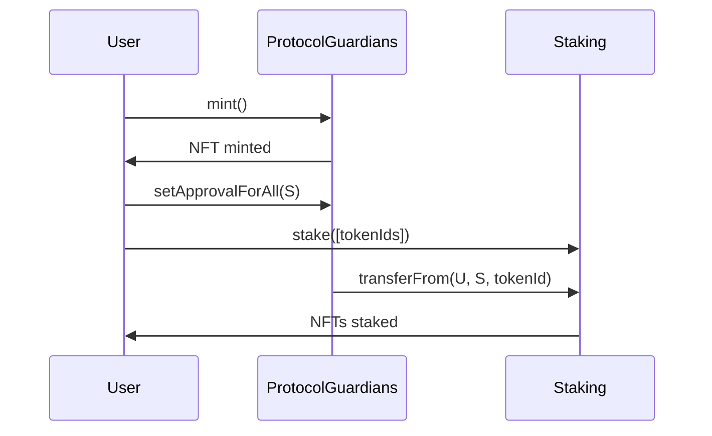
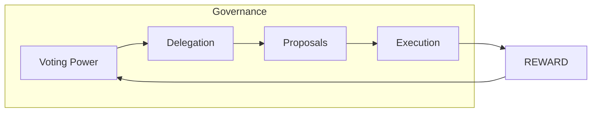
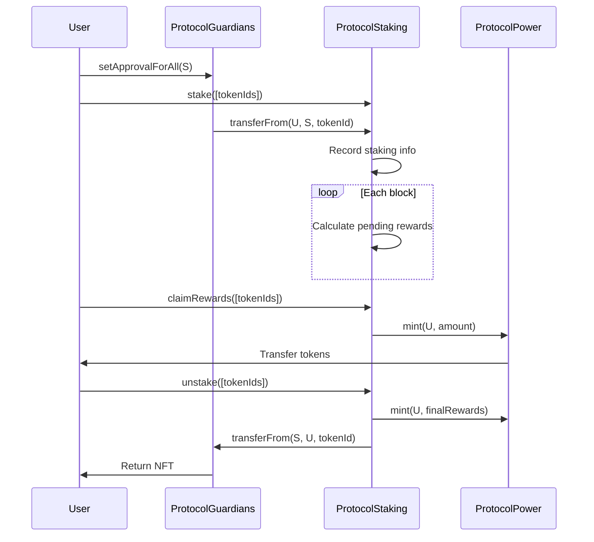
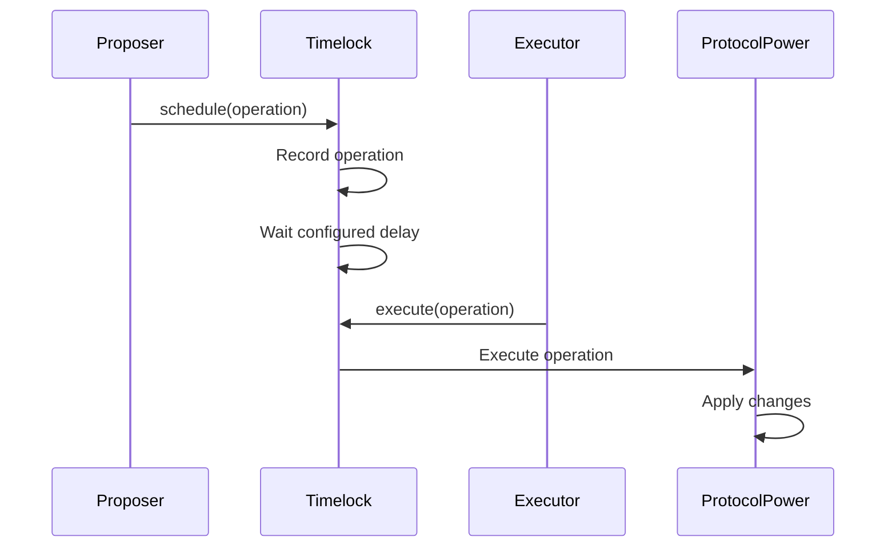
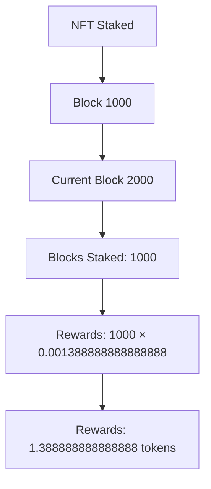
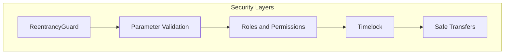
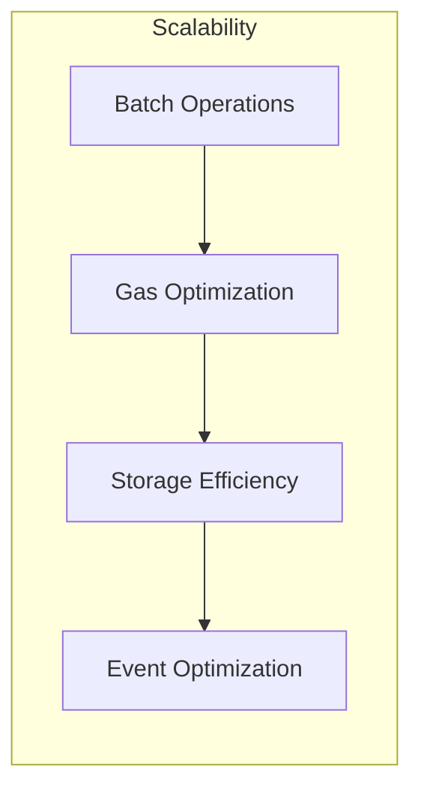
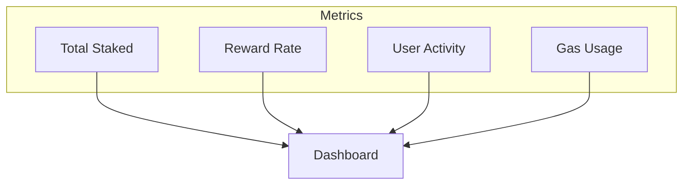

# Protocol Guardians System Architecture

## Overview

Protocol Guardians is an ecosystem of smart contracts built on Ethereum that enables NFT staking with rewards and DAO governance. The system is designed to be secure, efficient, and decentralized.

## Architecture Diagram



## System Components

### 1. ProtocolGuardians NFT (ERC721)

**Purpose**: NFT collection with immutable metadata

**Features**:
- Solady implementation for gas optimization
- Immutable base URI (IPFS)
- Unlimited supply
- Standard ERC721 transfers

**Data Flow**:


### 2. ProtocolPower Token (ERC20)

**Purpose**: Reward token with governance capabilities

**Features**:
- Standard ERC20 implementation
- Governance extensions (Votes, Permit)
- On-demand minting
- Timelock ownership

**Governance Structure**:


### 3. ProtocolStaking

**Purpose**: Custody staking contract with reward distribution

**Features**:
- Custody staking (NFTs transferred to contract)
- Precise reward calculation
- Reentrancy protection
- Multiple NFT tracking per user

**Staking Flow**:


### 4. ProtocolTimelock

**Purpose**: Timelock controller for DAO governance

**Features**:
- 2-day delay for execution
- Proposer, executor, and admin roles
- Proposal cancellation
- Secure operation execution

**Governance Flow**:


## Reward Calculation

### Reward Formula

```
Rewards = Blocks_Staked × REWARD_RATE_PER_BLOCK
```

Where:
- `REWARD_RATE_PER_BLOCK = 1388888888888888` (0.001388888888888888 tokens per block)
- `Blocks_Staked = Current_Block - Last_Claim_Block`

### Calculation Example



## Security

### Implemented Security Measures

1. **ReentrancyGuard**: In ProtocolStaking
2. **Role-based Access**: In all contracts
3. **Parameter Validation**: In all functions
4. **Safe Transfers**: Using SafeERC20
5. **Timelock Delay**: Configurable delay for critical operations

### Security Diagram



## Gas Optimization

### Implemented Strategies

1. **Solady**: Gas-optimized contracts
2. **Batch Operations**: Batch operations
3. **Storage Optimization**: Storage optimization
4. **Event Optimization**: Efficient events

### Gas Cost Comparison

| Operation | Gas Cost | Optimization |
|-----------|----------|--------------|
| Mint NFT | ~150k | Solady ERC721 |
| Stake NFT | ~200k | Batch operations |
| Claim Rewards | ~100k | Efficient calculation |
| Unstake NFT | ~180k | Batch operations |

## Scalability

### Scalability Considerations

1. **Batch Operations**: Up to 50 NFTs per transaction
2. **Gas Limits**: Operations optimized for gas limits
3. **Storage Efficiency**: Minimal storage usage
4. **Event Optimization**: Compact events

### Scalability Diagram



## Monitoring and Analytics

### Important Metrics

1. **Total Staked**: Total number of NFTs in staking
2. **Reward Rate**: Reward rate per block
3. **User Activity**: User activity
4. **Gas Usage**: Gas usage per operation

### Monitoring Dashboard



## Next Steps

1. **Security Audit**: Complete contract audit
2. **Optimizations**: Additional gas optimizations
3. **Integrations**: Integration with more platforms
4. **Analytics**: Advanced analytics system

## Conclusion

The Protocol Guardians architecture is designed to be secure, efficient, and scalable. The system uses best practices for smart contract development and is optimized for the Ethereum ecosystem.

For more technical details, consult the [Contract Documentation](./contracts.md).
