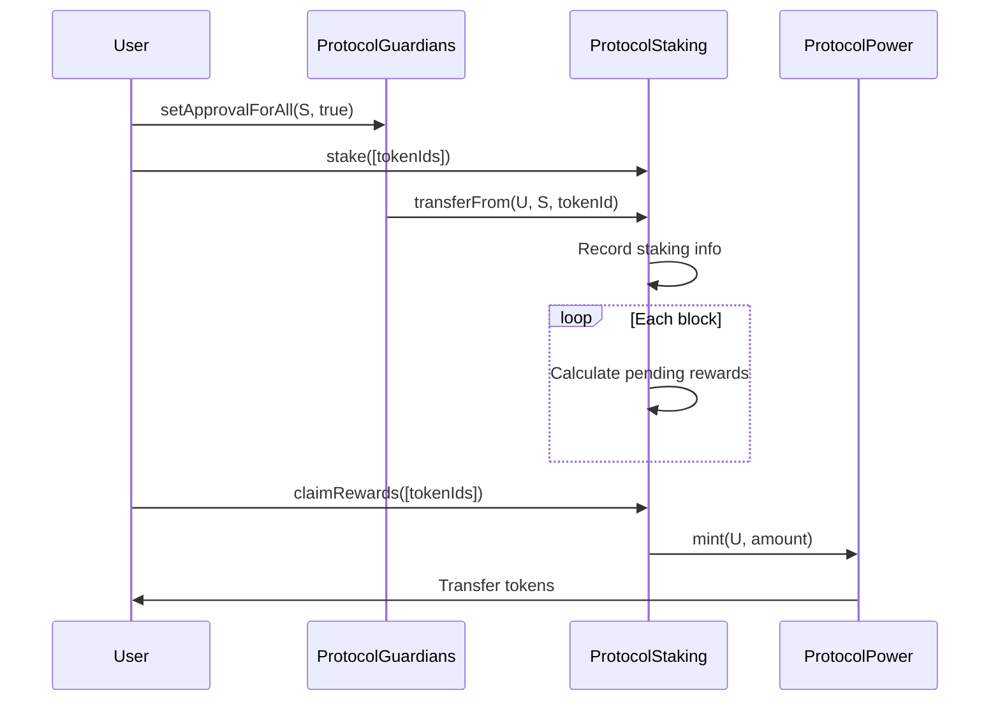
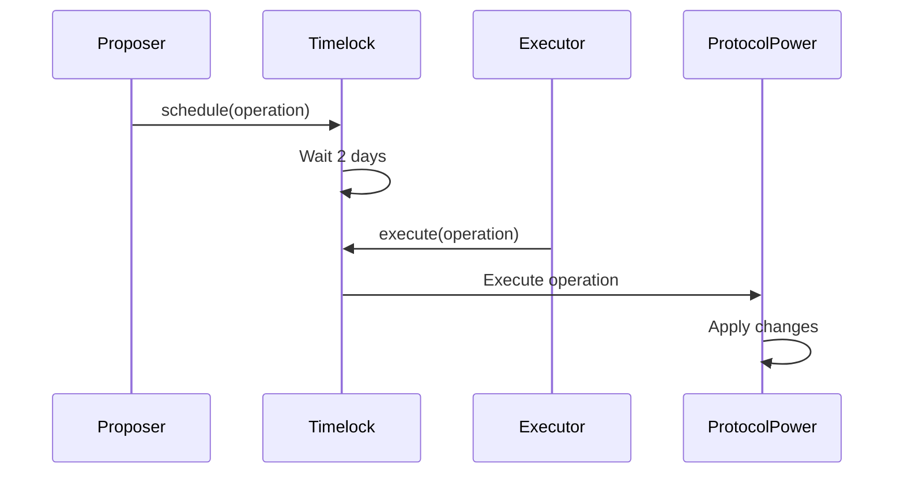

# Protocol Guardians Contract Documentation

## Overview

This document provides detailed technical documentation of all contracts in the Protocol Guardians ecosystem built on Ethereum, including security considerations and implementation details.

## Deployed Contracts

### Ethereum Mainnet
- **ProtocolGuardians NFT**: [`0xfB49118d739482048ff514b699C23E2875a91837`](https://etherscan.io/address/0xfB49118d739482048ff514b699C23E2875a91837)
- **Etherscan**: [View Contract](https://etherscan.io/address/0xfB49118d739482048ff514b699C23E2875a91837)
- **Sourcify**: [Verified Source](https://repo.sourcify.dev/1/0xfB49118d739482048ff514b699C23E2875a91837/)
- **Blockscout**: [View on Blockscout](https://eth.blockscout.com/address/0xfB49118d739482048ff514b699C23E2875a91837?tab=contract)
- **Routescan**: [View on Routescan](https://routescan.io/address/0xfB49118d739482048ff514b699C23E2875a91837/contract/1/code)

## Security Considerations

### Static Analysis with Slither
All contracts have been analyzed using [Slither](https://github.com/crytic/slither), a static analysis framework for Solidity. Critical security issues have been identified and fixed:

- **Reentrancy Protection**: Checks-Effects-Interactions pattern implementation
- **Access Control**: Role-based permissions and Ownable pattern
- **Input Validation**: Comprehensive parameter validation
- **Emergency Functions**: Withdraw mechanisms for accidental ETH

📖 **[Read Full Security Analysis](../SECURITY.md)**

## ProtocolGuardians NFT

### Description
ERC721 contract for the ProtocolGuardians NFT collection with IPFS CID-based token identification system.

### Key Features
- **Inheritance**: Solady ERC721, OpenZeppelin Ownable
- **Token IDs**: IPFS CIDs as external identifiers (maintains uint256 internal compatibility)
- **Supply**: Unlimited
- **Optimization**: Gas optimized with Solady
- **Security**: Ether withdraw function to prevent locking
- **Gateway**: Uses https://ipfs.io/ipfs/ for tokenURI

### Main Functions

#### `constructor(string memory baseURI_)`
Initializes the contract with immutable base URI and sets the owner.
```solidity
constructor(string memory baseURI_) Ownable(msg.sender) {
    _baseTokenURI = baseURI_;
}
```

#### `mint(address to, string memory cid) external returns (uint256 tokenId)`
Mints a new NFT to the specified address with IPFS CID.
- **Parameters**: 
  - `to` - Address that will receive the NFT
  - `cid` - IPFS CID for the token metadata
- **Returns**: `tokenId` - Internal uint256 ID of the minted token
- **Events**: 
  - `TokenMinted(address indexed to, uint256 indexed tokenId)`
  - `TokenMintedWithCID(uint256 indexed tokenId, string cid, address indexed to)`

⚠️ **IMPORTANT WARNING**: The mint() function is public and has no access restrictions. 
Any address can mint NFTs without limit. There is no owner control or supply limit.
This is intentional to allow open minting, but should be considered in the business model.

#### `tokenURI(uint256 tokenId) public view returns (string memory)`
Returns the complete token URI using IPFS gateway.
- **Parameters**: `tokenId` - Internal uint256 token ID
- **Returns**: Complete IPFS URL (https://ipfs.io/ipfs/{cid})
- **Reverts**: If token doesn't exist

#### `withdraw() external onlyOwner`
Allows the owner to withdraw any ETH accidentally sent to this contract.
- **Security**: Prevents the contract from locking ether permanently
- **Access**: Only owner can call
- **Events**: None

#### `getBalance() external view returns (uint256)`
Returns the contract's ETH balance.
- **Returns**: ETH balance in wei
- **Access**: Public view function

#### `getCIDByTokenId(uint256 tokenId) external view returns (string memory)`
Returns the IPFS CID for a given token ID.
- **Parameters**: `tokenId` - Internal uint256 token ID
- **Returns**: IPFS CID string (empty string if token doesn't exist)
- **Access**: Public view function

#### `getTokenIdByCID(string memory cid) external view returns (uint256)`
Returns the internal token ID for a given IPFS CID.
- **Parameters**: `cid` - IPFS CID string
- **Returns**: Internal uint256 token ID
- **Reverts**: If CID not found
- **Access**: Public view function

#### `batchMintToSingleAddress(address recipient, string[] memory cids) external returns (uint256[] memory tokenIds)`
Mints multiple NFTs to a single address with different CIDs.
- **Parameters**: 
  - `recipient` - Address that will receive the NFTs
  - `cids` - Array of IPFS CIDs
- **Returns**: Array of internal token IDs
- **Reverts**: If cids array is empty
- **Access**: Public function

### Events

```solidity
event TokenMinted(address indexed to, uint256 indexed tokenId);
event TokenMintedWithCID(uint256 indexed tokenId, string cid, address indexed to);
```

### Usage Example

```javascript
// Mint an NFT with IPFS CID
const cid = "bafybeigdyrzt5sfp7udm7hu76uh7y26nf3efuylqabf3oclgtqy55fbzdi";
const tx = await protocolGuardians.mint(userAddress, cid);
await tx.wait();

// Get token URI (returns IPFS gateway URL)
const tokenURI = await protocolGuardians.tokenURI(1);
console.log(tokenURI); // "https://ipfs.io/ipfs/bafybeigdyrzt5sfp7udm7hu76uh7y26nf3efuylqabf3oclgtqy55fbzdi"

// Get CID by token ID
const tokenCID = await protocolGuardians.getCIDByTokenId(1);
console.log(tokenCID); // "bafybeigdyrzt5sfp7udm7hu76uh7y26nf3efuylqabf3oclgtqy55fbzdi"

// Get token ID by CID
const tokenId = await protocolGuardians.getTokenIdByCID(cid);
console.log(tokenId); // 1

// Batch mint multiple NFTs
const cids = ["bafybei...", "bafybei...", "bafybei..."];
const tokenIds = await protocolGuardians.batchMintToSingleAddress(userAddress, cids);
```

## ProtocolPower Token

### Description
ERC20 token with governance capabilities for staking rewards.

### Key Features
- **Inheritance**: ERC20, ERC20Votes, ERC20Permit, Ownable
- **Name**: "Protocol Power"
- **Symbol**: "POWER"
- **Decimals**: 18
- **Max Supply**: 100,000,000 tokens

### Main Functions

#### `constructor(address initialOwner)`
Initializes the token with initial owner (Timelock).
```solidity
constructor(address initialOwner) 
    ERC20("Protocol Power", "POWER") 
    ERC20Permit("Protocol Power")
    Ownable(initialOwner)
```

#### `mint(address to, uint256 amount) external onlyMinter`
Mints tokens to the specified address.
- **Parameters**: 
  - `to` - Address that will receive the tokens
  - `amount` - Amount of tokens to mint
- **Modifiers**: `onlyMinter`
- **Events**: `TokensMinted(address indexed to, uint256 amount)`

#### `grantMinterRole(address account) external onlyOwner`
Grants minter role to an address.
- **Parameters**: `account` - Address that will receive the role
- **Modifiers**: `onlyOwner`
- **Events**: `MinterRoleGranted(address indexed account)`

#### `revokeMinterRole(address account) external onlyOwner`
Revokes minter role from an address.
- **Parameters**: `account` - Address that will lose the role
- **Modifiers**: `onlyOwner`
- **Events**: `MinterRoleRevoked(address indexed account)`

### Governance Functions

#### `delegate(address delegatee) external`
Delegates voting power to another address.
```javascript
await protocolPower.delegate(delegateeAddress);
```

#### `getVotes(address account) external view returns (uint256)`
Gets voting power of an address.
```javascript
const votingPower = await protocolPower.getVotes(accountAddress);
```

#### `permit(address owner, address spender, uint256 value, uint256 deadline, uint8 v, bytes32 r, bytes32 s) external`
Allows token approval without transaction.
```javascript
const permit = await protocolPower.permit(
    ownerAddress,
    spenderAddress,
    amount,
    deadline,
    v, r, s
);
```

### Events

```solidity
event TokensMinted(address indexed to, uint256 amount);
event MinterRoleGranted(address indexed account);
event MinterRoleRevoked(address indexed account);
```

## ProtocolStaking

### Description
Custody staking contract for ProtocolGuardians NFTs and reward distribution.

### Key Features
- **Custody Staking**: NFTs transferred to contract
- **Reward Rate**: 10 tokens per day per NFT
- **Protection**: ReentrancyGuard with Checks-Effects-Interactions pattern
- **Tracking**: Multiple NFTs per user

⚠️ **NOTE**: The staking contract is immutable. It does not include pause() 
or setRewardRate() functions. Reward parameters cannot be modified after deployment.
- **Security**: State updates before external calls to prevent reentrancy

### Main Functions

#### `stake(uint256[] calldata tokenIds) external nonReentrant`
Stakes multiple NFTs with secure execution pattern.
- **Parameters**: `tokenIds` - Array of token IDs to stake (maximum 30)
- **Modifiers**: `nonReentrant`
- **Security**: Updates state before external calls (Checks-Effects-Interactions)
- **Events**: `NFTsStaked(address indexed owner, uint256[] tokenIds)`

#### `unstake(uint256[] calldata tokenIds) external nonReentrant`
Unstakes multiple NFTs and claims rewards with secure execution pattern.
- **Parameters**: `tokenIds` - Array of token IDs to unstake (maximum 30)
- **Modifiers**: `nonReentrant`
- **Events**: `NFTsUnstaked`, `RewardsClaimed`

#### `claimRewards(uint256[] calldata tokenIds) external nonReentrant`
Claims rewards without unstaking.
- **Parameters**: `tokenIds` - Array of token IDs (maximum 30)
- **Modifiers**: `nonReentrant`
- **Events**: `RewardsClaimed`

### Query Functions

#### `getStakedTokens(address owner) external view returns (uint256[] memory)`
Gets staked tokens by a user.
```javascript
const stakedTokens = await protocolStaking.getStakedTokens(userAddress);
```

#### `getPendingRewards(uint256 tokenId) external view returns (uint256)`
Gets pending rewards for a token.
```javascript
const rewards = await protocolStaking.getPendingRewards(tokenId);
```

#### `getTotalPendingRewards(address owner) external view returns (uint256)`
Gets total pending rewards for a user.
```javascript
const totalRewards = await protocolStaking.getTotalPendingRewards(userAddress);
```

#### `getStakingInfo(uint256 tokenId) external view returns (...)`
Gets complete staking information for a token.
```javascript
const info = await protocolStaking.getStakingInfo(tokenId);
// info.owner, info.stakedAtBlock, info.lastClaimedBlock, info.pendingRewards
```

### Reward Calculation

```solidity
function _calculateRewards(uint256 tokenId, uint256 currentBlock) internal view returns (uint256) {
    StakingInfo memory info = stakingInfo[tokenId];
    
    if (info.owner == address(0)) {
        return 0;
    }
    
    uint256 blocksStaked = currentBlock - info.lastClaimedBlock;
    return blocksStaked * REWARD_RATE_PER_BLOCK;
}
```

### Events

```solidity
event NFTsStaked(address indexed owner, uint256[] tokenIds);
event NFTsUnstaked(address indexed owner, uint256[] tokenIds);
event RewardsClaimed(address indexed owner, uint256[] tokenIds, uint256 amount);
```

## ProtocolTimelock

### Description
Timelock controller for DAO governance with configurable delay.

### Key Features
- **Delay**: Configurable in constructor (default 2 days)
- **Roles**: Proposer, Executor, Admin
- **Security**: Delayed execution
- **Cancellation**: Cancellable proposals

### Main Functions

#### `schedule(address target, uint256 value, bytes calldata data, bytes32 predecessor, bytes32 salt, uint256 delay) external`
Schedules an operation for future execution.
- **Parameters**:
  - `target` - Target contract
  - `value` - ETH value to send
  - `data` - Function calldata
  - `predecessor` - Preceding operation
  - `salt` - Unique salt
  - `delay` - Delay in seconds
- **Modifiers**: Proposers only
- **Events**: `CallScheduled`

#### `execute(address target, uint256 value, bytes calldata data, bytes32 predecessor, bytes32 salt) external`
Executes a scheduled operation.
- **Parameters**: Same as schedule
- **Modifiers**: Executors only
- **Requirements**: Operation must be ready
- **Events**: `CallExecuted`

#### `cancel(bytes32 id) external`
Cancels a scheduled operation.
- **Parameters**: `id` - Operation ID
- **Modifiers**: Admin only
- **Events**: `Cancelled`

### Query Functions

#### `isOperationPending(bytes32 id) external view returns (bool)`
Checks if an operation is pending.
```javascript
const isPending = await protocolTimelock.isOperationPending(operationId);
```

#### `isOperationReady(bytes32 id) external view returns (bool)`
Checks if an operation is ready to execute.
```javascript
const isReady = await protocolTimelock.isOperationReady(operationId);
```

#### `getProposalStatus(bytes32 id) external view returns (uint8)`
Gets proposal status.
- **Returns**: 0 (not set), 1 (pending), 2 (ready), 3 (done)

### Governance Example

```javascript
// 1. Create proposal
const target = protocolPowerAddress;
const value = 0;
const data = protocolPower.interface.encodeFunctionData("grantMinterRole", [newMinterAddress]);
const predecessor = ethers.ZeroHash;
const salt = ethers.ZeroHash;
const delay = 2 * 24 * 60 * 60; // 2 days (configurable in deployment)

// 2. Schedule operation
await protocolTimelock.connect(proposer).schedule(
    target, value, data, predecessor, salt, delay
);

// 3. Wait for delay
await ethers.provider.send("evm_increaseTime", [2 * 24 * 60 * 60 + 1]);
await ethers.provider.send("evm_mine");

// 4. Execute operation
await protocolTimelock.connect(executor).execute(
    target, value, data, predecessor, salt
);
```

## Contract Interactions

### Staking Flow



### Governance Flow



## Security Considerations

### Implemented Validations

1. **ReentrancyGuard**: In ProtocolStaking
2. **Role-based Access**: In all contracts
3. **Parameter Validation**: In all functions
4. **Safe Transfers**: Using SafeERC20
5. **Timelock Delay**: For critical operations

### Best Practices

1. **Audit**: Contracts audited before deployment
2. **Testing**: Test coverage >95%
3. **Monitoring**: Event and metrics monitoring
4. **Upgrades**: Consider upgradeability if needed

## Gas Optimization

### Implemented Strategies

1. **Solady**: Gas-optimized contracts
2. **Batch Operations**: Batch operations
3. **Storage Packing**: Storage optimization
4. **Event Optimization**: Efficient events

### Gas Cost Estimates

| Operation | Gas Cost | Optimization |
|-----------|----------|--------------|
| Mint NFT | ~150k | Solady ERC721 |
| Stake NFT | ~200k | Batch operations |
| Claim Rewards | ~100k | Efficient calculation |
| Unstake NFT | ~180k | Batch operations |
| Governance Proposal | ~300k | Timelock operations |

## Next Steps

1. **Security Audit**: Complete security audit
2. **Optimizations**: Additional optimizations
3. **Integrations**: More platforms
4. **Analytics**: Analytics system

For more information, consult the [Deployment Guide](./deployment.md) and [Usage Examples](./examples.md).
