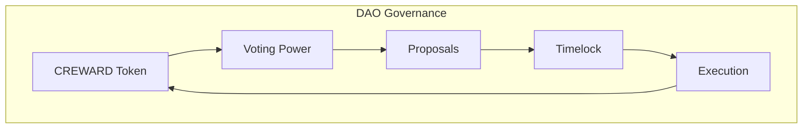
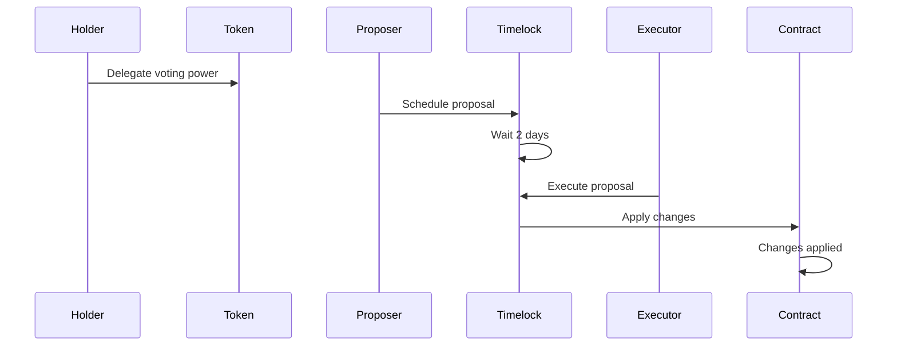

# Protocol Guardians DAO Governance Guide

## Introduction

The Protocol Guardians DAO governance allows CREWARD token holders to participate in decisions about the ecosystem. This guide explains how to create proposals, vote, and execute changes through the Timelock system.

## What is DAO Governance?

DAO (Decentralized Autonomous Organization) governance allows CREWARD token holders to:

- **Create proposals** for ecosystem changes
- **Vote** on important decisions
- **Execute changes** after a waiting period (Timelock)
- **Participate** in project direction

## Governance Architecture



## System Components

### 1. ProtocolPower Token
- **Voting Power**: 1 token = 1 vote
- **Delegation**: You can delegate your voting power
- **Permit**: Approvals without transactions

### 2. ProtocolTimelock
- **Delay**: 2 days for execution
- **Roles**: Proposer, Executor, Admin
- **Security**: Delayed execution

### 3. Tally Integration
- **Interface**: User-friendly governance interface
- **Proposals**: Proposal creation and management
- **Voting**: Intuitive voting system

## Governance Flow



## Step by Step

### 1. Preparation

#### Get CREWARD Tokens
```javascript
// Check token balance
const balance = await protocolPower.balanceOf(userAddress);
console.log("CREWARD tokens:", ethers.formatEther(balance));
```

#### Delegate Voting Power
```javascript
// Delegate to yourself
await protocolPower.delegate(userAddress);

// Delegate to another address
await protocolPower.delegate(delegateAddress);
```

#### Check Voting Power
```javascript
// Check your voting power
const votingPower = await protocolPower.getVotes(userAddress);
console.log("Voting power:", ethers.formatEther(votingPower));
```

### 2. Create Proposal

#### Prepare the Proposal
```javascript
// Example: Grant minter role to new address
const target = protocolPowerAddress;
const value = 0;
const data = protocolPower.interface.encodeFunctionData("grantMinterRole", [newMinterAddress]);
const predecessor = ethers.ZeroHash;
const salt = ethers.ZeroHash;
const delay = 2 * 24 * 60 * 60; // 2 days
```

#### Schedule the Proposal
```javascript
// Schedule proposal (proposers only)
const scheduleTx = await protocolTimelock.connect(proposer).schedule(
    target, value, data, predecessor, salt, delay
);
await scheduleTx.wait();
console.log("✅ Proposal scheduled");
```

#### Get Proposal ID
```javascript
// Get proposal ID
const operationId = await protocolTimelock.hashOperation(
    target, value, data, predecessor, salt
);
console.log("Proposal ID:", operationId);
```

### 3. Monitor Proposal

#### Check Status
```javascript
// Check if pending
const isPending = await protocolTimelock.isOperationPending(operationId);
console.log("Proposal pending:", isPending);

// Check if ready
const isReady = await protocolTimelock.isOperationReady(operationId);
console.log("Proposal ready:", isReady);

// Get complete status
const status = await protocolTimelock.getProposalStatus(operationId);
console.log("Status:", status); // 0: not set, 1: pending, 2: ready, 3: done
```

#### Get Proposal Information
```javascript
// Get complete information
const proposalInfo = await protocolTimelock.getProposalInfo(operationId);
console.log("Target:", proposalInfo.target);
console.log("Value:", proposalInfo.value);
console.log("Data:", proposalInfo.data);
console.log("Predecessor:", proposalInfo.predecessor);
console.log("Salt:", proposalInfo.salt);
```

### 4. Execute Proposal

#### Verify it's Ready
```javascript
// Wait until ready
while (!(await protocolTimelock.isOperationReady(operationId))) {
    console.log("Waiting for proposal to be ready...");
    await new Promise(resolve => setTimeout(resolve, 1000));
}
```

#### Execute the Proposal
```javascript
// Execute proposal (executors only)
const executeTx = await protocolTimelock.connect(executor).execute(
    target, value, data, predecessor, salt
);
await executeTx.wait();
console.log("✅ Proposal executed");
```

### 5. Cancel Proposal (Admin Only)

```javascript
// Cancel proposal (admin only)
const cancelTx = await protocolTimelock.connect(admin).cancel(operationId);
await cancelTx.wait();
console.log("✅ Proposal cancelled");
```

## Complete Examples

### Example 1: Basic Proposal

```javascript
async function basicProposal() {
    // 1. Prepare proposal
    const target = protocolPowerAddress;
    const value = 0;
    const data = protocolPower.interface.encodeFunctionData("grantMinterRole", [newMinterAddress]);
    const predecessor = ethers.ZeroHash;
    const salt = ethers.ZeroHash;
    const delay = 2 * 24 * 60 * 60;
    
    // 2. Schedule proposal
    const operationId = await protocolTimelock.hashOperation(target, value, data, predecessor, salt);
    await protocolTimelock.connect(proposer).schedule(target, value, data, predecessor, salt, delay);
    
    // 3. Wait for delay
    console.log("Waiting 2 days...");
    await ethers.provider.send("evm_increaseTime", [2 * 24 * 60 * 60 + 1]);
    await ethers.provider.send("evm_mine");
    
    // 4. Execute proposal
    await protocolTimelock.connect(executor).execute(target, value, data, predecessor, salt);
    console.log("✅ Proposal executed");
}
```

### Example 2: Role Management

```javascript
async function roleManagement() {
    // Grant proposer role
    const grantProposerData = protocolTimelock.interface.encodeFunctionData("grantRole", [
        await protocolTimelock.PROPOSER_ROLE(),
        newProposerAddress
    ]);
    
    // Grant executor role
    const grantExecutorData = protocolTimelock.interface.encodeFunctionData("grantRole", [
        await protocolTimelock.EXECUTOR_ROLE(),
        newExecutorAddress
    ]);
    
    // Schedule both proposals
    await protocolTimelock.connect(proposer).schedule(
        protocolTimelockAddress, 0, grantProposerData, ethers.ZeroHash, ethers.ZeroHash, 2 * 24 * 60 * 60
    );
    
    await protocolTimelock.connect(proposer).schedule(
        protocolTimelockAddress, 0, grantExecutorData, ethers.ZeroHash, ethers.ZeroHash, 2 * 24 * 60 * 60
    );
    
    console.log("✅ Role proposals scheduled");
}
```

### Example 3: Staking Changes

```javascript
async function stakingChanges() {
    // Example: Pause staking (if implemented)
    const pauseData = protocolStaking.interface.encodeFunctionData("pause");
    
    // Schedule pause
    await protocolTimelock.connect(proposer).schedule(
        stakingAddress, 0, pauseData, ethers.ZeroHash, ethers.ZeroHash, 2 * 24 * 60 * 60
    );
    
    // Example: Change reward rate (if implemented)
    const newRate = ethers.parseEther("0.002"); // New rate
    const changeRateData = protocolStaking.interface.encodeFunctionData("setRewardRate", [newRate]);
    
    await protocolTimelock.connect(proposer).schedule(
        stakingAddress, 0, changeRateData, ethers.ZeroHash, ethers.ZeroHash, 2 * 24 * 60 * 60
    );
    
    console.log("✅ Staking proposals scheduled");
}
```

## Tally Integration

### Tally Setup

1. **Connect Wallet**: Connect your wallet to Tally
2. **Select DAO**: Select Protocol Guardians DAO
3. **Verify Voting Power**: Verify your voting power
4. **Create Proposal**: Use Tally interface to create proposals

### Create Proposal in Tally

1. **Navigate to Proposals**: Go to proposals section
2. **Create New Proposal**: Click "Create Proposal"
3. **Fill Form**:
   - **Title**: Descriptive title for the proposal
   - **Description**: Detailed description
   - **Actions**: Configure proposal actions
4. **Submit Proposal**: Submit proposal for review

### Vote on Proposals

1. **View Proposals**: Navigate to proposals list
2. **Read Details**: Read complete description
3. **Vote**: Select your vote (For/Against/Abstain)
4. **Confirm**: Confirm your vote

## Best Practices

### 1. Proposal Preparation

```javascript
// Verify you have enough voting power
const votingPower = await protocolPower.getVotes(userAddress);
const requiredPower = ethers.parseEther("1000"); // Example: 1000 tokens minimum

if (votingPower < requiredPower) {
    console.log("❌ Insufficient voting power");
    return;
}
```

### 2. Proposal Validation

```javascript
// Validate proposal is valid
async function validateProposal(target, value, data) {
    try {
        // Simulate execution
        await ethers.provider.call({
            to: target,
            value: value,
            data: data
        });
        console.log("✅ Proposal valid");
        return true;
    } catch (error) {
        console.log("❌ Invalid proposal:", error.message);
        return false;
    }
}
```

### 3. Event Monitoring

```javascript
// Monitor governance events
protocolTimelock.on("CallScheduled", (id, target, value, data, predecessor, delay) => {
    console.log("Proposal scheduled:", id);
});

protocolTimelock.on("CallExecuted", (id, target, value, data) => {
    console.log("Proposal executed:", id);
});

protocolTimelock.on("Cancelled", (id) => {
    console.log("Proposal cancelled:", id);
});
```

## Troubleshooting

### Common Issues

#### 1. Error "AccessControlUnauthorizedAccount"
```
Error: AccessControlUnauthorizedAccount
```
**Solution**: Make sure you have the correct role (proposer/executor).

#### 2. Error "TimelockInsufficientDelay"
```
Error: TimelockInsufficientDelay
```
**Solution**: Wait for the complete delay (2 days) before executing.

#### 3. Error "CallNotReady"
```
Error: CallNotReady
```
**Solution**: Verify the proposal is ready to execute.

#### 4. Error "CallAlreadyExecuted"
```
Error: CallAlreadyExecuted
```
**Solution**: The proposal has already been executed.

### Security Checks

```javascript
// Verify roles
const isProposer = await protocolTimelock.hasRole(
    await protocolTimelock.PROPOSER_ROLE(),
    userAddress
);
const isExecutor = await protocolTimelock.hasRole(
    await protocolTimelock.EXECUTOR_ROLE(),
    userAddress
);
const isAdmin = await protocolTimelock.hasRole(
    await protocolTimelock.TIMELOCK_ADMIN_ROLE(),
    userAddress
);

console.log("Is proposer:", isProposer);
console.log("Is executor:", isExecutor);
console.log("Is admin:", isAdmin);
```

## Next Steps

1. **Participate Actively**: Join governance discussions
2. **Create Proposals**: Propose ecosystem improvements
3. **Vote Responsibly**: Vote on important proposals
4. **Educate Others**: Help other holders understand governance

## Additional Resources

- [Staking Guide](./staking-guide.md)
- [Usage Examples](./examples.md)
- [Contract Documentation](./contracts.md)
- [System Architecture](./architecture.md)

## Support

If you have issues with governance:

1. Review this guide step by step
2. Verify you have the correct roles
3. Consult technical documentation
4. Contact the development team
5. Join the DAO community
