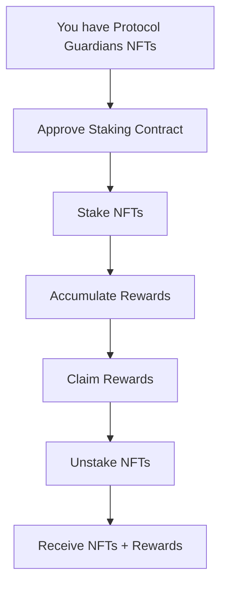

# Protocol Guardians Staking Guide

## Introduction

Staking Protocol Guardians NFTs allows you to earn POWER tokens as rewards for keeping your NFTs locked in the staking contract. This guide explains how to stake, claim rewards, and manage your staked NFTs.

## What is Staking?

Staking is the process of depositing your NFTs into the staking contract to earn rewards. The NFTs are transferred to the contract (custody staking) and you accumulate CREWARD tokens automatically.

### Staking Features

- **Rewards**: 10 CREWARD tokens per NFT per day
- **Custody**: NFTs are transferred to the contract
- **Accumulative**: Rewards accumulate automatically
- **Flexible**: You can stake/unstake at any time

## Staking Flow



## Step by Step

### 1. Preparation

#### Verify you have NFTs
```javascript
// Check NFT balance
const balance = await protocolGuardians.balanceOf(userAddress);
console.log("NFTs in your wallet:", balance.toString());
```

#### Verify you have CREWARD tokens (optional)
```javascript
// Check CREWARD token balance
const rewardBalance = await protocolPower.balanceOf(userAddress);
console.log("CREWARD tokens:", ethers.formatEther(rewardBalance));
```

### 2. Approve Staking Contract

Before staking, you must approve the staking contract to transfer your NFTs:

```javascript
// Approve staking contract for all NFTs
const approveTx = await protocolGuardians.setApprovalForAll(stakingAddress, true);
await approveTx.wait();
console.log("✅ Staking contract approved");
```

### 3. Stake NFTs

#### Staking a single NFT
```javascript
// Stake a specific NFT
const tokenId = 1;
const stakeTx = await protocolStaking.stake([tokenId]);
await stakeTx.wait();
console.log("✅ NFT staked:", tokenId);
```

#### Staking multiple NFTs
```javascript
// Stake multiple NFTs (max 30 per transaction)
const tokenIds = [1, 2, 3, 4, 5];
const stakeTx = await protocolStaking.stake(tokenIds);
await stakeTx.wait();
console.log("✅ NFTs staked:", tokenIds);
```

### 4. Verify Staking

#### Check staked NFTs
```javascript
// Get staked NFTs by user
const stakedTokens = await protocolStaking.getStakedTokens(userAddress);
console.log("Staked NFTs:", stakedTokens);
```

#### Check staking information
```javascript
// Get staking information for a token
const stakingInfo = await protocolStaking.getStakingInfo(tokenId);
console.log("Owner:", stakingInfo.owner);
console.log("Staked at block:", stakingInfo.stakedAtBlock);
console.log("Last claimed block:", stakingInfo.lastClaimedBlock);
console.log("Pending rewards:", ethers.formatEther(stakingInfo.pendingRewards));
```

### 5. Monitor Rewards

#### Check pending rewards
```javascript
// Pending rewards for a specific token
const pendingRewards = await protocolStaking.getPendingRewards(tokenId);
console.log("Pending rewards:", ethers.formatEther(pendingRewards));
```

#### Check total rewards
```javascript
// Total rewards for a user
const totalRewards = await protocolStaking.getTotalPendingRewards(userAddress);
console.log("Total rewards:", ethers.formatEther(totalRewards));
```

### 6. Claim Rewards

#### Claim rewards without unstaking
```javascript
// Claim rewards for specific tokens
const tokenIds = [1, 2, 3];
const claimTx = await protocolStaking.claimRewards(tokenIds);
await claimTx.wait();
console.log("✅ Rewards claimed");
```

#### Check balance after claim
```javascript
// Check CREWARD token balance
const newBalance = await protocolPower.balanceOf(userAddress);
console.log("New CREWARD balance:", ethers.formatEther(newBalance));
```

### 7. Unstake NFTs

#### Unstake with automatic rewards
```javascript
// Unstake NFTs (automatically claims rewards)
const tokenIds = [1, 2, 3];
const unstakeTx = await protocolStaking.unstake(tokenIds);
await unstakeTx.wait();
console.log("✅ NFTs unstaked and rewards claimed");
```

#### Verify NFTs returned
```javascript
// Verify NFTs returned to your wallet
const nftOwner = await protocolGuardians.ownerOf(tokenId);
console.log("NFT owner:", nftOwner);
```

## Complete Examples

### Example 1: Basic Staking

```javascript
async function basicStaking() {
    // 1. Approve staking contract
    await protocolGuardians.setApprovalForAll(stakingAddress, true);
    
    // 2. Stake NFT
    await protocolStaking.stake([1]);
    
    // 3. Wait for some blocks
    for (let i = 0; i < 10; i++) {
        await ethers.provider.send("evm_mine");
    }
    
    // 4. Check rewards
    const rewards = await protocolStaking.getPendingRewards(1);
    console.log("Rewards:", ethers.formatEther(rewards));
    
    // 5. Claim rewards
    await protocolStaking.claimRewards([1]);
    
    // 6. Unstake
    await protocolStaking.unstake([1]);
}
```

### Example 2: Advanced Staking

```javascript
async function advancedStaking() {
    // 1. Mint multiple NFTs
    for (let i = 0; i < 5; i++) {
        await protocolGuardians.mint(userAddress);
    }
    
    // 2. Approve staking contract
    await protocolGuardians.setApprovalForAll(stakingAddress, true);
    
    // 3. Stake all NFTs (max 30 per transaction)
    const tokenIds = [1, 2, 3, 4, 5];
    await protocolStaking.stake(tokenIds);
    
    // 4. Monitor rewards
    setInterval(async () => {
        const totalRewards = await protocolStaking.getTotalPendingRewards(userAddress);
        console.log("Accumulated rewards:", ethers.formatEther(totalRewards));
    }, 10000); // Every 10 seconds
    
    // 5. Claim rewards periodically
    setInterval(async () => {
        await protocolStaking.claimRewards(tokenIds);
        console.log("Rewards claimed");
    }, 60000); // Every minute
}
```

### Example 3: Portfolio Management

```javascript
async function portfolioManagement() {
    // Get all staked NFTs
    const stakedTokens = await protocolStaking.getStakedTokens(userAddress);
    console.log("Staked NFTs:", stakedTokens);
    
    // Calculate rewards per NFT
    for (const tokenId of stakedTokens) {
        const rewards = await protocolStaking.getPendingRewards(tokenId);
        console.log(`Token ${tokenId}: ${ethers.formatEther(rewards)} CREWARD`);
    }
    
    // Calculate total rewards
    const totalRewards = await protocolStaking.getTotalPendingRewards(userAddress);
    console.log("Total rewards:", ethers.formatEther(totalRewards));
    
    // Claim all rewards
    if (totalRewards > 0) {
        await protocolStaking.claimRewards(stakedTokens);
        console.log("All rewards claimed");
    }
}
```

## Reward Calculation

### Reward Formula

```
Rewards = Blocks_Staked × REWARD_RATE_PER_BLOCK
```

Where:
- `REWARD_RATE_PER_BLOCK = 1388888888888888` (0.001388888888888888 tokens per block)
- `Blocks_Staked = Current_Block - Last_Claim_Block`

### Calculation Example

```javascript
// Calculate rewards manually
function calculateRewards(stakedAtBlock, lastClaimedBlock, currentBlock) {
    const blocksStaked = currentBlock - lastClaimedBlock;
    const rewardRate = 1388888888888888n; // REWARD_RATE_PER_BLOCK
    return blocksStaked * rewardRate;
}

// Example: NFT staked at block 1000, last claim at block 1500, current block 2000
const rewards = calculateRewards(1000, 1500, 2000);
console.log("Rewards:", ethers.formatEther(rewards));
```

## Best Practices

### 1. Gas Management

```javascript
// Estimate gas before transactions
const gasEstimate = await protocolStaking.stake.estimateGas([1]);
console.log("Estimated gas:", gasEstimate.toString());

// Use dynamic gas price
const gasPrice = await ethers.provider.getGasPrice();
const tx = await protocolStaking.stake([1], { gasPrice });

// Note: Maximum 30 NFTs per transaction to prevent gas exhaustion
// The contract is optimized with the Checks-Effects-Interactions pattern
// to minimize gas and DoS risks
```

### 2. Error Handling

```javascript
try {
    await protocolStaking.stake([1]);
    console.log("✅ Staking successful");
} catch (error) {
    if (error.message.includes("Not token owner")) {
        console.log("❌ You don't own this NFT");
    } else if (error.message.includes("Token already staked")) {
        console.log("❌ NFT is already staked");
    } else {
        console.log("❌ Error:", error.message);
    }
}
```

### 3. Event Monitoring

```javascript
// Monitor staking events
protocolStaking.on("NFTsStaked", (owner, tokenIds) => {
    console.log("NFTs staked:", owner, tokenIds);
});

protocolStaking.on("RewardsClaimed", (owner, tokenIds, amount) => {
    console.log("Rewards claimed:", owner, tokenIds, ethers.formatEther(amount));
});

protocolStaking.on("NFTsUnstaked", (owner, tokenIds) => {
    console.log("NFTs unstaked:", owner, tokenIds);
});
```

## Troubleshooting

### Common Issues

#### 1. Error "Not token owner"
```
Error: ProtocolStaking: Not token owner
```
**Solution**: Make sure you own the NFT you want to stake.

#### 2. Error "Token already staked"
```
Error: ProtocolStaking: Token already staked
```
**Solution**: The NFT is already staked. Check with `getStakedTokens()`.

#### 3. Error "No rewards to claim"
```
Error: ProtocolStaking: No rewards to claim
```
**Solution**: No pending rewards. Wait for more blocks.

#### 4. Approval error
```
Error: ProtocolStaking: NotOwnerNorApproved
```
**Solution**: Approve the staking contract with `setApprovalForAll()`.

### Security Checks

```javascript
// Verify the contract is correct
const nftContract = await protocolStaking.nftContract();
const rewardContract = await protocolStaking.rewardToken();
console.log("NFT Contract:", nftContract);
console.log("Reward Contract:", rewardContract);

// Verify you have permissions
const isApproved = await protocolGuardians.isApprovedForAll(userAddress, stakingAddress);
console.log("Staking contract approved:", isApproved);

// Note: The contract implements security optimizations:
// - Checks-Effects-Interactions pattern to prevent reentrancy
// - Gas limits to prevent DoS attacks
// - Exhaustive validations before critical operations
```

## Next Steps

1. **Explore Governance**: Participate in DAO decisions with your CREWARD tokens
2. **Optimize Staking**: Find the optimal staking strategy
3. **Monitor Rewards**: Set up alerts for rewards
4. **Share Experience**: Help other users

## Additional Resources

- [DAO Governance Guide](./dao-guide.md)
- [Usage Examples](./examples.md)
- [Contract Documentation](./contracts.md)
- [System Architecture](./architecture.md)

## Support

If you have issues with staking:

1. Review this guide step by step
2. Verify you have the correct permissions
3. Consult technical documentation
4. Contact the development team
