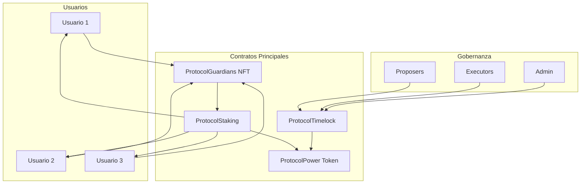
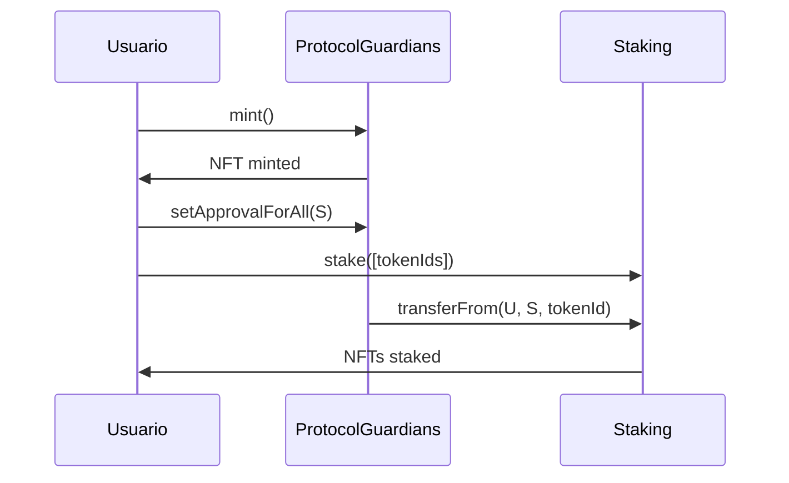
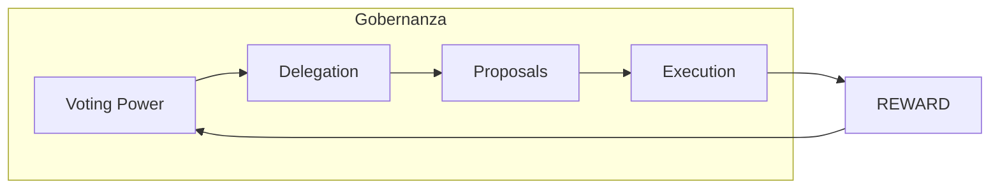
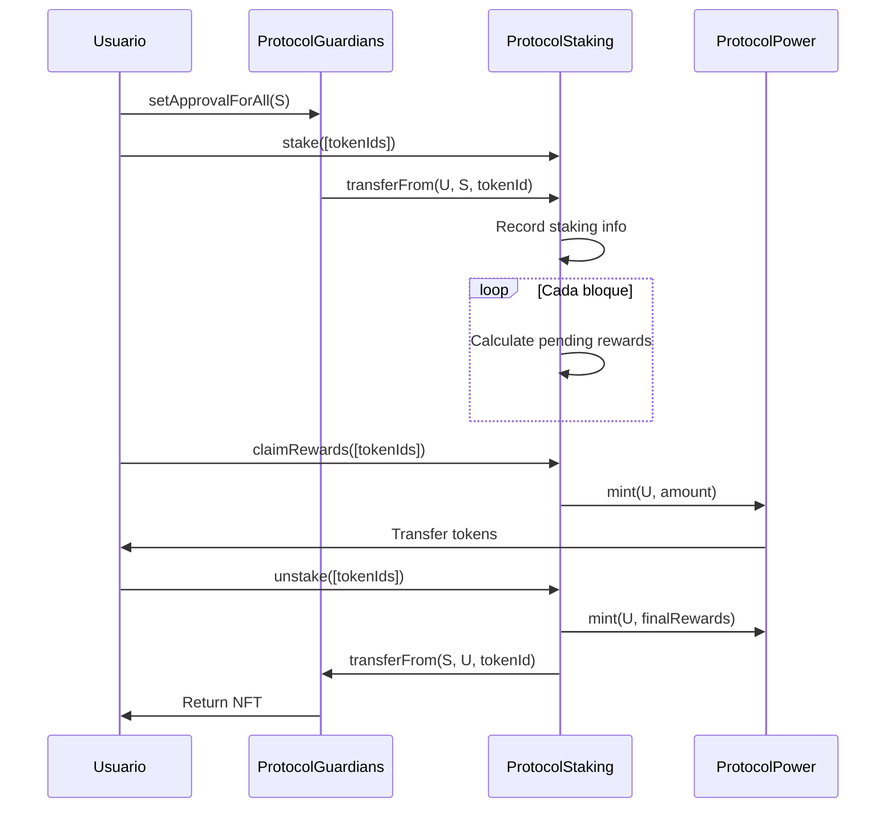
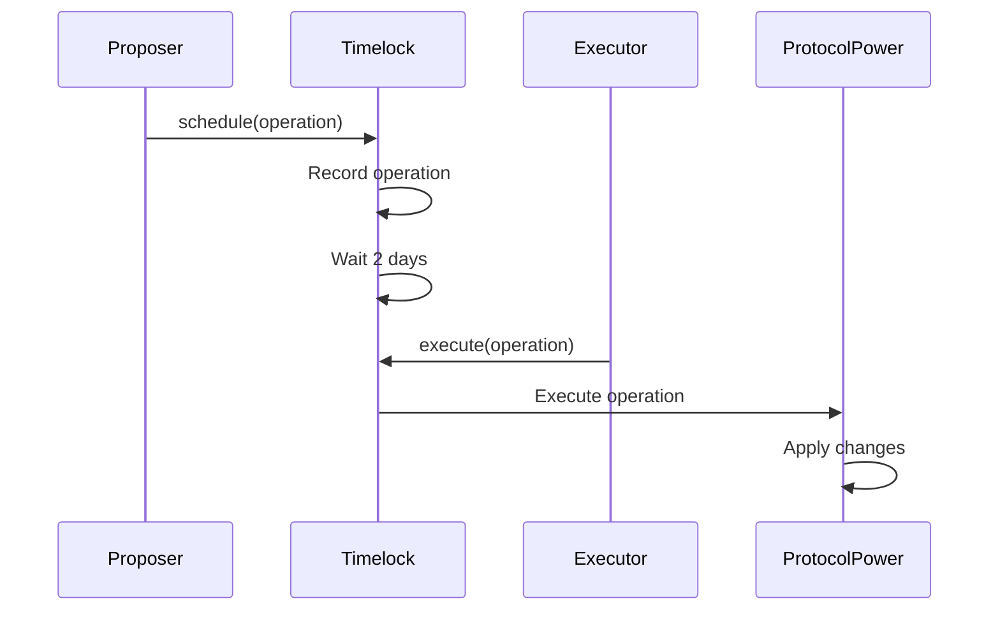
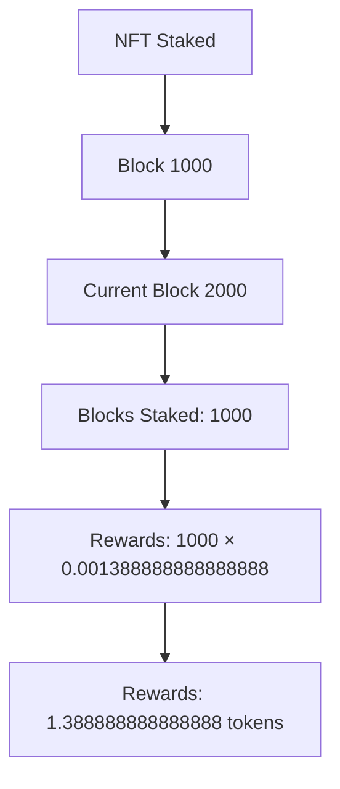
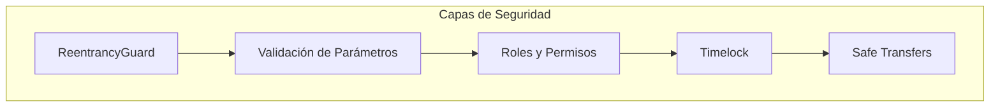
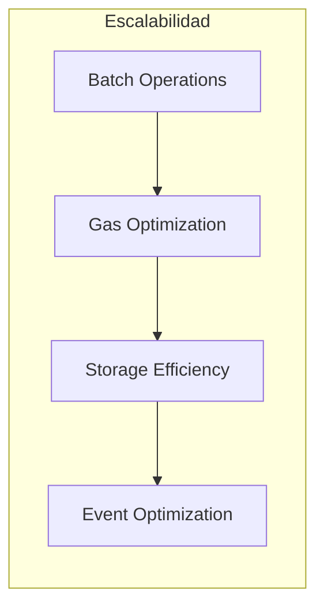
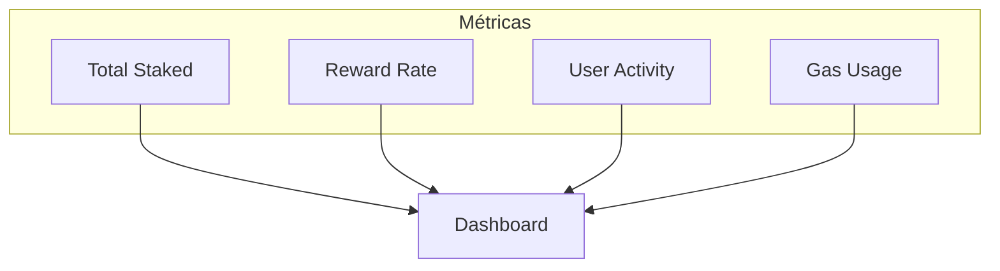

# Arquitectura del Sistema ProtocolGuardians

## Visión General

ProtocolGuardians es un ecosistema de contratos inteligentes construido en Ethereum que permite el staking de NFTs con recompensas y gobernanza DAO. El sistema está diseñado para ser seguro, eficiente y descentralizado.

## Diagrama de Arquitectura



## Componentes del Sistema

### 1. ProtocolGuardians NFT (ERC721)

**Propósito**: Colección de NFTs con metadatos inmutables

**Características**:
- Implementación con Solady para optimización de gas
- URI base inmutable (IPFS)
- Supply ilimitado
- Transferencias estándar ERC721

**Flujo de Datos**:


### 2. ProtocolPower Token (ERC20)

**Propósito**: Token de recompensas con capacidades de gobernanza

**Características**:
- Implementación ERC20 estándar
- Extensiones de gobernanza (Votes, Permit)
- Minting on-demand
- Ownership por Timelock

**Estructura de Gobernanza**:


### 3. ProtocolStaking

**Propósito**: Contrato de staking con custody y distribución de recompensas

**Características**:
- Custody staking (NFTs transferidos al contrato)
- Cálculo preciso de recompensas
- Protección contra reentrancy
- Tracking de múltiples NFTs por usuario

**Flujo de Staking**:


### 4. ProtocolTimelock

**Propósito**: Controlador de timelock para gobernanza DAO

**Características**:
- Delay configurable para ejecución (por defecto 2 días)
- Roles de proposer, executor y admin
- Cancelación de propuestas
- Ejecución segura de operaciones

**Flujo de Gobernanza**:


## Cálculo de Recompensas

### Fórmula de Recompensas

```
Recompensas = Bloques_Stakeados × REWARD_RATE_PER_BLOCK
```

Donde:
- `REWARD_RATE_PER_BLOCK = 1388888888888888` (0.001388888888888888 tokens por bloque)
- `Bloques_Stakeados = Bloque_Actual - Bloque_Último_Claim`

### Ejemplo de Cálculo



## Seguridad

### Medidas de Seguridad Implementadas

1. **ReentrancyGuard**: Protección contra ataques de reentrancy
2. **Validación de Parámetros**: Verificación de todas las entradas
3. **Roles y Permisos**: Control de acceso granular
4. **Timelock**: Delay para operaciones críticas
5. **Safe Transfers**: Uso de SafeERC20 para transfers

### Diagrama de Seguridad



## Optimizaciones de Gas

### Estrategias Implementadas

1. **Solady**: Contratos optimizados para gas
2. **Batch Operations**: Operaciones en lote
3. **Storage Optimization**: Optimización de almacenamiento
4. **Event Optimization**: Eventos eficientes

### Comparación de Gas

| Operación | Gas Cost | Optimización |
|-----------|----------|--------------|
| Mint NFT | ~150k | Solady ERC721 |
| Stake NFT | ~200k | Batch operations |
| Claim Rewards | ~100k | Efficient calculation |
| Unstake NFT | ~180k | Batch operations |

## Escalabilidad

### Consideraciones de Escalabilidad

1. **Batch Operations**: Hasta 30 NFTs por transacción
2. **Gas Limits**: Operaciones optimizadas para límites de gas
3. **Storage Efficiency**: Mínimo uso de storage
4. **Event Optimization**: Eventos compactos

### Diagrama de Escalabilidad



## Monitoreo y Analytics

### Métricas Importantes

1. **Total Staked**: Número total de NFTs en staking
2. **Reward Rate**: Tasa de recompensas por bloque
3. **User Activity**: Actividad de usuarios
4. **Gas Usage**: Uso de gas por operación

### Dashboard de Monitoreo



## Limitaciones del Sistema

### Limitaciones de Diseño
1. **Supply Ilimitado**: Protocol Guardians no tiene límite de supply
2. **Mint Público**: Cualquiera puede mintear NFTs
3. **Sin Pausa**: Staking no puede ser pausado
4. **Inmutabilidad**: Parámetros de recompensas son fijos

### Límites Técnicos
1. **Batch Operations**: Máximo 30 NFTs por transacción
2. **Gas Limits**: Operaciones en batch limitadas por gas
3. **Block-based Rewards**: Recompensas calculadas por bloque de Ethereum

## Próximos Pasos

1. **Auditoría de Seguridad**: Auditoría completa de contratos
2. **Optimizaciones**: Mejoras adicionales de gas
3. **Integraciones**: Integración con más plataformas
4. **Analytics**: Sistema de analytics avanzado

## Conclusión

La arquitectura de Protocol Guardians está diseñada para ser segura, eficiente y escalable. El sistema utiliza las mejores prácticas de desarrollo de contratos inteligentes y está optimizado para el ecosistema Ethereum.

Para más detalles técnicos, consulta la [Documentación de Contratos](./contratos.md).
