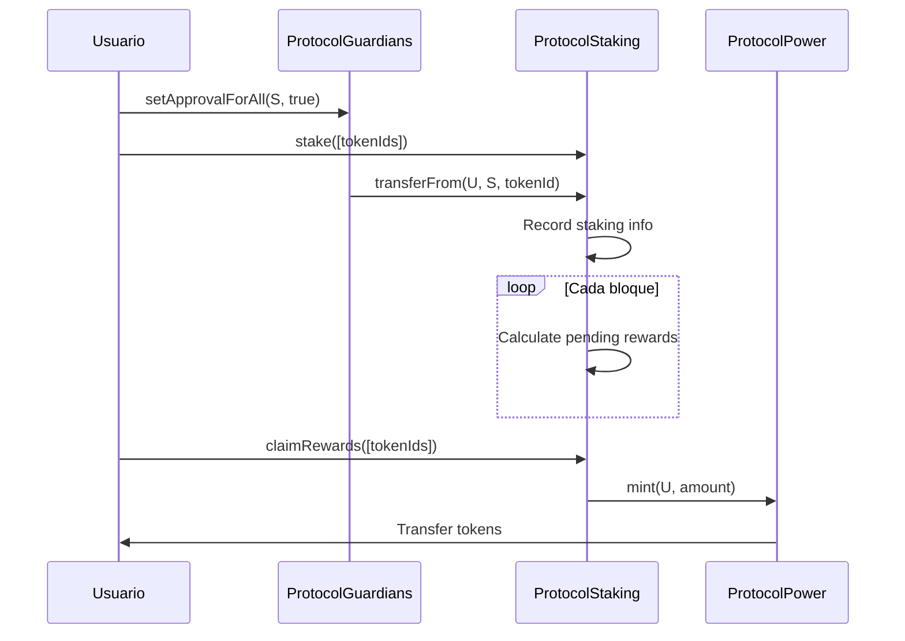
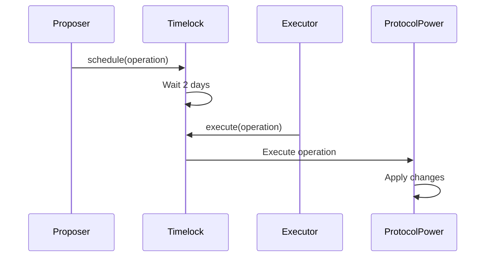

# Documentación de Contratos Protocol Guardians

## Visión General

Este documento proporciona documentación técnica detallada de todos los contratos del ecosistema Protocol Guardians construido en Ethereum, incluyendo consideraciones de seguridad y detalles de implementación.

## Contratos Desplegados

### Ethereum Mainnet
- **ProtocolGuardians NFT**: [`0xfB49118d739482048ff514b699C23E2875a91837`](https://etherscan.io/address/0xfB49118d739482048ff514b699C23E2875a91837)
- **Etherscan**: [Ver Contrato](https://etherscan.io/address/0xfB49118d739482048ff514b699C23E2875a91837)
- **Sourcify**: [Código Verificado](https://repo.sourcify.dev/1/0xfB49118d739482048ff514b699C23E2875a91837/)
- **Blockscout**: [Ver en Blockscout](https://eth.blockscout.com/address/0xfB49118d739482048ff514b699C23E2875a91837?tab=contract)
- **Routescan**: [Ver en Routescan](https://routescan.io/address/0xfB49118d739482048ff514b699C23E2875a91837/contract/1/code)

## Consideraciones de Seguridad

### Análisis Estático con Slither
Todos los contratos han sido analizados usando [Slither](https://github.com/crytic/slither), un framework de análisis estático para Solidity. Los problemas críticos de seguridad han sido identificados y corregidos:

- **Variable Shadowing**: Corregido en ProtocolGuardians.sol
- **Llamadas Externas en Bucles**: Documentadas limitaciones en ProtocolStaking.sol
- **Operaciones Costosas en Bucles**: Documentadas consideraciones de gas
- **Protección contra Reentrancy**: Implementación del patrón Checks-Effects-Interactions
- **Control de Acceso**: Permisos basados en roles y patrón Ownable
- **Validación de Entrada**: Validación integral de parámetros
- **Funciones de Emergencia**: Mecanismos de retiro para ETH accidental

📖 **[Lee el Análisis de Seguridad Completo](../SECURITY.md)**

## ProtocolGuardians NFT

### Descripción
Contrato ERC721 para la colección de NFTs ProtocolGuardians con sistema de identificación basado en CIDs de IPFS.

### Características Principales
- **Herencia**: Solady ERC721, OpenZeppelin Ownable
- **Token IDs**: CIDs de IPFS como identificadores externos (mantiene compatibilidad uint256 interna)
- **Supply**: Ilimitado
- **Optimización**: Gas optimizado con Solady
- **Gateway**: Usa https://ipfs.io/ipfs/ para tokenURI

### Funciones Principales

#### `constructor(string memory baseURI_)`
Inicializa el contrato con URI base inmutable.
```solidity
constructor(string memory baseURI_) {
    _baseTokenURI = baseURI_;
}
```

#### `mint(address to, string memory cid) external returns (uint256 tokenId)`
Mint un nuevo NFT al address especificado con CID de IPFS.
- **Parámetros**: 
  - `to` - Address que recibirá el NFT
  - `cid` - CID de IPFS para los metadatos del token
- **Retorna**: `tokenId` - ID interno uint256 del token mintado
- **Eventos**: 
  - `TokenMinted(address indexed to, uint256 indexed tokenId)`
  - `TokenMintedWithCID(uint256 indexed tokenId, string cid, address indexed to)`

⚠️ **ADVERTENCIA IMPORTANTE**: La función mint() es pública y sin restricciones de acceso. 
Cualquier dirección puede mintear NFTs sin límite. No hay control de owner ni límite de supply.
Esto es intencional para permitir minting abierto, pero debe considerarse en el modelo de negocio.

#### `tokenURI(uint256 tokenId) public view returns (string memory)`
Retorna la URI completa del token usando gateway de IPFS.
- **Parámetros**: `tokenId` - ID interno uint256 del token
- **Retorna**: URL completa de IPFS (https://ipfs.io/ipfs/{cid})
- **Reverts**: Si el token no existe

#### `withdraw() external onlyOwner`
Permite al owner retirar cualquier ETH enviado accidentalmente a este contrato.
- **Seguridad**: Previene que el contrato bloquee ether permanentemente
- **Acceso**: Solo owner puede llamar
- **Eventos**: Ninguno

#### `getBalance() external view returns (uint256)`
Retorna el balance de ETH del contrato.
- **Retorna**: Balance de ETH en wei
- **Acceso**: Función pública de solo lectura

#### `getCIDByTokenId(uint256 tokenId) external view returns (string memory)`
Retorna el CID de IPFS para un ID de token dado.
- **Parámetros**: `tokenId` - ID interno uint256 del token
- **Retorna**: String del CID de IPFS (string vacío si el token no existe)
- **Acceso**: Función pública de solo lectura

#### `getTokenIdByCID(string memory cid) external view returns (uint256)`
Retorna el ID interno del token para un CID de IPFS dado.
- **Parámetros**: `cid` - String del CID de IPFS
- **Retorna**: ID interno uint256 del token
- **Reverts**: Si el CID no se encuentra
- **Acceso**: Función pública de solo lectura

#### `batchMintToSingleAddress(address recipient, string[] memory cids) external returns (uint256[] memory tokenIds)`
Mint múltiples NFTs a una sola dirección con diferentes CIDs.
- **Parámetros**: 
  - `recipient` - Dirección que recibirá los NFTs
  - `cids` - Array de CIDs de IPFS
- **Retorna**: Array de IDs internos de tokens
- **Reverts**: Si el array de cids está vacío
- **Acceso**: Función pública

### Eventos

```solidity
event TokenMinted(address indexed to, uint256 indexed tokenId);
event TokenMintedWithCID(uint256 indexed tokenId, string cid, address indexed to);
```

### Ejemplo de Uso

```javascript
// Mint un NFT con CID de IPFS
const cid = "bafybeigdyrzt5sfp7udm7hu76uh7y26nf3efuylqabf3oclgtqy55fbzdi";
const tx = await protocolGuardians.mint(userAddress, cid);
await tx.wait();

// Obtener URI del token (retorna URL del gateway de IPFS)
const tokenURI = await protocolGuardians.tokenURI(1);
console.log(tokenURI); // "https://ipfs.io/ipfs/bafybeigdyrzt5sfp7udm7hu76uh7y26nf3efuylqabf3oclgtqy55fbzdi"

// Obtener CID por ID de token
const tokenCID = await protocolGuardians.getCIDByTokenId(1);
console.log(tokenCID); // "bafybeigdyrzt5sfp7udm7hu76uh7y26nf3efuylqabf3oclgtqy55fbzdi"

// Obtener ID de token por CID
const tokenId = await protocolGuardians.getTokenIdByCID(cid);
console.log(tokenId); // 1

// Batch mint múltiples NFTs
const cids = ["bafybei...", "bafybei...", "bafybei..."];
const tokenIds = await protocolGuardians.batchMintToSingleAddress(userAddress, cids);

// Verificar balance del contrato
const balance = await protocolGuardians.getBalance();
console.log("Contract ETH balance:", ethers.formatEther(balance));

// Retirar ETH (solo owner)
if (balance > 0) {
    await protocolGuardians.withdraw();
    console.log("ETH withdrawn");
}
```

## ProtocolPower Token

### Descripción
Token ERC20 con capacidades de gobernanza para recompensas de staking.

### Características Principales
- **Herencia**: ERC20, ERC20Votes, ERC20Permit, Ownable
- **Nombre**: "ProtocolPower"
- **Símbolo**: "POWER"
- **Decimals**: 18
- **Max Supply**: 100,000,000 tokens

### Funciones Principales

#### `constructor(address initialOwner)`
Inicializa el token con owner inicial (Timelock).
```solidity
constructor(address initialOwner) 
    ERC20("ProtocolPower", "POWER") 
    ERC20Permit("ProtocolPower")
    Ownable(initialOwner)
```

#### `mint(address to, uint256 amount) external onlyMinter`
Mint tokens a la dirección especificada.
- **Parámetros**: 
  - `to` - Address que recibirá los tokens
  - `amount` - Cantidad de tokens a mintar
- **Modifiers**: `onlyMinter`
- **Eventos**: `TokensMinted(address indexed to, uint256 amount)`

#### `grantMinterRole(address account) external onlyOwner`
Otorga rol de minter a una dirección.
- **Parámetros**: `account` - Address que recibirá el rol
- **Modifiers**: `onlyOwner`
- **Eventos**: `MinterRoleGranted(address indexed account)`

#### `revokeMinterRole(address account) external onlyOwner`
Revoca rol de minter de una dirección.
- **Parámetros**: `account` - Address que perderá el rol
- **Modifiers**: `onlyOwner`
- **Eventos**: `MinterRoleRevoked(address indexed account)`

### Funciones de Gobernanza

#### `delegate(address delegatee) external`
Delega poder de voto a otra dirección.
```javascript
await protocolPower.delegate(delegateeAddress);
```

#### `getVotes(address account) external view returns (uint256)`
Obtiene el poder de voto de una dirección.
```javascript
const votingPower = await protocolPower.getVotes(accountAddress);
```

#### `permit(address owner, address spender, uint256 value, uint256 deadline, uint8 v, bytes32 r, bytes32 s) external`
Permite aprobación de tokens sin transacción.
```javascript
const permit = await protocolPower.permit(
    ownerAddress,
    spenderAddress,
    amount,
    deadline,
    v, r, s
);
```

### Eventos

```solidity
event TokensMinted(address indexed to, uint256 amount);
event MinterRoleGranted(address indexed account);
event MinterRoleRevoked(address indexed account);
```

## ProtocolStaking

### Descripción
Contrato de staking con custody para NFTs ProtocolGuardians y distribución de recompensas.

### Características Principales
- **Custody Staking**: NFTs transferidos al contrato
- **Reward Rate**: 10 tokens por día por NFT
- **Protección**: ReentrancyGuard
- **Tracking**: Múltiples NFTs por usuario

⚠️ **NOTA**: El contrato de staking es inmutable. No incluye funciones pause() 
ni setRewardRate(). Los parámetros de recompensas no pueden ser modificados después del deployment.

### Funciones Principales

#### `stake(uint256[] calldata tokenIds) external nonReentrant`
Stake múltiples NFTs.
- **Parámetros**: `tokenIds` - Array de IDs de tokens a stake (máximo 30)
- **Modifiers**: `nonReentrant`
- **Eventos**: `NFTsStaked(address indexed owner, uint256[] tokenIds)`

#### `unstake(uint256[] calldata tokenIds) external nonReentrant`
Unstake múltiples NFTs y claim recompensas.
- **Parámetros**: `tokenIds` - Array de IDs de tokens a unstake (máximo 30)
- **Modifiers**: `nonReentrant`
- **Eventos**: `NFTsUnstaked`, `RewardsClaimed`

#### `claimRewards(uint256[] calldata tokenIds) external nonReentrant`
Claim recompensas sin unstake.
- **Parámetros**: `tokenIds` - Array de IDs de tokens (máximo 30)
- **Modifiers**: `nonReentrant`
- **Eventos**: `RewardsClaimed`

### Funciones de Consulta

#### `getStakedTokens(address owner) external view returns (uint256[] memory)`
Obtiene tokens stakeados por un usuario.
```javascript
const stakedTokens = await protocolStaking.getStakedTokens(userAddress);
```

#### `getPendingRewards(uint256 tokenId) external view returns (uint256)`
Obtiene recompensas pendientes para un token.
```javascript
const rewards = await protocolStaking.getPendingRewards(tokenId);
```

#### `getTotalPendingRewards(address owner) external view returns (uint256)`
Obtiene total de recompensas pendientes para un usuario.
```javascript
const totalRewards = await protocolStaking.getTotalPendingRewards(userAddress);
```

#### `getStakingInfo(uint256 tokenId) external view returns (...)`
Obtiene información completa de staking para un token.
```javascript
const info = await protocolStaking.getStakingInfo(tokenId);
// info.owner, info.stakedAtBlock, info.lastClaimedBlock, info.pendingRewards
```

### Cálculo de Recompensas

```solidity
function _calculateRewards(uint256 tokenId, uint256 currentBlock) internal view returns (uint256) {
    StakingInfo memory info = stakingInfo[tokenId];
    
    if (info.owner == address(0)) {
        return 0;
    }
    
    uint256 blocksStaked = currentBlock - info.lastClaimedBlock;
    return blocksStaked * REWARD_RATE_PER_BLOCK;
}
```

### Eventos

```solidity
event NFTsStaked(address indexed owner, uint256[] tokenIds);
event NFTsUnstaked(address indexed owner, uint256[] tokenIds);
event RewardsClaimed(address indexed owner, uint256[] tokenIds, uint256 amount);
```

## ProtocolTimelock

### Descripción
Controlador de timelock para gobernanza DAO con delay configurable.

### Características Principales
- **Delay**: Configurable en el constructor (por defecto 2 días)
- **Roles**: Proposer, Executor, Admin
- **Seguridad**: Ejecución retardada
- **Cancelación**: Propuestas cancelables

### Funciones Principales

#### `schedule(address target, uint256 value, bytes calldata data, bytes32 predecessor, bytes32 salt, uint256 delay) external`
Programa una operación para ejecución futura.
- **Parámetros**:
  - `target` - Contrato objetivo
  - `value` - Valor ETH a enviar
  - `data` - Calldata de la función
  - `predecessor` - Operación precedente
  - `salt` - Salt único
  - `delay` - Delay en segundos
- **Modifiers**: Solo proposers
- **Eventos**: `CallScheduled`

#### `execute(address target, uint256 value, bytes calldata data, bytes32 predecessor, bytes32 salt) external`
Ejecuta una operación programada.
- **Parámetros**: Mismos que schedule
- **Modifiers**: Solo executors
- **Requisitos**: Operación debe estar lista
- **Eventos**: `CallExecuted`

#### `cancel(bytes32 id) external`
Cancela una operación programada.
- **Parámetros**: `id` - ID de la operación
- **Modifiers**: Solo admin
- **Eventos**: `Cancelled`

### Funciones de Consulta

#### `isOperationPending(bytes32 id) external view returns (bool)`
Verifica si una operación está pendiente.
```javascript
const isPending = await protocolTimelock.isOperationPending(operationId);
```

#### `isOperationReady(bytes32 id) external view returns (bool)`
Verifica si una operación está lista para ejecutar.
```javascript
const isReady = await protocolTimelock.isOperationReady(operationId);
```

#### `getProposalStatus(bytes32 id) external view returns (uint8)`
Obtiene el estado de una propuesta.
- **Retorna**: 0 (not set), 1 (pending), 2 (ready), 3 (done)

### Ejemplo de Gobernanza

```javascript
// 1. Crear propuesta
const target = protocolPowerAddress;
const value = 0;
const data = protocolPower.interface.encodeFunctionData("grantMinterRole", [newMinterAddress]);
const predecessor = ethers.ZeroHash;
const salt = ethers.ZeroHash;
const delay = 2 * 24 * 60 * 60; // 2 días (configurable en deployment)

// 2. Programar operación
await protocolTimelock.connect(proposer).schedule(
    target, value, data, predecessor, salt, delay
);

// 3. Esperar delay
await ethers.provider.send("evm_increaseTime", [2 * 24 * 60 * 60 + 1]);
await ethers.provider.send("evm_mine");

// 4. Ejecutar operación
await protocolTimelock.connect(executor).execute(
    target, value, data, predecessor, salt
);
```

## Interacciones Entre Contratos

### Flujo de Staking



### Flujo de Gobernanza



## Consideraciones de Seguridad

### Validaciones Implementadas

1. **ReentrancyGuard**: En ProtocolStaking
2. **Role-based Access**: En todos los contratos
3. **Parameter Validation**: En todas las funciones
4. **Safe Transfers**: Uso de SafeERC20
5. **Timelock Delay**: Para operaciones críticas

### Mejores Prácticas

1. **Auditoría**: Contratos auditados antes de deployment
2. **Testing**: Cobertura de tests >95%
3. **Monitoring**: Monitoreo de eventos y métricas
4. **Upgrades**: Considerar upgradeability si es necesario

## Gas Optimization

### Estrategias Implementadas

1. **Solady**: Contratos optimizados
2. **Batch Operations**: Operaciones en lote con límites de gas
3. **Storage Packing**: Optimización de storage
4. **Event Optimization**: Eventos eficientes
5. **External Calls Management**: Documentación de limitaciones en bucles

### Estimaciones de Gas

| Operación | Gas Cost | Optimización | Limitaciones |
|-----------|----------|--------------|--------------|
| Mint NFT | ~150k | Solady ERC721 | - |
| Stake NFT | ~200k | Batch operations | Max 30 tokens/transacción |
| Claim Rewards | ~100k | Efficient calculation | - |
| Unstake NFT | ~180k | Batch operations | Max 30 tokens/transacción |
| Governance Proposal | ~300k | Timelock operations | - |

### Consideraciones de Gas en Batch Operations

Las operaciones de batch en ProtocolStaking incluyen llamadas externas en bucles que son necesarias para:
- Validación de ownership de NFTs
- Transferencias de múltiples tokens
- Limpieza de storage

**Mitigaciones implementadas**:
- Límite de 30 tokens por transacción
- Comentarios de documentación explicando limitaciones
- Patrón Checks-Effects-Interactions para seguridad

## Próximos Pasos

1. **Auditoría de Seguridad**: Auditoría completa
2. **Optimizaciones**: Mejoras adicionales
3. **Integraciones**: Más plataformas
4. **Analytics**: Sistema de analytics

Para más información, consulta la [Guía de Deployment](../deployment.md) y [Ejemplos de Uso](../ejemplos.md).
