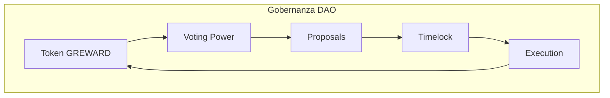
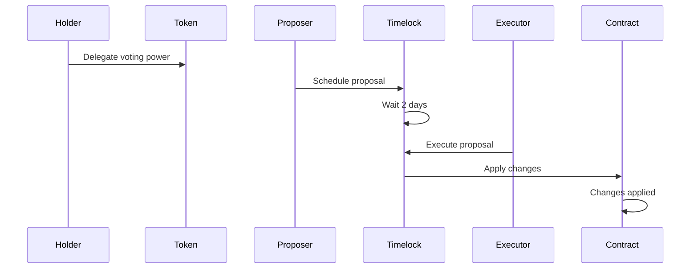

# Guía de Gobernanza DAO ProtocolGuardians

## Introducción

La gobernanza DAO de ProtocolGuardians permite a los holders de tokens GREWARD participar en decisiones sobre el ecosistema. Esta guía explica cómo crear propuestas, votar y ejecutar cambios a través del sistema de Timelock.

## ¿Qué es la Gobernanza DAO?

La gobernanza DAO (Organización Autónoma Descentralizada) permite a los holders de tokens GREWARD:

- **Crear propuestas** para cambios en el ecosistema
- **Votar** en decisiones importantes
- **Ejecutar cambios** después de un período de espera (Timelock)
- **Participar** en la dirección del proyecto

## Arquitectura de Gobernanza



## Componentes del Sistema

### 1. ProtocolPower Token
- **Voting Power**: 1 token = 1 voto
- **Delegation**: Puedes delegar tu poder de voto
- **Permit**: Aprobaciones sin transacciones

### 2. ProtocolTimelock
- **Delay**: Configurable (por defecto 2 días)
- **Roles**: Proposer, Executor, Admin
- **Seguridad**: Ejecución retardada

### 3. Tally Integration
- **Interface**: Interfaz amigable para gobernanza
- **Proposals**: Creación y gestión de propuestas
- **Voting**: Sistema de votación intuitivo

## Flujo de Gobernanza



## Paso a Paso

### 1. Preparación

#### Obtener Tokens GREWARD
```javascript
// Verificar balance de tokens
const balance = await protocolPower.balanceOf(userAddress);
console.log("Tokens GREWARD:", ethers.formatEther(balance));
```

#### Delegar Poder de Voto
```javascript
// Delegar a ti mismo
await protocolPower.delegate(userAddress);

// Delegar a otra dirección
await protocolPower.delegate(delegateAddress);
```

#### Verificar Poder de Voto
```javascript
// Verificar tu poder de voto
const votingPower = await protocolPower.getVotes(userAddress);
console.log("Poder de voto:", ethers.formatEther(votingPower));
```

### 2. Crear Propuesta

#### Preparar la Propuesta
```javascript
// Ejemplo: Grant minter role to new address
const target = protocolPowerAddress;
const value = 0;
const data = protocolPower.interface.encodeFunctionData("grantMinterRole", [newMinterAddress]);
const predecessor = ethers.ZeroHash;
const salt = ethers.ZeroHash;
const delay = 2 * 24 * 60 * 60; // 2 días (configurable en deployment)
```

#### Programar la Propuesta
```javascript
// Programar propuesta (solo proposers)
const scheduleTx = await protocolTimelock.connect(proposer).schedule(
    target, value, data, predecessor, salt, delay
);
await scheduleTx.wait();
console.log("✅ Propuesta programada");
```

#### Obtener ID de la Propuesta
```javascript
// Obtener ID de la propuesta
const operationId = await protocolTimelock.hashOperation(
    target, value, data, predecessor, salt
);
console.log("ID de propuesta:", operationId);
```

### 3. Monitorear Propuesta

#### Verificar Estado
```javascript
// Verificar si está pendiente
const isPending = await protocolTimelock.isOperationPending(operationId);
console.log("Propuesta pendiente:", isPending);

// Verificar si está lista
const isReady = await protocolTimelock.isOperationReady(operationId);
console.log("Propuesta lista:", isReady);

// Obtener estado completo
const status = await protocolTimelock.getProposalStatus(operationId);
console.log("Estado:", status); // 0: not set, 1: pending, 2: ready, 3: done
```

#### Obtener Información de la Propuesta
⚠️ **ADVERTENCIA**: La función `getProposalInfo()` retorna valores vacíos y no debe ser usada 
para obtener información real de propuestas. Obtener información mediante eventos `CallScheduled`.

### 4. Ejecutar Propuesta

#### Verificar que está Lista
```javascript
// Esperar a que esté lista
while (!(await protocolTimelock.isOperationReady(operationId))) {
    console.log("Esperando a que la propuesta esté lista...");
    await new Promise(resolve => setTimeout(resolve, 1000));
}
```

#### Ejecutar la Propuesta
```javascript
// Ejecutar propuesta (solo executors)
const executeTx = await protocolTimelock.connect(executor).execute(
    target, value, data, predecessor, salt
);
await executeTx.wait();
console.log("✅ Propuesta ejecutada");
```

### 5. Cancelar Propuesta (Solo Admin)

```javascript
// Cancelar propuesta (solo admin)
const cancelTx = await protocolTimelock.connect(admin).cancel(operationId);
await cancelTx.wait();
console.log("✅ Propuesta cancelada");
```

## Ejemplos Completos

### Ejemplo 1: Propuesta Básica

```javascript
async function basicProposal() {
    // 1. Preparar propuesta
    const target = protocolPowerAddress;
    const value = 0;
    const data = protocolPower.interface.encodeFunctionData("grantMinterRole", [newMinterAddress]);
    const predecessor = ethers.ZeroHash;
    const salt = ethers.ZeroHash;
    const delay = 2 * 24 * 60 * 60;
    
    // 2. Programar propuesta
    const operationId = await protocolTimelock.hashOperation(target, value, data, predecessor, salt);
    await protocolTimelock.connect(proposer).schedule(target, value, data, predecessor, salt, delay);
    
    // 3. Esperar delay
    console.log("Esperando delay configurado...");
    await ethers.provider.send("evm_increaseTime", [2 * 24 * 60 * 60 + 1]);
    await ethers.provider.send("evm_mine");
    
    // 4. Ejecutar propuesta
    await protocolTimelock.connect(executor).execute(target, value, data, predecessor, salt);
    console.log("✅ Propuesta ejecutada");
}
```

### Ejemplo 2: Gestión de Roles

```javascript
async function roleManagement() {
    // Grant proposer role
    const grantProposerData = protocolTimelock.interface.encodeFunctionData("grantRole", [
        await protocolTimelock.PROPOSER_ROLE(),
        newProposerAddress
    ]);
    
    // Grant executor role
    const grantExecutorData = protocolTimelock.interface.encodeFunctionData("grantRole", [
        await protocolTimelock.EXECUTOR_ROLE(),
        newExecutorAddress
    ]);
    
    // Programar ambas propuestas
    await protocolTimelock.connect(proposer).schedule(
        protocolTimelockAddress, 0, grantProposerData, ethers.ZeroHash, ethers.ZeroHash, 2 * 24 * 60 * 60
    );
    
    await protocolTimelock.connect(proposer).schedule(
        protocolTimelockAddress, 0, grantExecutorData, ethers.ZeroHash, ethers.ZeroHash, 2 * 24 * 60 * 60
    );
    
    console.log("✅ Propuestas de roles programadas");
}
```

### Ejemplo 3: Limitaciones de Gobernanza

⚠️ **NOTA IMPORTANTE**: El contrato ProtocolStaking es inmutable y NO incluye:
- Función pause() para pausar operaciones
- Función setRewardRate() para cambiar recompensas
- Mecanismos de actualización de parámetros

La gobernanza se limita a:
- Gestión de roles (minters, proposers, executors)
- Ownership de contratos
- Parámetros del Timelock

## Integración con Tally

### Configuración en Tally

1. **Conectar Wallet**: Conecta tu wallet a Tally
2. **Seleccionar DAO**: Selecciona Protocol Guardians DAO
3. **Verificar Poder de Voto**: Verifica tu poder de voto
4. **Crear Propuesta**: Usa la interfaz de Tally para crear propuestas

### Crear Propuesta en Tally

1. **Navegar a Proposals**: Ve a la sección de propuestas
2. **Crear Nueva Propuesta**: Haz clic en "Create Proposal"
3. **Completar Formulario**:
   - **Título**: Título descriptivo de la propuesta
   - **Descripción**: Descripción detallada
   - **Acciones**: Configurar acciones de la propuesta
4. **Enviar Propuesta**: Envía la propuesta para revisión

### Votar en Propuestas

1. **Ver Propuestas**: Navega a la lista de propuestas
2. **Leer Detalles**: Lee la descripción completa
3. **Votar**: Selecciona tu voto (For/Against/Abstain)
4. **Confirmar**: Confirma tu voto

## Mejores Prácticas

### 1. Preparación de Propuestas

```javascript
// Verificar que tienes suficiente poder de voto
const votingPower = await protocolPower.getVotes(userAddress);
const requiredPower = ethers.parseEther("1000"); // Ejemplo: 1000 tokens mínimo

if (votingPower < requiredPower) {
    console.log("❌ Poder de voto insuficiente");
    return;
}
```

### 2. Validación de Propuestas

```javascript
// Validar que la propuesta es válida
async function validateProposal(target, value, data) {
    try {
        // Simular ejecución
        await ethers.provider.call({
            to: target,
            value: value,
            data: data
        });
        console.log("✅ Propuesta válida");
        return true;
    } catch (error) {
        console.log("❌ Propuesta inválida:", error.message);
        return false;
    }
}
```

### 3. Monitoreo de Eventos

```javascript
// Monitorear eventos de gobernanza
protocolTimelock.on("CallScheduled", (id, target, value, data, predecessor, delay) => {
    console.log("Propuesta programada:", id);
});

protocolTimelock.on("CallExecuted", (id, target, value, data) => {
    console.log("Propuesta ejecutada:", id);
});

protocolTimelock.on("Cancelled", (id) => {
    console.log("Propuesta cancelada:", id);
});
```

## Troubleshooting

### Problemas Comunes

#### 1. Error "AccessControlUnauthorizedAccount"
```
Error: AccessControlUnauthorizedAccount
```
**Solución**: Asegúrate de tener el rol correcto (proposer/executor).

#### 2. Error "TimelockInsufficientDelay"
```
Error: TimelockInsufficientDelay
```
**Solución**: Espera el delay completo configurado antes de ejecutar.

#### 3. Error "CallNotReady"
```
Error: CallNotReady
```
**Solución**: Verifica que la propuesta esté lista para ejecutar.

#### 4. Error "CallAlreadyExecuted"
```
Error: CallAlreadyExecuted
```
**Solución**: La propuesta ya fue ejecutada.

### Verificaciones de Seguridad

```javascript
// Verificar roles
const isProposer = await protocolTimelock.hasRole(
    await protocolTimelock.PROPOSER_ROLE(),
    userAddress
);
const isExecutor = await protocolTimelock.hasRole(
    await protocolTimelock.EXECUTOR_ROLE(),
    userAddress
);
const isAdmin = await protocolTimelock.hasRole(
    await protocolTimelock.TIMELOCK_ADMIN_ROLE(),
    userAddress
);

console.log("Es proposer:", isProposer);
console.log("Es executor:", isExecutor);
console.log("Es admin:", isAdmin);
```

## Próximos Pasos

1. **Participar Activamente**: Únete a discusiones de gobernanza
2. **Crear Propuestas**: Propón mejoras al ecosistema
3. **Votar Responsablemente**: Vota en propuestas importantes
4. **Educar a Otros**: Ayuda a otros holders a entender la gobernanza

## Recursos Adicionales

- [Guía de Staking](./staking-guide.md)
- [Ejemplos de Uso](./ejemplos.md)
- [Documentación de Contratos](./contratos.md)
- [Arquitectura del Sistema](./arquitectura.md)

## Soporte

Si tienes problemas con la gobernanza:

1. Revisa esta guía paso a paso
2. Verifica que tienes los roles correctos
3. Consulta la documentación técnica
4. Contacta al equipo de desarrollo
5. Únete a la comunidad DAO
