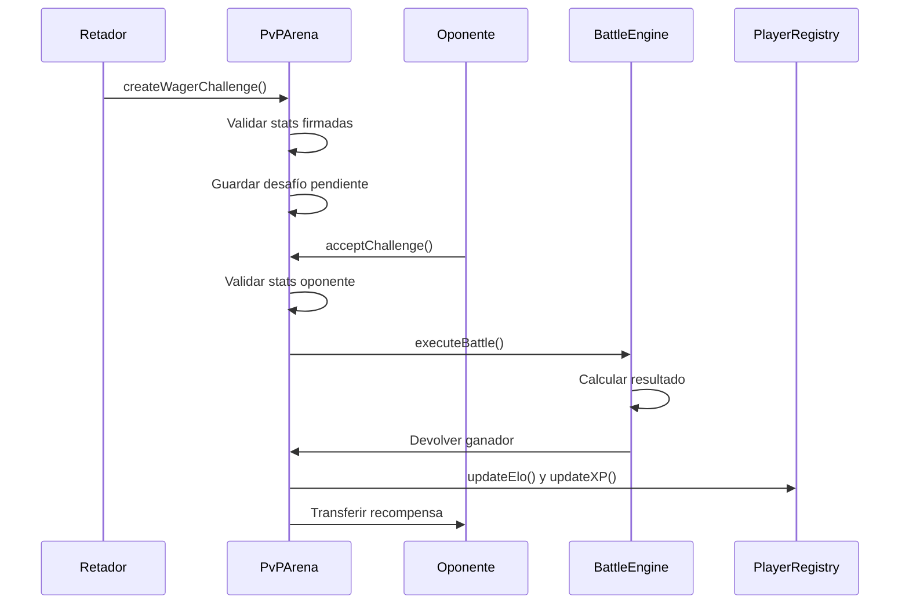
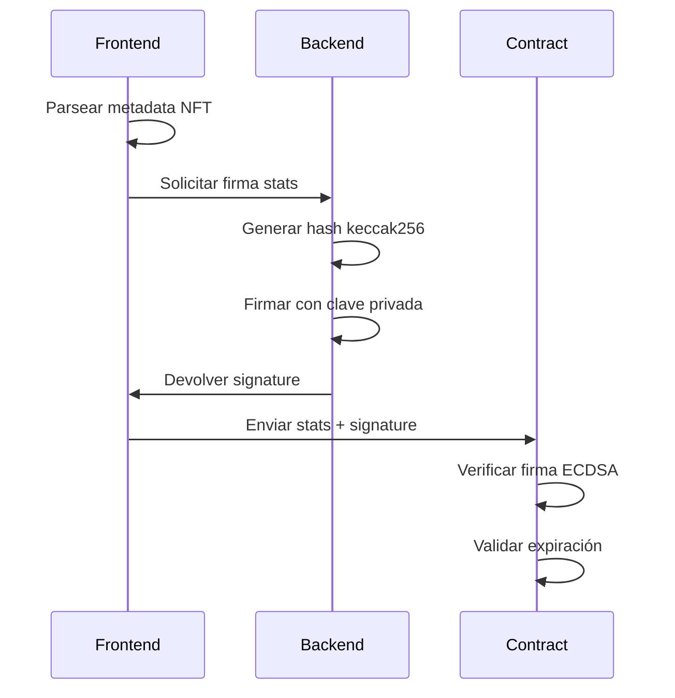

# Documentación Técnica de Contratos PvP - Protocol Guardians

## Visión General

Este documento proporciona documentación técnica detallada de todos los contratos inteligentes del sistema PvP de Protocol Guardians, incluyendo estructuras de datos, funciones principales, eventos y consideraciones de seguridad.

## Contratos del Sistema

### 1. IProtocolGuardians.sol

Interface para interactuar con el contrato NFT principal.

#### Funciones

```solidity
function ownerOf(uint256 tokenId) external view returns (address);
function balanceOf(address owner) external view returns (uint256);
```

### 2. PlayerRegistry.sol

Gestiona perfiles de jugador, formaciones, estadísticas y pool de matchmaking.

#### Características Principales

- Registro de jugadores con username único
- Formaciones por tipo de batalla (1v1, 3v3, 5v5)
- Sistema de ELO y XP
- Pool de matchmaking con búsqueda por ELO

#### Estructuras de Datos

```solidity
struct Player {
    string username;
    string avatarUrl;
    uint256 elo;
    uint256 xp;
    uint256 level;
    uint256 wins;
    uint256 losses;
    uint256 registeredAt;
    mapping(uint8 => uint256[]) formations;
    bool isRegistered;
}
```

#### Funciones Principales

**Registro y Perfil**

- `registerPlayer(string username, string avatarUrl)`: Registra un nuevo jugador
- `updateProfile(string newUsername, string newAvatarUrl)`: Actualiza perfil
- `players(address)`: Obtiene perfil completo del jugador

**Formaciones**

- `setFormation(uint8 battleType, uint256[] tokenIds)`: Guarda formación
- `getFormation(address player, uint8 battleType)`: Obtiene formación
- Validaciones: propiedad de NFTs, tamaño correcto, no en staking

**Matchmaking**

- `setMatchmakingStatus(bool active, uint8 battleType)`: Unirse/salir del pool
- `getAvailableOpponents(uint256 minElo, uint256 maxElo, uint8 battleType)`: Busca oponentes (max 10)

**Estadísticas**

- `updateElo(uint256 newElo)`: Actualiza ELO
- `updateXP(uint256 xpGain, bool isWin)`: Actualiza XP y level
- `incrementWins()` / `incrementLosses()`: Actualiza record

#### Eventos

```solidity
event PlayerRegistered(address indexed player, string username);
event ProfileUpdated(address indexed player, string username, string avatarUrl);
event FormationSet(address indexed player, uint8 battleType, uint256[] tokenIds);
```

#### Consideraciones de Seguridad

- Validación de ownership de NFTs antes de guardar formaciones
- Verificación de tamaño de formación (1, 3, o 5)
- NFTs en staking no pueden usarse en formaciones
- Formaciones bloqueadas cuando están en desafíos pendientes

### 3. BattleEngine.sol

Motor de combate con algoritmo de resolución automática.

#### Características Principales

- Combate por turnos basado en Speed
- Sistema de daño con defensa reducida
- Ventajas de tipo (115% / 85%)
- Críticos y esquiva
- Límite de 50 turnos

#### Estructuras de Datos

```solidity
struct CardStats {
    uint256 power;
    uint256 defense;
    uint256 speed;
    uint256 hp;
    uint256 luck;
    uint256 critical;
    uint8 cardType;
}

struct BattleResult {
    uint8 winner; // 0 = team1, 1 = team2
    uint256 turnsPlayed;
    uint256 team1RemainingHP;
    uint256 team2RemainingHP;
}
```

#### Funciones Principales

**Simulación y Ejecución**

- `simulateBattle(CardStats[] memory team1, CardStats[] memory team2, uint256 seed)`: Preview del combate (view)
- `executeBattle(CardStats[] memory team1, CardStats[] memory team2, uint256 seed)`: Ejecuta combate

#### Algoritmo de Combate

1. Ordenar cartas por Speed (mayor primero)
2. Por cada turno (máx 50):
   - Target selection: menor HP enemigo
   - Calcular esquiva (Luck/100)
   - Si no esquiva: calcular crítico, tipo, daño
   - Aplicar daño mínimo 1
   - Reducir HP del target
3. Si 50 turnos: gana equipo con más HP total

#### Eventos

```solidity
event BattleExecuted(
    address indexed player1,
    address indexed player2,
    uint8 winner,
    uint256 turnsPlayed
);
```

#### Consideraciones de Seguridad

- Determinístico (mismo seed = mismo resultado)
- Protección contra overflow/underflow
- Validación de stats (HP > 0, etc.)

### 4. PvPArena.sol

Orquesta desafíos, apuestas y ejecución de combates.

#### Características Principales

- Desafíos de ranking (afecta ELO)
- Desafíos con apuesta (tokens o ETH)
- Verificación de firmas de stats
- Gestión de fees y comisiones
- Sistema de pausa granular

#### Estructuras de Datos

```solidity
struct Challenge {
    address challenger;
    address opponent;
    uint8 battleType;
    uint256[] challengerTokenIds;
    bool isWager;
    address wagerToken;
    uint256 wagerAmount;
    uint256 createdAt;
    ChallengeStatus status;
}

struct SignedStats {
    uint256 tokenId;
    uint256[] stats; // 8 stats
    uint256 expiration;
    bytes signature;
}

enum ChallengeStatus { Pending, Accepted, Cancelled, Completed }
```

#### Constantes y Configuración

```solidity
uint256 public challengeFee = 0.001 ether; // Tarifa creación desafío
uint256 public protocolFeePercent = 3; // 3% comisión apuestas
uint256 public cancellationPenaltyPercent = 5; // 5% penalización cancelación
```

#### Funciones Principales

**Desafíos de Ranking**

- `createRankingChallenge(address opponent, uint8 battleType, SignedStats[] signedStats)`: Crear desafío sin apuesta
- Pagar challengeFee en ETH

**Desafíos con Apuesta**

- `createWagerChallenge(address opponent, uint8 battleType, address token, uint256 amount, SignedStats[] signedStats)`: Desafío con apuesta
- Depositar amount + challengeFee
- Ambos jugadores deben usar mismo token y cantidad

**Aceptación y Ejecución**

- `acceptChallenge(uint256 challengeId, SignedStats[] signedStats)`: Acepta y ejecuta combate
- Deposita apuesta si aplica
- Ejecuta batalla automáticamente
- Distribuye recompensas

**Cancelación**

- `cancelChallenge(uint256 challengeId)`: Solo retador puede cancelar
- Penalización de 5% para apuestas
- Reembolso de balance

**Administración**

- `setChallengeFee(uint256 _fee)`: Actualiza tarifa de desafío
- `setProtocolFee(uint256 _percent)`: Actualiza comisión
- `setSignerAddress(address _signer)`: Actualiza address del signer
- `setPauseStatus(bool pauseMatchmaking, bool pauseWagers, bool pauseRanking)`: Pausa granular
- `withdrawFees()`: Retira fees acumulados

#### Validación de Stats

```solidity
function _verifyStatsSignature(
    uint256 tokenId,
    uint256[] memory stats,
    uint256 expiration,
    bytes memory signature
) internal view returns (bool)
```

- Verifica firma ECDSA de stats
- Comprueba expiración (1 hora)
- Valida que signer sea el esperado

#### Eventos

```solidity
event ChallengeCreated(
    uint256 indexed challengeId,
    address indexed challenger,
    address indexed opponent,
    bool isWager
);
event ChallengeAccepted(uint256 indexed challengeId);
event ChallengeCancelled(uint256 indexed challengeId, uint256 refunded);
event BattleCompleted(
    uint256 indexed challengeId,
    address indexed winner,
    bool isWager,
    uint256 rewardAmount
);
```

#### Consideraciones de Seguridad

- ReentrancyGuard en funciones con transferencias
- Checks-Effects-Interactions pattern
- Validación de ownership y firma
- Manejo de errores con reembolsos automáticos
- Protección contra overflow/underflow
- Access control (onlyOwner para admin)

### 5. MockContracts.sol

Contratos mock para testing.

#### MockProtocolGuardians.sol

- Implementa IProtocolGuardians
- Función `mint(address to)`: Crea NFTs de prueba
- Función `transferFrom()`: Simula transferencias

#### MockERC20.sol

- Token ERC20 básico
- Función `mint(address to, uint256 amount)`: Crea tokens de prueba

## Interacciones Entre Contratos

### Flujo de Desafío con Apuesta



### Verificación de Stats



## Optimizaciones de Gas

### PlayerRegistry

- Uso de mapping para formaciones (O(1) acceso)
- Evitar copias de arrays grandes
- Packing de datos cuando sea posible

### BattleEngine

- Pre-calcular modificadores de tipo
- Early return en límite de turnos
- Minimizar reads de storage

### PvPArena

- Batch de validaciones
- Caché de datos frecuentes
- Minimizar transferencias on-chain

## Consideraciones de Implementación

### Manejo de Errores

- Reversiones explícitas con mensajes claros
- Reembolsos automáticos en caso de falla
- Estados consistentes en todos los casos

### Validaciones

- Ownership de NFTs verificado en creación y ejecución
- Expiración de firmas verificada
- Propiedades de stats válidas (HP > 0, etc.)

### Escalabilidad

- No hay límites on-chain para número de jugadores
- Consideraciones de gas para batallas largas
- Pool de matchmaking limitado a 10 resultados

## Seguridad

### Protecciones Implementadas

- Reentrancy protection
- Access control (Ownable)
- Input validation
- Overflow/underflow protection
- Signature verification

### Límites Conocidos

- Randomness pseudoaleatoria (determinística por bloque)
- Stats enlazados a firma (requiere backend confiable)
- Gas costs pueden ser altos para 5v5

## Gas Estimates

Aproximados (dependen de red y condiciones):

- `registerPlayer()`: ~100k gas
- `setFormation()`: ~150k gas (1v1), ~200k (3v3), ~250k (5v5)
- `createRankingChallenge()`: ~150k gas
- `createWagerChallenge()`: ~180k gas
- `acceptChallenge()`: ~300k gas (1v1), ~500k (3v3), ~800k (5v5)
- `cancelChallenge()`: ~80k gas
