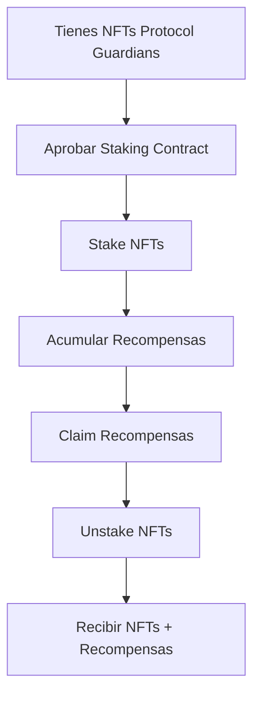

# Guía de Staking Protocol Guardians

## Introducción

El staking de NFTs Protocol Guardians te permite ganar tokens POWER como recompensa por mantener tus NFTs bloqueados en el contrato de staking. Esta guía te explica cómo hacer staking, claimear recompensas y gestionar tus NFTs stakeados.

## ¿Qué es el Staking?

El staking es el proceso de depositar tus NFTs en el contrato de staking para ganar recompensas. Los NFTs se transfieren al contrato (custody staking) y acumulas tokens CREWARD automáticamente.

### Características del Staking

- **Recompensas**: 10 tokens CREWARD por NFT por día
- **Custody**: Los NFTs se transfieren al contrato
- **Acumulativo**: Las recompensas se acumulan automáticamente
- **Flexible**: Puedes stake/unstake en cualquier momento

## Flujo de Staking



## Paso a Paso

### 1. Preparación

#### Verificar que tienes NFTs
```javascript
// Verificar balance de NFTs
const balance = await protocolGuardians.balanceOf(userAddress);
console.log("NFTs en tu wallet:", balance.toString());
```

#### Verificar que tienes tokens CREWARD (opcional)
```javascript
// Verificar balance de tokens CREWARD
const rewardBalance = await protocolPower.balanceOf(userAddress);
console.log("Tokens CREWARD:", ethers.formatEther(rewardBalance));
```

### 2. Aprobar el Contrato de Staking

Antes de hacer staking, debes aprobar el contrato de staking para transferir tus NFTs:

```javascript
// Aprobar staking contract para todos los NFTs
const approveTx = await protocolGuardians.setApprovalForAll(stakingAddress, true);
await approveTx.wait();
console.log("✅ Staking contract aprobado");
```

### 3. Hacer Staking

#### Staking de un solo NFT
```javascript
// Stake un NFT específico
const tokenId = 1;
const stakeTx = await protocolStaking.stake([tokenId]);
await stakeTx.wait();
console.log("✅ NFT staked:", tokenId);
```

#### Staking de múltiples NFTs
```javascript
// Stake múltiples NFTs (máximo 30 por transacción)
const tokenIds = [1, 2, 3, 4, 5];
const stakeTx = await protocolStaking.stake(tokenIds);
await stakeTx.wait();
console.log("✅ NFTs staked:", tokenIds);
```

### 4. Verificar Staking

#### Verificar NFTs stakeados
```javascript
// Obtener NFTs stakeados por usuario
const stakedTokens = await protocolStaking.getStakedTokens(userAddress);
console.log("NFTs stakeados:", stakedTokens);
```

#### Verificar información de staking
```javascript
// Obtener información de staking para un token
const stakingInfo = await protocolStaking.getStakingInfo(tokenId);
console.log("Owner:", stakingInfo.owner);
console.log("Staked at block:", stakingInfo.stakedAtBlock);
console.log("Last claimed block:", stakingInfo.lastClaimedBlock);
console.log("Pending rewards:", ethers.formatEther(stakingInfo.pendingRewards));
```

### 5. Monitorear Recompensas

#### Verificar recompensas pendientes
```javascript
// Recompensas pendientes para un token específico
const pendingRewards = await protocolStaking.getPendingRewards(tokenId);
console.log("Recompensas pendientes:", ethers.formatEther(pendingRewards));
```

#### Verificar recompensas totales
```javascript
// Recompensas totales para un usuario
const totalRewards = await protocolStaking.getTotalPendingRewards(userAddress);
console.log("Recompensas totales:", ethers.formatEther(totalRewards));
```

### 6. Claimear Recompensas

#### Claimear recompensas sin unstake
```javascript
// Claimear recompensas para tokens específicos
const tokenIds = [1, 2, 3];
const claimTx = await protocolStaking.claimRewards(tokenIds);
await claimTx.wait();
console.log("✅ Recompensas claimeadas");
```

#### Verificar balance después del claim
```javascript
// Verificar balance de tokens CREWARD
const newBalance = await protocolPower.balanceOf(userAddress);
console.log("Nuevo balance CREWARD:", ethers.formatEther(newBalance));
```

### 7. Unstake NFTs

#### Unstake con recompensas automáticas
```javascript
// Unstake NFTs (automáticamente claimea recompensas)
const tokenIds = [1, 2, 3];
const unstakeTx = await protocolStaking.unstake(tokenIds);
await unstakeTx.wait();
console.log("✅ NFTs unstaked y recompensas claimeadas");
```

#### Verificar que los NFTs regresaron
```javascript
// Verificar que los NFTs regresaron a tu wallet
const nftOwner = await protocolGuardians.ownerOf(tokenId);
console.log("NFT owner:", nftOwner);
```

## Ejemplos Completos

### Ejemplo 1: Staking Básico

```javascript
async function basicStaking() {
    // 1. Aprobar staking contract
    await protocolGuardians.setApprovalForAll(stakingAddress, true);
    
    // 2. Stake NFT
    await protocolStaking.stake([1]);
    
    // 3. Esperar algunos bloques
    for (let i = 0; i < 10; i++) {
        await ethers.provider.send("evm_mine");
    }
    
    // 4. Verificar recompensas
    const rewards = await protocolStaking.getPendingRewards(1);
    console.log("Recompensas:", ethers.formatEther(rewards));
    
    // 5. Claimear recompensas
    await protocolStaking.claimRewards([1]);
    
    // 6. Unstake
    await protocolStaking.unstake([1]);
}
```

### Ejemplo 2: Staking Avanzado

```javascript
async function advancedStaking() {
    // 1. Mint múltiples NFTs
    for (let i = 0; i < 5; i++) {
        await protocolGuardians.mint(userAddress);
    }
    
    // 2. Aprobar staking contract
    await protocolGuardians.setApprovalForAll(stakingAddress, true);
    
    // 3. Stake todos los NFTs (máximo 30 por transacción)
    const tokenIds = [1, 2, 3, 4, 5];
    await protocolStaking.stake(tokenIds);
    
    // 4. Monitorear recompensas
    setInterval(async () => {
        const totalRewards = await protocolStaking.getTotalPendingRewards(userAddress);
        console.log("Recompensas acumuladas:", ethers.formatEther(totalRewards));
    }, 10000); // Cada 10 segundos
    
    // 5. Claimear recompensas periódicamente
    setInterval(async () => {
        await protocolStaking.claimRewards(tokenIds);
        console.log("Recompensas claimeadas");
    }, 60000); // Cada minuto
}
```

### Ejemplo 3: Gestión de Portfolio

```javascript
async function portfolioManagement() {
    // Obtener todos los NFTs stakeados
    const stakedTokens = await protocolStaking.getStakedTokens(userAddress);
    console.log("NFTs stakeados:", stakedTokens);
    
    // Calcular recompensas por NFT
    for (const tokenId of stakedTokens) {
        const rewards = await protocolStaking.getPendingRewards(tokenId);
        console.log(`Token ${tokenId}: ${ethers.formatEther(rewards)} CREWARD`);
    }
    
    // Calcular recompensas totales
    const totalRewards = await protocolStaking.getTotalPendingRewards(userAddress);
    console.log("Recompensas totales:", ethers.formatEther(totalRewards));
    
    // Claimear todas las recompensas
    if (totalRewards > 0) {
        await protocolStaking.claimRewards(stakedTokens);
        console.log("Todas las recompensas claimeadas");
    }
}
```

## Cálculo de Recompensas

### Fórmula de Recompensas

```
Recompensas = Bloques_Stakeados × REWARD_RATE_PER_BLOCK
```

Donde:
- `REWARD_RATE_PER_BLOCK = 1388888888888888` (0.001388888888888888 tokens por bloque)
- `Bloques_Stakeados = Bloque_Actual - Bloque_Último_Claim`

### Ejemplo de Cálculo

```javascript
// Calcular recompensas manualmente
function calculateRewards(stakedAtBlock, lastClaimedBlock, currentBlock) {
    const blocksStaked = currentBlock - lastClaimedBlock;
    const rewardRate = 1388888888888888n; // REWARD_RATE_PER_BLOCK
    return blocksStaked * rewardRate;
}

// Ejemplo: NFT staked en bloque 1000, último claim en bloque 1500, bloque actual 2000
const rewards = calculateRewards(1000, 1500, 2000);
console.log("Recompensas:", ethers.formatEther(rewards));
```

## Mejores Prácticas

### 1. Gestión de Gas

```javascript
// Estimar gas antes de transacciones
const gasEstimate = await protocolStaking.stake.estimateGas([1]);
console.log("Gas estimado:", gasEstimate.toString());

// Usar gas price dinámico
const gasPrice = await ethers.provider.getGasPrice();
const tx = await protocolStaking.stake([1], { gasPrice });

// Nota: Máximo 30 NFTs por transacción para prevenir agotamiento de gas
// El contrato está optimizado con el patrón Checks-Effects-Interactions
// para minimizar riesgos de gas y DoS
```

### 2. Manejo de Errores

```javascript
try {
    await protocolStaking.stake([1]);
    console.log("✅ Staking exitoso");
} catch (error) {
    if (error.message.includes("Not token owner")) {
        console.log("❌ No eres el dueño del NFT");
    } else if (error.message.includes("Token already staked")) {
        console.log("❌ El NFT ya está stakeado");
    } else {
        console.log("❌ Error:", error.message);
    }
}
```

### 3. Monitoreo de Eventos

```javascript
// Monitorear eventos de staking
protocolStaking.on("NFTsStaked", (owner, tokenIds) => {
    console.log("NFTs staked:", owner, tokenIds);
});

protocolStaking.on("RewardsClaimed", (owner, tokenIds, amount) => {
    console.log("Rewards claimed:", owner, tokenIds, ethers.formatEther(amount));
});

protocolStaking.on("NFTsUnstaked", (owner, tokenIds) => {
    console.log("NFTs unstaked:", owner, tokenIds);
});
```

## Troubleshooting

### Problemas Comunes

#### 1. Error "Not token owner"
```
Error: ProtocolStaking: Not token owner
```
**Solución**: Asegúrate de ser el dueño del NFT que quieres stake.

#### 2. Error "Token already staked"
```
Error: ProtocolStaking: Token already staked
```
**Solución**: El NFT ya está stakeado. Verifica con `getStakedTokens()`.

#### 3. Error "No rewards to claim"
```
Error: ProtocolStaking: No rewards to claim
```
**Solución**: No hay recompensas pendientes. Espera más bloques.

#### 4. Error de aprobación
```
Error: ProtocolStaking: NotOwnerNorApproved
```
**Solución**: Aproba el staking contract con `setApprovalForAll()`.

#### 5. No se puede pausar el staking
⚠️ **LIMITACIÓN DEL DISEÑO**: El contrato de staking NO tiene función pause().
No es posible detener el staking en caso de emergencia.
**Mitigación**: Deployment y auditoría cuidadosos antes de producción.

### Verificaciones de Seguridad

```javascript
// Verificar que el contrato es correcto
const nftContract = await protocolStaking.nftContract();
const rewardContract = await protocolStaking.rewardToken();
console.log("NFT Contract:", nftContract);
console.log("Reward Contract:", rewardContract);

// Verificar que tienes permisos
const isApproved = await protocolGuardians.isApprovedForAll(userAddress, stakingAddress);
console.log("Staking contract aprobado:", isApproved);

// Nota: El contrato implementa optimizaciones de seguridad:
// - Patrón Checks-Effects-Interactions para prevenir reentrancy
// - Límites de gas para prevenir ataques DoS
// - Validaciones exhaustivas antes de operaciones críticas
```

## Próximos Pasos

1. **Explorar Gobernanza**: Participa en decisiones DAO con tus tokens CREWARD
2. **Optimizar Staking**: Encuentra la estrategia de staking óptima
3. **Monitorear Recompensas**: Configura alertas para recompensas
4. **Compartir Experiencia**: Ayuda a otros usuarios

## Recursos Adicionales

- [Guía de Gobernanza DAO](./dao-guide.md)
- [Ejemplos de Uso](./ejemplos.md)
- [Documentación de Contratos](./contratos.md)
- [Arquitectura del Sistema](./arquitectura.md)

## Soporte

Si tienes problemas con el staking:

1. Revisa esta guía paso a paso
2. Verifica que tienes los permisos correctos
3. Consulta la documentación técnica
4. Contacta al equipo de desarrollo
