# Family System Documentation

## Overview

The Protocol Guardians collection features 8 distinct families, each with unique thematic characteristics and exclusive signature abilities. Families provide additional strategic depth beyond the type system, offering specialized abilities that can only be used by Guardians belonging to that family.

## Family Hierarchy

```mermaid
graph TD
    %% Defensive Families
    A[Guardians] --> B[Protective Abilities]
    
    %% Offensive Families
    C[Beasts] --> D[Hunt Abilities]
    K[Dragons] --> L[Fury Abilities]
    
    %% Technological Families
    E[Mechanicals] --> F[System Abilities]
    
    %% Magical Families
    G[Elementals] --> H[Element Abilities]
    I[Chaos] --> J[Chaos Abilities]
    
    %% Wisdom & Reality Families
    M[Ancients] --> N[Wisdom Abilities]
    O[Void] --> P[Nullify Abilities]
    
    %% Styling - All 8 Families
    style A fill:#ffd700,stroke:#333,stroke-width:2px
    style C fill:#8b4513,stroke:#333,stroke-width:2px
    style E fill:#808080,stroke:#333,stroke-width:2px
    style G fill:#ff6b35,stroke:#333,stroke-width:2px
    style I fill:#8b008b,stroke:#333,stroke-width:2px
    style K fill:#dc143c,stroke:#333,stroke-width:2px
    style M fill:#4169e1,stroke:#333,stroke-width:2px
    style O fill:#000000,stroke:#333,stroke-width:2px
```



## Family Profiles

### 1. Guardians Family
**Theme**: Protection, defense, and safeguarding
**Lore**: The protectors of Ethereum, these Guardians have sworn to defend the ecosystem from external threats. They are the 'diamond hands' of the digital realm, holding strong through any market conditions.

**Signature Abilities**:
- **GUARDIAN'S WARD** (Uncommon+) - 50% damage reduction for 6 hours
- **PROTECTIVE AURA** (Rare+) - Prevents all party damage for 2 hours
- **DIVINE SHIELD** (Epic+) - Reflects 100% damage back to attackers
- **SACRED BARRIER** (Legendary+) - Immunity to all negative effects for 8 hours
- **ETERNAL GUARDIAN** (Mythic+) - Resurrects fallen party members

**Strategic Role**: Defensive specialists, party protection, damage mitigation
**Best For**: Defensive strategies, protecting valuable Guardians, tank roles

### 2. Beasts Family
**Theme**: Hunting, instinct, and natural prowess
**Lore**: Wild hunters who track down the most profitable opportunities in the Ethereum ecosystem. They are the 'ape' investors who trust their instincts over complex analysis.

**Signature Abilities**:
- **HUNTER'S INSTINCT** (Uncommon+) - +40% Critical and +25% Speed for 4 hours
- **PREDATOR'S FURY** (Rare+) - +35% Power and -20% enemy defense for 3 hours
- **PACK TACTICS** (Epic+) - +20% all stats when 3+ Beasts in party
- **ALPHA ROAR** (Legendary+) - Stuns enemies and +50% party Power for 2 hours
- **PRIMAL RAGE** (Mythic+) - Transforms party into berserkers for 6 hours

**Strategic Role**: Offensive specialists, high damage output, pack coordination
**Best For**: Aggressive strategies, high damage parties, pack-based play

### 3. Mechanicals Family
**Theme**: Technology, precision, and systematic efficiency
**Lore**: Precision-engineered entities that operate the complex machinery of Ethereum. They are the 'bots' with consciousness, executing strategies with mathematical perfection.

**Signature Abilities**:
- **SYSTEM OVERRIDE** (Uncommon+) - +25% all stats and -30% cooldowns for 6 hours
- **CIRCUIT BREAKER** (Rare+) - Prevents negative effects and +40% Mana for 4 hours
- **AUTOMATED DEFENSE** (Epic+) - Creates auto-shields absorbing 1000 damage per member
- **QUANTUM PROCESSOR** (Legendary+) - Calculates optimal expedition strategies
- **OMEGA PROTOCOL** (Transcendent+) - Guarantees expedition success

**Strategic Role**: Efficiency specialists, system optimization, automated strategies
**Best For**: Systematic approaches, efficiency optimization, automated play

### 4. Elementals Family
**Theme**: Elemental mastery and environmental control
**Lore**: Masters of specific aspects of the Ethereum ecosystem, these Guardians channel the power of particular protocols and technologies.

**Signature Abilities**:
- **ELEMENTAL INFUSION** (Uncommon+) - +30% Power and Mana for 5 hours
- **NATURE'S WRATH** (Rare+) - +50% Critical and elemental damage for 4 hours
- **ELEMENTAL CONVERGENCE** (Epic+) - Combines elemental powers for massive stat boosts
- **PRIMAL STORM** (Legendary+) - Creates devastating elemental storms
- **WORLD SHAPER** (Transcendent+) - Temporarily reshapes reality to favor party

**Strategic Role**: Elemental specialists, environmental control, magical mastery
**Best For**: Magical strategies, elemental damage, environmental manipulation

### 5. Chaos Family
**Theme**: Unpredictability and destructive potential
**Lore**: The ultimate 'degens' of the digital realm, these Guardians thrive in the unpredictable nature of crypto markets and find opportunity in chaos.

**Signature Abilities**:
- **CHAOS SURGE** (Uncommon+) - Randomly buffs 3 stats by 40% for 3 hours
- **REALITY WARP** (Rare+) - 25% chance to double rewards
- **ENTROPY FIELD** (Epic+) - Reduces enemy effectiveness by 35%
- **CHAOS VORTEX** (Legendary+) - Creates unpredictable effects
- **REALITY COLLAPSE** (Transcendent+) - Temporarily breaks reality

**Strategic Role**: Chaos specialists, unpredictable outcomes, high-risk strategies
**Best For**: High-risk strategies, unpredictable play, chaos-based approaches

### 6. Dragons Family
**Theme**: Ancient power and treasure hoarding
**Lore**: Ancient entities of immense power and wealth, these Guardians have been accumulating since the early days of crypto and now serve as the ultimate powerhouses of the Ethereum ecosystem.

**Signature Abilities**:
- **DRAGON'S FURY** (Uncommon+) - +50% Power and fire damage for 4 hours
- **ANCIENT WISDOM** (Rare+) - +20% all stats and strategic insights
- **DRAGON'S BREATH** (Epic+) - Devastating area attack and +60% party Power
- **HOARD MASTER** (Legendary+) - +100% rewards for next 3 expeditions
- **DRAGON LORD** (Transcendent+) - Transforms party into dragon form

**Strategic Role**: Power specialists, treasure accumulation, ultimate strength
**Best For**: Power-based strategies, treasure hunting, ultimate strength

### 7. Ancients Family
**Theme**: Wisdom and primordial knowledge
**Lore**: Wise entities that carry the knowledge of the entire crypto evolution, from Bitcoin's genesis to Ethereum's innovation. They are the 'OGs' who remember the original vision.

**Signature Abilities**:
- **ETERNAL KNOWLEDGE** (Rare+) - Perfect expedition strategy for 8 hours
- **PRIMORDIAL POWER** (Epic+) - +40% all stats for 6 hours
- **TIME MASTERY** (Legendary+) - -50% expedition durations for 12 hours
- **COSMIC AWARENESS** (Mythic+) - Reveals all hidden expedition mechanics
- **REALITY ARCHITECT** (Transcendent+) - Modifies expedition parameters

**Strategic Role**: Wisdom specialists, strategic guidance, reality manipulation
**Best For**: Strategic play, wisdom-based approaches, reality manipulation

### 8. Void Family
**Theme**: Nullification and existence manipulation
**Lore**: Mysterious entities that exist in the spaces between blockchain networks, understanding the fundamental nature of digital existence itself.

**Signature Abilities**:
- **VOID TOUCH** (Rare+) - Nullifies enemy abilities and +50% party Luck
- **ENTROPY DRAIN** (Epic+) - Steals enemy stats and adds to party for 4 hours
- **REALITY ERASURE** (Legendary+) - Temporarily removes enemies from existence
- **VOID MASTER** (Transcendent+) - Controls fabric of reality for 8 hours
- **NULL EXISTENCE** (Transcendent+) - Makes party invulnerable and omnipotent

**Strategic Role**: Nullification specialists, existence manipulation, ultimate control
**Best For**: Control strategies, nullification approaches, existence manipulation

## Signature Abilities Table

| Family | Ability | Min Rarity | Cooldown | Effect | Duration |
|--------|---------|------------|----------|--------|----------|
| **Guardians** | GUARDIAN'S WARD | Uncommon | 48h | 50% damage reduction | 6h |
| **Guardians** | PROTECTIVE AURA | Rare | 72h | Prevents all damage | 2h |
| **Guardians** | DIVINE SHIELD | Epic | 96h | Reflects 100% damage | 4h |
| **Guardians** | SACRED BARRIER | Legendary | 168h | Immunity to negative effects | 8h |
| **Guardians** | ETERNAL GUARDIAN | Mythic | 336h | Resurrects fallen members | Instant |
| **Beasts** | HUNTER'S INSTINCT | Uncommon | 36h | +40% Critical, +25% Speed | 4h |
| **Beasts** | PREDATOR'S FURY | Rare | 48h | +35% Power, -20% enemy defense | 3h |
| **Beasts** | PACK TACTICS | Epic | 72h | +20% all stats (3+ Beasts) | 6h |
| **Beasts** | ALPHA ROAR | Legendary | 120h | Stuns enemies, +50% Power | 2h |
| **Beasts** | PRIMAL RAGE | Mythic | 240h | Berserker transformation | 6h |
| **Mechanicals** | SYSTEM OVERRIDE | Uncommon | 48h | +25% all stats, -30% cooldowns | 6h |
| **Mechanicals** | CIRCUIT BREAKER | Rare | 72h | Prevents negative effects, +40% Mana | 4h |
| **Mechanicals** | AUTOMATED DEFENSE | Epic | 96h | Auto-shields (1000 damage) | 8h |
| **Mechanicals** | QUANTUM PROCESSOR | Legendary | 168h | Optimal strategy calculation | 24h |
| **Mechanicals** | OMEGA PROTOCOL | Transcendent | 336h | Guaranteed success | Instant |
| **Elementals** | ELEMENTAL INFUSION | Uncommon | 42h | +30% Power and Mana | 5h |
| **Elementals** | NATURE'S WRATH | Rare | 60h | +50% Critical, elemental damage | 4h |
| **Elementals** | ELEMENTAL CONVERGENCE | Epic | 96h | Massive stat boosts | 8h |
| **Elementals** | PRIMAL STORM | Legendary | 144h | Devastating elemental storms | 6h |
| **Elementals** | WORLD SHAPER | Transcendent | 288h | Reality manipulation | 48h |
| **Chaos** | CHAOS SURGE | Uncommon | 36h | Random 3 stats +40% | 3h |
| **Chaos** | REALITY WARP | Rare | 72h | 25% chance double rewards | 6h |
| **Chaos** | ENTROPY FIELD | Epic | 96h | -35% enemy effectiveness | 8h |
| **Chaos** | CHAOS VORTEX | Legendary | 168h | Unpredictable effects | 12h |
| **Chaos** | REALITY COLLAPSE | Transcendent | 336h | Reality breaking | 24h |
| **Dragons** | DRAGON'S FURY | Uncommon | 48h | +50% Power, fire damage | 4h |
| **Dragons** | ANCIENT WISDOM | Rare | 72h | +20% all stats, strategy | 6h |
| **Dragons** | DRAGON'S BREATH | Epic | 120h | Area attack, +60% Power | 4h |
| **Dragons** | HOARD MASTER | Legendary | 240h | +100% rewards (3 expeditions) | 72h |
| **Dragons** | DRAGON LORD | Transcendent | 480h | Dragon transformation | 12h |
| **Ancients** | ETERNAL KNOWLEDGE | Rare | 72h | Perfect strategy | 8h |
| **Ancients** | PRIMORDIAL POWER | Epic | 120h | +40% all stats | 6h |
| **Ancients** | TIME MASTERY | Legendary | 192h | -50% expedition duration | 12h |
| **Ancients** | COSMIC AWARENESS | Mythic | 336h | Reveals hidden mechanics | 24h |
| **Ancients** | REALITY ARCHITECT | Transcendent | 720h | Parameter modification | 48h |
| **Void** | VOID TOUCH | Rare | 60h | Nullifies abilities, +50% Luck | 4h |
| **Void** | ENTROPY DRAIN | Epic | 96h | Steals enemy stats | 4h |
| **Void** | REALITY ERASURE | Legendary | 240h | Removes enemies | 6h |
| **Void** | VOID MASTER | Transcendent | 480h | Controls reality | 8h |
| **Void** | NULL EXISTENCE | Transcendent | 960h | Invulnerability, omnipotence | 12h |

## Family Synergy

### Same Family Bonuses
When multiple Guardians of the same family are in a party, they receive synergy bonuses:

```javascript
function calculateFamilySynergy(party) {
  const familyCounts = {};
  party.forEach(guardian => {
    familyCounts[guardian.family] = (familyCounts[guardian.family] || 0) + 1;
  });
  
  const maxFamilyCount = Math.max(...Object.values(familyCounts));
  const totalGuardians = party.length;
  
  return (maxFamilyCount / totalGuardians) * 3; // 3% per 100% same family
}
```

### Family Combinations
Different family combinations provide unique strategic advantages:

| Combination | Bonus | Description |
|-------------|-------|-------------|
| **Guardians + Beasts** | +5% Defense, +3% Power | Balanced offense/defense |
| **Mechanicals + Elementals** | +4% Mana, +3% Critical | Magical precision |
| **Dragons + Ancients** | +6% Power, +4% Wisdom | Ultimate strength |
| **Chaos + Void** | +5% Luck, +3% Critical | Unpredictable power |
| **All 8 Families** | +10% all stats | Ultimate diversity bonus |

## Strategic Implications

### Family Selection Strategy
- **Guardians**: Defensive play, protecting valuable Guardians
- **Beasts**: Aggressive play, high damage output
- **Mechanicals**: Systematic play, efficiency optimization
- **Elementals**: Magical play, elemental mastery
- **Chaos**: High-risk play, unpredictable outcomes
- **Dragons**: Power play, treasure accumulation
- **Ancients**: Strategic play, wisdom-based approaches
- **Void**: Control play, existence manipulation

### Party Composition
- **Single Family**: Maximum synergy bonuses, focused strategy
- **Mixed Families**: Versatility, multiple strategic options
- **Complementary Families**: Balanced approach, covering weaknesses

### Ability Access
- **Higher Rarity**: Access to more powerful family abilities
- **Family Focus**: Specialization in specific family abilities
- **Diversity**: Access to multiple family abilities

## Implementation Examples

### Example 1: Family Synergy Calculation
```javascript
// Party: 3x Guardians, 1x Beasts, 1x Mechanicals
const party = [
  { family: 'Guardians' },
  { family: 'Guardians' },
  { family: 'Guardians' },
  { family: 'Beasts' },
  { family: 'Mechanicals' }
];

const familyCounts = {
  'Guardians': 3,
  'Beasts': 1,
  'Mechanicals': 1
};

const maxFamilyCount = 3; // Guardians
const totalGuardians = 5;

const familySynergy = (3 / 5) * 3; // 1.8% bonus
```

### Example 2: Family Ability Access
```javascript
// Check if Guardian can learn family ability
function canLearnFamilyAbility(guardian, ability) {
  const familyLevels = {
    'Common': 0,
    'Uncommon': 1,
    'Rare': 2,
    'Epic': 3,
    'Legendary': 4,
    'Mythic': 5,
    'Transcendent': 6
  };
  
  const guardianLevel = familyLevels[guardian.rarity];
  const abilityLevel = ability.minRarityLevel;
  
  return guardian.family === ability.family && guardianLevel >= abilityLevel;
}
```

### Example 3: Optimal Family Composition
```javascript
// Mission: High damage required, defensive capabilities needed
// Recommended: 2x Dragons + 2x Guardians + 1x Beasts

const recommendedParty = [
  { family: 'Dragons', abilities: ['DRAGON\'S FURY', 'ANCIENT WISDOM'] },
  { family: 'Dragons', abilities: ['DRAGON\'S FURY', 'ANCIENT WISDOM'] },
  { family: 'Guardians', abilities: ['GUARDIAN\'S WARD', 'PROTECTIVE AURA'] },
  { family: 'Guardians', abilities: ['GUARDIAN\'S WARD', 'PROTECTIVE AURA'] },
  { family: 'Beasts', abilities: ['HUNTER\'S INSTINCT', 'PREDATOR\'S FURY'] }
];

// This party provides:
// - High damage output (Dragons + Beasts)
// - Defensive capabilities (Guardians)
// - Family synergy bonuses
// - Balanced ability coverage
```

## Balance Considerations

### Family Balance
- **No single family dominates**: Each has clear strengths and weaknesses
- **Synergy bonuses**: Encourage family-focused strategies
- **Ability access**: Progressive unlock system based on rarity

### Strategic Depth
- **Family selection matters**: Different families excel in different contexts
- **Ability combinations**: Multiple families can work together effectively
- **Long-term progression**: Clear upgrade path through family abilities

### Accessibility
- **All families are viable**: No family is completely useless
- **Clear strengths and weaknesses**: Easy to understand strategic implications
- **Progressive unlock system**: Clear path to more powerful abilities

## Future Considerations

### Planned Features
- **Family Evolution**: Guardians may evolve between families
- **Family Fusion**: Combine families for hybrid abilities
- **Family Mastery**: Specialization bonuses for focused play

### Balance Updates
- **Family Abilities**: May be adjusted based on gameplay data
- **Synergy Bonuses**: Fine-tuning based on performance
- **New Families**: Potential addition of new families in future expansions

---

The family system provides additional strategic depth beyond the type system, offering specialized abilities and synergy bonuses that encourage focused play while maintaining balance and accessibility.
