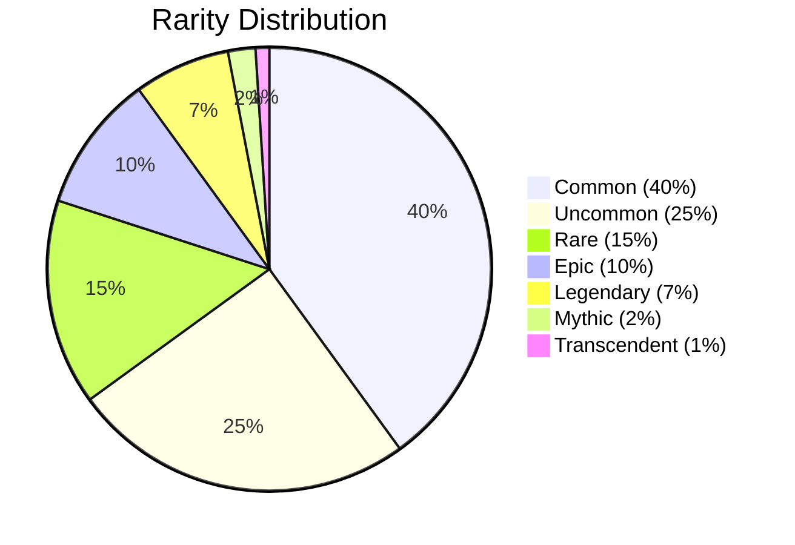
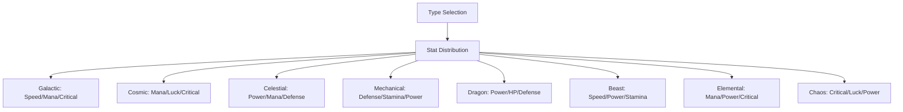
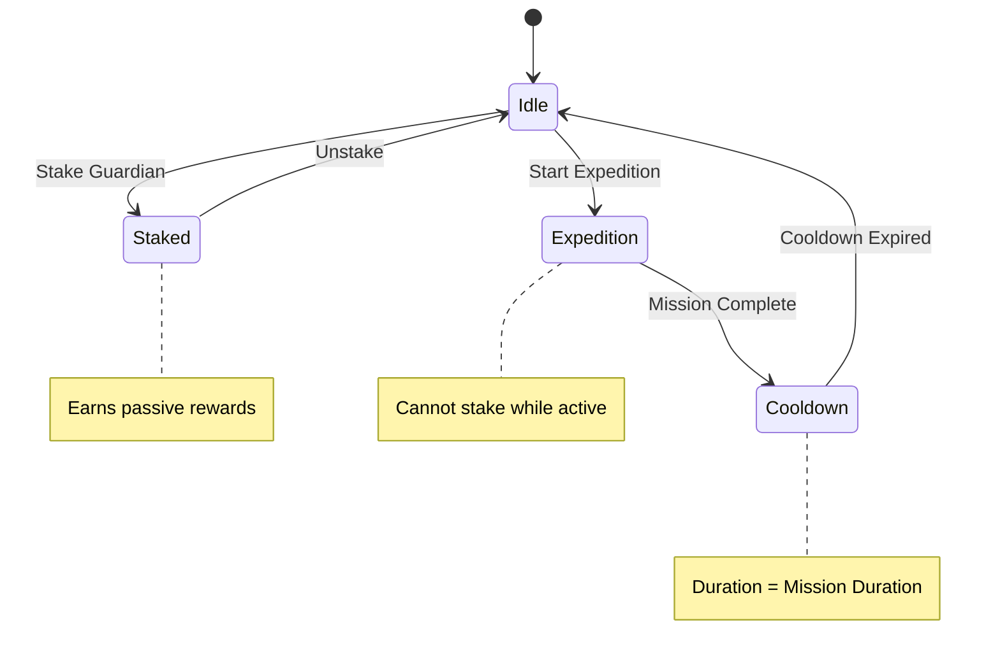
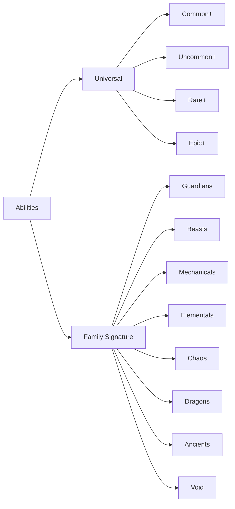
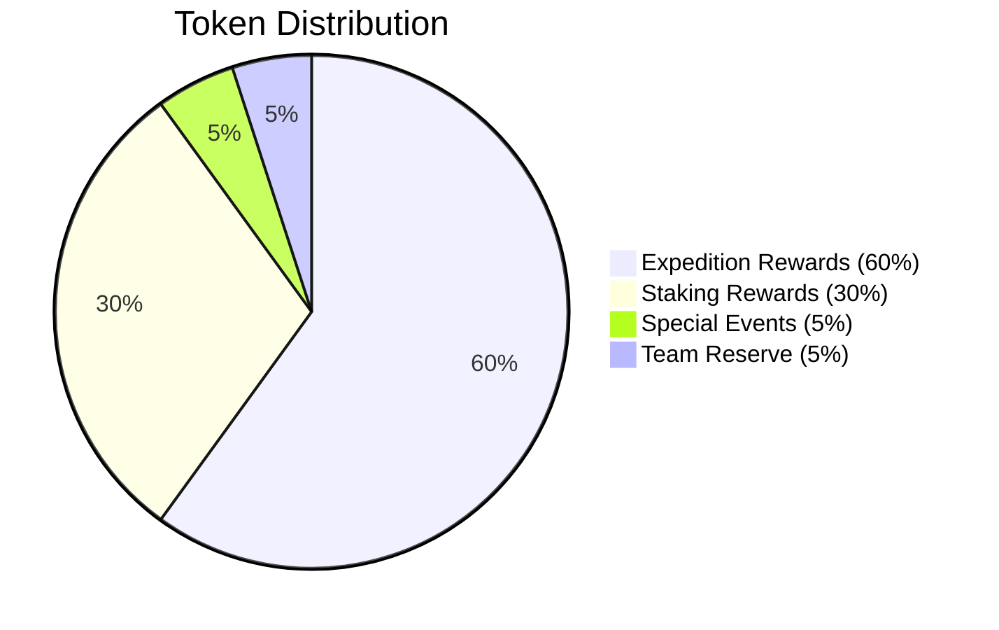

# Game System Documentation

## Overview

The Protocol Guardians game system is built on Ethereum and features a comprehensive NFT collection with unique mechanics for expeditions, staking, and strategic gameplay. This document explains all core mechanics, formulas, and implementation details.

## Core Mechanics

### 1. Type System (Circular Advantage)

The game features 8 types with a circular advantage system where each type is strong against one other type and weak against another.

#### Type Wheel
```
Galactic ⭐ > Cosmic 🌌 > Celestial ☄️ > Mechanical 🤖 > Dragon 🐉 > Beast 🦁 > Elemental 🔥 > Chaos 💀 > Galactic ⭐
```

#### Type Effectiveness Matrix

| Attacker | Galactic | Cosmic | Celestial | Mechanical | Dragon | Beast | Elemental | Chaos |
|----------|----------|--------|-----------|------------|--------|-------|-----------|-------|
| **Galactic** | 100% | 115% | 85% | 100% | 100% | 100% | 100% | 100% |
| **Cosmic** | 85% | 100% | 115% | 100% | 100% | 100% | 100% | 100% |
| **Celestial** | 100% | 85% | 100% | 115% | 100% | 100% | 100% | 100% |
| **Mechanical** | 100% | 100% | 85% | 100% | 115% | 100% | 100% | 100% |
| **Dragon** | 100% | 100% | 100% | 85% | 100% | 115% | 100% | 100% |
| **Beast** | 100% | 100% | 100% | 100% | 85% | 100% | 115% | 100% |
| **Elemental** | 100% | 100% | 100% | 100% | 100% | 85% | 100% | 115% |
| **Chaos** | 115% | 100% | 100% | 100% | 100% | 100% | 85% | 100% |

#### Type Advantage Formula
```javascript
function calculateTypeAdvantage(attackerType, defenderType) {
  const advantageMap = {
    'Galactic': 'Cosmic',
    'Cosmic': 'Celestial', 
    'Celestial': 'Mechanical',
    'Mechanical': 'Dragon',
    'Dragon': 'Beast',
    'Beast': 'Elemental',
    'Elemental': 'Chaos',
    'Chaos': 'Galactic'
  };
  
  if (advantageMap[attackerType] === defenderType) {
    return 1.15; // 15% advantage
  } else if (advantageMap[defenderType] === attackerType) {
    return 0.85; // 15% disadvantage
  } else {
    return 1.0; // Neutral
  }
}
```

### 2. Rarity System

The game features 7 rarity tiers with different stat ranges and supply distributions.

#### Rarity Tiers and Supply Distribution



#### Stat Ranges by Rarity

| Rarity | Total Stats | Background Color | Multiplier |
|--------|-------------|------------------|------------|
| Common | 4000-5000 | #808080 (Gray) | 1.0x |
| Uncommon | 5500-6500 | #00FF00 (Green) | 1.5x |
| Rare | 7000-8000 | #0000FF (Blue) | 2.0x |
| Epic | 8500-9500 | #800080 (Purple) | 2.5x |
| Legendary | 10000-11000 | #FFD700 (Gold) | 3.0x |
| Mythic | 11500-12500 | #FF0000 (Red) | 3.5x |
| Transcendent | 12000-14000 | #FF00FF (Rainbow) | 4.0x |

### 3. Stat System

Each Guardian has 8 stats that determine their effectiveness in expeditions and staking.

#### Stat Categories
- **Power**: Offensive capability
- **Defense**: Damage mitigation
- **Speed**: Turn order/initiative
- **HP**: Health points/durability
- **Luck**: Success rate modifier (+0.01% per point)
- **Mana**: Magical resource
- **Stamina**: Physical resource
- **Critical**: Critical hit chance/damage

#### Stat Distribution by Type



### 4. Expedition System

Expeditions are on-chain missions where Guardians earn rewards based on their stats and abilities.

#### Expedition Flow

```mermaid
flowchart TD
    A[Select Party] --> B[Choose Mission]
    B --> C[Calculate Success Rate]
    C --> D[Execute Mission]
    D --> E[Calculate Rewards]
    E --> F[Apply Cooldowns]
    F --> G[Update Stats]
    
    C --> H[Base Success: 50%]
    C --> I[Stats Bonus: min(45%, (party_stats - required) / required * 100)]
    C --> J[Type Advantage: +15% if advantageous]
    C --> K[Luck Bonus: sum(party_luck) * 0.01%]
    C --> L[Party Synergy: (same_type / total) * 5%]
    
    H --> M[Final Success = min(95%, Base + Stats + Type + Luck + Synergy)]
    I --> M
    J --> M
    K --> M
    L --> M
```

#### Difficulty Levels

| Level | Duration | Required Stats | Base Reward | Success Rate |
|-------|----------|----------------|-------------|--------------|
| Beginner | 30 min | 5,000 | 50 tokens | 60-80% |
| Novice | 2 hours | 10,000 | 150 tokens | 50-70% |
| Adept | 6 hours | 15,000 | 400 tokens | 40-60% |
| Expert | 12 hours | 20,000 | 1,000 tokens | 30-50% |
| Master | 24 hours | 25,000 | 3,000 tokens | 20-40% |

#### Success Rate Calculation

```javascript
function calculateSuccessRate(party, mission) {
  const baseSuccess = 50;
  const statsBonus = Math.min(45, (party.totalStats - mission.requiredStats) / mission.requiredStats * 100);
  const typeAdvantage = hasTypeAdvantage(party, mission) ? 15 : 0;
  const luckBonus = party.totalLuck * 0.01;
  const partySynergy = (party.sameTypeGuardians / party.totalGuardians) * 5;
  
  return Math.min(95, baseSuccess + statsBonus + typeAdvantage + luckBonus + partySynergy);
}
```

#### Reward Calculation

```javascript
function calculateRewards(party, mission) {
  const baseReward = mission.baseReward;
  const rarityMultiplier = party.averageRarityMultiplier;
  const difficultyScaling = baseReward * Math.pow(1.5, mission.difficultyLevel);
  
  return baseReward * rarityMultiplier * difficultyScaling;
}
```

### 5. Staking System

Guardians can be staked to earn passive Protocol Power tokens when not on expeditions.

#### Staking Mechanics



#### Staking Rewards Formula

```javascript
function calculateStakingRewards(guardian, timeStaked) {
  const baseReward = 10; // tokens per hour
  const rarityMultiplier = getRarityMultiplier(guardian.rarity);
  const timeMultiplier = timeStaked / 3600; // hours
  
  return baseReward * rarityMultiplier * timeMultiplier;
}
```

### 6. Ability System

Guardians have unique abilities that provide strategic advantages in expeditions and staking.

#### Ability Categories



#### Ability Cooldown System

```javascript
function canUseAbility(guardian, ability) {
  const lastUsed = guardian.abilityCooldowns[ability.name];
  const cooldownDuration = ability.cooldown;
  const currentTime = Date.now() / 1000;
  
  return (currentTime - lastUsed) >= cooldownDuration;
}
```

### 7. Party Composition Strategy

#### Optimal Party Compositions

| Mission Type | Recommended Party | Reasoning |
|--------------|-------------------|-----------|
| Speed Critical | 3x Galactic + 2x Cosmic | High Speed + Mana for quick completion |
| Power Focus | 2x Dragon + 2x Beast + 1x Elemental | Maximum Power output |
| Balanced | 1x each type | Type advantage coverage |
| Defensive | 3x Mechanical + 2x Celestial | High Defense + Mana |
| Luck Based | 2x Chaos + 2x Cosmic + 1x Galactic | Maximum Luck + Mana |

#### Party Synergy Bonuses

```javascript
function calculatePartySynergy(party) {
  const typeCounts = {};
  party.forEach(guardian => {
    typeCounts[guardian.type] = (typeCounts[guardian.type] || 0) + 1;
  });
  
  const maxTypeCount = Math.max(...Object.values(typeCounts));
  const totalGuardians = party.length;
  
  return (maxTypeCount / totalGuardians) * 5; // 5% per 100% same type
}
```

### 8. Economic Model

#### Token Distribution



#### Reward Scaling

```javascript
function calculateTotalRewards(guardian, timeStaked, expeditionsCompleted) {
  const stakingRewards = calculateStakingRewards(guardian, timeStaked);
  const expeditionRewards = calculateExpeditionRewards(guardian, expeditionsCompleted);
  const rarityBonus = getRarityMultiplier(guardian.rarity);
  
  return (stakingRewards + expeditionRewards) * rarityBonus;
}
```

## Implementation Examples

### Example 1: Expedition Success Calculation

```javascript
// Party: 3x Legendary Galactic, 2x Epic Cosmic
// Mission: Expert (20,000 stats required, 12 hours)

const party = {
  totalStats: 25000,
  totalLuck: 500,
  sameTypeGuardians: 3,
  totalGuardians: 5,
  hasTypeAdvantage: true
};

const mission = {
  requiredStats: 20000,
  difficultyLevel: 4
};

// Calculation:
const baseSuccess = 50;
const statsBonus = Math.min(45, (25000 - 20000) / 20000 * 100); // 25%
const typeAdvantage = 15; // Galactic > Cosmic
const luckBonus = 500 * 0.01; // 5%
const partySynergy = (3 / 5) * 5; // 3%

const finalSuccess = Math.min(95, 50 + 25 + 15 + 5 + 3); // 98% -> 95% (capped)
```

### Example 2: Reward Calculation

```javascript
// Same party and mission
const baseReward = 1000; // Expert base reward
const rarityMultiplier = (3 * 3.0 + 2 * 2.5) / 5; // 2.8x average
const difficultyScaling = 1000 * Math.pow(1.5, 4); // 5,062.5

const finalReward = 1000 * 2.8 * 5.0625; // 14,175 tokens
```

### Example 3: Staking Rewards

```javascript
// Legendary Guardian staked for 24 hours
const guardian = { rarity: 'Legendary' };
const timeStaked = 86400; // 24 hours in seconds

const baseReward = 10; // tokens per hour
const rarityMultiplier = 3.0; // Legendary multiplier
const timeMultiplier = 24; // hours

const stakingReward = 10 * 3.0 * 24; // 720 tokens
```

## Technical Implementation

### Smart Contract Integration

```solidity
// Example: Expedition execution
function startExpedition(uint256[] memory tokenIds, uint256 missionId) external {
    require(tokenIds.length >= 1 && tokenIds.length <= 5, "Invalid party size");
    require(canStartExpedition(tokenIds), "Guardians not available");
    
    Expedition memory expedition = Expedition({
        party: tokenIds,
        missionId: missionId,
        startTime: block.timestamp,
        successRate: calculateSuccessRate(tokenIds, missionId)
    });
    
    expeditions[msg.sender] = expedition;
    emit ExpeditionStarted(msg.sender, tokenIds, missionId);
}
```

### Metadata Parsing

```javascript
// Example: Parse Guardian metadata
function parseGuardianMetadata(tokenURI) {
  const metadata = await fetch(tokenURI).then(r => r.json());
  
  return {
    name: metadata.name,
    stats: extractStats(metadata.attributes),
    abilities: extractAbilities(metadata.attributes),
    rarity: extractRarity(metadata.attributes),
    type: extractType(metadata.attributes)
  };
}
```

## Balance Considerations

### Stat Distribution Balance
- No single type dominates all stats
- Each type has clear strengths and weaknesses
- Rarity scaling ensures higher tiers are meaningfully better

### Economic Balance
- Rewards scale appropriately with difficulty
- Staking provides steady income without being overpowered
- Expedition rewards encourage active participation

### Strategic Depth
- Party composition matters significantly
- Type advantages create meaningful choices
- Ability cooldowns prevent spam strategies

## Future Considerations

### Planned Features
- **PvP System**: Direct Guardian vs Guardian combat
- **Fusion System**: Combine Guardians to create new ones
- **Guild System**: Collaborative gameplay features
- **Seasonal Events**: Limited-time content and rewards

### Scalability
- **Blockchain Optimization**: Built for Ethereum efficiency
- **Gas Optimization**: Minimal transaction costs
- **Modular Design**: Easy to add new features

---

This comprehensive game system provides deep strategic gameplay while maintaining accessibility for new players. The circular type system, rarity scaling, and dual income model create a sustainable and engaging NFT gaming experience on Ethereum.
