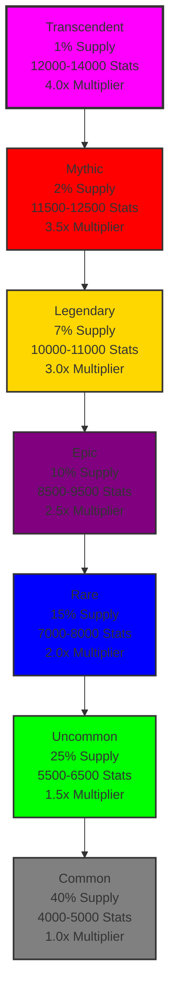
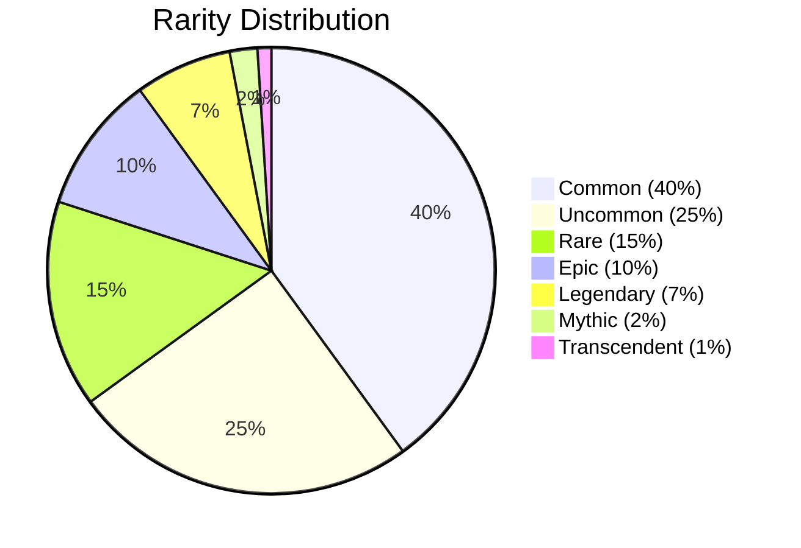

# Rarity System Documentation

## Overview

The Protocol Guardians collection features 7 distinct rarity tiers, each with unique stat ranges, supply distributions, and visual characteristics. The rarity system uses a pyramid distribution where higher rarities are exponentially more valuable and powerful.

## Rarity Pyramid



## Rarity Tiers

### 1. Common (40% Supply)
**Background Color**: #808080 (Gray)
**Stat Range**: 4000-5000 total stats
**Multiplier**: 1.0x
**Characteristics**: Basic abilities, standard stats, entry-level gameplay

**Stat Distribution Example**:
- Power: 500-750
- Defense: 500-750
- Speed: 500-750
- HP: 500-750
- Luck: 500-750
- Mana: 500-750
- Stamina: 500-750
- Critical: 500-750

**Abilities**: Basic universal abilities only
**Expedition Success**: 40-60% on Beginner missions
**Staking Rewards**: 10 tokens/hour base

### 2. Uncommon (25% Supply)
**Background Color**: #00FF00 (Green)
**Stat Range**: 5500-6500 total stats
**Multiplier**: 1.5x
**Characteristics**: Improved stats, access to intermediate abilities

**Stat Distribution Example**:
- Power: 700-900
- Defense: 700-900
- Speed: 700-900
- HP: 700-900
- Luck: 700-900
- Mana: 700-900
- Stamina: 700-900
- Critical: 700-900

**Abilities**: Basic + Intermediate universal abilities
**Expedition Success**: 50-70% on Beginner missions
**Staking Rewards**: 15 tokens/hour base

### 3. Rare (15% Supply)
**Background Color**: #0000FF (Blue)
**Stat Range**: 7000-8000 total stats
**Multiplier**: 2.0x
**Characteristics**: Good stats, access to advanced abilities

**Stat Distribution Example**:
- Power: 900-1100
- Defense: 900-1100
- Speed: 900-1100
- HP: 900-1100
- Luck: 900-1100
- Mana: 900-1100
- Stamina: 900-1100
- Critical: 900-1100

**Abilities**: Basic + Intermediate + Advanced universal abilities
**Expedition Success**: 60-80% on Beginner missions
**Staking Rewards**: 20 tokens/hour base

### 4. Epic (10% Supply)
**Background Color**: #800080 (Purple)
**Stat Range**: 8500-9500 total stats
**Multiplier**: 2.5x
**Characteristics**: High stats, access to elite abilities

**Stat Distribution Example**:
- Power: 1100-1300
- Defense: 1100-1300
- Speed: 1100-1300
- HP: 1100-1300
- Luck: 1100-1300
- Mana: 1100-1300
- Stamina: 1100-1300
- Critical: 1100-1300

**Abilities**: All universal abilities + some family signature abilities
**Expedition Success**: 70-90% on Beginner missions
**Staking Rewards**: 25 tokens/hour base

### 5. Legendary (7% Supply)
**Background Color**: #FFD700 (Gold)
**Stat Range**: 10000-11000 total stats
**Multiplier**: 3.0x
**Characteristics**: Excellent stats, access to most abilities

**Stat Distribution Example**:
- Power: 1300-1500
- Defense: 1300-1500
- Speed: 1300-1500
- HP: 1300-1500
- Luck: 1300-1500
- Mana: 1300-1500
- Stamina: 1300-1500
- Critical: 1300-1500

**Abilities**: Most universal abilities + family signature abilities
**Expedition Success**: 80-95% on Beginner missions
**Staking Rewards**: 30 tokens/hour base

### 6. Mythic (2% Supply)
**Background Color**: #FF0000 (Red)
**Stat Range**: 11500-12500 total stats
**Multiplier**: 3.5x
**Characteristics**: Exceptional stats, access to all abilities

**Stat Distribution Example**:
- Power: 1500-1700
- Defense: 1500-1700
- Speed: 1500-1700
- HP: 1500-1700
- Luck: 1500-1700
- Mana: 1500-1700
- Stamina: 1500-1700
- Critical: 1500-1700

**Abilities**: All universal abilities + all family signature abilities
**Expedition Success**: 85-95% on Beginner missions
**Staking Rewards**: 35 tokens/hour base

### 7. Transcendent (1% Supply)
**Background Color**: #FF00FF (Rainbow/Prismatic)
**Stat Range**: 12000-14000 total stats
**Multiplier**: 4.0x
**Characteristics**: Maximum stats, access to exclusive abilities

**Stat Distribution Example**:
- Power: 1700-2000
- Defense: 1700-2000
- Speed: 1700-2000
- HP: 1700-2000
- Luck: 1700-2000
- Mana: 1700-2000
- Stamina: 1700-2000
- Critical: 1700-2000

**Abilities**: All abilities + exclusive Transcendent abilities
**Expedition Success**: 90-95% on Beginner missions
**Staking Rewards**: 40 tokens/hour base

## Supply Distribution



## Stat Scaling

### Linear Scaling Within Rarity
Each rarity tier has a linear stat range, but the total stat pool increases exponentially between rarities:

```javascript
function calculateStatRange(rarity) {
  const baseStats = {
    'Common': 4000,
    'Uncommon': 5500,
    'Rare': 7000,
    'Epic': 8500,
    'Legendary': 10000,
    'Mythic': 11500,
    'Transcendent': 12000
  };
  
  const range = 1000; // 1000 stat points range
  return {
    min: baseStats[rarity],
    max: baseStats[rarity] + range
  };
}
```

### Exponential Scaling Between Rarities
The stat ranges increase exponentially, making higher rarities significantly more powerful:

```javascript
function calculateRarityMultiplier(rarity) {
  const multipliers = {
    'Common': 1.0,
    'Uncommon': 1.5,
    'Rare': 2.0,
    'Epic': 2.5,
    'Legendary': 3.0,
    'Mythic': 3.5,
    'Transcendent': 4.0
  };
  
  return multipliers[rarity];
}
```

## Visual Characteristics

### Background Colors
Each rarity has a distinct background color that appears in OpenSea and other marketplaces:

| Rarity | Color | Hex Code | Description |
|--------|-------|----------|-------------|
| Common | Gray | #808080 | Basic, neutral |
| Uncommon | Green | #00FF00 | Growth, improvement |
| Rare | Blue | #0000FF | Stability, reliability |
| Epic | Purple | #800080 | Mystery, power |
| Legendary | Gold | #FFD700 | Prestige, value |
| Mythic | Red | #FF0000 | Danger, power |
| Transcendent | Rainbow | #FF00FF | Transcendence, ultimate |

### Visual Effects
- **Common**: Standard appearance
- **Uncommon**: Slight glow effect
- **Rare**: Subtle particle effects
- **Epic**: Moderate glow and particles
- **Legendary**: Strong glow and particles
- **Mythic**: Intense glow and particles
- **Transcendent**: Maximum glow, particles, and special effects

## Economic Impact

### Staking Rewards
Higher rarity Guardians earn more tokens per hour when staked:

```javascript
function calculateStakingRewards(guardian, timeStaked) {
  const baseReward = 10; // tokens per hour
  const rarityMultiplier = getRarityMultiplier(guardian.rarity);
  const timeMultiplier = timeStaked / 3600; // hours
  
  return baseReward * rarityMultiplier * timeMultiplier;
}
```

### Expedition Rewards
Higher rarity Guardians contribute more to expedition success and rewards:

```javascript
function calculateExpeditionRewards(party, mission) {
  const baseReward = mission.baseReward;
  const rarityMultiplier = party.averageRarityMultiplier;
  const difficultyScaling = baseReward * Math.pow(1.5, mission.difficultyLevel);
  
  return baseReward * rarityMultiplier * difficultyScaling;
}
```

## Ability Access

### Universal Abilities
All Guardians can learn universal abilities, but higher rarities have access to more powerful abilities:

| Rarity | Universal Abilities | Description |
|--------|-------------------|-------------|
| Common | 5 basic abilities | Entry-level abilities |
| Uncommon | 10 abilities | Basic + intermediate |
| Rare | 15 abilities | Basic + intermediate + advanced |
| Epic | 20 abilities | All universal abilities |
| Legendary | 25 abilities | All universal + some family |
| Mythic | 30 abilities | All universal + most family |
| Transcendent | 35+ abilities | All abilities + exclusive |

### Family Signature Abilities
Higher rarities have access to more family signature abilities:

| Rarity | Family Abilities | Description |
|--------|-----------------|-------------|
| Common | 0 | No family abilities |
| Uncommon | 1-2 | Basic family abilities |
| Rare | 3-4 | Intermediate family abilities |
| Epic | 5-6 | Advanced family abilities |
| Legendary | 7-8 | Most family abilities |
| Mythic | 9-10 | All family abilities |
| Transcendent | 11+ | All family + exclusive abilities |

## Strategic Implications

### Party Composition
Higher rarity Guardians are more valuable in party compositions:

- **Common**: Basic party members, good for learning
- **Uncommon**: Reliable party members, good for standard missions
- **Rare**: Strong party members, good for challenging missions
- **Epic**: Excellent party members, good for difficult missions
- **Legendary**: Elite party members, good for expert missions
- **Mythic**: Exceptional party members, good for master missions
- **Transcendent**: Ultimate party members, good for any mission

### Economic Strategy
Players must balance rarity with cost:

- **Common**: Cheap, good for beginners
- **Uncommon**: Affordable, good value
- **Rare**: Moderate cost, good performance
- **Epic**: Higher cost, excellent performance
- **Legendary**: Expensive, elite performance
- **Mythic**: Very expensive, exceptional performance
- **Transcendent**: Extremely expensive, ultimate performance

## Implementation Examples

### Example 1: Stat Calculation
```javascript
// Legendary Galactic Guardian
const guardian = {
  rarity: 'Legendary',
  type: 'Galactic',
  totalStats: 10500
};

// Stat distribution (Galactic profile)
const stats = {
  speed: Math.floor(10500 * 0.25), // 2625
  mana: Math.floor(10500 * 0.20),  // 2100
  critical: Math.floor(10500 * 0.15), // 1575
  power: Math.floor(10500 * 0.15), // 1575
  defense: Math.floor(10500 * 0.10), // 1050
  hp: Math.floor(10500 * 0.08), // 840
  luck: Math.floor(10500 * 0.05), // 525
  stamina: Math.floor(10500 * 0.02) // 210
};
```

### Example 2: Reward Calculation
```javascript
// Party: 2x Legendary, 2x Epic, 1x Rare
const party = [
  { rarity: 'Legendary', multiplier: 3.0 },
  { rarity: 'Legendary', multiplier: 3.0 },
  { rarity: 'Epic', multiplier: 2.5 },
  { rarity: 'Epic', multiplier: 2.5 },
  { rarity: 'Rare', multiplier: 2.0 }
];

const averageMultiplier = (3.0 + 3.0 + 2.5 + 2.5 + 2.0) / 5; // 2.6x
const baseReward = 1000; // Expert mission
const difficultyScaling = 1000 * Math.pow(1.5, 4); // 5,062.5

const finalReward = baseReward * averageMultiplier * difficultyScaling; // 13,162.5 tokens
```

### Example 3: Ability Access
```javascript
// Check ability access for different rarities
function canLearnAbility(guardian, ability) {
  const rarityLevels = {
    'Common': 1,
    'Uncommon': 2,
    'Rare': 3,
    'Epic': 4,
    'Legendary': 5,
    'Mythic': 6,
    'Transcendent': 7
  };
  
  const guardianLevel = rarityLevels[guardian.rarity];
  const abilityLevel = ability.minRarityLevel;
  
  return guardianLevel >= abilityLevel;
}
```

## Balance Considerations

### Supply Balance
- **Common**: High supply ensures accessibility
- **Uncommon**: Good supply for progression
- **Rare**: Moderate supply for advancement
- **Epic**: Limited supply for exclusivity
- **Legendary**: Low supply for prestige
- **Mythic**: Very low supply for rarity
- **Transcendent**: Ultra-low supply for ultimate rarity

### Power Balance
- **Linear scaling within rarity**: Fair distribution
- **Exponential scaling between rarities**: Meaningful differences
- **Ability access**: Progressive unlock system
- **Economic impact**: Balanced rewards

### Strategic Depth
- **Rarity matters**: Higher rarities are significantly better
- **Cost vs. benefit**: Players must balance investment
- **Party composition**: Mix of rarities can be effective
- **Long-term progression**: Clear upgrade path

## Future Considerations

### Planned Features
- **Rarity Evolution**: Guardians may evolve between rarities
- **Rarity Fusion**: Combine Guardians to increase rarity
- **Rarity Mastery**: Specialization bonuses for focused play

### Balance Updates
- **Stat Ranges**: May be adjusted based on gameplay data
- **Supply Distribution**: Fine-tuning based on market dynamics
- **New Rarities**: Potential addition of new tiers in future expansions

---

The rarity system provides clear progression and meaningful differences between tiers while maintaining balance and strategic depth. Each rarity has distinct characteristics that make them valuable in different contexts.
