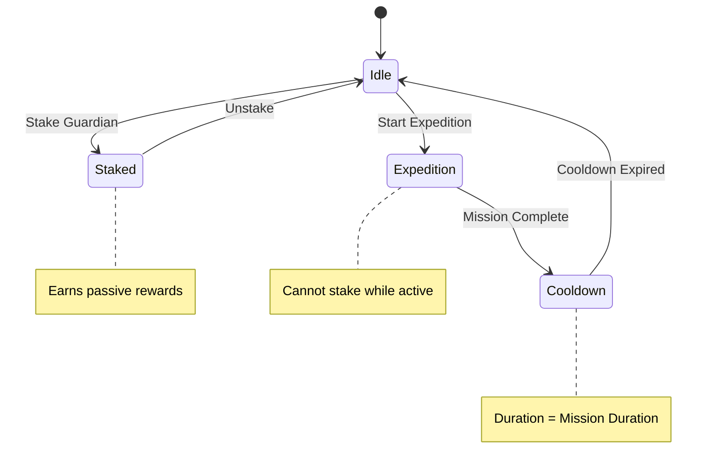

# Staking System Documentation

## Overview

The Protocol Guardians staking system allows Guardians to earn passive Protocol Power tokens when not participating in expeditions. The system features rarity-based multipliers, mutual exclusivity with expeditions, and integration with the broader Ethereum ecosystem.

## Staking Mechanics

### State Machine



### Mutual Exclusivity

Guardians cannot be staked while participating in expeditions, and vice versa. This creates strategic decisions about resource allocation:

- **Staking**: Passive income, no risk, lower rewards
- **Expeditions**: Active income, risk of failure, higher rewards
- **Cooldown**: No income, recovery period, strategic planning

## Staking Rewards

### Base Formula
```javascript
function calculateStakingRewards(guardian, timeStaked) {
  const baseReward = 10; // tokens per hour
  const rarityMultiplier = getRarityMultiplier(guardian.rarity);
  const timeMultiplier = timeStaked / 3600; // hours
  
  return baseReward * rarityMultiplier * timeMultiplier;
}
```

### Rarity Multipliers

| Rarity | Multiplier | Tokens/Hour | 24h Rewards | 7d Rewards |
|--------|------------|-------------|-------------|------------|
| Common | 1.0x | 10 | 240 | 1,680 |
| Uncommon | 1.5x | 15 | 360 | 2,520 |
| Rare | 2.0x | 20 | 480 | 3,360 |
| Epic | 2.5x | 25 | 600 | 4,200 |
| Legendary | 3.0x | 30 | 720 | 5,040 |
| Mythic | 3.5x | 35 | 840 | 5,880 |
| Transcendent | 4.0x | 40 | 960 | 6,720 |

### Time-Based Scaling

Staking rewards scale linearly with time staked:

```javascript
const timeMultiplier = timeStaked / 3600; // Convert seconds to hours
const rewards = baseReward * rarityMultiplier * timeMultiplier;
```

**Examples**:
- **1 hour**: Base reward × rarity multiplier × 1
- **24 hours**: Base reward × rarity multiplier × 24
- **7 days**: Base reward × rarity multiplier × 168
- **30 days**: Base reward × rarity multiplier × 720

## Staking vs. Expeditions

### Economic Comparison

| Strategy | Risk | Reward Rate | Time Investment | Skill Required |
|----------|------|-------------|-----------------|----------------|
| **Staking** | None | Low | Passive | None |
| **Expeditions** | High | High | Active | High |
| **Mixed** | Medium | Medium | Moderate | Medium |

### Optimal Strategy

#### For Beginners
- **Focus**: Staking for steady income
- **Reasoning**: Low risk, guaranteed rewards
- **Guardians**: Common/Uncommon for learning

#### For Intermediate Players
- **Focus**: Mixed approach
- **Reasoning**: Balance risk and reward
- **Guardians**: Rare/Epic for better returns

#### For Advanced Players
- **Focus**: Expeditions for maximum rewards
- **Reasoning**: High risk, high reward
- **Guardians**: Legendary/Mythic for best performance

## Staking Integration

### Smart Contract Integration

```solidity
// Example: Staking function
function stake(uint256 tokenId) external {
    require(ownerOf(tokenId) == msg.sender, "Not owner");
    require(!isOnExpedition(tokenId), "On expedition");
    require(!isStaked(tokenId), "Already staked");
    
    stakedTokens[msg.sender].push(tokenId);
    stakingStartTime[tokenId] = block.timestamp;
    
    emit Staked(msg.sender, tokenId);
}

function unstake(uint256 tokenId) external {
    require(ownerOf(tokenId) == msg.sender, "Not owner");
    require(isStaked(tokenId), "Not staked");
    
    uint256 stakingTime = block.timestamp - stakingStartTime[tokenId];
    uint256 rewards = calculateStakingRewards(tokenId, stakingTime);
    
    // Transfer rewards to user
    protocolPower.transfer(msg.sender, rewards);
    
    // Remove from staked tokens
    removeFromStaked(msg.sender, tokenId);
    
    emit Unstaked(msg.sender, tokenId, rewards);
}
```

### Reward Distribution

```javascript
function distributeStakingRewards() {
  const stakedGuardians = getAllStakedGuardians();
  
  for (const guardian of stakedGuardians) {
    const stakingTime = Date.now() / 1000 - guardian.stakingStartTime;
    const rewards = calculateStakingRewards(guardian, stakingTime);
    
    if (rewards > 0) {
      transferRewards(guardian.owner, rewards);
      updateStakingStartTime(guardian, Date.now() / 1000);
    }
  }
}
```

## Staking Strategies

### 1. Passive Income Strategy
**Approach**: Stake all Guardians for steady income
**Advantages**: No risk, guaranteed rewards, passive
**Disadvantages**: Lower rewards, no active gameplay
**Best For**: Beginners, risk-averse players

### 2. Active Trading Strategy
**Approach**: Stake between expeditions
**Advantages**: Maximum income, active gameplay
**Disadvantages**: High risk, requires skill
**Best For**: Advanced players, risk-tolerant

### 3. Balanced Strategy
**Approach**: Mix of staking and expeditions
**Advantages**: Balanced risk/reward, moderate skill
**Disadvantages**: Suboptimal for either strategy
**Best For**: Intermediate players, balanced approach

### 4. Rarity Focus Strategy
**Approach**: Focus on high-rarity Guardians
**Advantages**: Maximum multipliers, best rewards
**Disadvantages**: High cost, limited availability
**Best For**: Players with high-value collections

## Staking Calculations

### Example 1: Basic Staking
```javascript
// Common Guardian staked for 24 hours
const guardian = { rarity: 'Common' };
const timeStaked = 86400; // 24 hours in seconds

const baseReward = 10; // tokens per hour
const rarityMultiplier = 1.0; // Common multiplier
const timeMultiplier = 24; // hours

const stakingReward = 10 * 1.0 * 24; // 240 tokens
```

### Example 2: High-Rarity Staking
```javascript
// Legendary Guardian staked for 7 days
const guardian = { rarity: 'Legendary' };
const timeStaked = 604800; // 7 days in seconds

const baseReward = 10; // tokens per hour
const rarityMultiplier = 3.0; // Legendary multiplier
const timeMultiplier = 168; // hours (7 days)

const stakingReward = 10 * 3.0 * 168; // 5,040 tokens
```

### Example 3: Multiple Guardians
```javascript
// Party: 2x Legendary, 2x Epic, 1x Rare
const party = [
  { rarity: 'Legendary', timeStaked: 86400 },
  { rarity: 'Legendary', timeStaked: 86400 },
  { rarity: 'Epic', timeStaked: 86400 },
  { rarity: 'Epic', timeStaked: 86400 },
  { rarity: 'Rare', timeStaked: 86400 }
];

const totalRewards = party.reduce((sum, guardian) => {
  const baseReward = 10;
  const rarityMultiplier = getRarityMultiplier(guardian.rarity);
  const timeMultiplier = 24; // 24 hours
  
  return sum + (baseReward * rarityMultiplier * timeMultiplier);
}, 0);

// Total: (10 * 3.0 * 24) * 2 + (10 * 2.5 * 24) * 2 + (10 * 2.0 * 24) * 1
// = 1440 + 1200 + 480 = 3,120 tokens
```

## Staking vs. Expedition Comparison

### Reward Rates

| Strategy | Common | Uncommon | Rare | Epic | Legendary | Mythic | Transcendent |
|----------|--------|----------|------|------|-----------|--------|--------------|
| **Staking (24h)** | 240 | 360 | 480 | 600 | 720 | 840 | 960 |
| **Expedition (24h)** | 0-1,200 | 0-1,800 | 0-2,400 | 0-3,000 | 0-3,600 | 0-4,200 | 0-4,800 |
| **Expedition (7d)** | 0-8,400 | 0-12,600 | 0-16,800 | 0-21,000 | 0-25,200 | 0-29,400 | 0-33,600 |

### Risk Analysis

#### Staking Risk
- **Success Rate**: 100% (guaranteed)
- **Reward Variance**: 0% (predictable)
- **Time Investment**: Passive
- **Skill Required**: None

#### Expedition Risk
- **Success Rate**: 20-95% (variable)
- **Reward Variance**: High (0-100% of potential)
- **Time Investment**: Active
- **Skill Required**: High

### Optimal Strategy by Player Type

#### Risk-Averse Players
- **Strategy**: 100% staking
- **Reasoning**: Guaranteed income, no risk
- **Expected Return**: 100% of staking rate

#### Risk-Tolerant Players
- **Strategy**: 100% expeditions
- **Reasoning**: Higher potential rewards
- **Expected Return**: 50-80% of expedition rate (accounting for failures)

#### Balanced Players
- **Strategy**: 50% staking, 50% expeditions
- **Reasoning**: Balanced risk/reward
- **Expected Return**: 75-90% of expedition rate

## Staking Optimization

### Time Management
```javascript
function optimizeStakingSchedule(guardians) {
  const stakingGuardians = guardians.filter(guardian => !guardian.isOnExpedition);
  const expeditionGuardians = guardians.filter(guardian => guardian.isOnExpedition);
  
  // Calculate optimal staking duration
  const stakingDuration = calculateOptimalStakingDuration(stakingGuardians);
  
  // Calculate optimal expedition schedule
  const expeditionSchedule = calculateOptimalExpeditionSchedule(expeditionGuardians);
  
  return {
    staking: stakingGuardians,
    expeditions: expeditionSchedule,
    totalRewards: calculateTotalRewards(stakingGuardians, expeditionSchedule)
  };
}
```

### Rarity Optimization
```javascript
function optimizeRarityDistribution(guardians) {
  const rarityGroups = groupByRarity(guardians);
  
  // High-rarity Guardians: Expeditions (higher risk, higher reward)
  const expeditionGuardians = rarityGroups
    .filter(group => group.rarity >= 'Epic')
    .flatMap(group => group.guardians);
  
  // Low-rarity Guardians: Staking (lower risk, steady income)
  const stakingGuardians = rarityGroups
    .filter(group => group.rarity < 'Epic')
    .flatMap(group => group.guardians);
  
  return {
    staking: stakingGuardians,
    expeditions: expeditionGuardians
  };
}
```

## Staking Rewards Distribution

### Daily Distribution
```javascript
function distributeDailyRewards() {
  const stakedGuardians = getAllStakedGuardians();
  const totalRewards = calculateTotalStakingRewards(stakedGuardians);
  
  // Distribute rewards proportionally
  for (const guardian of stakedGuardians) {
    const guardianRewards = calculateStakingRewards(guardian, 86400); // 24 hours
    const percentage = guardianRewards / totalRewards;
    
    transferRewards(guardian.owner, guardianRewards);
    updateStakingStartTime(guardian, Date.now() / 1000);
  }
}
```

### Weekly Distribution
```javascript
function distributeWeeklyRewards() {
  const stakedGuardians = getAllStakedGuardians();
  const totalRewards = calculateTotalStakingRewards(stakedGuardians);
  
  // Distribute rewards with weekly bonus
  const weeklyBonus = 1.1; // 10% bonus for weekly staking
  
  for (const guardian of stakedGuardians) {
    const guardianRewards = calculateStakingRewards(guardian, 604800); // 7 days
    const bonusRewards = guardianRewards * weeklyBonus;
    
    transferRewards(guardian.owner, bonusRewards);
    updateStakingStartTime(guardian, Date.now() / 1000);
  }
}
```

## Staking Abilities

### Staking-Specific Abilities
Certain abilities can enhance staking rewards:

- **PASSIVE INCOME**: +25% staking rewards for 24 hours
- **COMPOUND INTEREST**: +50% staking rewards for 48 hours
- **WEALTH ACCUMULATION**: +100% staking rewards for 72 hours
- **FINANCIAL MASTERY**: +200% staking rewards for 168 hours

### Ability Integration
```javascript
function calculateStakingRewardsWithAbilities(guardian, timeStaked) {
  const baseRewards = calculateStakingRewards(guardian, timeStaked);
  const abilityMultiplier = getStakingAbilityMultiplier(guardian);
  
  return baseRewards * abilityMultiplier;
}
```

## Future Considerations

### Planned Features
- **Staking Pools**: Collective staking for better rewards
- **Staking Competitions**: Time-limited events with bonus rewards
- **Staking Levels**: Progression system for staking mastery
- **Staking Guilds**: Collaborative staking strategies

### Balance Updates
- **Reward Rates**: May be adjusted based on economic data
- **Multipliers**: Fine-tuning based on player behavior
- **Ability Integration**: Optimization of staking abilities
- **New Mechanics**: Addition of new staking features

---

The staking system provides a balanced alternative to expeditions, offering steady income with no risk while maintaining strategic depth through rarity multipliers and ability integration. The mutual exclusivity with expeditions creates meaningful choices about resource allocation and risk management.
