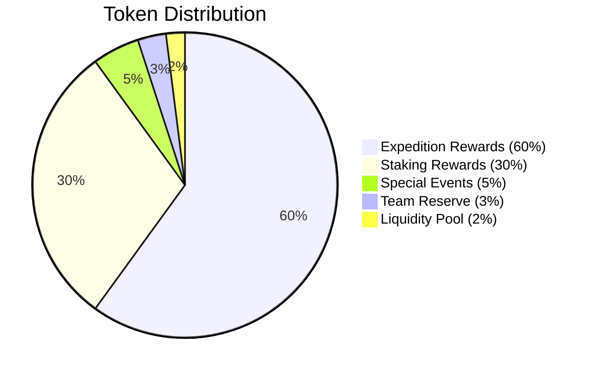

# Tokenomics Documentation

## Overview

The Protocol Guardians ecosystem is powered by the Protocol Power (POWER) token, an ERC20 token built on Ethereum. The tokenomics are designed for long-term sustainability, value appreciation, and community growth while maintaining accessibility for all players.

## Token Distribution

### Total Supply
**1,000,000,000 POWER tokens** (1 billion tokens)

### Distribution Breakdown



### Detailed Allocation

| Category | Percentage | Tokens | Purpose |
|----------|------------|--------|---------|
| **Expedition Rewards** | 60% | 600,000,000 | Rewards for successful expeditions |
| **Staking Rewards** | 30% | 300,000,000 | Passive income for staked Guardians |
| **Special Events** | 5% | 50,000,000 | Community events, tournaments, airdrops |
| **Team Reserve** | 3% | 30,000,000 | Team compensation, development |
| **Liquidity Pool** | 2% | 20,000,000 | Initial liquidity and market making |

## Emission Schedule

### Staking Rewards (30% - 300M tokens)

#### Emission Rate
- **Year 1**: 50% of staking pool (150M tokens)
- **Year 2**: 30% of staking pool (90M tokens)
- **Year 3**: 15% of staking pool (45M tokens)
- **Year 4+**: 5% of staking pool (15M tokens)

#### Daily Emission
```javascript
function calculateDailyStakingEmission(year) {
  const yearlyRates = {
    1: 0.50,  // 50% in year 1
    2: 0.30,  // 30% in year 2
    3: 0.15,  // 15% in year 3
    4: 0.05   // 5% in year 4+
  };
  
  const totalStakingPool = 300000000; // 300M tokens
  const yearlyRate = yearlyRates[year] || 0.05;
  const yearlyEmission = totalStakingPool * yearlyRate;
  
  return yearlyEmission / 365; // Daily emission
}
```

#### APY Calculations
- **Year 1**: ~50% APY (high initial rewards)
- **Year 2**: ~30% APY (moderate rewards)
- **Year 3**: ~15% APY (sustainable rewards)
- **Year 4+**: ~5% APY (long-term sustainability)

### Expedition Rewards (60% - 600M tokens)

#### Emission Rate
- **Year 1**: 40% of expedition pool (240M tokens)
- **Year 2**: 30% of expedition pool (180M tokens)
- **Year 3**: 20% of expedition pool (120M tokens)
- **Year 4+**: 10% of expedition pool (60M tokens)

#### Difficulty-Based Distribution
```javascript
function calculateExpeditionRewards(difficulty, successRate) {
  const baseRewards = {
    'Beginner': 50,
    'Novice': 150,
    'Adept': 400,
    'Expert': 1000,
    'Master': 3000
  };
  
  const baseReward = baseRewards[difficulty];
  const adjustedReward = baseReward * successRate;
  
  return adjustedReward;
}
```

#### Daily Expedition Emission
```javascript
function calculateDailyExpeditionEmission(year) {
  const yearlyRates = {
    1: 0.40,  // 40% in year 1
    2: 0.30,  // 30% in year 2
    3: 0.20,  // 20% in year 3
    4: 0.10   // 10% in year 4+
  };
  
  const totalExpeditionPool = 600000000; // 600M tokens
  const yearlyRate = yearlyRates[year] || 0.10;
  const yearlyEmission = totalExpeditionPool * yearlyRate;
  
  return yearlyEmission / 365; // Daily emission
}
```

## Economic Model

### Supply and Demand Dynamics

#### Supply Factors
- **Staking rewards**: Continuous emission to staked Guardians
- **Expedition rewards**: Emission based on successful missions
- **Special events**: Controlled emission for community engagement
- **Team reserve**: Vesting schedule for team tokens

#### Demand Factors
- **Utility**: Tokens used for gameplay and rewards
- **Staking**: Tokens locked in staking mechanisms
- **Expeditions**: Tokens earned through active gameplay
- **Community**: Tokens used for events and competitions

### Deflationary Mechanisms

#### Token Burning
- **Failed expeditions**: 10% of potential rewards burned
- **Ability cooldowns**: 5% of ability usage costs burned
- **Special events**: 20% of event participation costs burned

#### Burning Formula
```javascript
function calculateBurnedTokens(activity, cost) {
  const burnRates = {
    'failed_expedition': 0.10,  // 10% of potential rewards
    'ability_cooldown': 0.05,   // 5% of ability costs
    'special_event': 0.20      // 20% of event costs
  };
  
  const burnRate = burnRates[activity] || 0;
  return cost * burnRate;
}
```

#### Supply Reduction
- **Year 1**: 5% of total supply burned
- **Year 2**: 3% of total supply burned
- **Year 3**: 2% of total supply burned
- **Year 4+**: 1% of total supply burned

### Inflation Control

#### Emission Decay
```javascript
function calculateEmissionDecay(year) {
  const decayRate = 0.20; // 20% reduction per year
  const baseEmission = 1000000; // 1M tokens per day
  
  return baseEmission * Math.pow(1 - decayRate, year - 1);
}
```

#### Adaptive Emission
- **High participation**: Increase emission by 10%
- **Low participation**: Decrease emission by 5%
- **Market conditions**: Adjust based on token price
- **Community feedback**: Community-driven adjustments

## Staking Economics

### Staking Rewards Formula
```javascript
function calculateStakingRewards(guardian, timeStaked) {
  const baseReward = 10; // tokens per hour
  const rarityMultiplier = getRarityMultiplier(guardian.rarity);
  const timeMultiplier = timeStaked / 3600; // hours
  const emissionRate = getCurrentEmissionRate();
  
  return baseReward * rarityMultiplier * timeMultiplier * emissionRate;
}
```

### Rarity Multipliers
| Rarity | Multiplier | Tokens/Hour | 24h Rewards | 7d Rewards |
|--------|------------|-------------|-------------|------------|
| Common | 1.0x | 10 | 240 | 1,680 |
| Uncommon | 1.5x | 15 | 360 | 2,520 |
| Rare | 2.0x | 20 | 480 | 3,360 |
| Epic | 2.5x | 25 | 600 | 4,200 |
| Legendary | 3.0x | 30 | 720 | 5,040 |
| Mythic | 3.5x | 35 | 840 | 5,880 |
| Transcendent | 4.0x | 40 | 960 | 6,720 |

### Staking Pool Dynamics
```javascript
function calculateStakingPool() {
  const totalStaked = getAllStakedGuardians();
  const totalRewards = calculateTotalStakingRewards(totalStaked);
  const poolSize = getStakingPoolSize();
  
  // Adjust emission based on pool utilization
  const utilizationRate = totalRewards / poolSize;
  const emissionMultiplier = Math.min(2.0, 1.0 + utilizationRate);
  
  return totalRewards * emissionMultiplier;
}
```

## Expedition Economics

### Reward Scaling
```javascript
function calculateExpeditionRewards(party, mission) {
  const baseReward = mission.baseReward;
  const rarityMultiplier = party.averageRarityMultiplier;
  const difficultyScaling = baseReward * Math.pow(1.5, mission.difficultyLevel);
  const successRate = calculateSuccessRate(party, mission);
  const emissionRate = getCurrentEmissionRate();
  
  return baseReward * rarityMultiplier * difficultyScaling * successRate * emissionRate;
}
```

### Difficulty-Based Rewards
| Difficulty | Base Reward | Rarity Multiplier | Difficulty Scaling | Total Potential |
|------------|-------------|-------------------|-------------------|-----------------|
| Beginner | 50 | 1.0-4.0x | 1.0x | 50-200 |
| Novice | 150 | 1.0-4.0x | 1.5x | 225-900 |
| Adept | 400 | 1.0-4.0x | 2.25x | 900-3,600 |
| Expert | 1,000 | 1.0-4.0x | 3.375x | 3,375-13,500 |
| Master | 3,000 | 1.0-4.0x | 5.0625x | 15,188-60,750 |

### Success Rate Impact
```javascript
function calculateSuccessImpact(successRate) {
  if (successRate >= 0.95) return 1.0;      // 100% rewards
  if (successRate >= 0.80) return 0.8;      // 80% rewards
  if (successRate >= 0.60) return 0.6;      // 60% rewards
  if (successRate >= 0.40) return 0.4;      // 40% rewards
  if (successRate >= 0.20) return 0.2;      // 20% rewards
  return 0.0;                               // 0% rewards (failure)
}
```

## Special Events Economics

### Event Types
- **Tournaments**: Competitive events with prize pools
- **Community Challenges**: Collaborative goals with rewards
- **Seasonal Events**: Limited-time content with special rewards
- **Airdrops**: Free token distribution to community

### Event Rewards
```javascript
function calculateEventRewards(eventType, participation) {
  const eventRewards = {
    'tournament': 10000,      // 10K tokens per tournament
    'challenge': 5000,        // 5K tokens per challenge
    'seasonal': 20000,        // 20K tokens per seasonal event
    'airdrop': 1000          // 1K tokens per airdrop
  };
  
  const baseReward = eventRewards[eventType];
  const participationMultiplier = Math.min(2.0, 1.0 + participation);
  
  return baseReward * participationMultiplier;
}
```

### Event Frequency
- **Tournaments**: Weekly (52 per year)
- **Community Challenges**: Bi-weekly (26 per year)
- **Seasonal Events**: Quarterly (4 per year)
- **Airdrops**: Monthly (12 per year)

## Liquidity and Market Making

### Initial Liquidity
- **ETH/POWER Pool**: 20M POWER tokens + 100 ETH
- **Liquidity Provider**: Automated market maker
- **Trading Fees**: 0.3% per transaction
- **Fee Distribution**: 0.25% to LPs, 0.05% to protocol

### Liquidity Incentives
```javascript
function calculateLiquidityRewards(lpTokens, timeStaked) {
  const baseReward = 100; // tokens per day
  const timeMultiplier = timeStaked / 86400; // days
  const lpMultiplier = Math.log(lpTokens + 1); // logarithmic scaling
  
  return baseReward * timeMultiplier * lpMultiplier;
}
```

### Market Stability
- **Price Floor**: 0.001 ETH per POWER token
- **Price Ceiling**: 0.1 ETH per POWER token
- **Volatility Control**: Automated buy/sell orders
- **Arbitrage Protection**: Slippage limits and time delays

## Long-term Sustainability

### Year 1-3: Growth Phase
- **High emission**: 50-40% of total supply
- **Community building**: Focus on adoption and engagement
- **Feature development**: Core gameplay and mechanics
- **Market establishment**: Liquidity and trading

### Year 4-6: Maturity Phase
- **Moderate emission**: 20-10% of total supply
- **Feature expansion**: New gameplay and mechanics
- **Community governance**: DAO implementation
- **Cross-platform integration**: Ethereum ecosystem

### Year 7+: Sustainability Phase
- **Low emission**: 5% of total supply
- **Community-driven**: Fully decentralized governance
- **Ecosystem integration**: Broader crypto ecosystem
- **Value appreciation**: Scarcity and utility

### Sustainability Metrics
```javascript
function calculateSustainabilityMetrics() {
  const totalSupply = 1000000000; // 1B tokens
  const circulatingSupply = getCirculatingSupply();
  const stakingRate = getStakingRate();
  const expeditionRate = getExpeditionRate();
  
  return {
    supplyUtilization: circulatingSupply / totalSupply,
    stakingParticipation: stakingRate,
    expeditionParticipation: expeditionRate,
    sustainabilityScore: (stakingRate + expeditionRate) / 2
  };
}
```

## Risk Management

### Economic Risks
- **Inflation risk**: Controlled through emission decay
- **Deflation risk**: Mitigated through burning mechanisms
- **Liquidity risk**: Managed through market making
- **Adoption risk**: Addressed through community incentives

### Mitigation Strategies
- **Dynamic emission**: Adjust based on participation
- **Burning mechanisms**: Reduce supply when needed
- **Liquidity incentives**: Encourage market participation
- **Community governance**: Decentralized decision making

### Emergency Measures
- **Emission pause**: Temporary halt in extreme conditions
- **Burning acceleration**: Increased burning during crises
- **Liquidity injection**: Emergency liquidity provision
- **Community vote**: Emergency governance decisions

## Governance and DAO

### Token Holders Rights
- **Voting power**: Proportional to token holdings
- **Proposal rights**: Minimum token threshold for proposals
- **Delegation**: Delegate voting power to representatives
- **Transparency**: Open governance and decision making

### Governance Parameters
- **Proposal threshold**: 1M POWER tokens (0.1% of supply)
- **Voting period**: 7 days
- **Execution delay**: 24 hours
- **Quorum requirement**: 10% of circulating supply

### DAO Treasury
- **Initial funding**: 5% of total supply
- **Revenue sources**: Trading fees, event participation
- **Expenditure**: Development, marketing, community rewards
- **Transparency**: Public treasury and spending

---

This comprehensive tokenomics model ensures long-term sustainability, value appreciation, and community growth while maintaining accessibility and fairness for all participants in the Protocol Guardians ecosystem.
