# Type System Documentation

## Overview

The Protocol Guardians collection features 8 distinct types, each with unique characteristics, stat distributions, and strategic advantages. The type system uses a circular advantage pattern where each type is strong against one other type and weak against another.

## Type Wheel

```mermaid
graph TD
    A[Galactic ⭐] --> B[Cosmic 🌌]
    B --> C[Celestial ☄️]
    C --> D[Mechanical 🤖]
    D --> E[Dragon 🐉]
    E --> F[Beast 🦁]
    F --> G[Elemental 🔥]
    G --> H[Chaos 💀]
    H --> A
    
    A -.->|Strong Against| B
    B -.->|Strong Against| C
    C -.->|Strong Against| D
    D -.->|Strong Against| E
    E -.->|Strong Against| F
    F -.->|Strong Against| G
    G -.->|Strong Against| H
    H -.->|Strong Against| A
```



## Type Profiles

### 1. Galactic ⭐
**Theme**: Speed and magical prowess, cosmic energy manipulation
**Lore**: Born from the primordial depths of Ethereum's genesis block, these entities channel the raw energy of interplanetary blockchain networks.

**Stat Distribution**:
- **Speed**: 25% (Primary)
- **Mana**: 20% (Primary)
- **Critical**: 15% (Primary)
- **Power**: 15% (Secondary)
- **Defense**: 10% (Secondary)
- **HP**: 8% (Secondary)
- **Luck**: 5% (Secondary)
- **Stamina**: 2% (Secondary)

**Strengths**: Fast, magically gifted, high critical hit potential
**Weaknesses**: Low HP and Stamina, vulnerable to sustained attacks
**Best For**: Quick expeditions, magical abilities, critical hit strategies

### 2. Cosmic 🌌
**Theme**: Mystical knowledge and dimensional manipulation
**Lore**: Masters of probability and quantum uncertainty, these entities manipulate the very fabric of digital reality.

**Stat Distribution**:
- **Mana**: 30% (Primary)
- **Luck**: 20% (Primary)
- **Critical**: 15% (Primary)
- **Speed**: 15% (Secondary)
- **Power**: 10% (Secondary)
- **Defense**: 5% (Secondary)
- **HP**: 3% (Secondary)
- **Stamina**: 2% (Secondary)

**Strengths**: High magical power, luck-based abilities, probability manipulation
**Weaknesses**: Low physical stats, vulnerable to direct attacks
**Best For**: Luck-based strategies, magical abilities, probability manipulation

### 3. Celestial ☄️
**Theme**: Divine power and celestial energy
**Lore**: Divine messengers of Ethereum, these entities carry the wisdom of the original Ethereum vision.

**Stat Distribution**:
- **Power**: 25% (Primary)
- **Mana**: 20% (Primary)
- **Defense**: 15% (Primary)
- **Speed**: 15% (Secondary)
- **HP**: 10% (Secondary)
- **Critical**: 8% (Secondary)
- **Luck**: 5% (Secondary)
- **Stamina**: 2% (Secondary)

**Strengths**: Balanced power and magic, good defense, divine abilities
**Weaknesses**: Average speed, limited physical endurance
**Best For**: Balanced strategies, divine abilities, defensive play

### 4. Mechanical 🤖
**Theme**: Technological precision and systematic efficiency
**Lore**: Precision-engineered entities born from Ethereum's smart contract infrastructure, operating with mathematical precision.

**Stat Distribution**:
- **Defense**: 25% (Primary)
- **Stamina**: 20% (Primary)
- **Power**: 15% (Primary)
- **Speed**: 15% (Secondary)
- **HP**: 10% (Secondary)
- **Critical**: 8% (Secondary)
- **Mana**: 5% (Secondary)
- **Luck**: 2% (Secondary)

**Strengths**: High defense, excellent stamina, systematic approach
**Weaknesses**: Low magical abilities, limited luck, predictable patterns
**Best For**: Defensive strategies, endurance-based play, systematic approaches

### 5. Dragon 🐉
**Theme**: Raw power and ancient wisdom
**Lore**: Ancient guardians of digital treasure hoards, these entities have accumulated vast wealth of knowledge and power.

**Stat Distribution**:
- **Power**: 30% (Primary)
- **HP**: 25% (Primary)
- **Defense**: 15% (Primary)
- **Speed**: 10% (Secondary)
- **Critical**: 8% (Secondary)
- **Mana**: 5% (Secondary)
- **Luck**: 4% (Secondary)
- **Stamina**: 3% (Secondary)

**Strengths**: Massive power, high HP, devastating attacks
**Weaknesses**: Slow movement, limited magical versatility, high resource costs
**Best For**: Power-based strategies, tank roles, devastating attacks

### 6. Beast 🦁
**Theme**: Natural instincts and physical prowess
**Lore**: Wild, untamed entities that rely on instinct and natural ability rather than complex strategies.

**Stat Distribution**:
- **Speed**: 25% (Primary)
- **Power**: 20% (Primary)
- **Stamina**: 20% (Primary)
- **HP**: 15% (Secondary)
- **Critical**: 10% (Secondary)
- **Defense**: 5% (Secondary)
- **Luck**: 3% (Secondary)
- **Mana**: 2% (Secondary)

**Strengths**: High speed, good power, excellent stamina
**Weaknesses**: Low magical abilities, limited luck, predictable patterns
**Best For**: Speed-based strategies, physical combat, endurance play

### 7. Elemental 🔥
**Theme**: Elemental mastery and environmental control
**Lore**: Masters of their chosen digital elements, these entities channel the raw power of specific blockchain protocols.

**Stat Distribution**:
- **Mana**: 25% (Primary)
- **Power**: 20% (Primary)
- **Critical**: 15% (Primary)
- **Speed**: 15% (Secondary)
- **Defense**: 10% (Secondary)
- **HP**: 8% (Secondary)
- **Luck**: 5% (Secondary)
- **Stamina**: 2% (Secondary)

**Strengths**: High magical power, elemental abilities, critical hit potential
**Weaknesses**: Low HP and Stamina, vulnerable to sustained attacks
**Best For**: Magical strategies, elemental abilities, critical hit play

### 8. Chaos 💀
**Theme**: Unpredictable power and destructive potential
**Lore**: Unpredictable entities that thrive in the volatility and uncertainty of the crypto markets.

**Stat Distribution**:
- **Critical**: 30% (Primary)
- **Luck**: 20% (Primary)
- **Power**: 15% (Primary)
- **Speed**: 15% (Secondary)
- **Mana**: 10% (Secondary)
- **HP**: 5% (Secondary)
- **Defense**: 3% (Secondary)
- **Stamina**: 2% (Secondary)

**Strengths**: Extremely high critical hits, luck-based abilities, unpredictable power
**Weaknesses**: Low HP and Defense, vulnerable to direct attacks, unpredictable outcomes
**Best For**: High-risk strategies, luck-based play, critical hit focus

## Type Effectiveness Matrix

| Attacker | Galactic | Cosmic | Celestial | Mechanical | Dragon | Beast | Elemental | Chaos |
|----------|----------|--------|-----------|------------|--------|-------|-----------|-------|
| **Galactic** | 100% | 115% | 85% | 100% | 100% | 100% | 100% | 100% |
| **Cosmic** | 85% | 100% | 115% | 100% | 100% | 100% | 100% | 100% |
| **Celestial** | 100% | 85% | 100% | 115% | 100% | 100% | 100% | 100% |
| **Mechanical** | 100% | 100% | 85% | 100% | 115% | 100% | 100% | 100% |
| **Dragon** | 100% | 100% | 100% | 85% | 100% | 115% | 100% | 100% |
| **Beast** | 100% | 100% | 100% | 100% | 85% | 100% | 115% | 100% |
| **Elemental** | 100% | 100% | 100% | 100% | 100% | 85% | 100% | 115% |
| **Chaos** | 115% | 100% | 100% | 100% | 100% | 100% | 85% | 100% |

## Strategic Implications

### Type Advantage in Expeditions

When a party contains a type that has advantage over the mission's type, the party receives a 15% bonus to their effective stats for success rate calculation.

```javascript
function calculateTypeAdvantage(party, mission) {
  const partyTypes = party.map(guardian => guardian.type);
  const missionType = mission.type;
  
  let hasAdvantage = false;
  for (const type of partyTypes) {
    if (getTypeAdvantage(type, missionType) > 1.0) {
      hasAdvantage = true;
      break;
    }
  }
  
  return hasAdvantage ? 15 : 0; // 15% bonus if advantageous
}
```

### Party Composition Strategies

#### Balanced Approach
- **Composition**: 1 of each type
- **Advantages**: Type coverage, versatility
- **Disadvantages**: No type synergy bonuses

#### Type Synergy Approach
- **Composition**: 3-4 of same type + 1-2 others
- **Advantages**: Type synergy bonuses, focused strategy
- **Disadvantages**: Vulnerable to type disadvantages

#### Counter-Strategy Approach
- **Composition**: Types chosen to counter specific mission types
- **Advantages**: Maximum type advantage
- **Disadvantages**: Limited versatility

### Type Synergy Bonuses

When multiple Guardians of the same type are in a party, they receive synergy bonuses:

```javascript
function calculateTypeSynergy(party) {
  const typeCounts = {};
  party.forEach(guardian => {
    typeCounts[guardian.type] = (typeCounts[guardian.type] || 0) + 1;
  });
  
  const maxTypeCount = Math.max(...Object.values(typeCounts));
  const totalGuardians = party.length;
  
  return (maxTypeCount / totalGuardians) * 5; // 5% per 100% same type
}
```

## Type-Specific Abilities

### Universal Abilities
All types can learn universal abilities, but some types are more suited to certain ability categories:

- **Galactic**: Speed and Mana abilities
- **Cosmic**: Luck and Mana abilities
- **Celestial**: Power and Mana abilities
- **Mechanical**: Defense and Stamina abilities
- **Dragon**: Power and HP abilities
- **Beast**: Speed and Power abilities
- **Elemental**: Mana and Critical abilities
- **Chaos**: Critical and Luck abilities

### Family Signature Abilities
Each type belongs to a family that has exclusive signature abilities:

- **Galactic** → **Guardians Family**: Protective abilities
- **Cosmic** → **Ancients Family**: Wisdom abilities
- **Celestial** → **Guardians Family**: Divine abilities
- **Mechanical** → **Mechanicals Family**: System abilities
- **Dragon** → **Dragons Family**: Fury abilities
- **Beast** → **Beasts Family**: Hunt abilities
- **Elemental** → **Elementals Family**: Element abilities
- **Chaos** → **Chaos Family**: Chaos abilities

## Implementation Examples

### Example 1: Type Advantage Calculation

```javascript
// Party: 2x Galactic, 1x Cosmic, 1x Mechanical, 1x Dragon
// Mission: Cosmic-type mission

const party = [
  { type: 'Galactic' },
  { type: 'Galactic' },
  { type: 'Cosmic' },
  { type: 'Mechanical' },
  { type: 'Dragon' }
];

const mission = { type: 'Cosmic' };

// Galactic > Cosmic, so party has type advantage
const typeAdvantage = 15; // 15% bonus to effective stats
```

### Example 2: Type Synergy Calculation

```javascript
// Same party as above
const typeCounts = {
  'Galactic': 2,
  'Cosmic': 1,
  'Mechanical': 1,
  'Dragon': 1
};

const maxTypeCount = 2; // Galactic
const totalGuardians = 5;

const typeSynergy = (2 / 5) * 5; // 2% bonus
```

### Example 3: Optimal Party Selection

```javascript
// Mission: Dragon-type, requires high Power and HP
// Recommended party: 2x Dragon + 2x Beast + 1x Elemental

const recommendedParty = [
  { type: 'Dragon', stats: { power: 3000, hp: 2500 } },
  { type: 'Dragon', stats: { power: 2800, hp: 2400 } },
  { type: 'Beast', stats: { power: 2000, speed: 2500 } },
  { type: 'Beast', stats: { power: 1900, speed: 2300 } },
  { type: 'Elemental', stats: { power: 1800, mana: 2000 } }
];

// This party has:
// - High Power (Dragon advantage)
// - Type advantage (Beast > Dragon)
// - Balanced stats for mission requirements
```

## Balance Considerations

### Type Balance
- No single type dominates all stats
- Each type has clear strengths and weaknesses
- Type advantages are meaningful but not overwhelming

### Strategic Depth
- Type selection matters for party composition
- Type advantages create meaningful choices
- Synergy bonuses encourage focused strategies

### Accessibility
- All types are viable in different contexts
- No type is completely useless
- Clear strengths and weaknesses for strategic planning

## Future Considerations

### Planned Features
- **Type Evolution**: Guardians may evolve between types
- **Type Fusion**: Combine types for hybrid abilities
- **Type Mastery**: Specialization bonuses for focused play

### Balance Updates
- **Type Effectiveness**: May be adjusted based on gameplay data
- **Stat Distributions**: Fine-tuning based on performance
- **New Types**: Potential addition of new types in future expansions

---

The type system provides deep strategic gameplay while maintaining accessibility. Each type has clear strengths and weaknesses, creating meaningful choices for party composition and strategic planning.
