# Documentación del Sistema de Familias

## Resumen

La colección Protocol Guardians cuenta con 8 familias distintas, cada una con características temáticas únicas y habilidades signature exclusivas. Las familias proporcionan profundidad estratégica adicional más allá del sistema de tipos, ofreciendo habilidades especializadas que solo pueden ser usadas por Guardians pertenecientes a esa familia.

## Jerarquía de Familias

```mermaid
graph TD
    A[Guardians] --> B[Habilidades Protectoras]
    C[Beasts] --> D[Habilidades de Caza]
    E[Mechanicals] --> F[Habilidades de Sistema]
    G[Elementals] --> H[Habilidades Elementales]
    I[Chaos] --> J[Habilidades de Caos]
    K[Dragons] --> L[Habilidades de Furia]
    M[Ancients] --> N[Habilidades de Sabiduría]
    O[Void] --> P[Habilidades de Anulación]
    
    style A fill:#ffd700,stroke:#333,stroke-width:2px
    style C fill:#8b4513,stroke:#333,stroke-width:2px
    style E fill:#808080,stroke:#333,stroke-width:2px
    style G fill:#ff6b35,stroke:#333,stroke-width:2px
    style I fill:#8b008b,stroke:#333,stroke-width:2px
    style K fill:#dc143c,stroke:#333,stroke-width:2px
    style M fill:#4169e1,stroke:#333,stroke-width:2px
    style O fill:#000000,stroke:#333,stroke-width:2px
```



## Perfiles de Familias

### 1. Familia Guardians
**Tema**: Protección, defensa y salvaguarda
**Lore**: Los protectores de Ethereum, estos Guardians han jurado defender el ecosistema de amenazas externas. Son los 'diamond hands' del reino digital, manteniéndose fuertes a través de cualquier condición de mercado.

**Habilidades Signature**:
- **GUARDIAN'S WARD** (Uncommon+) - 50% de reducción de daño por 6 horas
- **PROTECTIVE AURA** (Rare+) - Previene todo el daño del partido por 2 horas
- **DIVINE SHIELD** (Epic+) - Refleja 100% del daño de vuelta a los atacantes
- **SACRED BARRIER** (Legendary+) - Inmunidad a todos los efectos negativos por 8 horas
- **ETERNAL GUARDIAN** (Mythic+) - Resucita miembros caídos del partido

**Rol Estratégico**: Especialistas defensivos, protección del partido, mitigación de daño
**Mejor Para**: Estrategias defensivas, proteger Guardians valiosos, roles de tanque

### 2. Familia Beasts
**Tema**: Caza, instinto y destreza natural
**Lore**: Cazadores salvajes que rastrean las oportunidades más rentables en el ecosistema Ethereum. Son los inversores 'ape' que confían en sus instintos sobre el análisis complejo.

**Habilidades Signature**:
- **HUNTER'S INSTINCT** (Uncommon+) - +40% Critical y +25% Speed por 4 horas
- **PREDATOR'S FURY** (Rare+) - +35% Power y -20% defense enemiga por 3 horas
- **PACK TACTICS** (Epic+) - +20% todos los stats cuando hay 3+ Beasts en el partido
- **ALPHA ROAR** (Legendary+) - Aturde enemigos y +50% Power del partido por 2 horas
- **PRIMAL RAGE** (Mythic+) - Transforma al partido en berserkers por 6 horas

**Rol Estratégico**: Especialistas ofensivos, alta salida de daño, coordinación de manada
**Mejor Para**: Estrategias agresivas, partidos de alto daño, juego basado en manada

### 3. Familia Mechanicals
**Tema**: Tecnología, precisión y eficiencia sistemática
**Lore**: Entidades de precisión que operan la maquinaria compleja de Ethereum. Son los 'bots' con conciencia, ejecutando estrategias con perfección matemática.

**Habilidades Signature**:
- **SYSTEM OVERRIDE** (Uncommon+) - +25% todos los stats y -30% cooldowns por 6 horas
- **CIRCUIT BREAKER** (Rare+) - Previene efectos negativos y +40% Mana por 4 horas
- **AUTOMATED DEFENSE** (Epic+) - Crea auto-escudos que absorben 1000 daño por miembro
- **QUANTUM PROCESSOR** (Legendary+) - Calcula estrategias óptimas de expedición
- **OMEGA PROTOCOL** (Transcendent+) - Garantiza el éxito de expedición

**Rol Estratégico**: Especialistas en eficiencia, optimización de sistemas, estrategias automatizadas
**Mejor Para**: Enfoques sistemáticos, optimización de eficiencia, juego automatizado

### 4. Familia Elementals
**Tema**: Maestría elemental y control ambiental
**Lore**: Maestros de aspectos específicos del ecosistema Ethereum, estos Guardians canalizan el poder de protocolos y tecnologías particulares.

**Habilidades Signature**:
- **ELEMENTAL INFUSION** (Uncommon+) - +30% Power y Mana por 5 horas
- **NATURE'S WRATH** (Rare+) - +50% Critical y daño elemental por 4 horas
- **ELEMENTAL CONVERGENCE** (Epic+) - Combina poderes elementales para boosts masivos de stats
- **PRIMAL STORM** (Legendary+) - Crea tormentas elementales devastadoras
- **WORLD SHAPER** (Transcendent+) - Reconfigura temporalmente la realidad para favorecer al partido

**Rol Estratégico**: Especialistas elementales, control ambiental, maestría mágica
**Mejor Para**: Estrategias mágicas, daño elemental, manipulación ambiental

### 5. Familia Chaos
**Tema**: Impredecibilidad y potencial destructivo
**Lore**: Los 'degens' definitivos del reino digital, estos Guardians prosperan en la naturaleza impredecible de los mercados crypto y encuentran oportunidad en el caos.

**Habilidades Signature**:
- **CHAOS SURGE** (Uncommon+) - Buffea aleatoriamente 3 stats aleatorios en 40% por 3 horas
- **REALITY WARP** (Rare+) - 25% de chance de duplicar recompensas
- **ENTROPY FIELD** (Epic+) - Reduce la efectividad enemiga en 35%
- **CHAOS VORTEX** (Legendary+) - Crea efectos impredecibles
- **REALITY COLLAPSE** (Transcendent+) - Rompe temporalmente la realidad

**Rol Estratégico**: Especialistas en caos, resultados impredecibles, estrategias de alto riesgo
**Mejor Para**: Estrategias de alto riesgo, juego impredecible, enfoques basados en caos

### 6. Familia Dragons
**Tema**: Poder ancestral y acumulación de tesoros
**Lore**: Entidades ancestrales de inmenso poder y riqueza, estos Guardians han estado acumulando desde los primeros días de crypto y ahora sirven como las potencias definitivas del ecosistema Ethereum.

**Habilidades Signature**:
- **DRAGON'S FURY** (Uncommon+) - +50% Power y daño de fuego por 4 horas
- **ANCIENT WISDOM** (Rare+) - +20% todos los stats e insights estratégicos
- **DRAGON'S BREATH** (Epic+) - Ataque de área devastador y +60% Power del partido
- **HOARD MASTER** (Legendary+) - +100% recompensas para las próximas 3 expediciones
- **DRAGON LORD** (Transcendent+) - Transforma al partido en forma de dragón

**Rol Estratégico**: Especialistas en poder, acumulación de tesoros, fuerza definitiva
**Mejor Para**: Estrategias basadas en poder, caza de tesoros, fuerza definitiva

### 7. Familia Ancients
**Tema**: Sabiduría y conocimiento primordial
**Lore**: Entidades sabias que cargan el conocimiento de toda la evolución crypto, desde el génesis de Bitcoin hasta la innovación de Ethereum. Son los 'OGs' que recuerdan la visión original.

**Habilidades Signature**:
- **ETERNAL KNOWLEDGE** (Rare+) - Estrategia perfecta de expedición por 8 horas
- **PRIMORDIAL POWER** (Epic+) - +40% todos los stats por 6 horas
- **TIME MASTERY** (Legendary+) - -50% duraciones de expedición por 12 horas
- **COSMIC AWARENESS** (Mythic+) - Revela todas las mecánicas ocultas de expedición
- **REALITY ARCHITECT** (Transcendent+) - Puede modificar parámetros de expedición

**Rol Estratégico**: Especialistas en sabiduría, guía estratégica, manipulación de realidad
**Mejor Para**: Juego estratégico, enfoques basados en sabiduría, manipulación de realidad

### 8. Familia Void
**Tema**: Anulación y manipulación de existencia
**Lore**: Entidades misteriosas que existen en los espacios entre redes blockchain, entendiendo la naturaleza fundamental de la existencia digital misma.

**Habilidades Signature**:
- **VOID TOUCH** (Rare+) - Anula habilidades enemigas y +50% Luck del partido
- **ENTROPY DRAIN** (Epic+) - Roba stats enemigos y los añade al partido por 4 horas
- **REALITY ERASURE** (Legendary+) - Remueve temporalmente enemigos de la existencia
- **VOID MASTER** (Transcendent+) - Controla el tejido de la realidad por 8 horas
- **NULL EXISTENCE** (Transcendent+) - Hace al partido temporalmente invulnerable y omnipotente

**Rol Estratégico**: Especialistas en anulación, manipulación de existencia, control definitivo
**Mejor Para**: Estrategias de control, enfoques de anulación, manipulación de existencia

## Tabla de Habilidades Signature

| Familia | Habilidad | Rareza Mín | Cooldown | Efecto | Duración |
|---------|------------|------------|----------|--------|----------|
| **Guardians** | GUARDIAN'S WARD | Uncommon | 48h | 50% reducción de daño | 6h |
| **Guardians** | PROTECTIVE AURA | Rare | 72h | Previene todo el daño | 2h |
| **Guardians** | DIVINE SHIELD | Epic | 96h | Refleja 100% del daño | 4h |
| **Guardians** | SACRED BARRIER | Legendary | 168h | Inmunidad a efectos negativos | 8h |
| **Guardians** | ETERNAL GUARDIAN | Mythic | 336h | Resucita miembros caídos | Instantáneo |
| **Beasts** | HUNTER'S INSTINCT | Uncommon | 36h | +40% Critical, +25% Speed | 4h |
| **Beasts** | PREDATOR'S FURY | Rare | 48h | +35% Power, -20% defense enemiga | 3h |
| **Beasts** | PACK TACTICS | Epic | 72h | +20% todos los stats (3+ Beasts) | 6h |
| **Beasts** | ALPHA ROAR | Legendary | 120h | Aturde enemigos, +50% Power | 2h |
| **Beasts** | PRIMAL RAGE | Mythic | 240h | Transformación berserker | 6h |
| **Mechanicals** | SYSTEM OVERRIDE | Uncommon | 48h | +25% todos los stats, -30% cooldowns | 6h |
| **Mechanicals** | CIRCUIT BREAKER | Rare | 72h | Previene efectos negativos, +40% Mana | 4h |
| **Mechanicals** | AUTOMATED DEFENSE | Epic | 96h | Auto-escudos (1000 daño) | 8h |
| **Mechanicals** | QUANTUM PROCESSOR | Legendary | 168h | Cálculo de estrategia óptima | 24h |
| **Mechanicals** | OMEGA PROTOCOL | Transcendent | 336h | Éxito garantizado | Instantáneo |
| **Elementals** | ELEMENTAL INFUSION | Uncommon | 42h | +30% Power y Mana | 5h |
| **Elementals** | NATURE'S WRATH | Rare | 60h | +50% Critical, daño elemental | 4h |
| **Elementals** | ELEMENTAL CONVERGENCE | Epic | 96h | Boosts masivos de stats | 8h |
| **Elementals** | PRIMAL STORM | Legendary | 144h | Tormentas elementales devastadoras | 6h |
| **Elementals** | WORLD SHAPER | Transcendent | 288h | Manipulación de realidad | 48h |
| **Chaos** | CHAOS SURGE | Uncommon | 36h | 3 stats aleatorios +40% | 3h |
| **Chaos** | REALITY WARP | Rare | 72h | 25% chance duplicar recompensas | 6h |
| **Chaos** | ENTROPY FIELD | Epic | 96h | -35% efectividad enemiga | 8h |
| **Chaos** | CHAOS VORTEX | Legendary | 168h | Efectos impredecibles | 12h |
| **Chaos** | REALITY COLLAPSE | Transcendent | 336h | Ruptura de realidad | 24h |
| **Dragons** | DRAGON'S FURY | Uncommon | 48h | +50% Power, daño de fuego | 4h |
| **Dragons** | ANCIENT WISDOM | Rare | 72h | +20% todos los stats, estrategia | 6h |
| **Dragons** | DRAGON'S BREATH | Epic | 120h | Ataque de área, +60% Power | 4h |
| **Dragons** | HOARD MASTER | Legendary | 240h | +100% recompensas (3 expediciones) | 72h |
| **Dragons** | DRAGON LORD | Transcendent | 480h | Transformación de dragón | 12h |
| **Ancients** | ETERNAL KNOWLEDGE | Rare | 72h | Estrategia perfecta | 8h |
| **Ancients** | PRIMORDIAL POWER | Epic | 120h | +40% todos los stats | 6h |
| **Ancients** | TIME MASTERY | Legendary | 192h | -50% duración de expedición | 12h |
| **Ancients** | COSMIC AWARENESS | Mythic | 336h | Revela mecánicas ocultas | 24h |
| **Ancients** | REALITY ARCHITECT | Transcendent | 720h | Modificación de parámetros | 48h |
| **Void** | VOID TOUCH | Rare | 60h | Anula habilidades, +50% Luck | 4h |
| **Void** | ENTROPY DRAIN | Epic | 96h | Roba stats enemigos | 4h |
| **Void** | REALITY ERASURE | Legendary | 240h | Remueve enemigos | 6h |
| **Void** | VOID MASTER | Transcendent | 480h | Controla realidad | 8h |
| **Void** | NULL EXISTENCE | Transcendent | 960h | Invulnerabilidad, omnipotencia | 12h |

## Sinergia de Familia

### Bonificaciones de Misma Familia
Cuando múltiples Guardians de la misma familia están en un partido, reciben bonificaciones de sinergia:

```javascript
function calculateFamilySynergy(party) {
  const familyCounts = {};
  party.forEach(guardian => {
    familyCounts[guardian.family] = (familyCounts[guardian.family] || 0) + 1;
  });
  
  const maxFamilyCount = Math.max(...Object.values(familyCounts));
  const totalGuardians = party.length;
  
  return (maxFamilyCount / totalGuardians) * 3; // 3% por 100% misma familia
}
```

### Combinaciones de Familias
Diferentes combinaciones de familias proporcionan ventajas estratégicas únicas:

| Combinación | Bonus | Descripción |
|-------------|-------|-------------|
| **Guardians + Beasts** | +5% Defense, +3% Power | Ofensa/defensa balanceada |
| **Mechanicals + Elementals** | +4% Mana, +3% Critical | Precisión mágica |
| **Dragons + Ancients** | +6% Power, +4% Sabiduría | Fuerza definitiva |
| **Chaos + Void** | +5% Luck, +3% Critical | Poder impredecible |
| **Todas las 8 Familias** | +10% todos los stats | Bonus de diversidad definitivo |

## Implicaciones Estratégicas

### Estrategia de Selección de Familia
- **Guardians**: Juego defensivo, proteger Guardians valiosos
- **Beasts**: Juego agresivo, alta salida de daño
- **Mechanicals**: Juego sistemático, optimización de eficiencia
- **Elementals**: Juego mágico, maestría elemental
- **Chaos**: Juego de alto riesgo, resultados impredecibles
- **Dragons**: Juego de poder, acumulación de tesoros
- **Ancients**: Juego estratégico, enfoques basados en sabiduría
- **Void**: Juego de control, manipulación de existencia

### Composición de Partido
- **Familia Única**: Máximas bonificaciones de sinergia, estrategia enfocada
- **Familias Mixtas**: Versatilidad, múltiples opciones estratégicas
- **Familias Complementarias**: Enfoque balanceado, cubrir debilidades

### Acceso a Habilidades
- **Mayor Rareza**: Acceso a habilidades familiares más poderosas
- **Enfoque de Familia**: Especialización en habilidades familiares específicas
- **Diversidad**: Acceso a múltiples habilidades familiares

## Ejemplos de Implementación

### Ejemplo 1: Cálculo de Sinergia de Familia
```javascript
// Partido: 3x Guardians, 1x Beasts, 1x Mechanicals
const party = [
  { family: 'Guardians' },
  { family: 'Guardians' },
  { family: 'Guardians' },
  { family: 'Beasts' },
  { family: 'Mechanicals' }
];

const familyCounts = {
  'Guardians': 3,
  'Beasts': 1,
  'Mechanicals': 1
};

const maxFamilyCount = 3; // Guardians
const totalGuardians = 5;

const familySynergy = (3 / 5) * 3; // 1.8% bonus
```

### Ejemplo 2: Acceso a Habilidades Familiares
```javascript
// Verificar si Guardian puede aprender habilidad familiar
function canLearnFamilyAbility(guardian, ability) {
  const familyLevels = {
    'Common': 0,
    'Uncommon': 1,
    'Rare': 2,
    'Epic': 3,
    'Legendary': 4,
    'Mythic': 5,
    'Transcendent': 6
  };
  
  const guardianLevel = familyLevels[guardian.rarity];
  const abilityLevel = ability.minRarityLevel;
  
  return guardian.family === ability.family && guardianLevel >= abilityLevel;
}
```

### Ejemplo 3: Composición Familiar Óptima
```javascript
// Misión: Alto daño requerido, capacidades defensivas necesarias
// Recomendado: 2x Dragons + 2x Guardians + 1x Beasts

const recommendedParty = [
  { family: 'Dragons', abilities: ['DRAGON\'S FURY', 'ANCIENT WISDOM'] },
  { family: 'Dragons', abilities: ['DRAGON\'S FURY', 'ANCIENT WISDOM'] },
  { family: 'Guardians', abilities: ['GUARDIAN\'S WARD', 'PROTECTIVE AURA'] },
  { family: 'Guardians', abilities: ['GUARDIAN\'S WARD', 'PROTECTIVE AURA'] },
  { family: 'Beasts', abilities: ['HUNTER\'S INSTINCT', 'PREDATOR\'S FURY'] }
];

// Este partido proporciona:
// - Alta salida de daño (Dragons + Beasts)
// - Capacidades defensivas (Guardians)
// - Bonificaciones de sinergia familiar
// - Cobertura balanceada de habilidades
```

## Consideraciones de Balance

### Balance de Familias
- **Ninguna familia domina**: Cada una tiene fortalezas y debilidades claras
- **Bonificaciones de sinergia**: Fomentan estrategias enfocadas en familia
- **Acceso a habilidades**: Sistema de desbloqueo progresivo basado en rareza

### Profundidad Estratégica
- **La selección de familia importa**: Diferentes familias sobresalen en diferentes contextos
- **Combinaciones de habilidades**: Múltiples familias pueden trabajar juntas efectivamente
- **Progresión a largo plazo**: Ruta clara de mejora a través de habilidades familiares

### Accesibilidad
- **Todas las familias son viables**: Ninguna familia es completamente inútil
- **Fortalezas y debilidades claras**: Fácil entender las implicaciones estratégicas
- **Sistema de desbloqueo progresivo**: Ruta clara hacia habilidades más poderosas

## Consideraciones Futuras

### Características Planificadas
- **Evolución de Familia**: Los Guardians pueden evolucionar entre familias
- **Fusión de Familias**: Combinar familias para habilidades híbridas
- **Maestría de Familia**: Bonificaciones de especialización para juego enfocado

### Actualizaciones de Balance
- **Habilidades Familiares**: Pueden ajustarse basadas en datos de gameplay
- **Bonificaciones de Sinergia**: Ajuste fino basado en rendimiento
- **Nuevas Familias**: Adición potencial de nuevas familias en expansiones futuras

---

El sistema de familias proporciona profundidad estratégica adicional más allá del sistema de tipos, ofreciendo habilidades especializadas y bonificaciones de sinergia que fomentan el juego enfocado mientras mantienen balance y accesibilidad.
