# Documentación del Sistema de Juego

## Resumen

El sistema de juego Protocol Guardians está construido en Ethereum y presenta una colección NFT integral con mecánicas únicas para expediciones, staking y gameplay estratégico. Este documento explica todas las mecánicas centrales, fórmulas y detalles de implementación.

## Mecánicas Centrales

### 1. Sistema de Tipos (Ventaja Circular)

El juego presenta 8 tipos con un sistema circular de ventajas donde cada tipo es fuerte contra un tipo y débil contra otro.

#### Rueda de Tipos
```
Galactic ⭐ > Cosmic 🌌 > Celestial ☄️ > Mechanical 🤖 > Dragon 🐉 > Beast 🦁 > Elemental 🔥 > Chaos 💀 > Galactic ⭐
```

#### Matriz de Efectividad de Tipos

| Atacante | Galactic | Cosmic | Celestial | Mechanical | Dragon | Beast | Elemental | Chaos |
|----------|----------|--------|-----------|------------|--------|-------|-----------|-------|
| **Galactic** | 100% | 115% | 85% | 100% | 100% | 100% | 100% | 100% |
| **Cosmic** | 85% | 100% | 115% | 100% | 100% | 100% | 100% | 100% |
| **Celestial** | 100% | 85% | 100% | 115% | 100% | 100% | 100% | 100% |
| **Mechanical** | 100% | 100% | 85% | 100% | 115% | 100% | 100% | 100% |
| **Dragon** | 100% | 100% | 100% | 85% | 100% | 115% | 100% | 100% |
| **Beast** | 100% | 100% | 100% | 100% | 85% | 100% | 115% | 100% |
| **Elemental** | 100% | 100% | 100% | 100% | 100% | 85% | 100% | 115% |
| **Chaos** | 115% | 100% | 100% | 100% | 100% | 100% | 85% | 100% |

#### Fórmula de Ventaja de Tipo
```javascript
function calculateTypeAdvantage(attackerType, defenderType) {
  const advantageMap = {
    'Galactic': 'Cosmic',
    'Cosmic': 'Celestial', 
    'Celestial': 'Mechanical',
    'Mechanical': 'Dragon',
    'Dragon': 'Beast',
    'Beast': 'Elemental',
    'Elemental': 'Chaos',
    'Chaos': 'Galactic'
  };
  
  if (advantageMap[attackerType] === defenderType) {
    return 1.15; // 15% ventaja
  } else if (advantageMap[defenderType] === attackerType) {
    return 0.85; // 15% desventaja
  } else {
    return 1.0; // Neutral
  }
}
```

### 2. Sistema de Rareza

El juego presenta 7 niveles de rareza con diferentes rangos de stats y distribuciones de suministro.

#### Niveles de Rareza y Distribución de Suministro


#### Rangos de Stats por Rareza

| Rareza | Stats Totales | Color de Fondo | Multiplicador |
|--------|---------------|----------------|---------------|
| Common | 4000-5000 | #808080 (Gris) | 1.0x |
| Uncommon | 5500-6500 | #00FF00 (Verde) | 1.5x |
| Rare | 7000-8000 | #0000FF (Azul) | 2.0x |
| Epic | 8500-9500 | #800080 (Púrpura) | 2.5x |
| Legendary | 10000-11000 | #FFD700 (Dorado) | 3.0x |
| Mythic | 11500-12500 | #FF0000 (Rojo) | 3.5x |
| Transcendent | 12000-14000 | #FF00FF (Arcoíris) | 4.0x |

### 3. Sistema de Stats

Cada Guardian tiene 8 stats que determinan su efectividad en expediciones y staking.

#### Categorías de Stats
- **Power**: Capacidad ofensiva
- **Defense**: Mitigación de daño
- **Speed**: Orden de turno/iniciativa
- **HP**: Puntos de salud/durabilidad
- **Luck**: Modificador de tasa de éxito (+0.01% por punto)
- **Mana**: Recurso mágico
- **Stamina**: Recurso físico
- **Critical**: Chance/damage de golpe crítico

#### Distribución de Stats por Tipo


### 4. Sistema de Expediciones

Las expediciones son misiones on-chain donde los Guardians ganan recompensas basadas en sus stats y habilidades.

#### Flujo de Expedición

```mermaid
flowchart TD
    A[Seleccionar Partido] --> B[Elegir Misión]
    B --> C[Calcular Tasa de Éxito]
    C --> D[Ejecutar Misión]
    D --> E[Calcular Recompensas]
    E --> F[Aplicar Cooldowns]
    F --> G[Actualizar Stats]
    
    C --> H[Éxito Base: 50%]
    C --> I[Bonus de Stats: min(45%, (party_stats - required) / required * 100)]
    C --> J[Ventaja de Tipo: +15% si ventajoso]
    C --> K[Bonus de Suerte: sum(party_luck) * 0.01%]
    C --> L[Sinergia de Partido: (same_type / total) * 5%]
    
    H --> M[Éxito Final = min(95%, Base + Stats + Tipo + Suerte + Sinergia)]
    I --> M
    J --> M
    K --> M
    L --> M
```

#### Niveles de Dificultad

| Nivel | Duración | Stats Requeridos | Recompensa Base | Tasa de Éxito |
|-------|----------|------------------|-----------------|---------------|
| Beginner | 30 min | 5,000 | 50 tokens | 60-80% |
| Novice | 2 horas | 10,000 | 150 tokens | 50-70% |
| Adept | 6 horas | 15,000 | 400 tokens | 40-60% |
| Expert | 12 horas | 20,000 | 1,000 tokens | 30-50% |
| Master | 24 horas | 25,000 | 3,000 tokens | 20-40% |

#### Cálculo de Tasa de Éxito

```javascript
function calculateSuccessRate(party, mission) {
  const baseSuccess = 50;
  const statsBonus = Math.min(45, (party.totalStats - mission.requiredStats) / mission.requiredStats * 100);
  const typeAdvantage = hasTypeAdvantage(party, mission) ? 15 : 0;
  const luckBonus = party.totalLuck * 0.01;
  const partySynergy = (party.sameTypeGuardians / party.totalGuardians) * 5;
  
  return Math.min(95, baseSuccess + statsBonus + typeAdvantage + luckBonus + partySynergy);
}
```

#### Cálculo de Recompensas

```javascript
function calculateRewards(party, mission) {
  const baseReward = mission.baseReward;
  const rarityMultiplier = party.averageRarityMultiplier;
  const difficultyScaling = baseReward * Math.pow(1.5, mission.difficultyLevel);
  
  return baseReward * rarityMultiplier * difficultyScaling;
}
```

### 5. Sistema de Staking

Los Guardians pueden estar en staking para ganar tokens Protocol Power pasivos cuando no están en expediciones.

#### Mecánicas de Staking

```mermaid
stateDiagram-v2
    [*] --> Idle
    Idle --> Staked: Staking Guardian
    Idle --> Expedition: Iniciar Expedición
    Staked --> Idle: Deshacer Staking
    Expedition --> Cooldown: Misión Completa
    Cooldown --> Idle: Cooldown Expirado
    
    note right of Staked: Gana recompensas pasivas
    note right of Expedition: No se puede hacer staking mientras está activo
    note right of Cooldown: Duración = Duración de Misión
```



#### Fórmula de Recompensas de Staking

```javascript
function calculateStakingRewards(guardian, timeStaked) {
  const baseReward = 10; // tokens por hora
  const rarityMultiplier = getRarityMultiplier(guardian.rarity);
  const timeMultiplier = timeStaked / 3600; // horas
  
  return baseReward * rarityMultiplier * timeMultiplier;
}
```

### 6. Sistema de Habilidades

Los Guardians tienen habilidades únicas que proporcionan ventajas estratégicas en expediciones y staking.

#### Categorías de Habilidades


#### Sistema de Cooldown de Habilidades

```javascript
function canUseAbility(guardian, ability) {
  const lastUsed = guardian.abilityCooldowns[ability.name];
  const cooldownDuration = ability.cooldown;
  const currentTime = Date.now() / 1000;
  
  return (currentTime - lastUsed) >= cooldownDuration;
}
```

### 7. Estrategias de Composición de Partido

#### Composiciones de Partido Óptimas

| Tipo de Misión | Partido Recomendado | Razonamiento |
|-----------------|---------------------|--------------|
| Velocidad Crítica | 3x Galactic + 2x Cosmic | Alta Speed + Mana para completado rápido |
| Enfoque de Poder | 2x Dragon + 2x Beast + 1x Elemental | Salida máxima de Power |
| Balanceado | 1x de cada tipo | Cobertura de ventaja de tipo |
| Defensivo | 3x Mechanical + 2x Celestial | Alta Defense + Mana |
| Basado en Suerte | 2x Chaos + 2x Cosmic + 1x Galactic | Máxima Luck + Mana |

#### Bonificaciones de Sinergia de Partido

```javascript
function calculatePartySynergy(party) {
  const typeCounts = {};
  party.forEach(guardian => {
    typeCounts[guardian.type] = (typeCounts[guardian.type] || 0) + 1;
  });
  
  const maxTypeCount = Math.max(...Object.values(typeCounts));
  const totalGuardians = party.length;
  
  return (maxTypeCount / totalGuardians) * 5; // 5% por 100% mismo tipo
}
```

### 8. Modelo Económico

#### Distribución de Tokens

```mermaid
pie title Distribución de Tokens
    "Recompensas de Expedición (60%)" : 60
    "Recompensas de Staking (30%)" : 30
    "Eventos Especiales (5%)" : 5
    "Reserva del Equipo (5%)" : 5
```



#### Escalado de Recompensas

```javascript
function calculateTotalRewards(guardian, timeStaked, expeditionsCompleted) {
  const stakingRewards = calculateStakingRewards(guardian, timeStaked);
  const expeditionRewards = calculateExpeditionRewards(guardian, expeditionsCompleted);
  const rarityBonus = getRarityMultiplier(guardian.rarity);
  
  return (stakingRewards + expeditionRewards) * rarityBonus;
}
```

## Ejemplos de Implementación

### Ejemplo 1: Cálculo de Éxito de Expedición
```javascript
// Partido: 3x Legendary Galactic, 2x Epic Cosmic
// Misión: Expert (20,000 stats requeridos, 12 horas)

const party = {
  totalStats: 25000,
  totalLuck: 500,
  sameTypeGuardians: 3,
  totalGuardians: 5,
  hasTypeAdvantage: true
};

const mission = {
  requiredStats: 20000,
  difficultyLevel: 4
};

// Cálculo:
const baseSuccess = 50;
const statsBonus = Math.min(45, (25000 - 20000) / 20000 * 100); // 25%
const typeAdvantage = 15; // Galactic > Cosmic
const luckBonus = 500 * 0.01; // 5%
const partySynergy = (3 / 5) * 5; // 3%

const finalSuccess = Math.min(95, 50 + 25 + 15 + 5 + 3); // 98% -> 95% (limitado)
```

### Ejemplo 2: Cálculo de Recompensas
```javascript
// Mismo partido y misión
const baseReward = 1000; // Recompensa base Expert
const rarityMultiplier = (3 * 3.0 + 2 * 2.5) / 5; // 2.8x promedio
const difficultyScaling = 1000 * Math.pow(1.5, 4); // 5,062.5

const finalReward = 1000 * 2.8 * 5.0625; // 14,175 tokens
```

### Ejemplo 3: Optimización de Partido
```javascript
// Misión: Tipo Dragon, requiere alta Power y HP
// Partido recomendado: 2x Dragon + 2x Beast + 1x Elemental

const recommendedParty = [
  { type: 'Dragon', stats: { power: 3000, hp: 2500 } },
  { type: 'Dragon', stats: { power: 2800, hp: 2400 } },
  { type: 'Beast', stats: { power: 2000, speed: 2500 } },
  { type: 'Beast', stats: { power: 1900, speed: 2300 } },
  { type: 'Elemental', stats: { power: 1800, mana: 2000 } }
];

// Este partido proporciona:
// - Alta Power (ventaja Dragon)
// - Ventaja de tipo (Beast > Dragon)
// - Stats balanceados para requerimientos de misión
// - Bonificaciones de sinergia para tipos iguales
```

## Integración Técnica

### Integración de Smart Contracts

```solidity
// Ejemplo: Ejecución de expedición
function startExpedition(uint256[] memory tokenIds, uint256 missionId) external {
    require(tokenIds.length >= 1 && tokenIds.length <= 5, "Tamaño de partido inválido");
    require(canStartExpedition(tokenIds), "Guardians no disponibles");
    
    Expedition memory expedition = Expedition({
        party: tokenIds,
        missionId: missionId,
        startTime: block.timestamp,
        successRate: calculateSuccessRate(tokenIds, missionId)
    });
    
    expeditions[msg.sender] = expedition;
    emit ExpeditionStarted(msg.sender, tokenIds, missionId);
}
```

### Parsing de Metadata

```javascript
// Ejemplo: Parsear metadata de Guardian
function parseGuardianMetadata(tokenURI) {
  const metadata = await fetch(tokenURI).then(r => r.json());
  
  return {
    name: metadata.name,
    stats: extractStats(metadata.attributes),
    abilities: extractAbilities(metadata.attributes),
    rarity: extractRarity(metadata.attributes),
    type: extractType(metadata.attributes)
  };
}
```

## Consideraciones de Balance

### Balance de Distribución de Stats
- Ningún tipo domina todos los stats
- Cada tipo tiene fortalezas y debilidades claras
- El escalado de rareza asegura que los niveles más altos sean significativamente mejores

### Balance Económico
- Las recompensas escalan apropiadamente con la dificultad
- El staking proporciona ingresos estables sin ser abrumador
- Las recompensas de expedición fomentan la participación activa

### Profundidad Estratégica
- La composición del partido importa significativamente
- Las ventajas de tipo crean decisiones significativas
- Los cooldowns de habilidades previenen estrategias de spam

## Consideraciones Futuras

### Características Planificadas
- **Sistema PvP**: Combate directo Guardian vs Guardian
- **Sistema de Fusión**: Combinar Guardians para crear nuevos
- **Sistema de Guild**: Características de gameplay colaborativo
- **Eventos Estacionales**: Contenido y recompensas de tiempo limitado

### Escalabilidad
- **Optimización L2**: Construido para eficiencia de Ethereum
- **Optimización de Gas**: Costos de transacción mínimos
- **Diseño Modular**: Fácil añadir nuevas características

---

Este sistema de juego integral proporciona gameplay estratégico profundo mientras mantiene accesibilidad para nuevos jugadores. El sistema circular de tipos, escalado de rareza y modelo de ingresos dual crean una experiencia de gaming NFT sostenible y atractiva en Ethereum.
