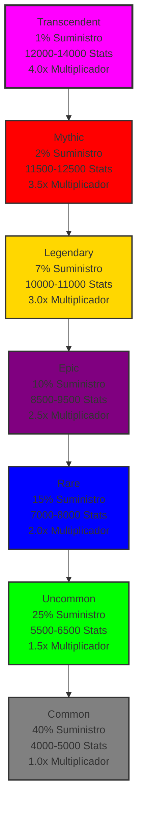
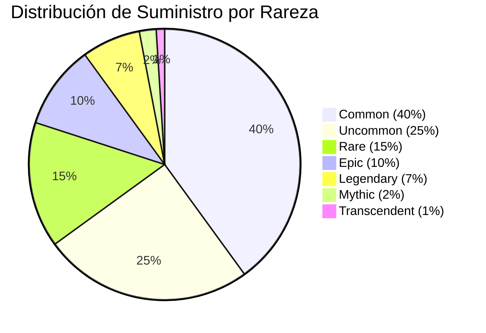

# Documentación del Sistema de Rareza

## Resumen

La colección Protocol Guardians presenta 7 niveles de rareza distintos, cada uno con rangos de stats únicos, distribuciones de suministro y características visuales. El sistema de rareza usa una distribución piramidal donde las rarezas más altas son exponencialmente más valiosas y poderosas.

## Pirámide de Rareza



## Niveles de Rareza

### 1. Common (40% Suministro)
**Color de Fondo**: #808080 (Gris)
**Rango de Stats**: 4000-5000 stats totales
**Multiplicador**: 1.0x
**Características**: Habilidades básicas, stats estándar, gameplay de nivel de entrada

**Ejemplo de Distribución de Stats**:
- Power: 500-750
- Defense: 500-750
- Speed: 500-750
- HP: 500-750
- Luck: 500-750
- Mana: 500-750
- Stamina: 500-750
- Critical: 500-750

**Habilidades**: Solo habilidades universales básicas
**Éxito de Expedición**: 40-60% en misiones Beginner
**Recompensas de Staking**: 10 tokens/hora base

### 2. Uncommon (25% Suministro)
**Color de Fondo**: #00FF00 (Verde)
**Rango de Stats**: 5500-6500 stats totales
**Multiplicador**: 1.5x
**Características**: Stats mejorados, acceso a habilidades intermedias

**Ejemplo de Distribución de Stats**:
- Power: 700-900
- Defense: 700-900
- Speed: 700-900
- HP: 700-900
- Luck: 700-900
- Mana: 700-900
- Stamina: 700-900
- Critical: 700-900

**Habilidades**: Habilidades universales básicas + intermedias
**Éxito de Expedición**: 50-70% en misiones Beginner
**Recompensas de Staking**: 15 tokens/hora base

### 3. Rare (15% Suministro)
**Color de Fondo**: #0000FF (Azul)
**Rango de Stats**: 7000-8000 stats totales
**Multiplicador**: 2.0x
**Características**: Buenos stats, acceso a habilidades avanzadas

**Ejemplo de Distribución de Stats**:
- Power: 900-1100
- Defense: 900-1100
- Speed: 900-1100
- HP: 900-1100
- Luck: 900-1100
- Mana: 900-1100
- Stamina: 900-1100
- Critical: 900-1100

**Habilidades**: Habilidades universales básicas + intermedias + avanzadas
**Éxito de Expedición**: 60-80% en misiones Beginner
**Recompensas de Staking**: 20 tokens/hora base

### 4. Epic (10% Suministro)
**Color de Fondo**: #800080 (Púrpura)
**Rango de Stats**: 8500-9500 stats totales
**Multiplicador**: 2.5x
**Características**: Stats altos, acceso a habilidades elite

**Ejemplo de Distribución de Stats**:
- Power: 1100-1300
- Defense: 1100-1300
- Speed: 1100-1300
- HP: 1100-1300
- Luck: 1100-1300
- Mana: 1100-1300
- Stamina: 1100-1300
- Critical: 1100-1300

**Habilidades**: Habilidades universales + signature de familia
**Éxito de Expedición**: 70-90% en misiones Beginner
**Recompensas de Staking**: 25 tokens/hora base

### 5. Legendary (7% Suministro)
**Color de Fondo**: #FFD700 (Dorado)
**Rango de Stats**: 10000-11000 stats totales
**Multiplicador**: 3.0x
**Características**: Stats muy altos, acceso a habilidades signature poderosas

**Ejemplo de Distribución de Stats**:
- Power: 1300-1500
- Defense: 1300-1500
- Speed: 1300-1500
- HP: 1300-1500
- Luck: 1300-1500
- Mana: 1300-1500
- Stamina: 1300-1500
- Critical: 1300-1500

**Habilidades**: Todas las habilidades universales + signature de familia
**Éxito de Expedición**: 80-95% en misiones Beginner
**Recompensas de Staking**: 30 tokens/hora base

### 6. Mythic (2% Suministro)
**Color de Fondo**: #FF0000 (Rojo)
**Rango de Stats**: 11500-12500 stats totales
**Multiplicador**: 3.5x
**Características**: Stats excepcionales, acceso a habilidades definitivas

**Ejemplo de Distribución de Stats**:
- Power: 1500-1700
- Defense: 1500-1700
- Speed: 1500-1700
- HP: 1500-1700
- Luck: 1500-1700
- Mana: 1500-1700
- Stamina: 1500-1700
- Critical: 1500-1700

**Habilidades**: Todas las habilidades + habilidades definitivas
**Éxito de Expedición**: 90-95% en misiones Beginner
**Recompensas de Staking**: 35 tokens/hora base

### 7. Transcendent (1% Suministro)
**Color de Fondo**: #FF00FF (Arcoíris)
**Rango de Stats**: 12000-14000 stats totales
**Multiplicador**: 4.0x
**Características**: Stats máximos, acceso a todas las habilidades

**Ejemplo de Distribución de Stats**:
- Power: 1700-2000
- Defense: 1700-2000
- Speed: 1700-2000
- HP: 1700-2000
- Luck: 1700-2000
- Mana: 1700-2000
- Stamina: 1700-2000
- Critical: 1700-2000

**Habilidades**: Acceso completo a todas las habilidades
**Éxito de Expedición**: 95%+ en misiones Beginner
**Recompensas de Staking**: 40 tokens/hora base

## Distribución de Suministro

### Distribución Piramidal


### Cálculo de Suministro
```javascript
function calculateSupplyDistribution(totalSupply) {
  return {
    common: Math.floor(totalSupply * 0.40),
    uncommon: Math.floor(totalSupply * 0.25),
    rare: Math.floor(totalSupply * 0.15),
    epic: Math.floor(totalSupply * 0.10),
    legendary: Math.floor(totalSupply * 0.07),
    mythic: Math.floor(totalSupply * 0.02),
    transcendent: Math.floor(totalSupply * 0.01)
  };
}
```

## Escalado de Stats

### Fórmula de Stats por Rareza
```javascript
function generateStatsByRarity(rarity) {
  const rarityConfig = {
    common: { min: 4000, max: 5000, multiplier: 1.0 },
    uncommon: { min: 5500, max: 6500, multiplier: 1.5 },
    rare: { min: 7000, max: 8000, multiplier: 2.0 },
    epic: { min: 8500, max: 9500, multiplier: 2.5 },
    legendary: { min: 10000, max: 11000, multiplier: 3.0 },
    mythic: { min: 11500, max: 12500, multiplier: 3.5 },
    transcendent: { min: 12000, max: 14000, multiplier: 4.0 }
  };
  
  const config = rarityConfig[rarity];
  const totalStats = Math.floor(Math.random() * (config.max - config.min + 1)) + config.min;
  
  return {
    totalStats,
    multiplier: config.multiplier,
    rarity
  };
}
```

### Distribución de Stats Individuales
```javascript
function distributeStats(totalStats, type) {
  const typeProfiles = {
    galactic: { speed: 0.25, mana: 0.20, critical: 0.15, power: 0.10, defense: 0.10, hp: 0.10, luck: 0.05, stamina: 0.05 },
    cosmic: { mana: 0.25, luck: 0.20, critical: 0.15, speed: 0.10, power: 0.10, defense: 0.10, hp: 0.05, stamina: 0.05 },
    celestial: { power: 0.20, mana: 0.20, defense: 0.15, speed: 0.10, hp: 0.10, luck: 0.10, critical: 0.10, stamina: 0.05 },
    mechanical: { defense: 0.25, stamina: 0.20, power: 0.15, speed: 0.10, hp: 0.10, mana: 0.10, luck: 0.05, critical: 0.05 },
    dragon: { power: 0.25, hp: 0.20, defense: 0.15, speed: 0.10, mana: 0.10, stamina: 0.10, luck: 0.05, critical: 0.05 },
    beast: { speed: 0.25, power: 0.20, stamina: 0.15, defense: 0.10, hp: 0.10, mana: 0.10, luck: 0.05, critical: 0.05 },
    elemental: { mana: 0.25, power: 0.20, critical: 0.15, speed: 0.10, defense: 0.10, hp: 0.10, luck: 0.05, stamina: 0.05 },
    chaos: { critical: 0.25, luck: 0.20, power: 0.15, speed: 0.10, defense: 0.10, hp: 0.10, mana: 0.05, stamina: 0.05 }
  };
  
  const profile = typeProfiles[type];
  const stats = {};
  
  Object.keys(profile).forEach(stat => {
    stats[stat] = Math.floor(totalStats * profile[stat]);
  });
  
  return stats;
}
```

## Acceso a Habilidades

### Puertas de Rareza para Habilidades
```javascript
const abilityRarityGates = {
  // Habilidades Universales
  'QUICK STRIKE': 'common',
  'DEFENSIVE STANCE': 'common',
  'LUCKY BREAK': 'common',
  'ENERGY SURGE': 'common',
  'HEALTH BOOST': 'common',
  
  'POWER FOCUS': 'uncommon',
  'CRITICAL EYE': 'uncommon',
  'MANA FLOW': 'uncommon',
  'TEAM SYNERGY': 'uncommon',
  'FORTUNE\'S FAVOR': 'uncommon',
  
  'DIMENSION HOP': 'rare',
  'REALITY ANCHOR': 'rare',
  'STATS OVERDRIVE': 'rare',
  'TIME DILATION': 'rare',
  'QUANTUM LUCK': 'rare',
  
  'COSMIC AWARENESS': 'epic',
  'REALITY BEND': 'epic',
  'STATS TRANSCENDENCE': 'epic',
  'TEMPORAL MASTERY': 'epic',
  'DIMENSIONAL GATE': 'epic',
  
  // Habilidades Signature de Familia
  'GUARDIAN\'S WARD': 'uncommon',
  'PROTECTIVE AURA': 'rare',
  'DIVINE SHIELD': 'epic',
  'SACRED BARRIER': 'legendary',
  'ETERNAL GUARDIAN': 'mythic',
  
  'HUNTER\'S INSTINCT': 'uncommon',
  'PREDATOR\'S FURY': 'rare',
  'PACK TACTICS': 'epic',
  'ALPHA ROAR': 'legendary',
  'PRIMAL RAGE': 'mythic',
  
  'SYSTEM OVERRIDE': 'uncommon',
  'CIRCUIT BREAKER': 'rare',
  'AUTOMATED DEFENSE': 'epic',
  'QUANTUM PROCESSOR': 'legendary',
  'OMEGA PROTOCOL': 'transcendent',
  
  'ELEMENTAL INFUSION': 'uncommon',
  'NATURE\'S WRATH': 'rare',
  'ELEMENTAL CONVERGENCE': 'epic',
  'PRIMAL STORM': 'legendary',
  'WORLD SHAPER': 'transcendent',
  
  'CHAOS SURGE': 'uncommon',
  'REALITY WARP': 'rare',
  'ENTROPY FIELD': 'epic',
  'CHAOS VORTEX': 'legendary',
  'REALITY COLLAPSE': 'transcendent',
  
  'DRAGON\'S FURY': 'uncommon',
  'ANCIENT WISDOM': 'rare',
  'DRAGON\'S BREATH': 'epic',
  'HOARD MASTER': 'legendary',
  'DRAGON LORD': 'transcendent',
  
  'ETERNAL KNOWLEDGE': 'rare',
  'PRIMORDIAL POWER': 'epic',
  'TIME MASTERY': 'legendary',
  'COSMIC AWARENESS': 'mythic',
  'REALITY ARCHITECT': 'transcendent',
  
  'VOID TOUCH': 'rare',
  'ENTROPY DRAIN': 'epic',
  'REALITY ERASURE': 'legendary',
  'VOID MASTER': 'transcendent',
  'NULL EXISTENCE': 'transcendent'
};
```

### Verificación de Acceso a Habilidades
```javascript
function canLearnAbility(guardian, abilityName) {
  const requiredRarity = abilityRarityGates[abilityName];
  const guardianRarity = guardian.rarity;
  
  const rarityLevels = {
    'common': 0,
    'uncommon': 1,
    'rare': 2,
    'epic': 3,
    'legendary': 4,
    'mythic': 5,
    'transcendent': 6
  };
  
  return rarityLevels[guardianRarity] >= rarityLevels[requiredRarity];
}
```

## Multiplicadores de Recompensas

### Escalado de Recompensas por Rareza
```javascript
function calculateRewardMultiplier(rarity) {
  const multipliers = {
    common: 1.0,
    uncommon: 1.5,
    rare: 2.0,
    epic: 2.5,
    legendary: 3.0,
    mythic: 3.5,
    transcendent: 4.0
  };
  
  return multipliers[rarity];
}
```

### Cálculo de Recompensas de Expedición
```javascript
function calculateExpeditionRewards(party, mission) {
  const baseReward = mission.baseReward;
  const averageRarityMultiplier = party.reduce((sum, guardian) => {
    return sum + calculateRewardMultiplier(guardian.rarity);
  }, 0) / party.length;
  
  const difficultyScaling = Math.pow(1.5, mission.difficultyLevel);
  
  return baseReward * averageRarityMultiplier * difficultyScaling;
}
```

### Cálculo de Recompensas de Staking
```javascript
function calculateStakingRewards(guardian, timeStaked) {
  const baseReward = 10; // tokens por hora
  const rarityMultiplier = calculateRewardMultiplier(guardian.rarity);
  const timeMultiplier = timeStaked / 3600; // horas
  
  return baseReward * rarityMultiplier * timeMultiplier;
}
```

## Características Visuales

### Colores de Fondo por Rareza
```javascript
const rarityColors = {
  common: '#808080',      // Gris
  uncommon: '#00FF00',    // Verde
  rare: '#0000FF',         // Azul
  epic: '#800080',         // Púrpura
  legendary: '#FFD700',    // Dorado
  mythic: '#FF0000',       // Rojo
  transcendent: '#FF00FF'  // Arcoíris
};
```

### Efectos Visuales Especiales
- **Common**: Sin efectos especiales
- **Uncommon**: Brillo sutil
- **Rare**: Partículas azules
- **Epic**: Aura púrpura
- **Legendary**: Resplandor dorado
- **Mythic**: Efectos de fuego
- **Transcendent**: Efectos de arcoíris y partículas

## Ejemplos de Implementación

### Ejemplo 1: Generación de Guardian
```javascript
function generateGuardian(type, rarity) {
  const stats = generateStatsByRarity(rarity);
  const distributedStats = distributeStats(stats.totalStats, type);
  const abilities = getAvailableAbilities(rarity, type);
  
  return {
    type,
    rarity,
    stats: distributedStats,
    abilities,
    multiplier: stats.multiplier,
    backgroundColor: rarityColors[rarity]
  };
}
```

### Ejemplo 2: Cálculo de Valor
```javascript
function calculateGuardianValue(guardian) {
  const baseValue = 100; // Valor base en tokens
  const rarityMultiplier = calculateRewardMultiplier(guardian.rarity);
  const statsMultiplier = guardian.stats.total / 10000; // Normalizar stats
  const abilityMultiplier = guardian.abilities.length / 3; // Normalizar habilidades
  
  return baseValue * rarityMultiplier * statsMultiplier * abilityMultiplier;
}
```

### Ejemplo 3: Optimización de Partido
```javascript
function optimizePartyForMission(availableGuardians, mission) {
  // Filtrar Guardians por rareza mínima requerida
  const eligibleGuardians = availableGuardians.filter(guardian => 
    canParticipateInMission(guardian, mission)
  );
  
  // Ordenar por valor total (stats + rareza)
  const sortedGuardians = eligibleGuardians.sort((a, b) => {
    const valueA = calculateGuardianValue(a);
    const valueB = calculateGuardianValue(b);
    return valueB - valueA;
  });
  
  // Seleccionar mejores Guardians para el partido
  return sortedGuardians.slice(0, Math.min(5, mission.maxPartySize));
}
```

## Consideraciones de Balance

### Balance de Distribución
- **40% Common**: Asegura accesibilidad para nuevos jugadores
- **25% Uncommon**: Proporciona progresión natural
- **15% Rare**: Introduce complejidad estratégica
- **10% Epic**: Añade profundidad de gameplay
- **7% Legendary**: Crea objetivos de alto valor
- **2% Mythic**: Proporciona rareza significativa
- **1% Transcendent**: Crea objetos de colección definitivos

### Escalado de Poder
- **Escalado lineal de stats**: Cada nivel de rareza proporciona mejora consistente
- **Escalado exponencial de recompensas**: Mayor rareza = recompensas significativamente mejores
- **Acceso progresivo a habilidades**: Desbloqueo natural de capacidades más poderosas

### Accesibilidad
- **Common es viable**: Los jugadores pueden comenzar con Guardians Common
- **Progresión clara**: Ruta obvia de mejora a través de rarezas
- **Balance de riesgo/recompensa**: Mayor rareza = mayor costo pero mayor beneficio

## Consideraciones Futuras

### Características Planificadas
- **Evolución de Rareza**: Sistema para mejorar Guardians de rareza
- **Fusión de Rareza**: Combinar Guardians para crear rarezas más altas
- **Eventos de Rareza**: Oportunidades especiales para obtener Guardians de alta rareza

### Actualizaciones de Balance
- **Ajuste de stats**: Pueden ajustarse basados en datos de gameplay
- **Revisión de multiplicadores**: Optimización basada en economía del juego
- **Nuevas rarezas**: Adición potencial de niveles de rareza adicionales

---

El sistema de rareza de Protocol Guardians proporciona una progresión clara y balanceada desde Guardians accesibles hasta objetos de colección definitivos, asegurando que cada nivel de rareza tenga valor y propósito en el ecosistema del juego.
