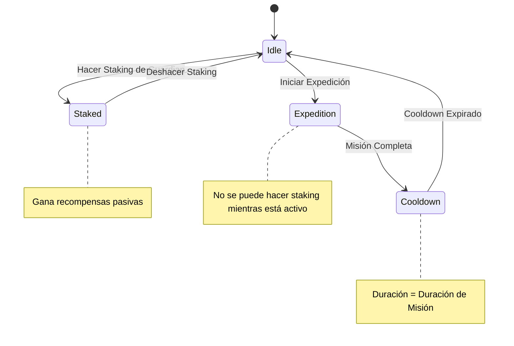

# Documentación del Sistema de Staking

## Resumen

El sistema de staking de Protocol Guardians permite que los Guardians ganen tokens ProtocolPower pasivos cuando no participan en expediciones. El sistema presenta multiplicadores basados en rareza, exclusividad mutua con expediciones e integración con el ecosistema Ethereum más amplio.

## Mecánicas de Staking

### Máquina de Estados



### Exclusividad Mutua

Los Guardians no pueden estar en staking mientras participan en expediciones, y viceversa. Esto crea decisiones estratégicas sobre asignación de recursos:

- **Staking**: Ingresos pasivos, sin riesgo, recompensas más bajas
- **Expediciones**: Ingresos activos, riesgo de fallo, recompensas más altas
- **Cooldown**: Sin ingresos, período de recuperación, planificación estratégica

## Recompensas de Staking

### Fórmula Base
```javascript
function calculateStakingRewards(guardian, timeStaked) {
  const baseReward = 10; // tokens por hora
  const rarityMultiplier = getRarityMultiplier(guardian.rarity);
  const timeMultiplier = timeStaked / 3600; // horas
  
  return baseReward * rarityMultiplier * timeMultiplier;
}
```

### Multiplicadores de Rareza

| Rareza | Multiplicador | Tokens/Hora | Recompensas 24h | Recompensas 7d |
|--------|---------------|-------------|-----------------|----------------|
| Common | 1.0x | 10 | 240 | 1,680 |
| Uncommon | 1.5x | 15 | 360 | 2,520 |
| Rare | 2.0x | 20 | 480 | 3,360 |
| Epic | 2.5x | 25 | 600 | 4,200 |
| Legendary | 3.0x | 30 | 720 | 5,040 |
| Mythic | 3.5x | 35 | 840 | 5,880 |
| Transcendent | 4.0x | 40 | 960 | 6,720 |

### Escalado Basado en Tiempo

Las recompensas de staking escalan linealmente con el tiempo en staking:

```javascript
const timeMultiplier = timeStaked / 3600; // Convertir segundos a horas
const rewards = baseReward * rarityMultiplier * timeMultiplier;
```

**Ejemplos**:
- **1 hora**: Recompensa base × multiplicador de rareza × 1
- **24 horas**: Recompensa base × multiplicador de rareza × 24
- **7 días**: Recompensa base × multiplicador de rareza × 168
- **30 días**: Recompensa base × multiplicador de rareza × 720

## Staking vs. Expediciones

### Comparación Económica

| Estrategia | Riesgo | Tasa de Recompensa | Inversión de Tiempo | Habilidad Requerida |
|------------|--------|-------------------|---------------------|-------------------|
| **Staking** | Ninguno | Baja | Pasiva | Ninguna |
| **Expediciones** | Alto | Alta | Activa | Alta |
| **Mixta** | Medio | Media | Moderada | Media |

### Estrategia Óptima

#### Para Principiantes
- **Enfoque**: Staking para ingresos estables
- **Razonamiento**: Bajo riesgo, recompensas garantizadas
- **Guardians**: Common/Uncommon para aprender

#### Para Jugadores Intermedios
- **Enfoque**: Enfoque mixto
- **Razonamiento**: Balance riesgo y recompensa
- **Guardians**: Rare/Epic para mejores retornos

#### Para Jugadores Avanzados
- **Enfoque**: Expediciones para recompensas máximas
- **Razonamiento**: Alto riesgo, alta recompensa
- **Guardians**: Legendary/Mythic para mejor rendimiento

## Integración de Staking

### Smart Contract Integration

```solidity
// Contrato de Staking
contract ProtocolStaking is ERC721, Ownable {
    struct StakingInfo {
        uint256 tokenId;
        uint256 startTime;
        uint256 lastClaimTime;
        bool isStaked;
    }
    
    mapping(uint256 => StakingInfo) public stakingInfo;
    mapping(address => uint256[]) public userStakedTokens;
    
    // Hacer staking de Guardian
    function stake(uint256 tokenId) external {
        require(ownerOf(tokenId) == msg.sender, "No eres el propietario");
        require(!stakingInfo[tokenId].isStaked, "Ya está en staking");
        require(!isOnExpedition(tokenId), "No se puede hacer staking durante expedición");
        
        stakingInfo[tokenId] = StakingInfo({
            tokenId: tokenId,
            startTime: block.timestamp,
            lastClaimTime: block.timestamp,
            isStaked: true
        });
        
        userStakedTokens[msg.sender].push(tokenId);
        emit Staked(msg.sender, tokenId);
    }
    
    // Deshacer staking de Guardian
    function unstake(uint256 tokenId) external {
        require(stakingInfo[tokenId].isStaked, "No está en staking");
        require(ownerOf(tokenId) == msg.sender, "No eres el propietario");
        
        // Calcular y transferir recompensas
        uint256 rewards = calculatePendingRewards(tokenId);
        if (rewards > 0) {
            protocolPower.transfer(msg.sender, rewards);
        }
        
        stakingInfo[tokenId].isStaked = false;
        removeFromUserStaked(msg.sender, tokenId);
        emit Unstaked(msg.sender, tokenId, rewards);
    }
    
    // Reclamar recompensas sin deshacer staking
    function claimRewards(uint256 tokenId) external {
        require(stakingInfo[tokenId].isStaked, "No está en staking");
        require(ownerOf(tokenId) == msg.sender, "No eres el propietario");
        
        uint256 rewards = calculatePendingRewards(tokenId);
        require(rewards > 0, "Sin recompensas pendientes");
        
        stakingInfo[tokenId].lastClaimTime = block.timestamp;
        protocolPower.transfer(msg.sender, rewards);
        emit RewardsClaimed(msg.sender, tokenId, rewards);
    }
}
```

### Cálculo de Recompensas

```javascript
// Cálculo de recompensas pendientes
function calculatePendingRewards(tokenId) {
  const stakingInfo = getStakingInfo(tokenId);
  const guardian = getGuardian(tokenId);
  
  if (!stakingInfo.isStaked) return 0;
  
  const timeStaked = block.timestamp - stakingInfo.lastClaimTime;
  const baseReward = 10; // tokens por hora
  const rarityMultiplier = getRarityMultiplier(guardian.rarity);
  const timeMultiplier = timeStaked / 3600; // horas
  
  return baseReward * rarityMultiplier * timeMultiplier;
}

// Obtener multiplicador de rareza
function getRarityMultiplier(rarity) {
  const multipliers = {
    'common': 1.0,
    'uncommon': 1.5,
    'rare': 2.0,
    'epic': 2.5,
    'legendary': 3.0,
    'mythic': 3.5,
    'transcendent': 4.0
  };
  
  return multipliers[rarity];
}
```

## Estrategias de Staking

### Estrategia Conservadora
**Enfoque**: Máximo staking, mínimo riesgo
- **Guardians**: Todos los Guardians en staking
- **Ventajas**: Ingresos garantizados, sin riesgo
- **Desventajas**: Recompensas limitadas, sin progresión

### Estrategia Agresiva
**Enfoque**: Máximas expediciones, alto riesgo
- **Guardians**: Todos los Guardians en expediciones
- **Ventajas**: Recompensas potencialmente altas
- **Desventajas**: Alto riesgo de fallo, sin ingresos garantizados

### Estrategia Balanceada
**Enfoque**: Mezcla de staking y expediciones
- **Guardians**: 50% staking, 50% expediciones
- **Ventajas**: Balance de riesgo y recompensa
- **Desventajas**: Requiere gestión activa

### Estrategia de Rotación
**Enfoque**: Rotar Guardians entre staking y expediciones
- **Guardians**: Cambiar entre modos basado en cooldowns
- **Ventajas**: Optimización de ingresos
- **Desventajas**: Requiere planificación compleja

## Optimización de Staking

### Selección de Guardians para Staking
```javascript
function selectGuardiansForStaking(availableGuardians) {
  // Filtrar Guardians disponibles (no en expediciones, no en cooldown)
  const eligibleGuardians = availableGuardians.filter(guardian => 
    !guardian.isOnExpedition && !guardian.isOnCooldown
  );
  
  // Ordenar por valor de staking (rareza + stats)
  const sortedGuardians = eligibleGuardians.sort((a, b) => {
    const valueA = calculateStakingValue(a);
    const valueB = calculateStakingValue(b);
    return valueB - valueA;
  });
  
  return sortedGuardians;
}

// Calcular valor de staking
function calculateStakingValue(guardian) {
  const baseReward = 10;
  const rarityMultiplier = getRarityMultiplier(guardian.rarity);
  const statsBonus = guardian.stats.total / 10000; // Normalizar stats
  
  return baseReward * rarityMultiplier * (1 + statsBonus);
}
```

### Timing de Staking
```javascript
function optimizeStakingTiming(guardian, expeditionSchedule) {
  const nextExpedition = expeditionSchedule.find(exp => 
    exp.party.includes(guardian.id)
  );
  
  if (!nextExpedition) {
    // No hay expediciones planificadas, staking inmediato
    return { action: 'stake', duration: 'indefinite' };
  }
  
  const timeUntilExpedition = nextExpedition.startTime - Date.now();
  const minStakingTime = 3600; // 1 hora mínima
  
  if (timeUntilExpedition > minStakingTime) {
    // Tiempo suficiente para staking rentable
    return { 
      action: 'stake', 
      duration: timeUntilExpedition - 300 // 5 minutos de buffer
    };
  } else {
    // No hay tiempo suficiente, mantener disponible
    return { action: 'wait', duration: timeUntilExpedition };
  }
}
```

## Integración con Expediciones

### Gestión de Recursos
```javascript
function manageResourceAllocation(guardians, strategy) {
  const totalGuardians = guardians.length;
  const stakingRatio = strategy.stakingRatio || 0.5;
  const expeditionRatio = 1 - stakingRatio;
  
  const stakingGuardians = Math.floor(totalGuardians * stakingRatio);
  const expeditionGuardians = totalGuardians - stakingGuardians;
  
  return {
    staking: guardians.slice(0, stakingGuardians),
    expeditions: guardians.slice(stakingGuardians),
    strategy: strategy
  };
}
```

### Sincronización de Estados
```javascript
function syncGuardianStates(guardians) {
  guardians.forEach(guardian => {
    if (guardian.isStaked && guardian.isOnExpedition) {
      // Estado inválido: no puede estar en ambos
      console.error(`Guardian ${guardian.id} en estado inválido`);
      // Resolver automáticamente: priorizar expedición
      guardian.isStaked = false;
    }
  });
}
```

## Consideraciones Económicas

### Análisis de Rentabilidad
```javascript
function analyzeStakingProfitability(guardian, timeHorizon) {
  const stakingRewards = calculateStakingRewards(guardian, timeHorizon);
  const expeditionRewards = calculateExpeditionRewards(guardian, timeHorizon);
  
  return {
    staking: stakingRewards,
    expeditions: expeditionRewards,
    difference: expeditionRewards - stakingRewards,
    recommendation: expeditionRewards > stakingRewards ? 'expeditions' : 'staking'
  };
}
```

### Optimización de Portfolio
```javascript
function optimizePortfolio(guardians, riskTolerance) {
  const sortedGuardians = guardians.sort((a, b) => {
    const valueA = calculateTotalValue(a);
    const valueB = calculateTotalValue(b);
    return valueB - valueA;
  });
  
  const highValueGuardians = sortedGuardians.slice(0, Math.floor(guardians.length * 0.3));
  const mediumValueGuardians = sortedGuardians.slice(
    Math.floor(guardians.length * 0.3), 
    Math.floor(guardians.length * 0.7)
  );
  const lowValueGuardians = sortedGuardians.slice(Math.floor(guardians.length * 0.7));
  
  return {
    staking: riskTolerance === 'low' ? highValueGuardians : lowValueGuardians,
    expeditions: riskTolerance === 'high' ? highValueGuardians : mediumValueGuardians,
    reserve: riskTolerance === 'medium' ? highValueGuardians : []
  };
}
```

## Ejemplos de Implementación

### Ejemplo 1: Staking Básico
```javascript
// Hacer staking de Guardian
async function stakeGuardian(tokenId) {
  try {
    const tx = await stakingContract.stake(tokenId);
    await tx.wait();
    console.log(`Guardian ${tokenId} puesto en staking`);
  } catch (error) {
    console.error('Error haciendo staking:', error);
  }
}

// Reclamar recompensas
async function claimRewards(tokenId) {
  try {
    const tx = await stakingContract.claimRewards(tokenId);
    await tx.wait();
    console.log(`Recompensas reclamadas para Guardian ${tokenId}`);
  } catch (error) {
    console.error('Error reclamando recompensas:', error);
  }
}
```

### Ejemplo 2: Optimización Automática
```javascript
// Optimizador automático de staking
class StakingOptimizer {
  constructor(guardians, strategy) {
    this.guardians = guardians;
    this.strategy = strategy;
  }
  
  optimize() {
    const eligibleGuardians = this.guardians.filter(guardian => 
      !guardian.isOnExpedition && !guardian.isOnCooldown
    );
    
    const stakingGuardians = this.selectBestForStaking(eligibleGuardians);
    const expeditionGuardians = this.selectBestForExpeditions(eligibleGuardians);
    
    return {
      staking: stakingGuardians,
      expeditions: expeditionGuardians,
      strategy: this.strategy
    };
  }
  
  selectBestForStaking(guardians) {
    return guardians
      .sort((a, b) => this.calculateStakingValue(b) - this.calculateStakingValue(a))
      .slice(0, Math.floor(guardians.length * this.strategy.stakingRatio));
  }
  
  calculateStakingValue(guardian) {
    const baseReward = 10;
    const rarityMultiplier = this.getRarityMultiplier(guardian.rarity);
    const statsBonus = guardian.stats.total / 10000;
    
    return baseReward * rarityMultiplier * (1 + statsBonus);
  }
}
```

### Ejemplo 3: Análisis de Rendimiento
```javascript
// Analizador de rendimiento de staking
class StakingAnalyzer {
  constructor(guardians, timeHorizon) {
    this.guardians = guardians;
    this.timeHorizon = timeHorizon;
  }
  
  analyze() {
    const results = this.guardians.map(guardian => ({
      id: guardian.id,
      rarity: guardian.rarity,
      stakingRewards: this.calculateStakingRewards(guardian),
      expeditionRewards: this.calculateExpeditionRewards(guardian),
      recommendation: this.getRecommendation(guardian)
    }));
    
    return {
      totalStakingRewards: results.reduce((sum, r) => sum + r.stakingRewards, 0),
      totalExpeditionRewards: results.reduce((sum, r) => sum + r.expeditionRewards, 0),
      recommendations: results
    };
  }
  
  getRecommendation(guardian) {
    const stakingRewards = this.calculateStakingRewards(guardian);
    const expeditionRewards = this.calculateExpeditionRewards(guardian);
    
    if (expeditionRewards > stakingRewards * 1.5) {
      return 'expeditions';
    } else if (stakingRewards > expeditionRewards * 1.2) {
      return 'staking';
    } else {
      return 'mixed';
    }
  }
}
```

## Consideraciones de Balance

### Balance Económico
- **Staking estable**: Proporciona ingresos garantizados
- **Expediciones arriesgadas**: Ofrecen recompensas potencialmente altas
- **Exclusividad mutua**: Fomenta decisiones estratégicas

### Accesibilidad
- **Principiantes**: Pueden comenzar con staking
- **Avanzados**: Pueden optimizar para expediciones
- **Balanceado**: Mezcla de ambas estrategias

### Sostenibilidad
- **Emisión controlada**: Recompensas balanceadas con suministro
- **Escalado apropiado**: Multiplicadores de rareza justos
- **Integración ecosistema**: Parte del ecosistema Ethereum

## Consideraciones Futuras

### Características Planificadas
- **Staking de Guild**: Staking colaborativo
- **Bonificaciones de tiempo**: Recompensas por staking a largo plazo
- **Staking de habilidades**: Usar habilidades para mejorar staking

### Actualizaciones de Balance
- **Multiplicadores**: Pueden ajustarse basados en datos
- **Tasas de recompensa**: Optimización basada en economía
- **Nuevas mecánicas**: Adición de características de staking

---

El sistema de staking de Protocol Guardians proporciona una forma accesible y rentable de ganar recompensas pasivas mientras mantiene balance con el sistema de expediciones, creando decisiones estratégicas significativas para los jugadores.
