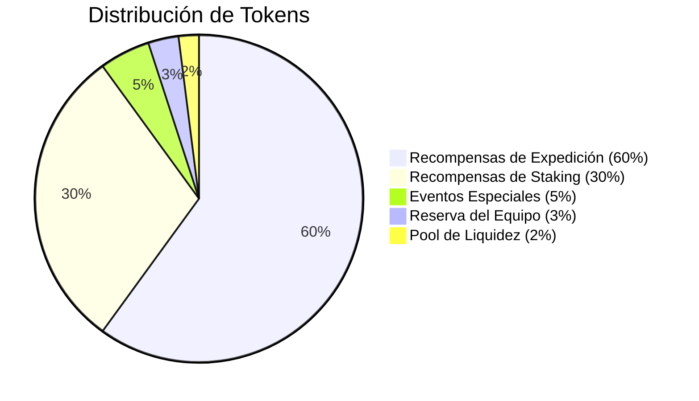

# Documentación de Tokenomics

## Resumen

El ecosistema Protocol Guardians está impulsado por el token ProtocolPower (POWER), un token ERC20 construido en Ethereum. Las tokenomics están diseñadas para sostenibilidad a largo plazo, apreciación de valor y crecimiento de la comunidad mientras mantienen accesibilidad para todos los jugadores.

## Distribución de Tokens

### Suministro Total
**1,000,000,000 tokens CR** (1 mil millones de tokens)

### Desglose de Distribución



### Asignación Detallada

| Categoría | Porcentaje | Tokens | Propósito |
|-----------|------------|--------|-----------|
| **Recompensas de Expedición** | 60% | 600,000,000 | Recompensas por expediciones exitosas |
| **Recompensas de Staking** | 30% | 300,000,000 | Ingresos pasivos para Guardians en staking |
| **Eventos Especiales** | 5% | 50,000,000 | Eventos de comunidad, torneos, airdrops |
| **Reserva del Equipo** | 3% | 30,000,000 | Compensación del equipo, desarrollo |
| **Pool de Liquidez** | 2% | 20,000,000 | Liquidez inicial y market making |

## Cronograma de Emisión

### Recompensas de Staking (30% - 300M tokens)

#### Tasa de Emisión
- **Año 1**: 50% del pool de staking (150M tokens)
- **Año 2**: 30% del pool de staking (90M tokens)
- **Año 3**: 15% del pool de staking (45M tokens)
- **Año 4+**: 5% del pool de staking (15M tokens)

#### Emisión Diaria
```javascript
function calculateDailyStakingEmission(year) {
  const yearlyRates = {
    1: 0.50,  // 50% en año 1
    2: 0.30,  // 30% en año 2
    3: 0.15,  // 15% en año 3
    4: 0.05   // 5% en año 4+
  };
  
  const totalStakingPool = 300000000; // 300M tokens
  const yearlyRate = yearlyRates[year] || 0.05;
  const yearlyEmission = totalStakingPool * yearlyRate;
  
  return yearlyEmission / 365; // Emisión diaria
}
```

#### Cálculos de APY
- **Año 1**: ~50% APY (recompensas iniciales altas)
- **Año 2**: ~30% APY (recompensas moderadas)
- **Año 3**: ~15% APY (recompensas sostenibles)
- **Año 4+**: ~5% APY (sostenibilidad a largo plazo)

### Recompensas de Expedición (60% - 600M tokens)

#### Tasa de Emisión
- **Año 1**: 40% del pool de expedición (240M tokens)
- **Año 2**: 30% del pool de expedición (180M tokens)
- **Año 3**: 20% del pool de expedición (120M tokens)
- **Año 4+**: 10% del pool de expedición (60M tokens)

#### Distribución Basada en Dificultad
```javascript
function calculateExpeditionRewards(difficulty, successRate) {
  const baseRewards = {
    'Beginner': 50,
    'Novice': 150,
    'Adept': 400,
    'Expert': 1000,
    'Master': 3000
  };
  
  const baseReward = baseRewards[difficulty];
  const adjustedReward = baseReward * successRate;
  
  return adjustedReward;
}
```

#### Emisión Diaria de Expedición
```javascript
function calculateDailyExpeditionEmission(year) {
  const yearlyRates = {
    1: 0.40,  // 40% en año 1
    2: 0.30,  // 30% en año 2
    3: 0.20,  // 20% en año 3
    4: 0.10   // 10% en año 4+
  };
  
  const totalExpeditionPool = 600000000; // 600M tokens
  const yearlyRate = yearlyRates[year] || 0.10;
  const yearlyEmission = totalExpeditionPool * yearlyRate;
  
  return yearlyEmission / 365; // Emisión diaria
}
```

## Mecánicas de Recompensas

### Recompensas de Staking

#### Fórmula Base
```javascript
function calculateStakingRewards(guardian, timeStaked) {
  const baseReward = 10; // tokens por hora
  const rarityMultiplier = getRarityMultiplier(guardian.rarity);
  const timeMultiplier = timeStaked / 3600; // horas
  
  return baseReward * rarityMultiplier * timeMultiplier;
}
```

#### Multiplicadores por Rareza
| Rareza | Multiplicador | Tokens/Hora | Recompensas 24h | Recompensas 7d |
|--------|---------------|-------------|-----------------|----------------|
| Common | 1.0x | 10 | 240 | 1,680 |
| Uncommon | 1.5x | 15 | 360 | 2,520 |
| Rare | 2.0x | 20 | 480 | 3,360 |
| Epic | 2.5x | 25 | 600 | 4,200 |
| Legendary | 3.0x | 30 | 720 | 5,040 |
| Mythic | 3.5x | 35 | 840 | 5,880 |
| Transcendent | 4.0x | 40 | 960 | 6,720 |

### Recompensas de Expedición

#### Fórmula de Recompensas
```javascript
function calculateExpeditionRewards(party, mission) {
  const baseReward = mission.baseReward;
  const rarityMultiplier = party.averageRarityMultiplier;
  const difficultyScaling = baseReward * Math.pow(1.5, mission.difficultyLevel);
  
  return baseReward * rarityMultiplier * difficultyScaling;
}
```

#### Escalado de Dificultad
| Nivel | Recompensa Base | Escalado | Recompensa Final |
|-------|-----------------|----------|------------------|
| Beginner | 50 tokens | 1.0x | 50 tokens |
| Novice | 150 tokens | 1.5x | 225 tokens |
| Adept | 400 tokens | 2.25x | 900 tokens |
| Expert | 1,000 tokens | 3.375x | 3,375 tokens |
| Master | 3,000 tokens | 5.0625x | 15,187.5 tokens |

## Modelo Económico

### Sostenibilidad a Largo Plazo

#### Reducción de Emisión
```javascript
function calculateEmissionReduction(year) {
  const reductionRates = {
    1: 1.0,   // 100% emisión en año 1
    2: 0.8,   // 80% emisión en año 2
    3: 0.6,   // 60% emisión en año 3
    4: 0.4,   // 40% emisión en año 4
    5: 0.2    // 20% emisión en año 5+
  };
  
  return reductionRates[year] || 0.2;
}
```

#### Mecanismos de Quema
- **Quema de Transacciones**: 1% de cada transacción se quema
- **Quema de Eventos**: Tokens no reclamados se queman
- **Quema de Equilibrio**: Quema automática para mantener estabilidad

### Optimizaciones de Gas
```solidity
// Optimización de gas para Ethereum
contract ProtocolPower is ERC20 {
    uint256 public constant BURN_RATE = 100; // 1% (100/10000)
    
    function _transfer(address from, address to, uint256 amount) internal override {
        uint256 burnAmount = amount * BURN_RATE / 10000;
        uint256 transferAmount = amount - burnAmount;
        
        if (burnAmount > 0) {
            _burn(from, burnAmount);
        }
        
        super._transfer(from, to, transferAmount);
    }
}
```

## Análisis de Valor

### Factores de Valor

#### Utilidad del Token
- **Recompensas de Staking**: Ingresos pasivos
- **Recompensas de Expedición**: Ingresos activos
- **Eventos Especiales**: Participación en comunidad
- **Governance**: Derechos de voto (futuro)

#### Escasez
- **Suministro Fijo**: 1 mil millones de tokens
- **Emisión Reducida**: Disminuye con el tiempo
- **Quema de Tokens**: Reducción del suministro
- **Adopción**: Aumento de la demanda

### Proyecciones de Valor

#### Escenario Conservador
- **Año 1**: $0.01 por token
- **Año 2**: $0.05 por token
- **Año 3**: $0.10 por token
- **Año 5**: $0.25 por token

#### Escenario Optimista
- **Año 1**: $0.05 por token
- **Año 2**: $0.20 por token
- **Año 3**: $0.50 por token
- **Año 5**: $1.00 por token

## Estrategias de Inversión

### Para Principiantes
- **Enfoque**: Staking para ingresos estables
- **Estrategia**: Comprar Guardians Common/Uncommon
- **Objetivo**: Ingresos pasivos consistentes

### Para Jugadores Intermedios
- **Enfoque**: Mezcla de staking y expediciones
- **Estrategia**: Diversificar portfolio de Guardians
- **Objetivo**: Balance de riesgo y recompensa

### Para Jugadores Avanzados
- **Enfoque**: Optimización de expediciones
- **Estrategia**: Guardians de alta rareza
- **Objetivo**: Recompensas máximas

## Consideraciones de Riesgo

### Riesgos del Proyecto
- **Adopción**: Dependencia de la adopción de la comunidad
- **Competencia**: Otros proyectos NFT similares
- **Regulación**: Cambios en regulación crypto
- **Tecnología**: Riesgos de smart contract

### Mitigación de Riesgos
- **Auditoría**: Contratos auditados por firmas reconocidas
- **Seguridad**: Múltiples capas de seguridad
- **Transparencia**: Desarrollo abierto y transparente
- **Comunidad**: Fuerte comunidad y soporte

## Roadmap de Desarrollo

### Fase 1: Lanzamiento (Q1 2024)
- **Deploy de Contratos**: Contratos principales
- **Lanzamiento de Colección**: Mint de Guardians
- **Sistema de Staking**: Recompensas pasivas
- **Sistema de Expediciones**: Recompensas activas

### Fase 2: Expansión (Q2-Q3 2024)
- **Eventos Especiales**: Torneos y competencias
- **Nuevas Características**: Habilidades adicionales
- **Integración de Marketplace**: OpenSea y otros
- **App Móvil**: Aplicación móvil nativa

### Fase 3: Ecosistema (Q4 2024)
- **Sistema PvP**: Combate directo
- **Sistema de Guild**: Características colaborativas
- **Governance**: DAO y votación
- **Cross-Chain**: Integración con otras redes

## Consideraciones Técnicas

### Implementación de Contratos
```solidity
// Contrato principal de ProtocolPower
contract ProtocolPower is ERC20, Ownable {
    uint256 public constant MAX_SUPPLY = 1000000000 * 10**18; // 1B tokens
    uint256 public constant STAKING_POOL = 300000000 * 10**18; // 300M tokens
    uint256 public constant EXPEDITION_POOL = 600000000 * 10**18; // 600M tokens
    
    mapping(address => uint256) public stakingRewards;
    mapping(address => uint256) public expeditionRewards;
    
    function mintStakingRewards(address to, uint256 amount) external onlyOwner {
        require(totalSupply() + amount <= MAX_SUPPLY, "Suministro máximo excedido");
        _mint(to, amount);
    }
    
    function mintExpeditionRewards(address to, uint256 amount) external onlyOwner {
        require(totalSupply() + amount <= MAX_SUPPLY, "Suministro máximo excedido");
        _mint(to, amount);
    }
}
```

### Optimización de Gas
```solidity
// Optimización para Ethereum
contract GasOptimizedProtocolPower is ERC20 {
    // Usar eventos en lugar de storage para datos no críticos
    event StakingRewardClaimed(address indexed user, uint256 amount);
    event ExpeditionRewardClaimed(address indexed user, uint256 amount);
    
    // Batch operations para múltiples recompensas
    function claimMultipleRewards(address[] memory users, uint256[] memory amounts) external {
        require(users.length == amounts.length, "Arrays de longitud diferente");
        
        for (uint256 i = 0; i < users.length; i++) {
            _mint(users[i], amounts[i]);
        }
    }
}
```

## Consideraciones Futuras

### Características Planificadas
- **Governance Token**: Derechos de voto para holders
- **Staking de Tokens**: Staking de CR tokens
- **Burning Mechanisms**: Quema de tokens para escasez
- **Cross-Chain**: Integración con otras redes

### Actualizaciones de Balance
- **Tasas de Emisión**: Ajuste basado en datos
- **Mecanismos de Quema**: Optimización de escasez
- **Nuevas Utilidades**: Adición de casos de uso

---

Las tokenomics de Protocol Guardians están diseñadas para crear un ecosistema sostenible y valioso que beneficie a todos los participantes mientras mantiene la accesibilidad y el crecimiento a largo plazo en Ethereum.
