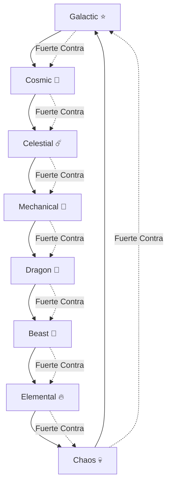

# Documentación del Sistema de Tipos

## Resumen

La colección Protocol Guardians presenta 8 tipos distintos, cada uno con características únicas, distribuciones de stats y ventajas estratégicas. El sistema de tipos usa un patrón circular de ventajas donde cada tipo es fuerte contra un tipo y débil contra otro.

## Rueda de Tipos



## Perfiles de Tipos

### 1. Galactic ⭐
**Tema**: Velocidad y destreza mágica, manipulación de energía cósmica
**Lore**: Nacidas de las profundidades primordiales de Ethereum, estas entidades canalizan la energía cruda de redes blockchain interplanetarias.

**Distribución de Stats**:
- **Speed**: 25% (Primario)
- **Mana**: 20% (Primario)
- **Critical**: 15% (Primario)
- **Power**: 15% (Secundario)
- **Defense**: 10% (Secundario)
- **HP**: 8% (Secundario)
- **Luck**: 5% (Secundario)
- **Stamina**: 2% (Secundario)

**Fortalezas**: Rápidas, dotadas mágicamente, alto potencial de golpe crítico
**Debilidades**: HP y Stamina bajos, vulnerables a ataques sostenidos
**Mejor Para**: Expediciones rápidas, habilidades mágicas, estrategias de golpe crítico

### 2. Cosmic 🌌
**Tema**: Conocimiento místico y manipulación dimensional
**Lore**: Maestros de probabilidad e incertidumbre cuántica, estas entidades manipulan el tejido mismo de la realidad digital.

**Distribución de Stats**:
- **Mana**: 30% (Primario)
- **Luck**: 20% (Primario)
- **Critical**: 15% (Primario)
- **Speed**: 15% (Secundario)
- **Power**: 10% (Secundario)
- **Defense**: 5% (Secundario)
- **HP**: 3% (Secundario)
- **Stamina**: 2% (Secundario)

**Fortalezas**: Alto poder mágico, habilidades basadas en suerte, manipulación de probabilidad
**Debilidades**: Stats físicos bajos, vulnerables a ataques directos
**Mejor Para**: Estrategias basadas en suerte, habilidades mágicas, manipulación de probabilidad

### 3. Celestial ☄️
**Tema**: Poder divino y energía celestial
**Lore**: Mensajeros divinos de Ethereum, estas entidades llevan la sabiduría de la visión original de Ethereum.

**Distribución de Stats**:
- **Power**: 25% (Primario)
- **Mana**: 20% (Primario)
- **Defense**: 15% (Primario)
- **Speed**: 15% (Secundario)
- **HP**: 10% (Secundario)
- **Critical**: 8% (Secundario)
- **Luck**: 5% (Secundario)
- **Stamina**: 2% (Secundario)

**Fortalezas**: Poder y magia balanceados, buena defensa, habilidades divinas
**Debilidades**: Velocidad promedio, resistencia física limitada
**Mejor Para**: Estrategias balanceadas, habilidades divinas, juego defensivo

### 4. Mechanical 🤖
**Tema**: Precisión tecnológica y eficiencia sistemática
**Lore**: Entidades de precisión ingeniería nacidas de la infraestructura de smart contracts de Ethereum, operando con precisión matemática.

**Distribución de Stats**:
- **Defense**: 25% (Primario)
- **Stamina**: 20% (Primario)
- **Power**: 15% (Primario)
- **Speed**: 15% (Secundario)
- **HP**: 10% (Secundario)
- **Critical**: 8% (Secundario)
- **Mana**: 5% (Secundario)
- **Luck**: 2% (Secundario)

**Fortalezas**: Alta defensa, excelente stamina, enfoque sistemático
**Debilidades**: Habilidades mágicas limitadas, baja suerte
**Mejor Para**: Estrategias defensivas, resistencia, enfoque sistemático

### 5. Dragon 🐉
**Tema**: Poder crudo y sabiduría ancestral
**Lore**: Guardianes ancestrales de tesoros digitales, estos Guardians han acumulado vasta riqueza de conocimiento y poder a través de eones de evolución blockchain.

**Distribución de Stats**:
- **Power**: 30% (Primario)
- **HP**: 25% (Primario)
- **Defense**: 15% (Primario)
- **Speed**: 10% (Secundario)
- **Critical**: 8% (Secundario)
- **Mana**: 5% (Secundario)
- **Luck**: 4% (Secundario)
- **Stamina**: 3% (Secundario)

**Fortalezas**: Poder devastador, pools masivos de HP, resistencia
**Debilidades**: Velocidad lenta, versatilidad mágica limitada
**Mejor Para**: Estrategias de poder, tanque, fuerza bruta

### 6. Beast 🦁
**Tema**: Instintos naturales y destreza física
**Lore**: Cazadores salvajes que rastrean las oportunidades más rentables en el ecosistema Ethereum, confiando en sus instintos sobre análisis complejo.

**Distribución de Stats**:
- **Speed**: 25% (Primario)
- **Power**: 20% (Primario)
- **Stamina**: 20% (Primario)
- **HP**: 15% (Secundario)
- **Critical**: 10% (Secundario)
- **Defense**: 5% (Secundario)
- **Luck**: 3% (Secundario)
- **Mana**: 2% (Secundario)

**Fortalezas**: Velocidad alta, buena resistencia, instintos naturales
**Debilidades**: Defensa baja, habilidades mágicas limitadas
**Mejor Para**: Estrategias de velocidad, resistencia, enfoque físico

### 7. Elemental 🔥
**Tema**: Maestría elemental y control ambiental
**Lore**: Maestros de sus elementos digitales elegidos, estos Guardians canalizan el poder crudo de protocolos blockchain específicos.

**Distribución de Stats**:
- **Mana**: 25% (Primario)
- **Power**: 20% (Primario)
- **Critical**: 15% (Primario)
- **Speed**: 15% (Secundario)
- **Defense**: 10% (Secundario)
- **HP**: 8% (Secundario)
- **Luck**: 5% (Secundario)
- **Stamina**: 2% (Secundario)

**Fortalezas**: Alto poder mágico, control elemental, potencial crítico
**Debilidades**: HP bajo, resistencia física limitada
**Mejor Para**: Estrategias mágicas, control elemental, daño crítico

### 8. Chaos 💀
**Tema**: Poder impredecible y potencial destructivo
**Lore**: Entidades impredecibles que prosperan en la volatilidad e incertidumbre de los mercados crypto, encontrando oportunidad en el caos.

**Distribución de Stats**:
- **Critical**: 30% (Primario)
- **Luck**: 20% (Primario)
- **Power**: 15% (Primario)
- **Speed**: 15% (Secundario)
- **Mana**: 10% (Secundario)
- **HP**: 5% (Secundario)
- **Defense**: 3% (Secundario)
- **Stamina**: 2% (Secundario)

**Fortalezas**: Tasas críticas extremas, habilidades basadas en suerte, impredecibilidad
**Debilidades**: Defensa muy baja, HP limitado, inconsistencia
**Mejor Para**: Estrategias de alto riesgo, golpes críticos, juego impredecible

## Sistema de Ventajas Circulares

### Matriz de Efectividad

| Atacante | Galactic | Cosmic | Celestial | Mechanical | Dragon | Beast | Elemental | Chaos |
|----------|----------|--------|-----------|------------|--------|-------|-----------|-------|
| **Galactic** | 100% | 115% | 85% | 100% | 100% | 100% | 100% | 100% |
| **Cosmic** | 85% | 100% | 115% | 100% | 100% | 100% | 100% | 100% |
| **Celestial** | 100% | 85% | 100% | 115% | 100% | 100% | 100% | 100% |
| **Mechanical** | 100% | 100% | 85% | 100% | 115% | 100% | 100% | 100% |
| **Dragon** | 100% | 100% | 100% | 85% | 100% | 115% | 100% | 100% |
| **Beast** | 100% | 100% | 100% | 100% | 85% | 100% | 115% | 100% |
| **Elemental** | 100% | 100% | 100% | 100% | 100% | 85% | 100% | 115% |
| **Chaos** | 115% | 100% | 100% | 100% | 100% | 100% | 85% | 100% |

### Fórmula de Ventaja de Tipo
```javascript
function calculateTypeAdvantage(attackerType, defenderType) {
  const advantageMap = {
    'Galactic': 'Cosmic',
    'Cosmic': 'Celestial',
    'Celestial': 'Mechanical',
    'Mechanical': 'Dragon',
    'Dragon': 'Beast',
    'Beast': 'Elemental',
    'Elemental': 'Chaos',
    'Chaos': 'Galactic'
  };
  
  if (advantageMap[attackerType] === defenderType) {
    return 1.15; // 15% ventaja
  } else if (advantageMap[defenderType] === attackerType) {
    return 0.85; // 15% desventaja
  } else {
    return 1.0; // Neutral
  }
}
```

## Estrategias por Tipo

### Estrategias de Galactic
- **Enfoque**: Velocidad y magia
- **Tácticas**: Ataques rápidos, habilidades mágicas
- **Composición**: 3x Galactic + 2x Cosmic
- **Ventajas**: Iniciativa, golpes críticos, versatilidad mágica

### Estrategias de Cosmic
- **Enfoque**: Manipulación de probabilidad
- **Tácticas**: Habilidades basadas en suerte, control de realidad
- **Composición**: 2x Cosmic + 2x Celestial + 1x Galactic
- **Ventajas**: Control de probabilidad, habilidades únicas

### Estrategias de Celestial
- **Enfoque**: Poder divino balanceado
- **Tácticas**: Habilidades divinas, defensa sólida
- **Composición**: 2x Celestial + 2x Mechanical + 1x Dragon
- **Ventajas**: Balance, versatilidad, habilidades divinas

### Estrategias de Mechanical
- **Enfoque**: Eficiencia sistemática
- **Tácticas**: Defensa sólida, resistencia, precisión
- **Composición**: 3x Mechanical + 2x Dragon
- **Ventajas**: Resistencia, defensa, enfoque sistemático

### Estrategias de Dragon
- **Enfoque**: Poder crudo y resistencia
- **Tácticas**: Fuerza bruta, tanque, poder devastador
- **Composición**: 2x Dragon + 2x Beast + 1x Elemental
- **Ventajas**: Poder máximo, resistencia, tanque

### Estrategias de Beast
- **Enfoque**: Velocidad y instinto
- **Tácticas**: Ataques rápidos, resistencia, instintos naturales
- **Composición**: 3x Beast + 2x Elemental
- **Ventajas**: Velocidad, resistencia, instintos

### Estrategias de Elemental
- **Enfoque**: Maestría elemental
- **Tácticas**: Control elemental, daño mágico, golpes críticos
- **Composición**: 2x Elemental + 2x Chaos + 1x Galactic
- **Ventajas**: Control elemental, daño mágico, versatilidad

### Estrategias de Chaos
- **Enfoque**: Impredecibilidad y alto riesgo
- **Tácticas**: Golpes críticos, habilidades basadas en suerte
- **Composición**: 2x Chaos + 2x Galactic + 1x Cosmic
- **Ventajas**: Golpes críticos, impredecibilidad, alto riesgo/recompensa

## Composición de Partidos Óptimos

### Partidos Balanceados
- **Composición**: 1x de cada tipo
- **Ventajas**: Cobertura de ventaja de tipo, versatilidad
- **Desventajas**: Sin bonificaciones de sinergia de tipo
- **Mejor Para**: Principiantes, aprendizaje del sistema

### Partidos de Sinergia de Tipo
- **Composición**: 3-4 del mismo tipo + 1-2 otros
- **Ventajas**: Bonificaciones de sinergia de tipo, estrategia enfocada
- **Desventajas**: Vulnerable a desventajas de tipo
- **Mejor Para**: Jugadores experimentados, estrategias específicas

### Partidos de Contra-Estrategia
- **Composición**: Tipos elegidos para contrarrestar tipos de misión específicos
- **Ventajas**: Máxima ventaja de tipo
- **Desventajas**: Versatilidad limitada
- **Mejor Para**: Jugadores avanzados, optimización específica de misión

## Ejemplos de Implementación

### Ejemplo 1: Cálculo de Ventaja de Tipo
```javascript
// Partido: 3x Galactic, 2x Cosmic
// Misión: Tipo Cosmic
const party = {
  types: ['Galactic', 'Galactic', 'Galactic', 'Cosmic', 'Cosmic'],
  missionType: 'Cosmic'
};

const typeAdvantage = calculateTypeAdvantage('Galactic', 'Cosmic'); // 1.15
const partyAdvantage = party.types.filter(type => 
  calculateTypeAdvantage(type, party.missionType) > 1.0
).length / party.types.length; // 0.6 (60% del partido tiene ventaja)

const finalAdvantage = 1.0 + (partyAdvantage * 0.15); // 1.09 (9% bonus)
```

### Ejemplo 2: Optimización de Partido
```javascript
// Misión: Tipo Dragon, requiere alta Power y HP
// Partido recomendado: 2x Dragon + 2x Beast + 1x Elemental

const recommendedParty = [
  { type: 'Dragon', stats: { power: 3000, hp: 2500 } },
  { type: 'Dragon', stats: { power: 2800, hp: 2400 } },
  { type: 'Beast', stats: { power: 2000, speed: 2500 } },
  { type: 'Beast', stats: { power: 1900, speed: 2300 } },
  { type: 'Elemental', stats: { power: 1800, mana: 2000 } }
];

// Este partido proporciona:
// - Alta Power (ventaja Dragon)
// - Ventaja de tipo (Beast > Dragon)
// - Stats balanceados para requerimientos de misión
// - Bonificaciones de sinergia para tipos iguales
```

### Ejemplo 3: Análisis de Composición
```javascript
function analyzePartyComposition(party) {
  const typeCounts = {};
  party.forEach(guardian => {
    typeCounts[guardian.type] = (typeCounts[guardian.type] || 0) + 1;
  });
  
  const maxTypeCount = Math.max(...Object.values(typeCounts));
  const totalGuardians = party.length;
  const typeSynergy = (maxTypeCount / totalGuardians) * 5; // 5% por 100% mismo tipo
  
  return {
    typeDistribution: typeCounts,
    typeSynergy: typeSynergy,
    diversity: Object.keys(typeCounts).length,
    recommendation: typeSynergy > 3 ? 'Enfoque de tipo' : 'Diversificación'
  };
}
```

## Consideraciones de Balance

### Balance de Tipos
- **Ningún tipo domina**: Cada tipo tiene fortalezas y debilidades claras
- **Ventajas circulares**: Sistema de ventajas balanceado
- **Stats únicos**: Cada tipo tiene perfil de stats distintivo

### Profundidad Estratégica
- **La composición del partido importa**: Diferentes tipos sobresalen en diferentes contextos
- **Ventajas de tipo**: Decisiones significativas para selección de partido
- **Sinergia de tipo**: Bonificaciones para enfoques enfocados

### Accesibilidad
- **Todos los tipos son viables**: Ningún tipo es completamente inútil
- **Fortalezas y debilidades claras**: Fácil entender las implicaciones estratégicas
- **Progresión natural**: Ruta clara de mejora a través de tipos

## Consideraciones Futuras

### Características Planificadas
- **Evolución de Tipo**: Los Guardians pueden evolucionar entre tipos
- **Fusión de Tipos**: Combinar tipos para crear híbridos
- **Maestría de Tipo**: Bonificaciones de especialización para juego enfocado

### Actualizaciones de Balance
- **Ventajas de tipo**: Pueden ajustarse basadas en datos de gameplay
- **Distribución de stats**: Optimización basada en rendimiento
- **Nuevos tipos**: Adición potencial de nuevos tipos en expansiones futuras

---

El sistema de tipos de Protocol Guardians proporciona profundidad estratégica significativa mientras mantiene balance y accesibilidad, creando decisiones significativas para composición de partido y fomentando el gameplay estratégico diverso.
